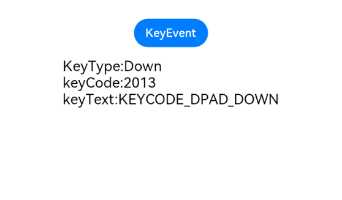

# 按键事件

按键事件指组件与键盘、遥控器等按键设备交互时触发的事件，适用于所有可获焦组件，例如Button。对于Text，Image等默认不可获焦的组件，可以设置focusable属性为true后使用按键事件。

>  **说明：**
>
>  从API Version 7开始支持。后续版本如有新增内容，则采用上角标单独标记该内容的起始版本。


## 事件

| 名称                                       | 支持冒泡 | 功能描述                                     |
| ---------------------------------------- | ---- | ---------------------------------------- |
| onKeyEvent(event:&nbsp;(event?:&nbsp;KeyEvent)&nbsp;=&gt;&nbsp;void) | 是    | 绑定该方法的组件获焦后，按键动作触发该回调，event返回值见[KeyEvent](#keyevent对象说明)介绍。 |


## KeyEvent对象说明

| 名称                                    | 类型                                       | 描述                         |
| ------------------------------------- | ---------------------------------------- | -------------------------- |
| type                                  | [KeyType](ts-appendix-enums.md#keytype)  | 按键的类型。                     |
| [keyCode](../apis/js-apis-keycode.md) | number                                   | 按键的键码。                     |
| keyText                               | string                                   | 按键的键值。                     |
| keySource                             | [KeySource](ts-appendix-enums.md#keysource) | 触发当前按键的输入设备类型。             |
| deviceId                              | number                                   | 触发当前按键的输入设备ID。             |
| metaKey                               | number                                   | 按键发生时元键（即Windows键盘的WIN键、Mac键盘的Command键）的状态，1表示按压态，0表示未按压态。 |
| timestamp                             | number                                   | 按键发生时的时间戳。                 |
| stopPropagation                       | () => void                               | 阻塞事件冒泡传递。                  |


## 示例

```ts
// xxx.ets
@Entry
@Component
struct KeyEventExample {
  @State text: string = ''
  @State eventType: string = ''

  build() {
    Column() {
      Button('KeyEvent')
        .onKeyEvent((event: KeyEvent) => {
          if (event.type === KeyType.Down) {
            this.eventType = 'Down'
          }
          if (event.type === KeyType.Up) {
            this.eventType = 'Up'
          }
          this.text = 'KeyType:' + this.eventType + '\nkeyCode:' + event.keyCode + '\nkeyText:' + event.keyText
        })
      Text(this.text).padding(15)
    }.height(300).width('100%').padding(35)
  }
}
```

  
