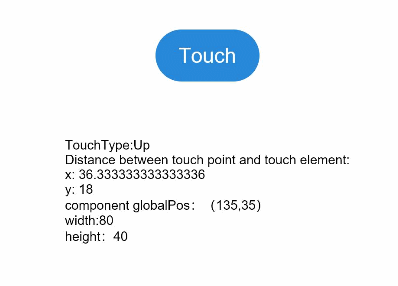

# 触摸事件<a name="ZH-CN_TOPIC_0000001237475045"></a>

> **说明：** 
>从API Version 7开始支持。后续版本如有新增内容，则采用上角标单独标记该内容的起始版本。

## 权限列表<a name="section781125411508"></a>

无

## 事件<a name="section18817111365714"></a>

<table><thead align="left"><tr><th class="cellrowborder" colspan="2" valign="top" id="mcps1.1.5.1.1"><p>名称</p>
</th>
<th class="cellrowborder" valign="top" id="mcps1.1.5.1.2"><p>是否冒泡</p>
</th>
<th class="cellrowborder" valign="top" id="mcps1.1.5.1.3"><p>功能描述</p>
</th>
</tr>
</thead>
<tbody><tr><td class="cellrowborder" colspan="2" valign="top" headers="mcps1.1.5.1.1 "><p>onTouch(callback: (event?: TouchEvent) =&gt; void)</p>
</td>
<td class="cellrowborder" valign="top" headers="mcps1.1.5.1.2 "><p>是</p>
</td>
<td class="cellrowborder" valign="top" headers="mcps1.1.5.1.3 "><p>触摸动作触发该方法调用，event参数见<a href="#section454663343911">TouchEvent</a>介绍。</p>
</td>
</tr>
</tbody>
</table>

## TouchEvent对象说明<a name="section454663343911"></a>

-   属性

    <table><thead align="left"><tr><th class="cellrowborder" valign="top" width="22.509999999999998%" id="mcps1.1.4.1.1"><p>属性名称</p>
    </th>
    <th class="cellrowborder" valign="top" width="22.7%" id="mcps1.1.4.1.2"><p>类型</p>
    </th>
    <th class="cellrowborder" valign="top" width="54.790000000000006%" id="mcps1.1.4.1.3"><p>描述</p>
    </th>
    </tr>
    </thead>
    <tbody><tr><td class="cellrowborder" valign="top" width="22.509999999999998%" headers="mcps1.1.4.1.1 "><p>type</p>
    </td>
    <td class="cellrowborder" valign="top" width="22.7%" headers="mcps1.1.4.1.2 "><p><a href="#li16235181314454">TouchType</a></p>
    </td>
    <td class="cellrowborder" valign="top" width="54.790000000000006%" headers="mcps1.1.4.1.3 "><p>触摸事件的类型。</p>
    </td>
    </tr>
    <tr><td class="cellrowborder" valign="top" width="22.509999999999998%" headers="mcps1.1.4.1.1 "><p>touches</p>
    </td>
    <td class="cellrowborder" valign="top" width="22.7%" headers="mcps1.1.4.1.2 "><p>Array&lt;<a href="#li1783344810442">TouchObject</a>&gt;</p>
    </td>
    <td class="cellrowborder" valign="top" width="54.790000000000006%" headers="mcps1.1.4.1.3 "><p>全部手指信息。</p>
    </td>
    </tr>
    <tr><td class="cellrowborder" valign="top" width="22.509999999999998%" headers="mcps1.1.4.1.1 "><p>changedTouches</p>
    </td>
    <td class="cellrowborder" valign="top" width="22.7%" headers="mcps1.1.4.1.2 "><p>Array&lt;<a href="#li1783344810442">TouchObject</a>&gt;</p>
    </td>
    <td class="cellrowborder" valign="top" width="54.790000000000006%" headers="mcps1.1.4.1.3 "><p>当前发生变化的手指信息。</p>
    </td>
    </tr>
    <tr><td class="cellrowborder" valign="top" width="22.509999999999998%" headers="mcps1.1.4.1.1 "><p>timestamp</p>
    </td>
    <td class="cellrowborder" valign="top" width="22.7%" headers="mcps1.1.4.1.2 "><p>number</p>
    </td>
    <td class="cellrowborder" valign="top" width="54.790000000000006%" headers="mcps1.1.4.1.3 "><p>事件时间戳。</p>
    </td>
    </tr>
    <tr><td class="cellrowborder" valign="top" width="22.509999999999998%" headers="mcps1.1.4.1.1 "><p>target<sup><span>8+</span></sup></p>
    </td>
    <td class="cellrowborder" valign="top" width="22.7%" headers="mcps1.1.4.1.2 "><p><a href="ts-universal-events-click.md#li552912253714">EventTarget</a></p>
    </td>
    <td class="cellrowborder" valign="top" width="54.790000000000006%" headers="mcps1.1.4.1.3 "><p>被触摸元素对象。</p>
    </td>
    </tr>
    </tbody>
    </table>


-   接口

    <table><thead align="left"><tr><th class="cellrowborder" valign="top" width="44.78%" id="mcps1.1.3.1.1"><p>接口名称</p>
    </th>
    <th class="cellrowborder" valign="top" width="55.22%" id="mcps1.1.3.1.2"><p>功能描述</p>
    </th>
    </tr>
    </thead>
    <tbody><tr><td class="cellrowborder" valign="top" width="44.78%" headers="mcps1.1.3.1.1 "><p>stopPropagation()：void</p>
    </td>
    <td class="cellrowborder" valign="top" width="55.22%" headers="mcps1.1.3.1.2 "><p>阻塞事件冒泡。</p>
    </td>
    </tr>
    </tbody>
    </table>


-   <a name="li1783344810442"></a>TouchObject对象说明

    <table><thead align="left"><tr><th class="cellrowborder" valign="top" width="18.55%" id="mcps1.1.4.1.1"><p>属性名称</p>
    </th>
    <th class="cellrowborder" valign="top" width="25.45%" id="mcps1.1.4.1.2"><p>类型</p>
    </th>
    <th class="cellrowborder" valign="top" width="56.00000000000001%" id="mcps1.1.4.1.3"><p>描述</p>
    </th>
    </tr>
    </thead>
    <tbody><tr><td class="cellrowborder" valign="top" width="18.55%" headers="mcps1.1.4.1.1 "><p>type</p>
    </td>
    <td class="cellrowborder" valign="top" width="25.45%" headers="mcps1.1.4.1.2 "><p><a href="#li16235181314454">TouchType</a></p>
    </td>
    <td class="cellrowborder" valign="top" width="56.00000000000001%" headers="mcps1.1.4.1.3 "><p>触摸事件的类型。</p>
    </td>
    </tr>
    <tr><td class="cellrowborder" valign="top" width="18.55%" headers="mcps1.1.4.1.1 "><p>id</p>
    </td>
    <td class="cellrowborder" valign="top" width="25.45%" headers="mcps1.1.4.1.2 "><p>number</p>
    </td>
    <td class="cellrowborder" valign="top" width="56.00000000000001%" headers="mcps1.1.4.1.3 "><p>手指唯一标识符。</p>
    </td>
    </tr>
    <tr><td class="cellrowborder" valign="top" width="18.55%" headers="mcps1.1.4.1.1 "><p>screenX</p>
    </td>
    <td class="cellrowborder" valign="top" width="25.45%" headers="mcps1.1.4.1.2 "><p>number</p>
    </td>
    <td class="cellrowborder" valign="top" width="56.00000000000001%" headers="mcps1.1.4.1.3 "><p>触摸点相对于设备屏幕左边沿的X坐标。</p>
    </td>
    </tr>
    <tr><td class="cellrowborder" valign="top" width="18.55%" headers="mcps1.1.4.1.1 "><p>screenY</p>
    </td>
    <td class="cellrowborder" valign="top" width="25.45%" headers="mcps1.1.4.1.2 "><p>number</p>
    </td>
    <td class="cellrowborder" valign="top" width="56.00000000000001%" headers="mcps1.1.4.1.3 "><p>触摸点相对于设备屏幕上边沿的Y坐标。</p>
    </td>
    </tr>
    <tr><td class="cellrowborder" valign="top" width="18.55%" headers="mcps1.1.4.1.1 "><p>x</p>
    </td>
    <td class="cellrowborder" valign="top" width="25.45%" headers="mcps1.1.4.1.2 "><p>number</p>
    </td>
    <td class="cellrowborder" valign="top" width="56.00000000000001%" headers="mcps1.1.4.1.3 "><p>触摸点相对于被触摸元素左边沿的X坐标。</p>
    </td>
    </tr>
    <tr><td class="cellrowborder" valign="top" width="18.55%" headers="mcps1.1.4.1.1 "><p>y</p>
    </td>
    <td class="cellrowborder" valign="top" width="25.45%" headers="mcps1.1.4.1.2 "><p>number</p>
    </td>
    <td class="cellrowborder" valign="top" width="56.00000000000001%" headers="mcps1.1.4.1.3 "><p>触摸点相对于被触摸元素上边沿的Y坐标。</p>
    </td>
    </tr>
    </tbody>
    </table>


-   <a name="li16235181314454"></a>TouchType枚举说明

    <table><thead align="left"><tr><th class="cellrowborder" valign="top" width="25.2%" id="mcps1.1.3.1.1"><p>名称</p>
    </th>
    <th class="cellrowborder" valign="top" width="74.8%" id="mcps1.1.3.1.2"><p>描述</p>
    </th>
    </tr>
    </thead>
    <tbody><tr><td class="cellrowborder" valign="top" width="25.2%" headers="mcps1.1.3.1.1 "><p>Down</p>
    </td>
    <td class="cellrowborder" valign="top" width="74.8%" headers="mcps1.1.3.1.2 "><p>手指按下时触发。</p>
    </td>
    </tr>
    <tr><td class="cellrowborder" valign="top" width="25.2%" headers="mcps1.1.3.1.1 "><p>Up</p>
    </td>
    <td class="cellrowborder" valign="top" width="74.8%" headers="mcps1.1.3.1.2 "><p>手指抬起时触发。</p>
    </td>
    </tr>
    <tr><td class="cellrowborder" valign="top" width="25.2%" headers="mcps1.1.3.1.1 "><p>Move</p>
    </td>
    <td class="cellrowborder" valign="top" width="74.8%" headers="mcps1.1.3.1.2 "><p>手指按压态在屏幕上移动时触发。</p>
    </td>
    </tr>
    <tr><td class="cellrowborder" valign="top" width="25.2%" headers="mcps1.1.3.1.1 "><p>Cancel</p>
    </td>
    <td class="cellrowborder" valign="top" width="74.8%" headers="mcps1.1.3.1.2 "><p>触摸事件取消时触发。</p>
    </td>
    </tr>
    </tbody>
    </table>


## 示例<a name="section13817013123017"></a>

```
@Entry
@Component
struct TouchExample {
  @State text: string = ''
  @State eventType: string = ''

  build() {
    Flex({ direction: FlexDirection.Column, alignItems: ItemAlign.Center, justifyContent: FlexAlign.SpaceBetween }) {
      Button('Touch').backgroundColor(0x2788D9).height(40).width(80)
        .onTouch((event: TouchEvent) => {
          if (event.type === TouchType.Down) {
            this.eventType = 'Down'
          }
          if (event.type === TouchType.Up) {
            this.eventType = 'Up'
          }
          if (event.type === TouchType.Move) {
            this.eventType = 'Move'
          }
          console.info(this.text = 'TouchType:' + this.eventType + '\nDistance between touch point and touch element:\nx: '
          + event.touches[0].x + '\n' + 'y: ' + event.touches[0].y + '\ncomponent globalPos：（'
          + event.target.area.globalPos.x + ',' + event.target.area.globalPos.y + '）\nwidth:'
          + event.target.area.width + '\nheight：' + event.target.area.height)
        })
      Text(this.text)
    }.height(200).width(350).padding({ left: 35, right: 35, top: 35 })
  }
}
```



