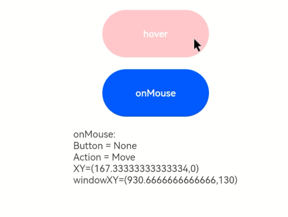

# 鼠标事件

在鼠标的单个动作触发多个事件时，事件的顺序是固定的，鼠标事件默认透传。

>  **说明：**
>
>  从API Version 8开始支持。后续版本如有新增内容，则采用上角标单独标记该内容的起始版本。


## 事件

| 名称                                       | 支持冒泡 | 描述                                       |
| ---------------------------------------- | ---- | ---------------------------------------- |
| onHover(event:&nbsp;(isHover?:&nbsp;boolean)&nbsp;=&gt;&nbsp;void) | 否    | 鼠标进入或退出组件时触发该回调。<br/>isHover：表示鼠标是否悬浮在组件上，鼠标进入时为true,&nbsp;退出时为false。 |
| onMouse(event:&nbsp;(event?:&nbsp;MouseEvent)&nbsp;=&gt;&nbsp;void) | 是    | 当前组件被鼠标按键点击时或者鼠标在组件上悬浮移动时，触发该回调，event返回值包含触发事件时的时间戳、鼠标按键、动作、鼠标位置在整个屏幕上的坐标和相对于当前组件的坐标。 |


## MouseEvent对象说明

| 名称                     | 属性类型                                     | 描述                           |
| ---------------------- | ---------------------------------------- | ---------------------------- |
| screenX                | number                                   | 鼠标位置相对于应用窗口左上角的x轴坐标。         |
| screenY                | number                                   | 鼠标位置相对于应用窗口左上角的y轴坐标。         |
| x                      | number                                   | 鼠标位置相对于当前组件左上角的x轴坐标。         |
| y                      | number                                   | 鼠标位置相对于当前组件左上角的y轴坐标。         |
| button                 | [MouseButton](ts-appendix-enums.md#mousebutton) | 鼠标按键。                        |
| action                 | [MouseAction](ts-appendix-enums.md#mouseaction) | 鼠标动作。                        |
| stopPropagation        | () => void                               | 阻塞事件冒泡。                      |
| timestamp<sup>8+</sup> | number                                   | 事件时间戳。触发事件时距离系统启动的时间间隔，单位纳秒。 |
| target<sup>8+</sup>    | [EventTarget](ts-universal-events-click.md#eventtarget8对象说明) | 触发手势事件的元素对象显示区域。             |
| source<sup>8+</sup>    | [SourceType](ts-gesture-settings.md#sourcetype枚举说明) | 事件输入设备。                      |

## 示例

```ts
// xxx.ets
@Entry
@Component
struct MouseEventExample {
  @State hoverText: string = 'no hover';
  @State mouseText: string = '';
  @State action: string = '';
  @State mouseBtn: string = '';
  @State color: Color = Color.Blue;

  build() {
    Column({ space: 20 }) {
      Button(this.hoverText)
        .width(180).height(80)
        .backgroundColor(this.color)
        .onHover((isHover: boolean) => {
          // 通过onHover事件动态修改按钮在是否有鼠标悬浮时的文本内容与背景颜色
          if (isHover) {
            this.hoverText = 'hover';
            this.color = Color.Pink;
          } else {
            this.hoverText = 'no hover';
            this.color = Color.Blue;
          }
        })
      Button('onMouse')
        .width(180).height(80)
        .onMouse((event: MouseEvent) => {
          switch (event.button) {
            case MouseButton.None:
              this.mouseBtn = 'None';
              break;
            case MouseButton.Left:
              this.mouseBtn = 'Left';
              break;
            case MouseButton.Right:
              this.mouseBtn = 'Right';
              break;
            case MouseButton.Back:
              this.mouseBtn = 'Back';
              break;
            case MouseButton.Forward:
              this.mouseBtn = 'Forward';
              break;
            case MouseButton.Middle:
              this.mouseBtn = 'Middle';
              break;
          }
          switch (event.action) {
            case MouseAction.Hover:
              this.action = 'Hover';
              break;
            case MouseAction.Press:
              this.action = 'Press';
              break;
            case MouseAction.Move:
              this.action = 'Move';
              break;
            case MouseAction.Release:
              this.action = 'Release';
              break;
          }
          this.mouseText = 'onMouse:\nButton = ' + this.mouseBtn +
          '\nAction = ' + this.action + '\nXY=(' + event.x + ',' + event.y + ')' +
          '\nscreenXY=(' + event.screenX + ',' + event.screenY + ')';
        })
      Text(this.mouseText)
    }.padding({ top: 30 }).width('100%')
  }
}
```

示意图：

鼠标悬浮时改变文本内容与背景颜色：



鼠标点击时：

