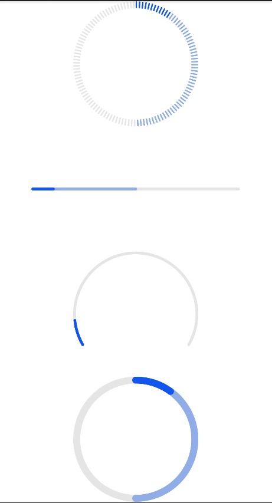

# progress


进度条，用于显示内容加载或操作的处理进度。

> **说明：**
>
> 从API Version 8 开始支持。后续版本如有新增内容，则采用上角标单独标记该内容的起始版本。


## 子组件

不支持。


## 属性

除支持[通用属性](js-service-widget-common-attributes.md)外，还支持如下属性：

| 名称 | 类型 | 默认值 | 必填 | 描述 |
| -------- | -------- | -------- | -------- | -------- |
| type | string | horizontal | 否 | 设置进度条的类型，该属性不支持动态修改，可选值为：<br/>-&nbsp;horizontal：线性进度条。<br/>-&nbsp;circular：loading样式进度条。<br/>-&nbsp;ring：圆环形进度条。<br/>-&nbsp;scale-ring：带刻度圆环形进度条。<br/>-&nbsp;arc：弧形进度条。<br/>-&nbsp;eclipse：圆形进度条，展现类似月圆月缺的进度展示效果。 |

不同类型的进度条还支持不同的属性：

- 类型为horizontal、ring、scale-ring时，支持如下属性：
    | 名称 | 类型 | 默认值 | 必填 | 描述 |
  | -------- | -------- | -------- | -------- | -------- |
  | percent | number | 0 | 否 | 当前进度。取值范围为0-100。 |
  | secondarypercent(Rich) | number | 0 | 否 | 次级进度。取值范围为0-100。 |

- 类型为ring、scale-ring时，支持如下属性：
    | 名称 | 类型 | 默认值 | 必填 | 描述 |
  | -------- | -------- | -------- | -------- | -------- |
  | clockwise | boolean | true | 否 | 圆环形进度条是否采用顺时针。 |

- 类型为arc、eclipse时，支持如下属性：
    | 名称 | 类型 | 默认值 | 必填 | 描述 |
  | -------- | -------- | -------- | -------- | -------- |
  | percent | number | 0 | 否 | 当前进度。取值范围为0-100。 |


## 样式

除支持[通用样式](js-service-widget-common-styles.md)外，还支持如下样式：

type=horizontal

| 名称 | 类型 | 默认值 | 必填 | 描述 |
| -------- | -------- | -------- | -------- | -------- |
| color | &lt;color&gt; | \#ff007dff | 否 | 设置进度条的颜色。 |
| stroke-width | &lt;length&gt; | 4px | 否 | 设置进度条的宽度。 |
| background-color | &lt;color&gt; | - | 否 | 设置进度条的背景色。 |
| secondary-color | &lt;color&gt; | - | 否 | 设置次级进度条的颜色。 |

type=circular

| 名称 | 类型 | 默认值 | 必填 | 描述 |
| -------- | -------- | -------- | -------- | -------- |
| color | &lt;color&gt; | - | 否 | loading进度条上的圆点颜色。 |

type=ring, scale-ring

| 名称 | 类型 | 默认值 | 必填 | 描述 |
| -------- | -------- | -------- | -------- | -------- |
| color | &lt;color&gt;&nbsp;\|&nbsp;&lt;linear-gradient&gt; | - | 否 | 环形进度条的颜色，ring类型支持线性渐变色设置。<br/>线性渐变色仅支持两个颜色参数设置格式，如color&nbsp;=&nbsp;linear-gradient(\#ff0000,&nbsp;\#00ff00)。 |
| background-color | &lt;color&gt; | - | 否 | 环形进度条的背景色。 |
| secondary-color | &lt;color&gt; | - | 否 | 环形次级进度条的颜色。 |
| stroke-width | &lt;length&gt; | 10px | 否 | 环形进度条的宽度。 |
| scale-width | &lt;length&gt; | - | 否 | 带刻度的环形进度条的刻度粗细，类型为scale-ring生效。 |
| scale-number | number | 120 | 否 | 带刻度的环形进度条的刻度数量，类型为scale-ring生效。 |

type=arc

| 名称 | 类型 | 默认值 | 必填 | 描述 |
| -------- | -------- | -------- | -------- | -------- |
| color | &lt;color&gt; | - | 否 | 弧形进度条的颜色。 |
| background-color | &lt;color&gt; | - | 否 | 弧形进度条的背景色。 |
| stroke-width | &lt;length&gt; | - | 否 | 弧形进度条的宽度。<br/>进度条宽度越大，进度条越靠近圆心。即进度条始终在半径区域内。 |
| start-angle | &lt;deg&gt; | 240 | 否 | 弧形进度条起始角度，以时钟0点为基线。范围为0到360（顺时针）。 |
| total-angle | &lt;deg&gt; | 240 | 否 | 弧形进度条总长度，范围为-360到360，负数标识起点到终点为逆时针。 |
| center-x | &lt;length&gt; | - | 否 | 弧形进度条中心位置，（坐标原点为组件左上角顶点）。该样式需要和center-y和radius一起。 |
| center-y | &lt;length&gt; | - | 否 | 弧形进度条中心位置，（坐标原点为组件左上角顶点）。该样式需要和center-x和radius一起。 |
| radius | &lt;length&gt; | - | 否 | 弧形进度条半径，该样式需要和center-x和center-y一起。 |


## 事件

支持[通用事件](js-service-widget-common-events.md)。


## 示例


```html
<!--xxx.hml -->
<div class="container">
  <progress class="min-progress" type="scale-ring"  percent= "10" secondarypercent="50"></progress>
  <progress class="min-progress" type="horizontal" percent= "10" secondarypercent="50"></progress>
  <progress class="min-progress" type="arc" percent= "10"></progress>
  <progress class="min-progress" type="ring" percent= "10" secondarypercent="50"></progress>
</div>
```


```css
/* xxx.css */
.container {
  flex-direction: column;
  height: 100%;
  width: 100%;
  align-items: center;
}
.min-progress {
  width: 300px;
  height: 300px;
}
```
**4*4卡片**



