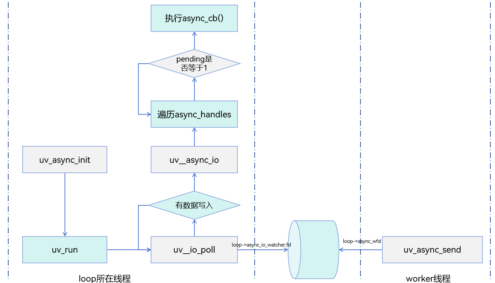
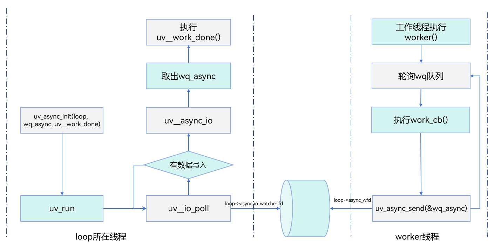
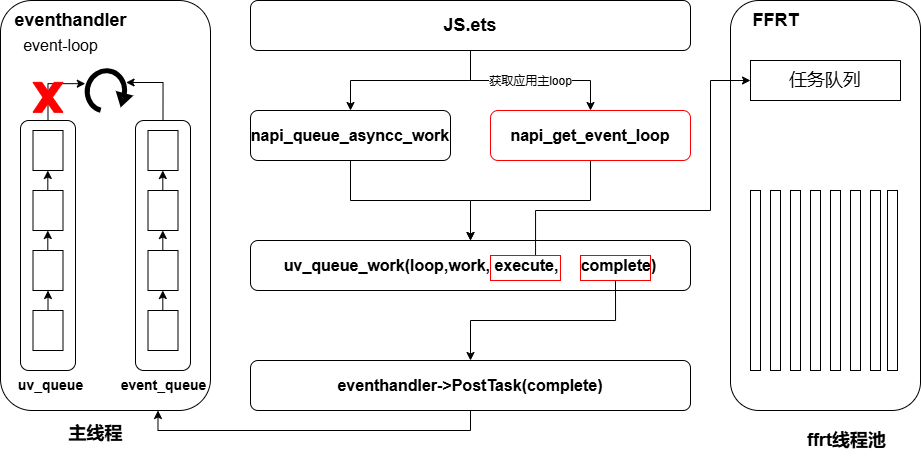

# libuv

## 简介

[libuv](http://libuv.org/)是一个跨平台库，基于事件驱动来实现异步I/O，适用于网络编程和文件系统操作。它是Node.js的核心库之一，也被其他语言的开发者广泛使用。

## 支持的能力

[libuv](http://libuv.org/)实现了跨平台的基于事件驱动的异步I/O。

支持标准库接口。

## 引入libuv能力

如果开发者需要使用libuv相关功能，首先请添加头文件：

```c
#include <uv.h>
```

其次在CMakeLists.txt中添加以下动态链接库：

```
libuv.so
```

## 接口列表

详见[libuv支持的API文档](http://docs.libuv.org/en/v1.x/api.html)。

## OpenHarmony引入libuv的背景

在OpenHarmony的早期版本中，为了兼容node的生态，将node的Node-API引入到系统中，方便node开发者快速接入OpenHarmony，扩展自己的js接口。同时引入了node的事件循环实现库——libuv。

### 演进方向

随着 OpenHarmony 的逐步完善，我们计划在未来的版本中，逐步将应用模型中的事件循环归一，并增强 OpenHarmony 自身的事件循环，以解决许多双 loop 机制下的调度问题，并为开发者提供更加完善的任务优先级、插队等与任务主循环交互的方法。

开发者应尽可能避免在 `napi_get_uv_event_loop` 接口(已在API12中标记废弃)获取的应用主 loop 上使用 libuv 的 ndk 进行操作，因为这可能会带来各种问题，并给未来的兼容性变更带来大量的工作量。

如果开发者希望跟主线程事件循环交互，比如插入任务等，应当使用[Node-API提供的接口](../../napi/napi-data-types-interfaces.md)。

OpenHarmony 还将长期通过Node-API来为开发者提供和主线程交互及扩展js接口的能力，但会屏蔽实现层使用的事件循环。尽管我们在API12中给`napi_get_uv_event_loop`接口标记了废弃，但Node-API的主要功能接口将会长期维护，并保证与node的原生行为一致，来保证熟悉node.js的扩展机制的开发者方便地将自己的已有代码接入到OpenHarmony中来。

如果您对 libuv 非常熟悉，并自信能够处理好所有的内存管理和多线程问题，您仍可以像使用原生 libuv 一样，自己启动线程，并在上面使用 libuv 完成自己的业务。在没有特殊版本要求的情况下，您不需要额外引入 libuv库到您的应用工程中。

### 当前问题和解决方案

根据现有机制，一个线程上只能存在一个事件循环，为了适配系统应用的主事件循环，在主线程上的js环境中，uvloop中的事件处理是由主事件循环监听其fd，触发一次`uv_run`来驱动的。因此部分依赖uvloop始终循环的功能无法生效。

基于上述，比较常用的场景和解决方案有：

#### 场景一、在JS主线程抛异步任务到工作线程执行，在主线程中执行JS代码处理返回结果

**错误示例：**

在native层直接通过调用`napi_get_uv_event_loop`接口获取系统loop，调用libuv NDK接口实现相关功能。

```cpp
#include "napi/native_api.h"
#include "uv.h"
#define LOG_DOMAIN 0X0202
#define LOG_TAG "MyTag"
#include <hilog/log.h>
#include <thread>
#include <sys/eventfd.h>
#include <unistd.h>

static void execute(uv_work_t *work) {
    OH_LOG_INFO(LOG_APP, "ohos in execute");
}

static void complete(uv_work_t *work, int status) {
    OH_LOG_INFO(LOG_APP, "ohos in complete"); 
    delete work;
}
static napi_value Add(napi_env env, napi_callback_info info)
{
    napi_value work_name;
    uv_loop_s *loop = nullptr;
    /* 获取应用js主线程的uv_loop */
    napi_get_uv_event_loop(env, &loop);
    uv_work_t *work = new uv_work_t;
    int ret = uv_queue_work(loop, work, execute, complete);
    if (ret != 0) {
        OH_LOG_INFO(LOG_APP, "delete work");
        delete work;
    }
    return 0;
}

EXTERN_C_START
static napi_value Init(napi_env env, napi_value exports){
    napi_property_descriptor desc[] = {{"add", nullptr, Add, nullptr, nullptr, nullptr, napi_default, nullptr}};
    napi_define_properties(env, exports, sizeof(desc) / sizeof(desc[0]), desc);
    return exports;
}
EXTERN_C_END
    
static napi_module demoModule = {
    .nm_version = 1,
    .nm_flags = 0,
    .nm_filename = nullptr,
    .nm_register_func = Init,
    .nm_modname = "entry",
    .nm_priv = ((void *)0),
    .reserved = {0},
};

extern "C" __attribute__((constructor)) void RegisterEntryModule(void){
    napi_module_register(&demoModule);
}
```

**正确示例：**

可通过`napi_create_async_work`、`napi_queue_async_work`搭配使用。

```cpp
#include "napi/native_api.h"
#include "uv.h"
#define LOG_DOMAIN 0X0202
#define LOG_TAG "MyTag"
#include <hilog/log.h>
#include <thread>
#include <sys/eventfd.h>
#include <unistd.h>
uv_loop_t *loop;
napi_value jsCb;
int fd = -1;

static napi_value Add(napi_env env, napi_callback_info info)
{
    napi_value work_name;
    napi_async_work work;
    napi_create_string_utf8(env, "ohos", NAPI_AUTO_LENGTH, &work_name);
    /* 第四个参数是异步线程的work任务，第五个参数为主线程的回调 */
    napi_create_async_work(env, nullptr, work_name, [](napi_env env, void* data){
        OH_LOG_INFO(LOG_APP, "ohos in execute");
    }, [](napi_env env, napi_status status, void *data){
        /* 不关心具体实现 */
        OH_LOG_INFO(LOG_APP, "ohos in complete");
        napi_delete_async_work(env, (napi_async_work)data);
    }, nullptr, &work);
    /* 通过napi_queue_async_work触发异步任务执行 */
    napi_queue_async_work(env, work);
    return 0;
}

EXTERN_C_START
static napi_value Init(napi_env env, napi_value exports){
    napi_property_descriptor desc[] = {{"add", nullptr, Add, nullptr, nullptr, nullptr, napi_default, nullptr}};
    napi_define_properties(env, exports, sizeof(desc) / sizeof(desc[0]), desc);
    return exports;
}
EXTERN_C_END
    
static napi_module demoModule = {
    .nm_version = 1,
    .nm_flags = 0,
    .nm_filename = nullptr,
    .nm_register_func = Init,
    .nm_modname = "entry",
    .nm_priv = ((void *)0),
    .reserved = {0},
};

extern "C" __attribute__((constructor)) void RegisterEntryModule(void){
    napi_module_register(&demoModule);
}
```

#### 场景二、在native侧向应用主循环抛fd事件，接口无法生效

由于应用主循环仅仅接收fd事件，在监听了uvloop中的backend_fd后，只有该fd事件被触发才会执行一次`uv_run`。这就意味着，在应用主循环中调用uv接口，如果不触发一次fd事件，`uv_run`将永远不会被执行，最后导致libuv的接口正常调用时不生效（仅当应用中没有触发uvloop中的fd事件时）。

**错误示例：**

我们以`uv_poll_start`接口举例，来说明在OpenHarmony中，我们像使用原生libuv一样调用`uv_poll_start`接口时无法生效的问题。

```cpp
#include "napi/native_api.h"
#include "uv.h"
#define LOG_DOMAIN 0X0202
#define LOG_TAG "MyTag"
#include <hilog/log.h>
#include <thread>
#include <sys/eventfd.h>
#include <unistd.h>
uv_loop_t *loop;
napi_value jsCb;
int fd = -1;
void poll_handler(uv_poll_t* handle,int status, int events){
    OH_LOG_INFO(LOG_APP, "ohos poll print");
}
static napi_value TestClose(napi_env env, napi_callback_info info){
    std::thread::id this_id = std::this_thread::get_id();
    OH_LOG_INFO(LOG_APP, "ohos thread id : %{public}ld\n", this_id);
    size_t argc = 1;
    napi_value workBname;
    
    napi_create_string_utf8(env, "test", NAPI_AUTO_LENGTH, &workBname);
    
    napi_get_cb_info(env, info, &argc, &jsCb, nullptr, nullptr);
    // 获取事件循环
    napi_get_uv_event_loop(env, &loop);
    // 创建一个eventfd
    fd = eventfd(0, 0);
    OH_LOG_INFO(LOG_APP, "fd is %{public}d\n",fd);
    uv_poll_t* poll_handle = new uv_poll_t;
    // 初始化一个poll句柄，并将其与eventfd关联
    uv_poll_init(loop, poll_handle, fd);
    // 开始监听poll事件
    uv_poll_start(poll_handle, UV_READABLE, poll_handler);
    // 创建一个新线程，向eventfd写入数据
    std::thread mythread([](){
        for (int i = 0; i < 8; i++){
            int value = 10;
            int ret = eventfd_write(fd, value);
            if (ret == -1){
                OH_LOG_INFO(LOG_APP, "write failed!\n");
                continue;
            }
        }
    });
    mythread.detach();
    return 0;
}
EXTERN_C_START
static napi_value Init(napi_env env, napi_value exports){
    napi_property_descriptor desc[] = {{"testClose", nullptr, TestClose, nullptr, nullptr, nullptr, napi_default, nullptr}};
    napi_define_properties(env, exports, sizeof(desc) / sizeof(desc[0]), desc);
    return exports;
}
EXTERN_C_END
    
static napi_module demoModule = {
    .nm_version = 1,
    .nm_flags = 0,
    .nm_filename = nullptr,
    .nm_register_func = Init,
    .nm_modname = "entry",
    .nm_priv = ((void *)0),
    .reserved = {0},
};

extern "C" __attribute__((constructor)) void RegisterEntryModule(void){
    napi_module_register(&demoModule);
}
```

在上述代码中，流程如下：

1. 首先通过`napi_get_uv_event_loop`接口获取到应用主线程的uvloop。
2. 然后创建一个eventfd。
3. 初始化uv_poll_t，并启动该句柄使其生效，在eventfd可读时触发回调函数`poll_handler`。
4. 新开一个线程，向eventfd里写入字符。

执行上述代码，poll_handler并不能正常打印。这是由于应用主线程是靠fd驱动来执行`uv_run`的，而非以UV_RUN_DEFAULT模式来进行循环。尽管uvloop中的backend_fd已经被event_handler监听，但是当执行`uv_poll_start`的时候，fd并未通过`epoll_ctl`加入到backend_fd中被其监听，**而是在下一次`uv_run`中的`uv__io_poll`这个函数才会执行`epoll_ctl`函数。因此，如果应用进程中没有其他触发backend_fd事件的时候，libuv接口的正常使用可能不会达到开发者的预期。**

**临时方案：**

在当下的系统版本中，我们并不推荐开发者直接通过`napi_get_uv_event_loop`获取应用主线程的uvloop进行业务逻辑的开发。如果当前系统接口无法满足开发者的开发需求，确有必要使用libuv来实现业务功能，为了使libuv接口在主线程上生效，我们可以在调用类似*uv_xxx_start*后，执行一次`uv_async_send`的方式来主动触发应用主线程执行一次`uv_run`。这样可以保证该接口生效并正常执行。

针对上述无法生效的代码示例，可以修改如下使其生效：

```cpp
#include "napi/native_api.h"
#include "uv.h"
#define LOG_DOMAIN 0x0202
#define LOG_TAG "MyTag"
#include <hilog/log.h>
#include <thread>
#include <sys/eventfd.h>
#include <unistd.h>
uv_loop_t *loop;
napi_value jsCb;
int fd = -1;
void poll_handler(uv_poll_t* handle,int status, int events){
    OH_LOG_INFO(LOG_APP, "ohos poll print");
}
static napi_value TestClose(napi_env env, napi_callback_info info){
    std::thread::id this_id = std::this_thread::get_id();
    OH_LOG_INFO(LOG_APP, "ohos thread id : %{public}ld\n", this_id);
    size_t argc = 1;
    napi_value workBName;
    
    napi_create_string_utf8(env, "test", NAPI_AUTO_LENGTH, &workBName);
    
    napi_get_cb_info(env, info, &argc, &jsCb, nullptr, nullptr);

    napi_get_uv_event_loop(env, &loop);

    fd = eventfd(0, 0);
    OH_LOG_INFO(LOG_APP, "fd is %{public}d\n",fd);
    uv_poll_t* poll_handle = new uv_poll_t;
    uv_poll_init(loop, poll_handle, fd);
    uv_poll_start(poll_handle, UV_READABLE, poll_handler);

    // 主动触发一次fd事件，让主线程执行一次uv_run
    uv_async_send(&loop->wq_async);
    
    std::thread mythread([](){
        for (int i = 0; i < 8; i++){
            int value = 10;
            int ret = eventfd_write(fd, value);
            if (ret == -1){
                OH_LOG_INFO(LOG_APP, "write failed!\n");
                continue;
            }
        }
    });
    mythread.detach();
    return 0;
}

EXTERN_C_START
static napi_value Init(napi_env env, napi_value exports){
    napi_property_descriptor desc[] = {{"testClose", nullptr, TestClose, nullptr, nullptr, nullptr, napi_default, nullptr}};
    napi_define_properties(env, exports, sizeof(desc) / sizeof(desc[0]), desc);
    return exports;
}
EXTERN_C_END
    
static napi_module demoModule = {
    .nm_version = 1,
    .nm_flags = 0,
    .nm_filename = nullptr,
    .nm_register_func = Init,
    .nm_modname = "entry",
    .nm_priv = ((void *)0),
    .reserved = {0},
};

extern "C" __attribute__((constructor)) void RegisterEntryModule(void){
    napi_module_register(&demoModule);
}
```

## libuv使用指导

**重要：libuv NDK中所有依赖`uv_run`的接口在当前系统的应用主循环中无法及时生效，并且可能会导致卡顿掉帧的现象。因此不建议直接在JS主线程上使用libuv NDK接口，对于异步任务执行及与使用线程安全函数与主线程通信，开发者可以直接调用Node-API接口来实现相关功能。**

### libuv接口与Node-API接口对应关系

当前OpenHarmony提供了一些Node-API接口，可以替换libuv接口的使用。主要包括异步任务相关接口，线程安全的函数调用接口。

#### 异步任务接口

当开发者需要执行一个比较耗时的操作但又不希望阻塞主线程执行时，libuv提供了底层接口`uv_queue_work`帮助开发者在异步线程中执行耗时操作，然后将结果回调到主线程上进行处理。

在Node-API中，通常可以通过[napi_async_work](../../napi/use-napi-asynchronous-task.md)相关函数来实现异步开发的功能。

相关函数为：

```cpp
// 创建一个新的异步工作
// env：指向当前环境的指针
// async_resource：可选的资源对象，用于跟踪异步操作
// async_resource_name：可选的字符串，用于描述异步资源
// execute：一个回调函数，它将在一个新的线程中执行异步操作
// complete：一个回调函数，它将在异步操作完成后被调用
// data：用户定义的数据，它将被传递给execute和complete回调函数
// result：指向新创建的异步工作的指针
napi_status napi_create_async_work(napi_env env,
                                  napi_value async_resource,
                                  napi_value async_resource_name,
                                   napi_async_execute_callback execute,
                                 napi_async_complete_callback complete,
                                  void* data,
                                  napi_async_work* result);

// 将异步工作添加到队列中
// env：指向当前环境的指针
// work：指向异步工作的指针
napi_status napi_queue_async_work(napi_env env, napi_async_work work);

// 删除异步工作
// env：指向当前环境的指针
// work：指向异步工作的指针
napi_status napi_delete_async_work(napi_env env, napi_async_work work);
```

#### 跨线程共享和调用的线程安全函数

当开发者想传入某个回调函数到应用主线程上时，libuv的实现方式一般使用`uv_async_t`句柄用于线程间通信。

相关函数包含：

- uv_async_init()
- uv_async_send()

Node-API与之对应的接口为[napi_threadsafe_function](../../napi/use-napi-thread-safety.md)相关函数。

相关函数：

```cpp
// 用于创建一个线程安全的函数，该函数可以在多个线程中调用，而不需要担心数据竞争或其他线程安全问题
// env：指向NAPI环境的指针，用于创建和操作Javascript值
// func：指向JavaScript函数的指针
// resource_name：指向资源名称的指针，这个名称将用于日志和调试
// max_queue_size：一个整数，表示队列的最大大小，当队列满时，新的调用将被丢弃
// initial_thread_count：一个整数，表示初始线程数，这些线程将在创建函数时启动
// context：指向上下文的指针，这个上下文将被传递给call_js_func函数
// call_js_func：指向回调函数的指针，这个函数将在Javascript函数被调用时被调用
// finalize：指向finalize函数的指针，这个函数将在线程安全函数被销毁时被调用
// result：指向napi_threadsafe_function结构的指针，这个结构将被填充为新创建的线程安全函数
napi_status napi_create_threadsafe_function(napi_env env,
                                           napi_value func,
                                           const char* resource_name,
                                           size_t max_queue_size,
                                           size_t initial_thread_count,
                                           void* context,
                                           napi_threadsafe_function_call_js call_js_func,
                                           napi_threadsafe_function_finalize finalize,
                                           napi_threadsafe_function* result);

// 获取一个线程安全的函数
// function：指向线程安全函数的指针
napi_status napi_acquire_threadsafe_function(napi_threadsafe_function function);

// 调用一个线程安全的函数
// function：指向线程安全函数的指针
// data：用户数据
napi_status napi_call_threadsafe_function(napi_threadsafe_function function, void* data);

// 释放一个线程安全的函数
// function：指向线程安全函数的指针
napi_status napi_release_threadsafe_function(napi_threadsafe_function function);

```

除此之外，如果开发者需要libuv其他原生接口来实现业务功能，为了让开发者正确使用libuv提供的接口能力，避免因为错误使用而陷入到问题当中。在后续章节，我们将逐步介绍libuv的一些基本概念和OpenHarmony系统中常用函数的正确使用方法，它仅仅可以保证开发者使用libuv接口的时候不会出现应用进程崩溃等现象。另外，我们还统计了在当前应用主线程上可以正常使用的接口，以及无法在应用主线程上使用的接口。

### 接口汇总说明

|  接口类型    |  接口汇总    |
| ---- | ---- |
|   [loop概念及相关接口](#libuv中的事件循环)   |  uv_loop_init    |
|   [loop概念及相关接口](#libuv中的事件循环)   |   uv_loop_close   |
|   [loop概念及相关接口](#libuv中的事件循环)   |  uv_default_loop    |
|   [loop概念及相关接口](#libuv中的事件循环)   |   uv_run   |
|   [loop概念及相关接口](#libuv中的事件循环)   |    uv_loop_alive  |
|   [loop概念及相关接口](#libuv中的事件循环)   |  uv_stop    |
|   [Handle概念及相关接口](#libuv中的handles和requests)   |  uv_poll\_\* |
|   [Handle概念及相关接口](#libuv中的handles和requests)   |  uv_timer\_\* |
|   [Handle概念及相关接口](#libuv中的handles和requests)   |  uv_async\_\* |
|   [Handle概念及相关接口](#libuv中的handles和requests)   |   uv_signal\_\*   |
|   [Handle概念及相关接口](#libuv中的handles和requests)   |   uv_fs\_\*  |
|   [Request概念及相关接口](#libuv中的handles和requests)   |  uv_random    |
|   [Request概念及相关接口](#libuv中的handles和requests)   |  uv_getaddrinfo    |
|   [Request概念及相关接口](#libuv中的handles和requests)   |  uv_getnameinfo    |
|   [Request概念及相关接口](#libuv中的handles和requests)   |  uv_queue_work    |
|   [线程间通信原理及相关接口](#线程间通信)   |  uv_async_init    |
|   [线程间通信原理及相关接口](#线程间通信)   |  uv_async_send    |
|   [线程池概念及相关接口](#线程池)   |  uv_queue_work    |

### 线程安全函数

在libuv中，由于涉及到大量的异步任务，稍有不慎就会陷入到多线程问题中。在这里，我们对libuv中常用的线程安全函数和非线程安全函数做了汇总。若开发者在多线程编程中调用了非线程安全的函数，势必要对其进行加锁保护或者保证代码的正确运行时序。否则将陷入到crash问题中。

线程安全函数：

- uv_async_init()：初始化异步句柄。
- uv_async_send()：向异步句柄发送信号，可以在任何线程中调用。
- uv_thread_create()：创建一个新线程并执行指定的函数，可以在任何线程中调用。
- uv_fs\_\*()：文件相关操作（uv\_fs\_\* 表示以uv\_fs\_开头的支持文件IO的系列函数）。
- uv_poll\_\*()：poll事件相关函数（uv\_poll\_\* 表示以uv\_poll\_开头的支持poll IO的系列函数）。
- 锁相关的操作，如uv\_mutex\_lock()、uv\_mutex\_unlock()等等。

**提示：所有形如uv_xxx_init的函数，即使它是以线程安全的方式实现的，但使用时要注意，避免多个线程同时调用uv_xxx_init，否则它依旧会引起多线程资源竞争的问题。最好的方式是在事件循环线程中调用该函数。**

**注：uv_async_send函数被调用后，回调函数是被异步触发的。如果调用了多次uv_async_send，libuv只保证至少有一次回调会被执行。这就可能导致一旦对同一句柄触发了多次uv_async_send，libuv对回调的处理可能会违背开发者的预期。**

非线程安全函数：

- uv\_os\_unsetenv()：删除环境变量
- uv\_os\_setenv()：设置环境变量
- uv\_os\_getenv()：获取环境变量
- uv\_os\_environ()：检索所有的环境变量
- uv\_os\_tmpdir()：获取临时目录
- uv\_os\_homedir()：获取家目录

### libuv中的事件循环

事件循环是libuv中最核心的一个概念，loop负责管理整个事件循环的所有资源，它贯穿于整个事件循环的生命周期。通常将`uv_run`所在的线程称为该事件循环的主线程。

#### 事件循环运行的三种方式

`UV_RUN_DEFAULT`：默认轮询方式，该模式将会一直运行下去，直到loop中没有活跃的句柄和请求。

`UV_RUN_ONCE`：一次轮询模式，如果pending_queue中有回调函数，则执行，然后跳过`uv__io_poll`函数。此模式默认认为loop中一定有事件发生。

`UV_RUN_NOWAIT`：非阻塞模式，该模式下不会执行pending_queue，而是直接执行一次I/O轮询（`uv__io_poll`）。

#### 常用接口

```cpp
int uv_loop_init(uv_loop_t* loop);
```

  对loop进行初始化。

```cpp
int uv_loop_close(uv_loop_t* loop);
```

  关闭loop，该函数只有在loop中所有的句柄和请求都关闭后才能成功返回，否则将返回UV_EBUSY。

```cpp
uv_loop_t* uv_default_loop(void);
```

  该函数创建一个进程级的loop。在OpenHarmony中，由于目前的应用主循环及其他js工作线程还存在着libuv的loop。因此我们不建议开发者使用该函数来创建loop并实现业务功能。在系统的双loop改造完成后，开发者可以根据业务要求来使用该接口。

```cpp
int uv_run(uv_loop_t* loop, uv_run_mode mode);
```

  启动事件循环。运行模式可查看[事件循环运行的三种方式](#事件循环运行的三种方式)。

```cpp
int uv_loop_alive(uv_loop_t loop);
```

  判断loop是否处于活跃状态。

```cpp
void uv_stop(uv_loop_t* loop);
```

  该函数用来停止一个事件循环，在loop的下一次迭代中才会停止。如果该函数发生在I/O操作之前，将不会阻塞而是直接跳过`uv__io_poll`。

**使用技巧**：在使用loop时，需要特别注意`uv_stop`函数的使用。开发者需要确保`uv_stop`前，通知与loop相关的所有线程的handle都关闭。参考代码如下：

```cpp
int stop_loop(uv_loop_t* loop)
{
    uv_stop(loop);
    auto const ensure_close = [](uv_handle_t* handle, void*) {
        if (uv_is_closing(handle)) {
            return;
        } else {
            uv_close(handle, nullptr);
        }
    };
    // 遍历所有句柄，如果handle处于活跃状态，调用ensure_close。
    uv_walk(loop, ensure_close, nullptr);

    // 继续运行uv_run，直到loop中不存在活跃的句柄和请求为止。
    while(true) {
        if (uv_run(loop, UV_RUN_DEFAULT) == 0) {
            break;
        }
    }

    // 最后检查loop状态。
    if (uv_loop_alive(loop) != 0) {
        return -1;
    }
    return 0;
}
```

### libuv中的handles和requests

handle表示一个持久性的对象，通常挂载到loop中对应的handle_queue队列上。如果handle处于活跃状态，每次`uv_run`都会处理handle中的回调函数。

request表示一个短暂性的请求，一个request只触发一次回调操作。

下面是OpenHarmony系统中最常用的几个Handles和Requests：

```cpp
/* Handle Type */
typedef struct uv_handle_s uv_handle_t;
typedef struct uv_timer_s uv_timer_t;
typedef struct uv_async_s uv_async_t;
typedef struct uv_signal_s uv_signal_t;

/* Request Type */
typedef struct uv_req_s uv_req_t;
typedef struct uv_work_s uv_work_t;
typedef struct uv_fs_s uv_fs_t;
```

**注：在handles中，uv_xxx_t继承了uv_handle_t；在requests中，uv_work_t继承了uv_req_t。**

对于libuv中的handles，对其有个正确的认识并管理好它的生命周期至关重要。handle作为一个长期存在于loop中的句柄，在使用中，开发者应遵循下面的原则：

1. 句柄的初始化工作应在事件循环的线程中进行。
2. 若由于业务问题，句柄需要在其他工作线程初始化，在使用之前用原子变量判断是否初始化完成。
3. 句柄在确定后续不再使用后，调用`uv_close`将句柄从loop中摘除。

在这里，需要特别说明一下`uv_close`的使用方法。`uv_close`被用来关闭一个handle，但是它是异步地关闭handle。函数原型为：

```cpp
void uv_close(uv_handle_t* handle, uv_close_cb close_cb)
```

  handle：要关闭的句柄。
  close_cb：处理该句柄的函数，用来进行内存管理等操作。

`uv_close`调用后，它首先将要关闭的handle挂载到loop中的closing_handles队列上，然后等待loop所在线程运行`uv__run_closing_handles`函数。最后回调函数close_cb将会在loop的下一次迭代中执行。因此，释放内存等操作应该在close_cb中进行。并且这种异步的关闭操作会带来多线程上的问题，开发者需要谨慎处理`uv_close`的时序问题，并且保证在close_cb执行之前Handles的生命周期。这是一篇在系统中存在的一些典型代码示例，可供开发者参考。

**Tips**：在[libuv官方文档](http://libuv.org/)中，有个经验法则需要在此提示一下。原文翻译：如果 uv_foo_t 类型的句柄具有 `uv_foo_start()` 函数，则从调用该函数的那一刻起，它就处于活动状态。 同样，`uv_foo_stop()`再次停用句柄。

而对于libuv中的requests，开发者需要确保一点，通过动态申请的request，在loop所在线程的回调函数中释放它即可。用uv_work_t举例，代码可参考如下：

```cpp
uv_work_t* work = new uv_work_t;
uv_queue_work(loop, work, [](uv_work_t* req) {
    // 异步操作
}, [](uv_work_t* req, int status) {
    // 回调操作
    delete req;
});
```

此外，使用`uv_queue_work`需要注意如下几点：

1. libuv中`uv_queue_work`的工作流程为：将`work_cb`挂在线程池中执行，然后将`after_work_cb`挂在回调队列wq中，然后触发一次fd事件；loop所在线程接收到fd事件，便会执行对应的after_work_cb。`uv_queue_work`调用完后，并不代表其中的任何一个任务执行完，仅代表将work_cb插入到异步线程池的任务队列中。
2. `uv_queue_work`仅限于在loop所在的线程中调用，这样不会有多线程安全问题。不建议使用如下用法：A线程获取到B线程的loop，并通过`uv_queue_work`的方式，把回调放在B线程中执行。
3. 为了避免低效的异步任务提交，请不要使用将work_cb实现为空任务，并将任务在after_work_cb中执行的方式调用`uv_queue_work`提交异步任务，请使用`napi_send_event`接口。

`napi_send_event`函数的声明为：

```cpp
napi_status napi_send_event(napi_env env, const std::function<void()> cb, napi_event_priority priority);
```

#### libuv timer使用规范

使用libuv timer需要遵守如下约定：

1. 请不要在多个线程中使用libuv的接口（uv_timer_start、uv_timer_stop和uv_timer_again）同时操作同一个loop的timer heap，否则将导致崩溃，如果想要使用libuv的接口操作定时器，请**保持在与当前env绑定的loop所在线程上操作**；
2. 如因业务需求往指定线程抛定时器，请使用`uv_async_send`线程安全函数实现。

##### 错误使用timer示例

以下错误示例中，由于在多个线程操作同一个loop的timer heap，崩溃率极高。

ArkTS侧：

```typescript
import { hilog } from '@kit.PerformanceAnalysisKit';
import testNapi from 'libentry.so'

function waitforRunner(): number {
    "use concurrent"
    hilog.info(0xff, "testTag", "executed");
    return 0;
}

@Entry
@Component
struct Index {
  build() {
    Row() {
      Column() {
        Button("TimerTest")
          .width('40%')
          .fontSize('14fp')
          .onClick(() => {
            let i: number = 20;
            while (i--) {
              setTimeout(waitforRunner, 200);
              testNapi.testTimer();
          }
        }).margin(20)
      }.width('100%')
    }.height('100%')
  }
}
```

Native C++侧：

```cpp
#include <napi/native_api.h>
#include <uv.h>
#define LOG_DOMAIN 0x0202
#define LOG_TAG "MyTag"
#include "hilog/log.h"
#include <thread>
#include <unistd.h>

static napi_value TestTimer(napi_env env, napi_callback_info info) {
    uv_loop_t* loop = nullptr;
    uv_timer_t* timer = new uv_timer_t;
    
    napi_get_uv_event_loop(env, &loop);
    uv_timer_init(loop, timer);
    std::thread t1([&loop, &timer](){
        uv_timer_start(timer, [](uv_timer_t* timer){
            uv_timer_stop(timer);
        }, 1000, 0);
    });
    
    t1.detach();
    return 0;
}

EXTERN_C_START
static napi_value Init(napi_env env, napi_value exports) {
    napi_property_descriptor desc[] = {
        {"testTimer", nullptr, TestTimer, nullptr, nullptr, nullptr, napi_default, nullptr},
    };
    napi_define_properties(env, exports, sizeof(desc) / sizeof(desc[0]), desc);
    return exports;
}
EXTERN_C_END
    
static napi_module demoModule = {
    .nm_version = 1,
    .nm_flags = 0,
    .nm_filename = nullptr,
    .nm_register_func = Init,
    .nm_modname = "entry",
    .nm_priv = ((void *)0),
    .reserved = {0},
};

extern "C" __attribute__((constructor)) void RegisterEntryModule(void) {
    napi_module_register(&demoModule);
}
```

在index.d.ts增加如下代码：

```typescript
export const testTimer:() => number;
```

##### 正确使用timer示例

**场景一：** 在上述场景中，需保证在native主线程上进行timer的相关操作。将上述TestTimer函数的代码做如下修改，便可以避免崩溃发生。

```cpp
static napi_value TestTimer(napi_env env, napi_callback_info info) {
    uv_loop_t* loop = nullptr;
    uv_timer_t* timer = new uv_timer_t;
    
    napi_get_uv_event_loop(env, &loop);
    uv_timer_init(loop, timer);
    uv_timer_start(timer, [](uv_timer_t* timer){
        uv_timer_stop(timer);
    }, 1000, 0);

    return 0;
}
```

**场景二：** 如果需要在指定的子线程抛定时器，请使用线程安全函数`uv_async_send`实现。

ArkTS测：

```typescript
import { hilog } from '@kit.PerformanceAnalysisKit';
import testNapi from 'libentry.so'

function waitforRunner(): number {
    "use concurrent"
    hilog.info(0xff, "testTag", "executed");
    return 0;
}

@Entry
@Component
struct Index {
  build() {
    Row() {
      Column() {
        Button("TestTimerAsync")
          .width('40%')
          .fontSize('14fp')
          .onClick(() => {
              testNapi.testTimerAsync();  // 初始化async句柄
        }).margin(20)
          
          Button("TestTimerAsyncSend")
          .width('40%')
          .fontSize('14fp')
          .onClick(() => {
              testNapi.testTimerAsyncSend();  // 子线程调用uv_async_send执行timer_cb
        }).margin(20)
      }.width('100%')
    }.height('100%')
  }
}
```

Native C++测：

```c++
#include <napi/native_api.h>
#include <uv.h>
#define LOG_DOMAIN 0x0202
#define LOG_TAG "MyTag"
#include "hilog/log.h"
#include <thread>
#include <unistd.h>
uv_async_t* async = new uv_async_t;

// 执行创建定时器操作
void timer_cb(uv_async_t* handle) {
    auto loop = handle->loop;
    uv_timer_t* timer = new uv_timer_t;
    uv_timer_init(loop, timer);
    
    uv_timer_start(timer, [](uv_timer_t* timer){
        uv_timer_stop(timer);
    }, 1000, 0);
}

// 初始化async句柄，绑定对应的回调函数
static napi_value TestTimerAsync(napi_env env, napi_callback_info info) {
    uv_loop_t* loop = nullptr;
	napi_get_uv_event_loop(env, &loop);
    uv_async_init(loop, async, timer_cb);
    return 0;
}

static napi_value TestTimerAsyncSend(napi_env env, napi_callback_info info) {
    std::thread t([](){
        uv_async_send(async);  // 在任意子线程中调用uv_async_send，通知主线程调用与async绑定的timer_cb
    });
    t.detach();
    return 0;
}

EXTERN_C_START
static napi_value Init(napi_env env, napi_value exports) {
    napi_property_descriptor desc[] = {
        {"testTimerAsync", nullptr, TestTimerAsync, nullptr, nullptr, nullptr, napi_default, nullptr},
        {"testTimerAsyncSend", nullptr, TestTimerAsyncSend, nullptr, nullptr, nullptr, napi_default, nullptr},
    };
    napi_define_properties(env, exports, sizeof(desc) / sizeof(desc[0]), desc);
    return exports;
}
EXTERN_C_END
    
static napi_module demoModule = {
    .nm_version = 1,
    .nm_flags = 0,
    .nm_filename = nullptr,
    .nm_register_func = Init,
    .nm_modname = "entry",
    .nm_priv = ((void *)0),
    .reserved = {0},
};

extern "C" __attribute__((constructor)) void RegisterEntryModule(void) {
    napi_module_register(&demoModule);
}
```

### 线程间通信

上面简单介绍了一些libuv中的基本概念，在这里我们将着重介绍libuv中的线程间通信。

libuv的线程间通信是通过uv_async_t句柄来进行的，相关函数如下：

```cpp
int uv_async_init(uv_loop_t* loop, uv_async_t* handle, uv_async_cb async_cb)
```

  loop：事件循环loop。

  handle：线程间通信句柄。

  async_cb：回调函数。

  返回：成功，返回0。失败，返回错误码。

```cpp
int uv_async_send(uv_async_t* handle)
```

  handle：线程间通信句柄。

  返回：成功，返回0。失败，返回错误码。
> 说明
>
> 1. uv_async_t从调用`uv_async_init`开始后就一直处于活跃状态，除非用`uv_close`将其关闭。
>
> 2. uv_async_t的执行顺序严格按照`uv_async_init`的顺序，而非通过`uv_async_send`的顺序来执行的。因此按照初始化的顺序来管理好时序问题是必要的。



示例代码：

```cpp
#include <bits/stdc++.h>
#include "uv.h"

uv_loop_t* loop = nullptr;
uv_async_t* async = nullptr;
void async_handler(uv_async_t* handle)
{
    printf("ohos async print\n");
}

int main()
{
    loop = uv_default_loop();
    async = new uv_async_t;
    uv_async_init(loop, async, async_handler);
    std::thread subThread([]() {
        for (int i = 0; i < 10; i++) {
            usleep(100);
            printf("%dth: subThread triggered\n", i);
            uv_async_send(async);
        }
        // 调用uv_close关闭async，在主循环中释放内存。
        uv_close((uv_handle_t*)async, [](uv_handle_t* handle) {
            printf("delete async\n");
            delete (uv_async_t*)handle;
        });
        uv_stop(loop);
    });
    subThread.detach();
    return uv_run(loop, UV_RUN_DEFAULT);
}
```

该示例代码仅仅描述了一个简单的场景，步骤如下：

1. 在主线程中初始化async句柄
2. 新建一个子线程，在里面每隔100毫秒触发一次`uv_async_send`。10次以后调用`uv_close`关闭async句柄。
3. 在主线程运行事件循环。

可以看到，每触发一次，主线程都会执行一次回调函数。

```
0th:subThread triggered
ohos async print
1th:subThread triggered
ohos async print
2th:subThread triggered
ohos async print
3th:subThread triggered
ohos async print
4th:subThread triggered
ohos async print
5th:subThread triggered
ohos async print
6th:subThread triggered
ohos async print
7th:subThread triggered
ohos async print
8th:subThread triggered
ohos async print
9th:subThread triggered
delete async
```

### 线程池

线程池是libuv的一个核心功能，libuv中的线程池是通过uv_loop_t中的成员变量wq_async来控制工作线程与主线程的通信。核心函数如下：

```cpp
int uv_queue_work(uv_loop_t* loop,
                  uv_work_t* req,
                  uv_work_cb work_cb,
                  uv_after_work_cb after_work_cb)
```

work_cb：提交给工作线程的任务。

after_work_cb：loop所在线程的要执行的回调函数。

**注意：** work_cb与after_work_cb的执行有一个时序问题，只有work_cb执行完，通过`uv_async_send(loop->wq_async)`触发fd事件，loop所在线程在下一次迭代中才会执行after_work_cb。只有执行到after_work_cb时，与之相关的uv_work_t生命周期才算结束。

下图为libuv的线程池工作流程，图中流程已简化，默认句柄的pending标志为1，worker线程个数不代表线程池中线程的真实数量。



### OpenHarmony中libuv的使用现状

当前OpenHarmony系统中涉及到libuv的线程主要有主线程、JS Worker线程、Taskpool中的TaskWorker线程以及IPC线程。除了主线程内采用了eventhandler作为主循环，其他线程都是使用libuv中的UV_RUN_DEFAULT运行模式作为当前线程的事件主循环来执行任务。在主线程中，eventhandler通过fd驱动的方式来触发任务的执行，eventhandler监听了uv_loop中的backend_fd。当loop中有fd事件触发的时候，eventhandler会执行一次`uv_run`来执行libuv中的任务。

综上所述，开发者会发现这样一种现象：**同样的libuv接口在主线程上不生效，但在JS Worker线程中就没问题。这主要还是因为主线程上所有不通过触发fd来驱动的uv接口都不会得到及时的响应。**

另外，在应用主线程中，所有的异步任务尽管最终都是通过libuv得到执行的。但是在当前系统中，[libuv的线程池已经对接到了FFRT中](https://gitee.com/openharmony/third_party_libuv/wikis/06-Wiki-%E6%8A%80%E6%9C%AF%E8%B5%84%E6%BA%90/%20libuv%E5%B7%A5%E4%BD%9C%E7%BA%BF%E7%A8%8B%E6%8E%A5%E5%85%A5FFRT%E6%96%B9%E6%A1%88%E5%88%86%E6%9E%90)，任何抛向libuv的异步任务都会在FFRT的线程中得到调度。应用主线程的回调函数也通过PostTask接口插入到eventhandler的队列上。这就意味着ffrt线程上的异步任务完成后不再通过`uv_async_send`的方式触发主线程的回调。过程如下图:



我们总结了五种类型的请求任务是直接可以按照正常用法在应用主循环中生效的：

- uv_random_t

  函数原型：

```cpp
/**
* 将一个工作请求添加到事件循环的队列中。
* 
* @param loop 事件循环
* @param req 随机数请求
* @param buf 存储随机数的缓冲区
* @param buflen 缓冲区的长度
* @param flags 一个无符号整数，表示生成随机数的选项
* @param cb  随机数生成完成后的回调函数
*
* @return 成功返回0，失败返回错误码
*/
int uv_random(uv_loop_t* loop,
             uv_random_t* req,
             void* buf,
             size_t buflen,
             unsigned flags,
             uv_random_cb cb);
```

- uv_work_t

    函数原型：

```cpp
/**
* 将一个工作请求添加到事件循环的队列中。
* 
* 当事件循环在下一次迭代时，work_cb函数将会在一个新的线程中被调用。
* 当work_cb函数完成时，after_work_cb函数将会在事件循环的线程中被调用。
* 
* @param loop 事件循环
* @param req 工作请求
* @param work_cb 在新线程中被调用的函数
* @param after_work_cb 在事件循环线程中被调用的函数
*
* @return 成功返回0，失败返回-1
*/
int uv_queue_work(uv_loop_t* loop,
                  uv_work_t* req,
                  uv_work_cb work_cb,
                  uv_after_work_cb after_work_cb);
```

- uv_fs_t

    文件类提供的所有异步接口，在应用主线程中都是可以生效的。主要有如下：

```cpp
/**
* 异步读取文件
*
* @param loop 事件循环
* @param req 文件操作请求
* @param file 文件描述符
* @param bufs 读取数据的缓冲区
* @param nbufs 缓冲区的数量
* @param off 文件的偏移量
* @param cb 完成后的回调函数
* @return 成功返回0，失败返回-1
*/
int uv_fs_read(uv_loop_t* loop, uv_fs_t* req,
              uv_file file, 
              const uv_buf_t bufs[],
              unsigned int nbufs,
              int64_t off,
              uv_fs_cb cb);

/**
* 异步打开文件
*
* @param loop 事件循环
* @param req 文件操作请求
* @param path 文件路径
* @param flags 打开文件的方式
* @param mode 文件权限
* @param cb 完成后的回调函数
*
* @return 成功返回0，失败返回-1
*/
int uv_fs_open(uv_loop_t* loop, 
               uv_fs_t* req,
               const char* path,
               int flags,
               int mode,
               uv_fs_cb cb);

/**
* 异步发送文件
*
* @param loop 事件循环
* @param req 文件操作请求
* @param out_fd 输出文件描述符
* @param in_fd 输入文件描述符
* @param off 文件的偏移量
* @param len 发送的长度
* @param cb 完成后的回调函数
*
* @return 成功返回0，失败返回-1
*/
int uv_fs_sendfile(uv_loop_t* loop,
                   uv_fs_t* req,
                   uv_file out_fd,
                   uv_file in_fd,
                   int64_t off,
                   size_t len,
                   uv_fs_cb cb);

/**
* 异步写入文件
*
* @param loop 事件循环
* @param req 文件操作请求
* @param file 文件描述符
* @param bufs 要写入的数据
* @param nbufs 数据的数量
* @param off 文件的偏移量
* @param cb 完成后的回调函数
*
* @return 成功返回0，失败返回-1
*/
int uv_fs_write(uv_loop_t* loop, 
                uv_fs_t* req,
                uv_file file,
                const uv_buf_t bufs[],
                unsigned int nbufs,
                int64_t off,
                uv_fs_cb cb);

/**
* 异步复制文件
*
* @param loop 事件循环
* @param req 文件操作请求
* @param path 源文件路径
* @param new_path 目标文件路径
* @param flags 复制选项
* @param cb 完成后的回调函数
*
* @return 成功返回0，失败返回-1
*/
int uv_fs_copyfile(uv_loop_t* loop,
                   uv_fs_t* req,
                   const char* path,
                   const char* new_path
                   int flags,
                   uv_fs_cb cb);
```

- uv_getaddrinfo_t

     函数原型：

```cpp
/**
* 异步获取地址信息
*
* @param loop 事件循环
* @param req 地址信息请求
* @param cb 完成后的回调函数
* @param hostname 主机名
* @param service 服务名
* @param hints 地址信息提示
*
* @return 成功返回0，失败返回-1
*/
int uv_getaddrinfo(uv_loop_t* loop,
                   uv_getaddrinfo_t* req,
                   uv_getaddrinfo_cb cb,
                   const char* hostname,
                   const char* service,
                   const struct addrinfo* hints);
```

- uv_getnameinfo_t

     函数原型：

```cpp
/**
* 异步获取名称信息
*
* @param loop 事件循环
* @param req 名称信息请求
* @param getnameinfo_cb 完成后的回调函数
* @param addr 地址
* @param flags 标志
*
* @return 成功返回0，失败返回-1
*/
int uv_getnameinfo(uv_loop_t* loop,
                   uv_getnameinfo_t* req,
                   uv_getnameinfo_cb getnameinfo_cb,
                   const struct sockaddr* addr,
                   int flags);
```

在应用主线程上不生效的接口主要包括：

- idle句柄
- prepare句柄
- check句柄
- signal相关函数
- tcp及udp相关函数

## 技术案例

[libuv中主线程timer回调事件触发时间不正确原因](https://gitee.com/openharmony/third_party_libuv/wikis/06-Wiki-%E6%8A%80%E6%9C%AF%E8%B5%84%E6%BA%90/libuv%E4%B8%AD%E4%B8%BB%E7%BA%BF%E7%A8%8Btimer%E5%9B%9E%E8%B0%83%E4%BA%8B%E4%BB%B6%E8%A7%A6%E5%8F%91%E6%97%B6%E9%97%B4%E4%B8%8D%E6%AD%A3%E7%A1%AE%E5%8E%9F%E5%9B%A0)

[libuv工作线程接入FFRT方案分析](https://gitee.com/openharmony/third_party_libuv/wikis/06-Wiki-%E6%8A%80%E6%9C%AF%E8%B5%84%E6%BA%90/%20libuv%E5%B7%A5%E4%BD%9C%E7%BA%BF%E7%A8%8B%E6%8E%A5%E5%85%A5FFRT%E6%96%B9%E6%A1%88%E5%88%86%E6%9E%90)

[QoS感知的libuv、Node-API异步接口整改FAQ](https://gitee.com/openharmony/third_party_libuv/wikis/06-Wiki-%E6%8A%80%E6%9C%AF%E8%B5%84%E6%BA%90/QoS%E6%84%9F%E7%9F%A5%E7%9A%84libuv%E3%80%81napi%E5%BC%82%E6%AD%A5%E6%8E%A5%E5%8F%A3%E6%95%B4%E6%94%B9FAQ)
