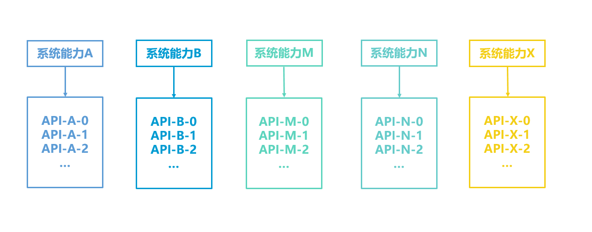
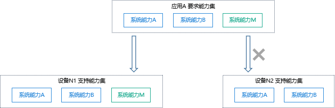
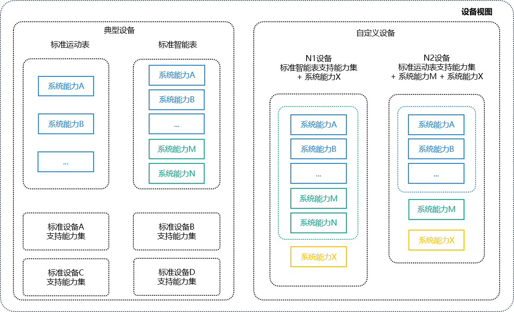
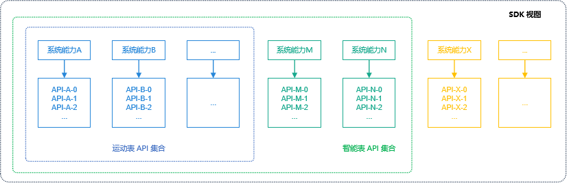
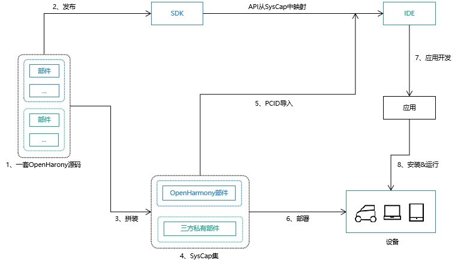

# 系统能力SystemCapability使用指南

## 概述

### 系统能力与 API

SysCap，全称SystemCapability，即系统能力，指操作系统中每一个相对独立的特性，如蓝牙，WIFI，NFC，摄像头等，都是系统能力之一。每个系统能力对应多个API，随着目标设备是否支持该系统能力共同存在或消失，也会随着DevEco Studio一起提供给开发者做联想。



<!--Del-->开发者可以在[SysCap列表](phone-syscap-list.md)中查询OpenHarmony的能力集。<!--DelEnd-->

### 支持能力集，联想能力集与要求能力集

支持能力集，联想能力集与要求能力集都是系统能力的集合。

支持能力集描述的是设备能力，要求能力集描述的是应用能力。若应用A的要求能力集是设备N的支持能力集的子集，则应用A可分发到设备N上安装运行，否则不能分发。

联想能力集是该应用开发时，DevEco Studio可联想的API所在的系统能力集合。



### 设备与支持能力集

每个设备根据其硬件能力，对应不同的支持能力集。

SDK将设备分为两组，典型设备和自定义设备，典型设备的支持能力集由OpenHarmony来定义，自定义设备由设备厂商给出。



### 设备与SDK能力的对应

SDK向DevEco Studio提供全量API，DevEco Studio识别开发者项目中选择的设备形态，找到该设备的支持能力集，筛选支持能力集包含的API并提供API联想。



## SysCap开发指导

<!--Del-->
### PCID获取

PCID，全称Product Compatibility ID，包含当前设备支持的SysCap信息。获取所有设备PCID的认证中心正在建设中，目前需要找对应设备的厂商获取该设备的PCID。

### PCID导入

DevEco Studio工程支持PCID的导入。导入的PCID文件解码后输出的SysCap会被写入syscap.json文件中。

在工程目录右键后选择Import Product Compatibility ID，即可上传PCID文件并导入至syscap.json中。


### 配置联想能力集和要求能力集

DevEco Studio会根据创建的工程所支持的设置自动配置联想能力集和要求能力集，开发者也可以自行修改。
对于联想能力集，开发者通过添加更多的系统能力，在DevEco Studio中可以使用更多的API，但要注意这些API可能在设备上不支持，使用前需要判断。
对于要求能力集，开发者修改时要十分慎重，修改不当会导致应用无法分发到目标设备上。

```json
// syscap.json
{
	"devices": {
		"general": [            // 每一个典型设备对应一个syscap支持能力集，可配置多个典型设备
			"default",
			"car"
		],
		"custom": [             // 厂家自定义设备
			{
				"某自定义设备": [
					"SystemCapability.Communication.SoftBus.Core"
				]
			}
		]
	},
	"development": {             // addedSysCaps内的sycap集合与devices中配置的各设备支持的syscap集合的并集共同构成联想能力集
		"addedSysCaps": [
			"SystemCapability.Location.Location.Lite"
		]
	},
	"production": {              // 用于生成rpcid，慎重添加，可能导致应用无法分发到目标设备上
		"addedSysCaps": [],      // devices中配置的各设备支持的syscap集合的交集，添加addedSysCaps集合再除去removedSysCaps集合，共同构成要求能力集
		"removedSysCaps": []     // 当该要求能力集为某设备的子集时，应用才可被分发到该设备上
	}
}
```
<!--DelEnd-->

<!--RP1--><!--RP1End-->

### 单设备应用开发

默认应用的联想能力集，要求系统能力集和设备的支持系统能力集相等，开发者修改要求能力集需要慎重。


### 跨设备应用开发

默认应用的联想能力集是多个设备支持能力集的并集，要求能力集则是交集。


### 判断 API 是否可以使用

当前提供了ArkTS API和Native API用于帮助判断某个API是否可以使用。

- ArkTS API

  - 方法1：OpenHarmony定义了API canIUse帮助开发者来判断该设备是否支持某个特定的syscap。

    ```ts
    if (canIUse("SystemCapability.ArkUI.ArkUI.Full")) {
	   console.log("该设备支持SystemCapability.ArkUI.ArkUI.Full");
    } else {
       console.log("该设备不支持SystemCapability.ArkUI.ArkUI.Full");
    }
    ```

  - 方法2：开发者可通过import的方式将模块导入，若当前设备不支持该模块，import的结果为undefined，开发者在使用其API时，需要判断其是否存在。

	```ts
	import geolocationManager from '@ohos.geoLocationManager';

	try {
	geolocationManager.getCurrentLocation((location) => {
		console.log('current location: ' + JSON.stringify(location));
	});
	} catch(err) {
	    console.error('该设备不支持位置信息' + err);
	}
	```
- Native API

	```c
	#include <stdio.h>
	#include <stdlib.h>
	#include "syscap_ndk.h"

	char syscap[] = "SystemCapability.ArkUI.ArkUI.Full";
	bool result = canIUse(syscap);
	if (result) {
		printf("SysCap: %s is supported!\n", syscap);
	} else {
		printf("SysCap: %s is not supported!\n", syscap);
	}
	```

除此之外，开发者可以通过API参考文档查询API接口所属的SysCap。

### 不同设备相同能力的差异检查

即使是相同的系统能力，在不同的设备下，也会有能力的差异。比如同是摄像头的能力，平板设备优于智能穿戴设备。

```ts
import userAuth from '@ohos.userIAM.userAuth';

const authParam : userAuth.AuthParam = {
  challenge: new Uint8Array(),
  authType: [userAuth.UserAuthType.PIN],
  authTrustLevel: userAuth.AuthTrustLevel.ATL1,
};
const widgetParam :userAuth.WidgetParam = {
  title: '请输入密码',
};
try {
  let userAuthInstance = userAuth.getUserAuthInstance(authParam, widgetParam);
  userAuthInstance.start();
    console.log('设备认证成功');
} catch (error) {
    console.error('auth catch error: ' + JSON.stringify(error));
}
```

### 设备间的SysCap差异如何产生的

设备的SysCap因产品解决方案厂商拼装的部件组合不同而不同，整体流程如下图：



1. 一套操作系统源码由可选和必选部件集组成，不同的部件为对外体现的系统能力不同，即部件与 SysCap 之间映射关系。

2. 发布归一化的SDK，API与SysCap之间存在映射关系。

3. 产品解决方案厂商按硬件能力和产品诉求，可按需拼装部件。

4. 产品配置的部件可以是系统部件，也可以是三方开发的私有部件，由于部件与SysCap间存在映射，所有拼装后即可得到该产品的SysCap集合。

5. SysCap集编码生成 PCID (Product Compatibility ID， 产品兼容性标识)，应用开发者可将PCID导入IDE解码成SysCap，开发时对设备的SysCap差异做兼容性处理。

6. 部署到设备上的系统参数中包含了SysCap集，系统提供了native的接口和应用接口，可供系统内的部件和应用查询某个SysCap是否存在。

7. 应用开发过程中，应用必要的SysCap将被编码成RPCID（Required Product Compatibility ID），并写入应用安装包中。应用安装时，包管理器将解码RPCID得到应用需要的 SysCap，与设备当前具备的SysCap比较，若应用要求的SysCap都被满足，则安装成功。

8. 应用运行时，可通过canIUse接口查询设备的SysCap，保证在不同设备上的兼容性。
