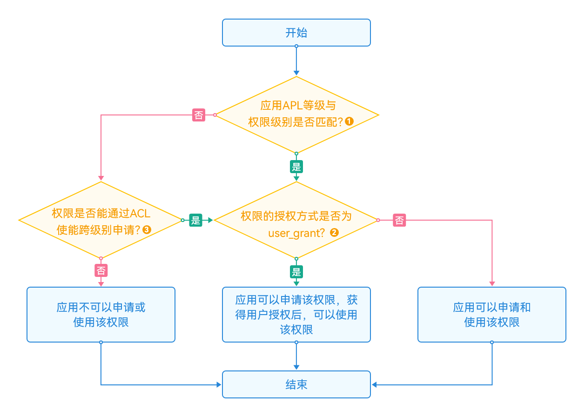

# 选择申请权限的方式

应用在访问数据或者执行操作时，需要评估该行为是否需要应用具备相关的权限。如果确认需要目标权限，则需要在应用安装包中申请目标权限。

每一个权限的权限等级、授权方式不同，申请权限的方式也不同，开发者在申请权限前，需要先根据以下流程判断应用能否申请目标权限。



上图的数字标注，请参考以下说明：

- 标注1：应用APL等级与权限等级的匹配关系请参考[APL等级说明](app-permission-mgmt-overview.md#权限机制中的基本概念)。

- 标注2：权限的授权方式分为user_grant（用户授权）和system_grant（系统授权），具体请参考[授权方式说明](app-permission-mgmt-overview.md#授权方式)。
  - 如果目标权限是system_grant类型，开发者在进行权限申请后，系统会在安装应用时自动为其进行权限预授予，开发者不需要做其他操作即可使用权限。
  - 在应用需要获取user_grant权限时，请完成以下步骤：
     1. 在配置文件中，声明应用需要请求的权限。
     2. 将应用中需要申请权限的目标对象与对应目标权限进行关联，让用户明确地知道，哪些操作需要用户向应用授予指定的权限。
     3. 运行应用时，在用户触发访问操作目标对象时应该调用接口，精准触发动态授权弹框。该接口的内部会检查当前用户是否已经授权应用所需的权限，如果当前用户尚未授予应用所需的权限，该接口会拉起动态授权弹框，向用户请求授权。
     4. 检查用户的授权结果，确认用户已授权才可以进行下一步操作。

- 标注3：应用可以通过ACL（访问控制列表）方式申请高级别的权限，具体请参考<!--RP1-->[访问控制列表（ACL）说明](app-permission-mgmt-overview.md#权限机制中的基本概念)。<!--RP1End-->

应用可根据目标权限的开放范围、授权方式，参考以下操作路径申请对应权限。

## <!--Del-->normal等级<!--DelEnd-->应用申请权限的方式

| 权限类型 | 授权方式 | 操作路径 |
| -------- | -------- | -------- |
| [开放权限（系统授权）](permissions-for-all.md) | system_grant | [声明权限](declare-permissions.md) &gt; 访问接口 | 
| [开放权限（用户授权）](permissions-for-all-user.md) | user_grant  | [声明权限](declare-permissions.md) &gt; [向用户申请授权](request-user-authorization.md) &gt; 访问接口 | 
| <!--DelRow-->[允许normal等级应用通过ACL跨级申请](permissions-for-system-apps.md#system_grant允许acl跨级申请) | system_grant | [申请使用受限权限](declare-permissions-in-acl.md) &gt; [声明权限](declare-permissions.md) &gt; 访问接口 | 
| <!--DelRow-->[允许normal等级应用通过ACL跨级申请](permissions-for-system-apps.md#user_grant允许acl跨级申请) | user_grant | [申请使用受限权限](declare-permissions-in-acl.md) &gt; [声明权限](declare-permissions.md) &gt; [向用户申请授权](request-user-authorization.md) &gt; 访问接口 |
<!--RP2--><!--RP2End-->

<!--Del-->
> **说明：**
>
> - 如果system_basic等级的权限，ACL使能为false，则normal等级应用无法申请该权限。
> - 当前可通过DevEco Studio完成[ACL方式跨级别申请权限](https://developer.huawei.com/consumer/cn/doc/harmonyos-guides/ide-signing-0000001587684945)，但该方法仅用于应用调试阶段使用，不可用于发布上架应用市场。如果需要开发商用版本的应用，请在对应的应用市场进行发布证书和Profile文件的申请。

## system_basic等级应用申请权限的方式

| 权限等级 | 授权方式 | ACL使能 | 操作路径 | 
| -------- | -------- | -------- | -------- |
| normal、system_basic | system_grant | - | [声明权限](declare-permissions.md) &gt; 访问接口 | 
| normal、system_basic | user_grant | - | [声明权限](declare-permissions.md) &gt; [向用户申请授权](request-user-authorization.md) &gt; 访问接口 | 
| system_core | system_grant | true | [申请使用受限权限](declare-permissions-in-acl.md) &gt; [声明权限](declare-permissions.md) &gt; 访问接口 | 
| system_core | user_grant | true | [申请使用受限权限](declare-permissions-in-acl.md) &gt; [声明权限](declare-permissions.md) &gt; [向用户申请授权](request-user-authorization.md) &gt; 访问接口 | 

如果应用需要将自身的APL等级声明为system_basic及以上，在开发应用安装包时，需要修改应用的HarmonyAppProvision配置文件即SDK目录下的“`Toolchains / _{Version} _/ lib / UnsgnedReleasedProfileTemplate.json`”文件，并重新进行应用签名。

**修改方式：**

HarmonyAppProvision配置文件示例如下所示，修改"bundle-info" &gt; "apl" 字段。

```json
"bundle-info" : {
    // ...
    "apl": "system_basic",
    // ...
},
```

> **说明：**
> 直接修改HarmonyAppProvision配置文件的方式，仅用于应用调试阶段使用，不可用于发布上架应用市场。如果需要开发商用版本的应用，请在对应的应用市场进行发布证书和Profile文件的申请。

<!--DelEnd-->