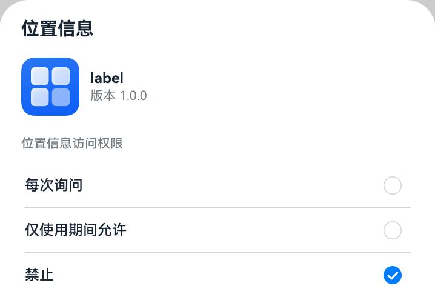

# 再次向用户申请授权

<!--Kit: Ability Kit-->
<!--Subsystem: Security-->
<!--Owner: @xia-bubai-->
<!--SE: @linshuqing; @hehehe-li-->
<!--TSE: @leiyuqian-->

当应用通过[requestPermissionsFromUser()](../../reference/apis-ability-kit/js-apis-abilityAccessCtrl.md#requestpermissionsfromuser9)拉起弹框[请求用户授权](request-user-authorization.md)时，如果用户拒绝授权，应用将无法再次通过requestPermissionsFromUser()拉起弹框。用户需要在系统设置中手动授权。

在“设置”应用中的路径如下：
<!--RP1-->
隐私 > 权限管理 > *权限类型（如位置信息）* > *具体应用*。
<!--RP1End-->

应用也可以通过调用[requestPermissionOnSetting()](../../reference/apis-ability-kit/js-apis-abilityAccessCtrl.md#requestpermissiononsetting12)，直接拉起权限设置弹框，引导用户授权。

效果展示：

<!--RP2-->

<!--RP2End-->

以下示例代码展示了如何再次拉起弹框申请ohos.permission.APPROXIMATELY_LOCATION权限。

```ts
import { abilityAccessCtrl, Context, common } from '@kit.AbilityKit';
import { BusinessError } from '@kit.BasicServicesKit';

let atManager: abilityAccessCtrl.AtManager = abilityAccessCtrl.createAtManager();
let context: Context = this.getUIContext().getHostContext() as common.UIAbilityContext;
atManager.requestPermissionOnSetting(context, ['ohos.permission.APPROXIMATELY_LOCATION']).then((data: Array<abilityAccessCtrl.GrantStatus>) => {
  console.info('data:' + JSON.stringify(data));
}).catch((err: BusinessError) => {
  console.error('data:' + JSON.stringify(err));
});
```