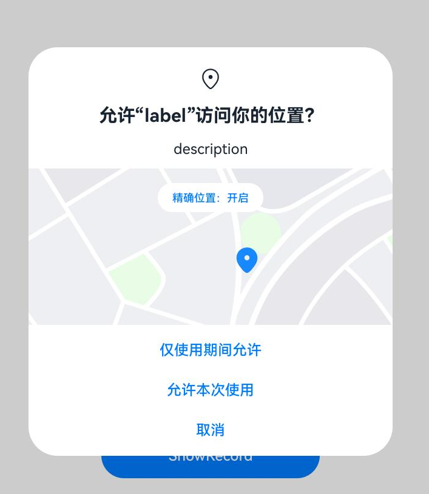

# 向用户申请授权

当应用需要访问用户的隐私信息或使用系统能力时，例如获取位置信息、访问日历、使用相机拍摄照片或录制视频等，应该向用户请求授权，这部分权限是user_grant权限。

当应用申请user_grant权限时，需要完成以下步骤：

1. 在配置文件中，声明应用需要请求的权限。

2. 将应用中需要申请权限的目标对象与对应目标权限进行关联，让用户明确地知道，哪些操作需要用户向应用授予指定的权限。
   以上两步请参考章节[声明权限](declare-permissions.md)完成。

3. 运行应用时，在用户触发访问操作目标对象时应该调用接口，精准触发动态授权弹框。该接口的内部会检查当前用户是否已经授权应用所需的权限，如果当前用户尚未授予应用所需的权限，该接口会拉起动态授权弹框，向用户请求授权。

4. 检查用户的授权结果，确认用户已授权才可以进行下一步操作。

本章节会介绍如何完成步骤3和4。

## 约束与限制

- 每次执行需要目标权限的操作时，应用都必须检查自己是否已经具有该权限。
  
  如需检查用户是否已向您的应用授予特定权限，可以使用[checkAccessToken()](../../reference/apis-ability-kit/js-apis-abilityAccessCtrl.md#checkaccesstoken9)函数，此方法会返回[PERMISSION_GRANTED](../../reference/apis-ability-kit/js-apis-abilityAccessCtrl.md#grantstatus)或[PERMISSION_DENIED](../../reference/apis-ability-kit/js-apis-abilityAccessCtrl.md#grantstatus)。具体示例可参考下文。

- 每次访问受目标权限保护的接口之前，都需要使用[requestPermissionsFromUser()](../../reference/apis-ability-kit/js-apis-abilityAccessCtrl.md#requestpermissionsfromuser9)接口请求相应的权限。

  用户可能在动态授予权限后通过系统设置来取消应用的权限，因此不能将之前授予的授权状态持久化。

- user_grant权限授权要基于用户可知可控的原则，需要应用在运行时主动调用系统动态申请权限的接口，系统弹框由用户授权，用户结合应用运行场景的上下文，识别出应用申请相应敏感权限的合理性，从而做出正确的选择。

- 系统不鼓励频繁弹窗打扰用户，如果用户拒绝授权，将无法再次拉起弹窗，需要应用引导用户在系统应用“设置”的界面中手动授予权限。

- 系统权限弹窗不可被遮挡。

  系统权限弹窗不可被其他组件/控件遮挡，弹窗信息需要完整展示，以便用户识别并完成授权动作。
  如果系统权限弹窗与其他组件/控件同时同位置展示，系统权限弹窗将默认覆盖其他组件/控件。

## 开发步骤

以申请使用位置权限为例进行说明。

效果展示：



1. 申请ohos.permission.LOCATION、ohos.permission.APPROXIMATELY_LOCATION权限，配置方式请参见[声明权限](declare-permissions.md)。

2. 校验当前是否已经授权。

   在进行权限申请之前，需要先检查当前应用程序是否已经被授予权限。可以通过调用[checkAccessToken()](../../reference/apis-ability-kit/js-apis-abilityAccessCtrl.md#checkaccesstoken9)方法来校验当前是否已经授权。如果已经授权，则可以直接访问目标操作，否则需要进行下一步操作，即向用户申请授权。

   ```ts
   import { abilityAccessCtrl, bundleManager, Permissions } from '@kit.AbilityKit';
   import { BusinessError } from '@kit.BasicServicesKit';
   
   const permissions: Array<Permissions> = ['ohos.permission.LOCATION','ohos.permission.APPROXIMATELY_LOCATION'];
   
   async function checkPermissionGrant(permission: Permissions): Promise<abilityAccessCtrl.GrantStatus> {
     let atManager: abilityAccessCtrl.AtManager = abilityAccessCtrl.createAtManager();
     let grantStatus: abilityAccessCtrl.GrantStatus = abilityAccessCtrl.GrantStatus.PERMISSION_DENIED;
   
     // 获取应用程序的accessTokenID
     let tokenId: number = 0;
     try {
       let bundleInfo: bundleManager.BundleInfo = await bundleManager.getBundleInfoForSelf(bundleManager.BundleFlag.GET_BUNDLE_INFO_WITH_APPLICATION);
       let appInfo: bundleManager.ApplicationInfo = bundleInfo.appInfo;
       tokenId = appInfo.accessTokenId;
     } catch (error) {
       const err: BusinessError = error as BusinessError;
       console.error(`Failed to get bundle info for self. Code is ${err.code}, message is ${err.message}`);
     }
   
     // 校验应用是否被授予权限
     try {
       grantStatus = await atManager.checkAccessToken(tokenId, permission);
     } catch (error) {
       const err: BusinessError = error as BusinessError;
       console.error(`Failed to check access token. Code is ${err.code}, message is ${err.message}`);
     }
   
     return grantStatus;
   }
   
   async function checkPermissions(): Promise<void> {
     let grantStatus1: boolean = await checkPermissionGrant(permissions[0]) === abilityAccessCtrl.GrantStatus.PERMISSION_GRANTED;// 获取精确定位权限状态
     let grantStatus2: boolean = await checkPermissionGrant(permissions[1]) === abilityAccessCtrl.GrantStatus.PERMISSION_GRANTED;// 获取模糊定位权限状态
     // 精确定位权限只能跟模糊定位权限一起申请，或者已经有模糊定位权限才能申请精确定位权限
     if (grantStatus2 && !grantStatus1) {
        // 申请精确定位权限
     } else if (!grantStatus1 && !grantStatus2) {
        // 申请模糊定位权限与精确定位权限或单独申请模糊定位权限
     } else {
        //  已经授权，可以继续访问目标操作
     }
   }
   ```

3. 动态向用户申请授权。

   动态向用户申请权限是指在应用程序运行时向用户请求授权的过程。可以通过调用[requestPermissionsFromUser()](../../reference/apis-ability-kit/js-apis-abilityAccessCtrl.md#requestpermissionsfromuser9)方法来实现。该方法接收一个权限列表参数，例如位置、日历、相机、麦克风等。用户可以选择授予权限或者拒绝授权。

   可以在UIAbility的onWindowStageCreate()回调中调用[requestPermissionsFromUser()](../../reference/apis-ability-kit/js-apis-abilityAccessCtrl.md#requestpermissionsfromuser9)方法来动态申请权限，也可以根据业务需要在UI中向用户申请授权。

   应用在onWindowStageCreate()回调中申请授权时，需要等待异步接口loadContent()/setUIContent()执行结束后或在loadContent()/setUIContent()回调中调用[requestPermissionsFromUser()](../../reference/apis-ability-kit/js-apis-abilityAccessCtrl.md#requestpermissionsfromuser9)，否则在Content加载完成前，requestPermissionsFromUser会调用失败。

   <!--RP1--><!--RP1End-->

   <!--RP2-->
   - 在UIAbility中向用户申请授权。

      ```ts
      import { abilityAccessCtrl, common, Permissions, UIAbility } from '@kit.AbilityKit';
      import { window } from '@kit.ArkUI';
      import { BusinessError } from '@kit.BasicServicesKit';
      
      const permissions: Array<Permissions> = ['ohos.permission.LOCATION','ohos.permission.APPROXIMATELY_LOCATION'];
      function reqPermissionsFromUser(permissions: Array<Permissions>, context: common.UIAbilityContext): void {
        let atManager: abilityAccessCtrl.AtManager = abilityAccessCtrl.createAtManager();
        // requestPermissionsFromUser会判断权限的授权状态来决定是否唤起弹窗
        atManager.requestPermissionsFromUser(context, permissions).then((data) => {
          let grantStatus: Array<number> = data.authResults;
          let length: number = grantStatus.length;
          for (let i = 0; i < length; i++) {
            if (grantStatus[i] === 0) {
              // 用户授权，可以继续访问目标操作
            } else {
              // 用户拒绝授权，提示用户必须授权才能访问当前页面的功能，并引导用户到系统设置中打开相应的权限
              return;
            }
          }
          // 授权成功
        }).catch((err: BusinessError) => {
          console.error(`Failed to request permissions from user. Code is ${err.code}, message is ${err.message}`);
        })
      }
      export default class EntryAbility extends UIAbility {
        onWindowStageCreate(windowStage: window.WindowStage): void {
          // ...
          windowStage.loadContent('pages/Index', (err, data) => {
            reqPermissionsFromUser(permissions, this.context);
          // ...
          });
        }
      
        // ...
      }
      ```

   - 在UI中向用户申请授权。

      ```ts
      import { abilityAccessCtrl, common, Permissions } from '@kit.AbilityKit';
      import { BusinessError } from '@kit.BasicServicesKit';
      
      const permissions: Array<Permissions> = ['ohos.permission.LOCATION','ohos.permission.APPROXIMATELY_LOCATION'];
      function reqPermissionsFromUser(permissions: Array<Permissions>, context: common.UIAbilityContext): void {
        let atManager: abilityAccessCtrl.AtManager = abilityAccessCtrl.createAtManager();
        // requestPermissionsFromUser会判断权限的授权状态来决定是否唤起弹窗
        atManager.requestPermissionsFromUser(context, permissions).then((data) => {
          let grantStatus: Array<number> = data.authResults;
          let length: number = grantStatus.length;
          for (let i = 0; i < length; i++) {
            if (grantStatus[i] === 0) {
              // 用户授权，可以继续访问目标操作
            } else {
              // 用户拒绝授权，提示用户必须授权才能访问当前页面的功能，并引导用户到系统设置中打开相应的权限
              return;
            }
          }
          // 授权成功
        }).catch((err: BusinessError) => {
          console.error(`Failed to request permissions from user. Code is ${err.code}, message is ${err.message}`);
        })
      }
      
      @Entry
      @Component
      struct Index {
        aboutToAppear() {
          const context: common.UIAbilityContext = getContext(this) as common.UIAbilityContext;
          reqPermissionsFromUser(permissions, context);
        }
      
        build() {
          // ...
        }
      }
      ```
   <!--RP2End-->

4. 处理授权结果。

   调用[requestPermissionsFromUser()](../../reference/apis-ability-kit/js-apis-abilityAccessCtrl.md#requestpermissionsfromuser9)方法后，应用程序将等待用户授权的结果。如果用户授权，则可以继续访问目标操作。如果用户拒绝授权，则需要提示用户必须授权才能访问当前页面的功能，并引导用户到系统应用“设置”中打开相应的权限。<!--RP3-->

   路径：设置 \> 隐私 \> 权限管理 \> 应用 \> 目标应用<!--RP3End-->
