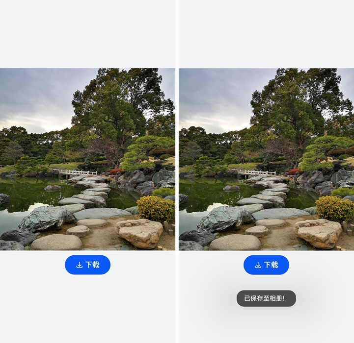

# 使用保存控件

保存控件是一种特殊的安全控件，它允许用户通过点击按钮临时获取存储权限，而无需通过权限弹框进行授权确认。

集成保存控件后，当用户点击该控件时，应用会获得10秒内访问媒体库特权接口的授权。这适用于任何需要将文件保存到媒体库的应用场景，例如保存图片或视频等。

与需要触发系统应用并由用户选择具体保存路径的Picker不同，保存控件可以直接保存到指定的媒体库路径，使得操作更为便捷。

保存控件效果如图所示。



## 约束与限制

- 当用户首次点击应用中的保存控件，系统将弹窗请求用户授权。如果用户点击“取消”，弹窗消失，应用无授权，用户再次点击保存控件时，将会重新弹窗；如果用户点击“允许”，弹窗消失，应用将被授予临时保存权限，此后点击该应用的保存控件将不会弹窗。

- 应用在onClick()触发回调到调用媒体库特权接口的时间间隔不能大于10秒。

- 用户点击一次控件，仅获取一次授权调用。

- 为了保障用户的隐私不被恶意应用获取，应用需确保安全控件是可见的且用户能够识别的。开发者需要合理的配置控件的尺寸、颜色等属性，避免视觉混淆的情况，如果发生因控件的样式不合法导致授权失败的情况，请检查设备错误日志。

- 当开发者需要自定义保存控件的图标和文本时，需要向应用市场申请ohos.permission.CUSTOMIZE_SAVE_BUTTON权限。

  > **注意：**
  > ohos.permission.CUSTOMIZE_SAVE_BUTTON受限开放，仅默认样式无法满足业务场景时可申请，申请方式请参考<!--RP1-->[申请使用受限权限](declare-permissions-in-acl.md)<!--RP1End-->。

## 开发步骤

以保存对话中图片为例，应用仅需要在前台期间，短暂使用保存图片的特性，不需要长时间使用。此时，可以直接使用安全控件中的保存控件，免去权限申请和权限请求等环节，获得临时授权，保存对应图片。

1. 导入文件和媒体库依赖。
   
   ```ts
   import { photoAccessHelper } from '@kit.MediaLibraryKit';
   import { fileIo } from '@kit.CoreFileKit';
   ```

2. 设置图片资源，并添加保存控件。
   
   保存控件是由图标、文本和背景组成的类似按钮的安全控件。其中，背景是必选的，图标和文本至少选择一个。图标和文本可以从已有的选项中选择，也可以通过[setIcon](../../reference/apis-arkui/arkui-ts/ts-security-components-savebutton.md#seticon20)和[setText](../../reference/apis-arkui/arkui-ts/ts-security-components-savebutton.md#settext20)自定义。在声明安全控件的接口时，有传参和不传参两种方式。不传参将默认创建一个包含图标、文字和背景的按钮；传参则根据参数创建，不包含未配置的元素。

   当前示例使用默认参数。具体请参见[SaveButton控件](../../reference/apis-arkui/arkui-ts/ts-security-components-savebutton.md)。此外，所有安全控件都继承[安全控件通用属性](../../reference/apis-arkui/arkui-ts/ts-securitycomponent-attributes.md)，可用于定制样式。
   
   图片保存到媒体库的详细介绍可参考[保存媒体库资源](../../media/medialibrary/photoAccessHelper-savebutton.md)。

   ```ts
   import { photoAccessHelper } from '@kit.MediaLibraryKit';
   import { fileIo } from '@kit.CoreFileKit';
   import { common } from '@kit.AbilityKit';
   import { promptAction } from '@kit.ArkUI';
   import { BusinessError } from '@kit.BasicServicesKit';
   
   async function savePhotoToGallery(context: common.UIAbilityContext) {
     let helper = photoAccessHelper.getPhotoAccessHelper(context);
     try {
       // onClick触发后10秒内通过createAsset接口创建图片文件，10秒后createAsset权限收回。
       let uri = await helper.createAsset(photoAccessHelper.PhotoType.IMAGE, 'jpg');
       // 使用uri打开文件，可以持续写入内容，写入过程不受时间限制。
       let file = await fileIo.open(uri, fileIo.OpenMode.READ_WRITE | fileIo.OpenMode.CREATE);
       // $r('app.media.startIcon')需要替换为开发者所需的图像资源文件。
       context.resourceManager.getMediaContent($r('app.media.startIcon').id, 0)
         .then(async value => {
           let media = value.buffer;
           // 写到媒体库文件中。
           await fileIo.write(file.fd, media);
           await fileIo.close(file.fd);
           promptAction.openToast({ message: '已保存至相册！' });
         });
     }
     catch (error) {
       const err: BusinessError = error as BusinessError;
       console.error(`Failed to save photo. Code is ${err.code}, message is ${err.message}`);
     }
   }
   
   @Entry
   @Component
   struct Index {
     build() {
       Row() {
         Column({ space: 10 }) {
           // $r('app.media.startIcon')需要替换为开发者所需的图像资源文件。
           Image($r('app.media.startIcon'))
             .height(400)
             .width('100%')
   
           SaveButton()
             .padding({top: 12, bottom: 12, left: 24, right: 24})
             .onClick((event: ClickEvent, result: SaveButtonOnClickResult) => {
               if (result === SaveButtonOnClickResult.SUCCESS) {
                 const context: common.UIAbilityContext = this.getUIContext().getHostContext() as common.UIAbilityContext;
                 // 免去权限申请和权限请求等环节，获得临时授权，保存对应图片。
                 savePhotoToGallery(context);
               } else {
                 promptAction.openToast({ message: '设置权限失败！' });
               }
             })
         }
         .width('100%')
       }
       .height('100%')
       .backgroundColor(0xF1F3F5)
     }
   }
   ```
