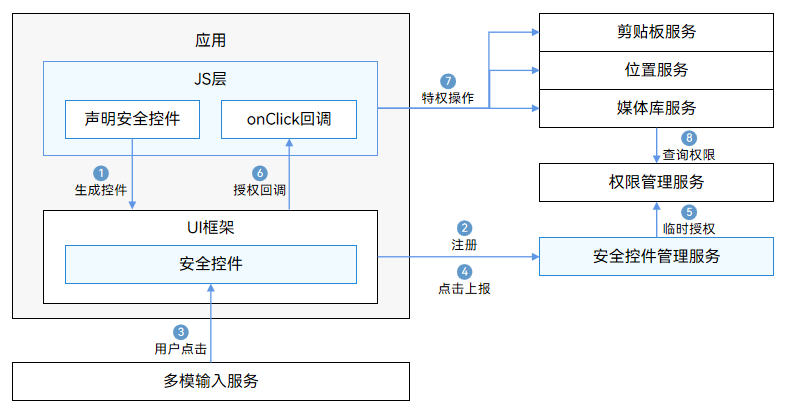

# 安全控件概述

安全控件是系统提供的一组系统实现的ArkUI组件，应用集成这类组件就可以实现在用户点击后自动授权，而无需弹窗授权。它们可以作为一种“特殊的按钮”融入应用页面，实现用户点击即许可的设计思路。

相较于动态申请权限的方式，安全控件可基于场景化授权，简化开发者和用户的操作，主要优点有：

1. 用户可掌握授权时机，授权范围最小化。

2. 授权场景可匹配用户真实意图。

3. 减少弹窗打扰。

4. 开发者不必向应用市场申请权限，简化操作。

安全控件坚持仅采集实现业务功能所必须的个人数据，以服务于用户的需求，帮助开发透明、可选、可控的隐私合规应用。

## 安全控件列表

目前系统提供三类安全控件：

- [粘贴控件（PasteButton）](pastebutton.md)
  
  该控件对应剪贴板读取特权。应用集成粘贴控件后，用户点击该控件，应用读取剪贴板数据时不会弹窗提示。

  建议使用场景：粘贴控件可以用于任何应用需要读取剪贴板的场景，避免弹窗提示对用户造成干扰。

- [保存控件（SaveButton）](savebutton.md)
  
  该控件对应媒体库写入特权。应用集成保存控件后，用户点击该控件，应用会获取10秒内访问媒体库特权接口的授权。

  建议使用场景：保存控件可以用于任何应用需要保存文件到媒体库的场景（保存图片、保存视频等）。与Picker需要拉起系统应用再由用户选择具体路径保存的方式不同，保存控件将直接保存到指定媒体库路径，操作更快捷。

- [位置控件（LocationButton）](locationbutton.md)
  
  该控件对应精准定位特权。应用集成位置控件后，用户点击该控件，无论应用是否申请过或者被授予精准定位权限，都会在本次前台期间获得精准定位的授权，可以调用位置服务获取精准定位。

  建议使用场景：应用不是强位置关联应用（如导航、运动健康等），仅在部分前台场景需要使用位置信息（如定位城市、打卡、分享位置等）。如果需要长时间使用或是在后台使用位置信息，建议申请位置权限。

## 运作机制

整体方案由安全控件UI组件、安全控件管理服务、安全控件增强组成：

- UI组件：实现了固定文字图标的样式，便于用户识别，同时提供了相对丰富的定制化能力，便于开发者定制。

- 控件管理服务：提供控件注册管理能力、控件临时授权机制、管理授权生效周期，确保应用后台、锁屏下无法注册使用安全控件。

- 安全增强：实现了地址随机化、挑战值检查、回调UI框架复核控件信息、调用者地址检查、组件防覆盖、真实点击事件校验等机制，防止应用开发者通过混淆、隐藏、篡改、仿冒等方式滥用授权机制，泄露用户隐私。

开发者调用接口时，运作流程如图所示。

1. 应用开发者在ETS文件中集成安全控件，通过JS引擎解析后，在ArkUI框架中生成具体的控件。

2. 安全控件注册控件信息到安全控件管理服务，安全控件管理服务检查控件信息的合法性。

3. 用户点击事件分发到安全控件。

4. 安全控件将点击事件上报到安全控件管理服务。

5. 安全控件管理服务根据控件种类对应不同权限，调用权限管理服务进行临时授权。

6. 授权成功后，安全控件回调OnClick通知应用层授权成功。

7. 应用调用相应的特权操作，如获取地理位置、读取剪贴板信息、媒体库中创建文件等。
   不同类型的安全控件，对于权限的使用方式不同、授权的有效期也不同，详情请查阅具体安全控件的开发指导。

8. 对应的服务会调用权限管理服务或安全控件管理服务，获取授权结果，返回鉴权结果。

## 约束与限制

安全控件因其自动授权的特性，为了保障用户的隐私不被恶意应用获取，针对安全控件作了很多的限制。应用开发者需保证安全控件在应用界面上清晰可见、用户能明确识别，防止因覆盖、混淆等因素导致授权失败。

当因控件样式不合法导致授权失败的情况发生时，请开发者检查设备错误日志，过滤关键字"SecurityComponentCheckFail"可以获取具体原因。

> **说明：**
> 请开发者关注过滤条件下，所有级别的日志。

可能会导致授权失败的问题（包括但不限于）：

- 字体、图标尺寸过小。

- 安全控件整体尺寸过大。

- 字体、图标、背景按钮的颜色透明度过高。

- 字体或图标与背景按钮颜色过于相似。

- 安全控件超出屏幕、超出窗口等，导致显示不全。

- 安全控件被其他组件或窗口遮挡。

- 安全控件的父组件有类似变形模糊等可能导致安全控件显示不完整的属性。
