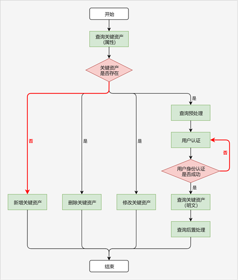

# 保护需要用户认证的密码类数据

<!--Kit: Asset Store Kit-->
<!--Subsystem: Security-->
<!--Owner: @JeremyXu-->
<!--SE: @skye_you-->
<!--TSE: @nacyli-->

> **说明：**
>
> 密码类数据可以是密码、登录令牌、信用卡号等用户敏感数据。

## 场景描述

用户在金融/银行类应用中查看银行卡号时，需要核实用户身份为持卡人本人。针对此种场景，应用可以将银行卡号存储到ASSET中，同时设置访问银行卡号需要用户身份认证。

用户查看银行卡号时，应用请求用户进行身份认证（例如通过验证锁屏密码或生物特征），身份校验通过后，应用查询并向用户展示银行卡号，极大地提升了用户安全体验。

## 关键流程

业务调用ASSET保护需要用户认证的关键资产，可以参照以下流程进行开发。

> **说明：**
>
> 由于统一用户认证（UserIAM）只提供ArkTS接口，故本场景只支持使用ArkTS语言开发。

 

1. 业务查询符合条件的关键资产属性，根据查询成功/失败，判断关键资产是否存在。

   开发步骤参考[查询关键资产](asset-js-query.md)，代码示例参考[查询单条关键资产属性](asset-js-query.md#查询单条关键资产属性)。
2. 如果关键资产不存在，业务可选择：
    * 新增关键资产，开发步骤参考[新增关键资产](asset-js-add.md)。
3. 如果关键资产存在，业务可选择：
    * 删除关键资产，开发步骤参考[删除关键资产](asset-js-remove.md)。
    * 更新关键资产，开发步骤参考[更新关键资产](asset-js-update.md)。
    * 查询关键资产明文，开发步骤包括预处理、用户认证、查询明文、后置处理，参考[查询需要用户认证的关键资产](asset-js-query-auth.md)。
