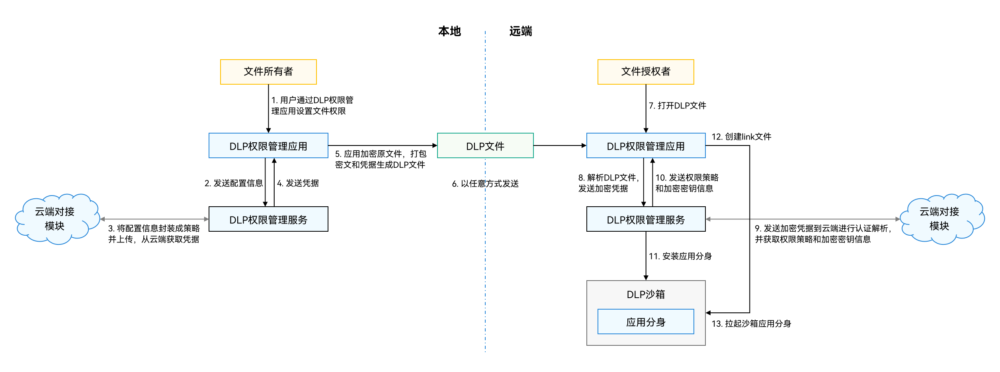

# 数据防泄漏服务简介
<!--Kit: Data Protection Kit-->
<!--Subsystem: Security-->
<!--Owner: @winnieHuYu-->
<!--SE: @lucky-jinduo-->
<!--TSE: @nacyli-->

数据防泄漏服务（Data Loss Prevention，简称为DLP），是系统提供的系统级的数据防泄漏解决方案，提供文件权限管理、加密存储、授权访问等能力，数据所有者可以基于账号认证对机密文件进行权限配置，允许拥有只读、编辑、拥有者权限，随后机密文件会通过密文存储，在支持DLP机制的设备上可以通过端云协调进行认证授权，获取对数据的访问和修改的能力。

DLP是系统级别的，应用开发者只需要做少量的适配甚至无需适配，即可获得完整的数据防泄漏保护。

DLP整体解决方案由3个主要部件构成。

- **DLP权限管理部件：**

  权限管理底层服务，负责沙箱应用创建、凭据管理交互。

- **DLP管理应用部件：**

  负责实现权限在本地的设置、检验和拦截功能；是最终实现用户可感知的受控分享功能的关键载体。

- **云端对接模块：（该模块当前需要开发者自行搭建）**

  负责将DLP文件的证书，发往云端完成基于账号的鉴权，证书生成及解密功能。

## 运作流程

**DLP文件生成**

1.文件所有者通过DLP权限管理应用给需保护的文件配置权限，添加允许访问的账号信息和相应的访问权限。
2.DLP权限管理应用发送用户配置给DLP权限管理服务封装成策略信息。
3.DLP权限管理服务将策略信息发送给云端对接模块。云端对接模块上传策略信息作端云协同的认证、策略检查、生成签发凭据等工作。
4.将签发的凭据通过DLP权限管理服务返回给DLP权限管理应用。
5.DLP权限管理应用对原文件进行加密，并将凭据和密文打包生成DLP文件。

**DLP文件发送**

6.DLP文件可通过任何途径分享给目标用户，密文保证了其机密性不被破坏。

**DLP文件打开**

7.文件授权者在远端设备打开DLP文件（例如使用文件管理器打开）。
8.DLP权限管理应用解析DLP文件，获取加密凭据后，发送给DLP权限管理服务。
9.DLP权限管理服务将加密凭据发送给云端对接模块。云端对接模块上传凭据到云端，作身份认证、凭据验证、策略解析。获取到授权策略和加密密钥等信息。
10.权限策略和加密密钥等信息通过DLP权限管理服务返回给DLP权限管理应用。
11.DLP权限管理应用调用DLP权限管理服务安装应用的DLP沙箱分身，并基于授权测试限制沙箱的权限，包含但不限于网络、打印、剪切板等，防止数据被泄漏。
12.DLP权限管理应用提供一种明文和密文映射机制（link），该方案基于开源的fuse文件系统（Filesystem in Userspace）实现，通过创建虚拟的link文件，分享给应用，从而在不需要适配的情况下，应用即可通过查看编辑明文文件，来达到实时操作DLP文件的效果。
13.DLP权限管理应用准备就绪后，拉起沙箱中的应用，并传递文件描述符给link文件。沙箱应用启动，应用进程读取被分享的link文件，完成文件内容展示。
