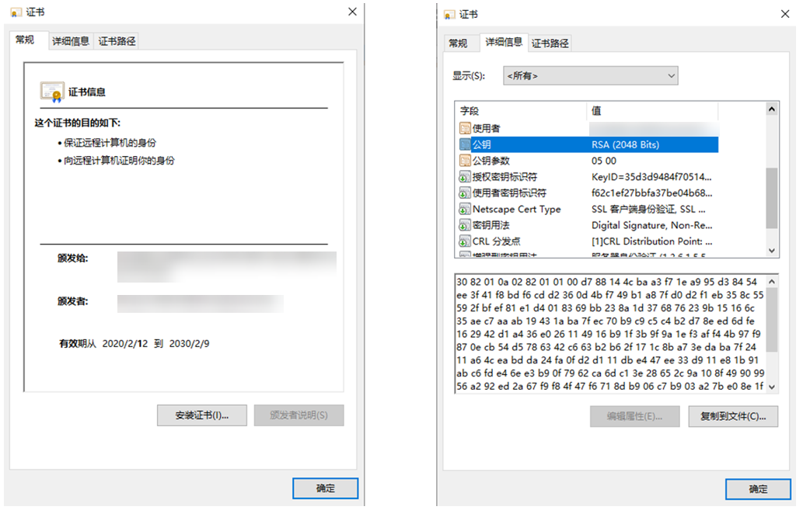
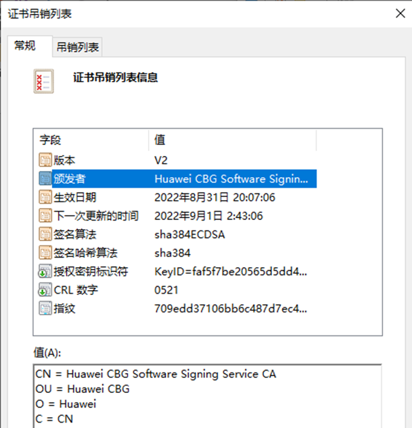

# 证书算法库框架概述

证书算法库框架是一个屏蔽了第三方算法库实现差异的证书算法框架，向应用提供证书、证书扩展域段、证书吊销列表的创建、解析及校验能力，此外还提供了证书链的校验能力。

开发者可以通过调用证书算法库框架接口，忽略底层不同三方算法库的差异，实现迅捷开发。

> **说明：**
> 本框架具备处理已有证书及证书吊销列表数据后处理的能力，并不具备生成或签发证书及证书吊销列表的能力，签发证书及证书吊销列表的能力一般由证书颁发机构（CA）来完成，不由单个应用签发。

## 基本概念

证书算法库框架提供X509证书的解析、序列化、X509证书签名验证、X509证书吊销列表、证书链校验器等相关的功能。

在开发具体的功能前，开发者需要先了解证书领域的一些基本概念。包括但不限于：

数字证书、数字证书标准X.509（本指导中的"X509"均代指的是X.509）、证书链、TBS（To Be Signed）、CRL（Certificate Revoked List）。

## 证书规格

证书相关规格说明如下所示。

### 证书链校验不包含对时间有效性的校验

由于端侧系统时间不可信，证书链校验不包含对证书有效时间的校验。如果需要检查证书的时间有效性，可使用X509证书的[checkValidityWithDate()](../../reference/apis-device-certificate-kit/js-apis-cert.md#checkvaliditywithdate)方法进行检查。

### 证书格式

目前仅支持DER与PEM格式的证书。

### X509证书的基本结构

样例证书文件：

### X509证书吊销列表（CRL）基本结构

样例CRL文件：

## 约束与限制

依赖加解密算法库框架的基础算法能力的部分，算法库框架不支持多线程并发操作，详情请参考[加解密算法框架](../CryptoArchitectureKit/crypto-architecture-kit-intro.md#约束与限制)。

## 开发总览

证书算法库框架为开发者提供了以下相关功能的开发指导，请开发者参照开发。在开发前，请先查阅[证书规格](#证书规格)。

- [证书对象的创建、解析和校验](create-parse-verify-cert-object.md)
- [证书扩展信息对象的创建、解析和校验](create-parse-verify-certextension-object.md)
- [证书吊销列表对象的创建、解析和校验](create-parse-verify-crl-object.md)
- [证书链校验器对象的创建和校验](create-verify-cerchainvalidator-object.md)
- [证书集合及证书吊销列表集合对象的创建和获取](create-get-cert-crl-object.md)
- [证书链对象的创建和校验](create-verify-certchain-object.md)
- [证书链校验时从p12文件构造TrustAnchor对象数组](create-trustanchor-from-p12.md)

证书算法库框架主要提供了以下类，开发者可以查阅对应API参考，了解以下接口：

| 名称 | 类 | 功能 |
| -------- | -------- | -------- |
| X509证书 | [X509Cert](../../reference/apis-device-certificate-kit/js-apis-cert.md#x509cert) | 提供X509证书的解析、序列化、X509证书签名验证、证书相关的信息查询等功能。 |
| 证书扩展域段 | [CertExtension](../../reference/apis-device-certificate-kit/js-apis-cert.md#certextension10) | 提供X509证书中扩展域段的获取，如是否CA，CRL分发点等字段。 |
| X509证书吊销列表 | [X509CRL](../../reference/apis-device-certificate-kit/js-apis-cert.md#x509crl11) | 提供X509证书吊销列表的解析、序列化、信息查询等功能。 |
| 证书链校验器 | [CertChainValidator](../../reference/apis-device-certificate-kit/js-apis-cert.md#certchainvalidator) | 提供证书链校验（不包括证书有效期的校验）、证书链算法名称查询的功能。 |
| 证书和证书吊销列表集合 | [CertCRLCollection](../../reference/apis-device-certificate-kit/js-apis-cert.md#certcrlcollection11) | 提供证书和证书吊销列表集合的查询功能。 |
| X509证书链 | [X509CertChain](../../reference/apis-device-certificate-kit/js-apis-cert.md#x509certchain11) | 提供证书链校验、证书列表获取的功能。 |
