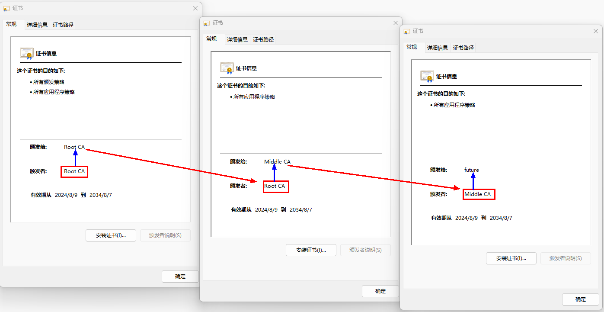

# 证书链校验器对象的创建和校验

证书链是由一组证书组成的证书集合，以图中样例证书文件为例，即可放在一个证书链中。

样例中可以看到GlobalSign自签名了证书，GlobalSign也签发了GlobalSign RSA OV SSL CA 2018的证书，GlobalSign RSA OV SSL CA 2018又签发了第三级证书。



开发者可以参考示例将已有的多个证书构建出证书链数据。

## 开发步骤

1. 导入[证书算法库框架模块](../../reference/apis-device-certificate-kit/js-apis-cert.md)。
   ```ts
   import { cert } from '@kit.DeviceCertificateKit';
   ```

2. [cert.createCertChainValidator](../../reference/apis-device-certificate-kit/js-apis-cert.md#certcreatecertchainvalidator)创建证书链校验器对象。

3. 基于已有的证书数据，创建证书链数据对象[CertChainData](../../reference/apis-device-certificate-kit/js-apis-cert.md#certchaindata)。
   
   证书算法库框架提供了证书链校验器对象可用于校验证书链，以验证信任链根源，但待校验的证书链数据对象应符合如下的数据结构定义。

   | 名称 | 类型 | 可读 | 可写 | 说明 | 
   | -------- | -------- | -------- | -------- | -------- |
   | data | Uint8Array | 是 | 是 | 证书数据，按照长度(2字节)-数据的形式传入。如08ABCDEFGH07ABCDEFG：第一本证书，前2个字节表示证书的长度为8字节，后面附加8字节的证书数据；第2本证书前2个字节表示证书的长度为7字节，后面附加7字节的证书数据。 | 
   | count | number | 是 | 是 | 传入的数据中，包含的证书数量。 | 
   | encodingFormat | [EncodingFormat](../../reference/apis-device-certificate-kit/js-apis-cert.md#encodingformat) | 是 | 是 | 指明证书编码格式。 | 

4. 调用[CertChainValidator.validate](../../reference/apis-device-certificate-kit/js-apis-cert.md#validate)校验证书链数据。

```ts
import { cert } from '@kit.DeviceCertificateKit';
import { util } from '@kit.ArkTS';

// CA数据，这只是一个示例，需要根据具体业务来赋值。
let caCertData = '-----BEGIN CERTIFICATE-----\n' +
  'MIIDgTCCAmmgAwIBAgIGAXKnJjrAMA0GCSqGSIb3DQEBCwUAMFcxCzAJBgNVBAYT\n' +
  'AkNOMQ8wDQYDVQQIDAbpmZXopb8xDzANBgNVBAcMBuilv+WuiTEPMA0GA1UECgwG\n' +
  '5rWL6K+VMRUwEwYDVQQDDAzkuK3mlofmtYvor5UwHhcNMjUwMjIwMDI1NjMxWhcN\n' +
  'MzUwMjE4MDI1NjMxWjBXMQswCQYDVQQGEwJDTjEPMA0GA1UECAwG6ZmV6KW/MQ8w\n' +
  'DQYDVQQHDAbopb/lrokxDzANBgNVBAoMBua1i+ivlTEVMBMGA1UEAwwM5Lit5paH\n' +
  '5rWL6K+VMIIBIjANBgkqhkiG9w0BAQEFAAOCAQ8AMIIBCgKCAQEAyY30ubE33Zmc\n' +
  'BBM4OIpD1UuDVKynC4xNBK4v79vnlc4ElmRZD4RjkS612DtpaUzt/yHMZXmJTdqg\n' +
  '2jq7UG4sQc0G3uNGIXdUpRZpnUYGVftuZMxHaNOb+IgDkZzaO3Dk33piOpH/X/Ke\n' +
  'OosCbm7eBL+y+wRhUsLSCEasEsIvW3edHuYLrfz3MzwY/9AmnwqDGdRJ5rPayODD\n' +
  'HH0yw9JuRkdMacN8omVX8jBfJeI8KafcQW8MJz+Y0qyQyiZ6A81AQSVfT+6Sk2U3\n' +
  'UqeSTmtdIL1u29HfYLwYGHey+1Ro2wxqnMsFKIdKu2dDMDQZx61pER/dFtPYFlS7\n' +
  '/uh3mi9HUQIDAQABo1MwUTAdBgNVHQ4EFgQUGDykmR825RPNFIEQaFzUqkr+CIow\n' +
  'HwYDVR0jBBgwFoAUGDykmR825RPNFIEQaFzUqkr+CIowDwYDVR0TAQH/BAUwAwEB\n' +
  '/zANBgkqhkiG9w0BAQsFAAOCAQEAXjlmYKjBz1ajWywZNlN+LVRXNx7bS4TYtOc2\n' +
  'ME4N1ls6yjWSLtBe4DdkBqZ2HwrVW4dg5xZdAS/T0v/rRiGbX6iUFRV9WCTdtLZB\n' +
  'HKNh7vU39F7mgTaaWXQK/+6NeLKMzwJENRRaESI/sXeKE6irfJgYuq3NH8GGFd+w\n' +
  'HnvVBHRb6WSlY2s5Li7t6lj40UbwOljnqzRQvBeX57rOnzJgVKND3oY9pex/05Oe\n' +
  '96x+qc2iqZbu54A6NYCTj/65EEKoj5rYxPXMV4FegV42ouaLJJoS+cEEY7w+ixcl\n' +
  '04TjtjEdhTZiJCmI0RK50H2SWC0t9qkFewM3CCWTHY5ygPtMGA==\n' +
  '-----END CERTIFICATE-----\n';

// 二级CA证书数据，这只是一个示例，需要根据具体业务来赋值。
let secondCaCertData = '-----BEGIN CERTIFICATE-----\n' +
  'MIIDgTCCAmmgAwIBAgIGAXKnJjrBMA0GCSqGSIb3DQEBCwUAMFcxCzAJBgNVBAYT\n' +
  'AkNOMQ8wDQYDVQQIDAbpmZXopb8xDzANBgNVBAcMBuilv+WuiTEPMA0GA1UECgwG\n' +
  '5rWL6K+VMRUwEwYDVQQDDAzkuK3mlofmtYvor5UwHhcNMjUwMjIwMDI1NjU3WhcN\n' +
  'MzUwMjE4MDI1NjU3WjBXMQswCQYDVQQGEwJDTjEPMA0GA1UECAwG6ZmV6KW/MQ8w\n' +
  'DQYDVQQHDAbopb/lrokxDzANBgNVBAoMBua1i+ivlTEVMBMGA1UEAwwM5Lit5paH\n' +
  '5rWL6K+VMIIBIjANBgkqhkiG9w0BAQEFAAOCAQ8AMIIBCgKCAQEAxSL5L7fwMaRF\n' +
  'RiT1l7kpzaAqZe33/3lgexoMfGiIFarIhYyYJsmOJKes2uLSnPeqEtscrXmFQiIG\n' +
  '0srmwrriGgo3oxDp4/5i1FhCf3FqZUwD/RJhtVmkHT0HoYl4cpt/dJSF/e5vxt/J\n' +
  '2Z1eRIQOj9DzyqET6+ONQmfVOyzEH6xlpXHZLvykSZ7ytPp25LxULPWjTmpDOPRq\n' +
  'vkSMaH4H3mPw/Z9r0MVKP7DgAZMl2yVudHp785AMTVD0L9zWGHf3sek25ek5nv2r\n' +
  'SlB21MTBpvd8GC/iGns4V3Bvf75WAMgpGghAkRRyADeqt5Hw+x9BIb9FcfE+h6n+\n' +
  '6EF6FPa8GQIDAQABo1MwUTAdBgNVHQ4EFgQUjt2Crk/j6W8WCdHWyz4H+Q2/3PYw\n' +
  'HwYDVR0jBBgwFoAUGDykmR825RPNFIEQaFzUqkr+CIowDwYDVR0TAQH/BAUwAwEB\n' +
  '/zANBgkqhkiG9w0BAQsFAAOCAQEAksPHMuVF9e2GMVlaSe1Ao9D1KrJvKNaFZPCI\n' +
  'lQe2CDsX+Qu7sQj4SML5vvWFLtcAp6ZovqUyEM0PtZWVSjPCRTMJ3ofBPwnXvQ2N\n' +
  '7J7NCDA227MQabXeN3jMhkcAzlpdO5poTnobPF4xRqb39jM7otnNJsujvzdDab2l\n' +
  'LiP4eU5TrEaF2lwidBWJX0VoLrRpqzQhiWXGMpCBBugP5U+bFs20wezJBG19WYyc\n' +
  '2xKKfvyIcxrpmvjLZl8HddS7Ot1CKXyc8U9QZBGAlPwOXu8juppcEtjJyl36EnvF\n' +
  'YAcwrXOAtCiNpX3UnLUbG8GtpOOWQWCt+x1gKmA6V0jbqQmqcw==\n' +
  '-----END CERTIFICATE-----\n';

// 证书链校验器示例。在这个示例中，验证了一个二级证书链。
function certChainValidatorSample(): void {
  let textEncoder = new util.TextEncoder();
  // 证书链校验器算法。目前仅支持PKIX。
  let algorithm = 'PKIX';

  // 创建一个证书链校验器实例。
  let validator = cert.createCertChainValidator(algorithm);

  // CA证书数据。
  let uint8ArrayOfCaCertData = textEncoder.encodeInto(caCertData);

  // CA证书数据的长度。
  let uint8ArrayOfCaCertDataLen = new Uint8Array(new Uint16Array([uint8ArrayOfCaCertData.byteLength]).buffer);

  // 二级CA证书数据。
  let uint8ArrayOf2ndCaCertData =  textEncoder.encodeInto(secondCaCertData);

  // 二级CA证书数据的长度。
  let uint8ArrayOf2ndCaCertDataLen = new Uint8Array(new Uint16Array([uint8ArrayOf2ndCaCertData.byteLength]).buffer);

  // 证书链二进制数据：二级CA证书数据长度+二级CA证书数据+CA证书数据长度+CA证书数据（L-V格式）。
  let encodingData = new Uint8Array(uint8ArrayOf2ndCaCertDataLen.length + uint8ArrayOf2ndCaCertData.length +
  uint8ArrayOfCaCertDataLen.length + uint8ArrayOfCaCertData.length);
  for (let i = 0; i < uint8ArrayOf2ndCaCertDataLen.length; i++) {
    encodingData[i] = uint8ArrayOf2ndCaCertDataLen[i];
  }
  for (let i = 0; i < uint8ArrayOf2ndCaCertData.length; i++) {
    encodingData[uint8ArrayOf2ndCaCertDataLen.length + i] = uint8ArrayOf2ndCaCertData[i];
  }
  for (let i = 0; i < uint8ArrayOfCaCertDataLen.length; i++) {
    encodingData[uint8ArrayOf2ndCaCertDataLen.length + uint8ArrayOf2ndCaCertData.length + i] = uint8ArrayOfCaCertDataLen[i];
  }
  for (let i = 0; i < uint8ArrayOfCaCertData.length; i++) {
    encodingData[uint8ArrayOf2ndCaCertDataLen.length + uint8ArrayOf2ndCaCertData.length +
    uint8ArrayOfCaCertDataLen.length + i] = uint8ArrayOfCaCertData[i];
  }

  let certChainData: cert.CertChainData = {
    // Uint8Array类型：L-V格式（证书数据长度-证书数据）。
    data: encodingData,
    // 证书的数量。本例中为2。
    count: 2,
    // 证书格式。仅支持 PEM 和 DER。在此示例中，证书为 PEM 格式。
    encodingFormat: cert.EncodingFormat.FORMAT_PEM
  };

  // 验证证书链。
  validator.validate(certChainData, (err, data) => {
    if (err != null) {
      // 校验失败。
      console.error(`validate failed, errCode: ${err.code}, errMsg: ${err.message}`);
    } else {
      // 校验成功。
      console.log('validate success');
    }
  });
}
```
