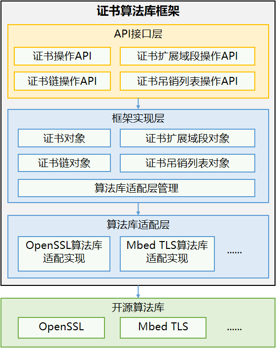

# Device Certificate Kit简介

Device Certificate Kit（设备证书服务）面向应用开发者，提供了[证书算法库](#证书算法库)和[证书管理](#证书管理)的能力。

## 证书算法库

证书算法库提供接口用于解析和验证数字证书。

证书算法库向应用提供证书、证书扩展域段、证书吊销列表的解析及校验能力，以及证书链的校验能力。

通过调用证书算法库框架接口，开发者可以忽略底层不同三方算法库的差异，实现迅捷开发。

**常见使用场景**

应用对接收的服务端证书或用户输入的证书进行解析，获取证书基本字段或扩展字段用于显示或校验，并使用CA证书链和CRL校验证书的合法性。

### 框架原理

系统提供证书算法库框架，开发者只需要调用API接口层即可实现证书的操作，通过证书算法库框架，可忽视不同三方算法库的差异。

### 与相关Kit的关系

证书算法库的功能使用时，涉及公钥的生成和获取，这部分依赖[Crypto Architecture Kit](../CryptoArchitectureKit/crypto-architecture-kit-intro.md)加解密算法框架服务的能力。

## 证书管理

证书管理主要提供系统级的证书管理能力，通过证书管理模块可以确保证书在传输和存储过程中的安全性，防止未经授权的访问和使用。

当前提供了应用私有凭据的安装、获取、使用及卸载能力。

通过证书管理能力，可以实现证书全生命周期（安装、存储、使用和销毁）的管理和安全使用。

**常见使用场景**

安装应用私有凭据，获取应用私有凭据，并使用应用私有凭据进行签名、验签，最后删除应用私有凭据。

### 与相关Kit的关系

证书管理的功能使用时，涉及凭据的安装和使用，这部分依赖[Universal Keystore Kit](../UniversalKeystoreKit/huks-overview.md)密钥管理服务的能力。

## 约束与限制

Device Certificate Kit不具备生成或签发证书及证书吊销列表的能力。生成或签发证书及证书吊销列表的能力一般由证书颁发机构（CA）来完成，不由单个应用签发。
