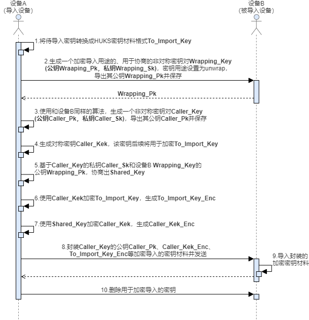

# 密钥导入介绍及算法规格

<!--Kit: Universal Keystore Kit-->
<!--Subsystem: Security-->
<!--Owner: @wutiantian-gitee-->
<!--SE: @HighLowWorld-->
<!--TSE: @wxy1234564846-->

如果业务在HUKS外部生成密钥（比如应用间协商生成、服务器端生成），业务可以将密钥导入到HUKS中由HUKS进行管理。密钥一旦导入到HUKS中，在密钥的生命周期内，其明文仅在安全环境中进行访问操作，不会传递出安全环境，保证任何人都无法获取到密钥的明文。

密钥导入的方式包含明文导入和加密导入两种方式。
> **注意：**
> 使用现有密钥别名作为导入的密钥别名会把现有密钥覆盖。

## 明文导入

该方式直接将密钥明文导入HUKS，在导入过程中密钥明文会暴露在非安全环境中，一般适用于轻量级设备或低安业务。

- 推荐使用该方式导入的密钥类型：非对称密钥的公钥。

- 不推荐使用该方式导入的密钥类型：对称密钥、非对称密钥对。
  > **说明：**
  > 轻量级设备只支持明文导入，不支持加密导入。

## 加密导入

该方式支持业务与HUKS建立端到端的加密传输通道，将密钥安全加密导入到HUKS中，确保导入传入过程中密钥不被泄露，适用于高安敏感业务。相较于明文导入，加密导入步骤更多，密钥材料更复杂。

- 推荐使用该方式导入的密钥类型：对称密钥、非对称密钥对。

下图为加密导入密钥开发时序图。

根据开发流程，在导入加密密钥过程中，需要依次调用HUKS的能力包括：  
* 生成非对称密钥对并导出公钥，用于设备间密钥协商。 
* 生成对称密钥，用于加密待导入密钥。
* 使用对称密钥加密待导入密钥，形成密钥密文。
* 导入加密密钥。
* 删除密钥。

导出密钥接口返回的[公钥明文材料是按照**X.509**格式封装](huks-concepts.md#公钥材料格式)，导入加密密钥接口中的密钥材料需满足**LengthData-Data**的格式封装，形如：[(Lengthpart1Datapart1)……(LengthpartnDatapartn)]。

> **说明：**
> 1. 加密导入密钥时，协商算法支持ECDH和X25519，协商后的Shared_Key使用AES-GCM算法加密Caller_Kek。对应算法套件定义见[HuksUnwrapSuite](../../reference/apis-universal-keystore-kit/js-apis-huks.md#huksunwrapsuite9)。
> 2. 加密导入不支持X.509格式。
> 3. 轻量级设备只支持明文导入，不支持加密导入。

### 加密导入密钥材料格式

| 内容 | 长度 |
| -------- | -------- |
| 业务公钥长度LCaller_Pk | 4字节 |
| 业务公钥Caller_Pk | LCaller_Pk字节 |
| Shared_Key加密参数AAD2长度LAAD2 | 4字节 |
| Shared_Key加密参数AAD2 | LAAD2字节 |
| Shared_Key加密参数Nonce2长度LNonce2 | 4字节 |
| Shared_Key加密参数Nonce2 | LNonce2字节 |
| Shared_Key加密参数TAG2长度LTAG2 | 4字节 |
| Shared_Key加密参数TAG2 | LTAG2字节 |
| Caller_Kek密文长度LCaller_Kek_enc | 4字节 |
| Caller_Kek密文Caller_Kek_enc | LCaller_Kek_enc字节 |
| Caller_Kek加密参数AAD3长度LAAD3 | 4字节 |
| Caller_Kek加密参数AAD3 | LAAD3字节 |
| Caller_Kek加密参数Nonce3长度LNonce3 | 4字节 |
| Caller_Kek加密参数Nonce3 | LNonce3字节 |
| Caller_Kek加密参数TAG3长度LTAG3 | 4字节 |
| Caller_Kek加密参数TAG3 | LTAG3字节 |
| 密钥明文材料长度的长度LTo_Import_Key_size | 4字节 |
| 密钥明文材料长度To_Import_Key_size | LTo_Import_Key_size字节 |
| To_Import_Key密文长度LTo_Import_Key_enc | 4字节 |
| To_Import_Key密文To_Import_Key_enc | LTo_Import_Key_enc字节 |

## 支持的算法

以下为密钥导入支持的规格说明。
<!--Del-->
面向OpenHarmony的厂商适配密钥管理服务规格分为必选规格和可选规格。必选规格为所有厂商均支持的算法规格。而对于可选规格，厂商将基于实际情况决定是否实现，如需使用，请查阅具体厂商提供的说明，确保规格支持再使用。

**建议开发者使用必选规格开发应用，可保证全平台兼容。**
<!--DelEnd-->

> **说明：**
> 导入RSA密钥时，公钥必须大于或者等于65537。

**标准设备规格**
| 算法 | 支持的密钥长度 | API级别 | <!--DelCol4-->是否必选规格 |
| -------- | -------- | -------- | -------- |
| AES | 128、192、256 | 8+ | 是 |
| <!--DelRow-->RSA | 512、768、1024 | 8+ | 否 |
| RSA | 2048、3072、4096 | 8+ | 是 |
| RSA | 1024-2048（含），必须是8的倍数 | 18+ | 是 |
| HMAC | 8-1024（含），必须是8的倍数 | 8+ | 是 |
| <!--DelRow-->ECC | 224 | 8+ | 否 |
| ECC | 256、384、521 | 8+ | 是 |
| ED25519 | 256 | 8+ | 是 |
| X25519 | 256 | 8+ | 是 |
| <!--DelRow-->DSA | 512-1024（含），8的倍数 | 8+ | 否 |
| DH | 2048 | 8+ | 是 |
| <!--DelRow-->DH | 3072、4096 | 8+ | 否 |
| SM2 | 256 | 9+ | 是 |
| SM4 | 128 | 9+ | 是 |
| DES | 64 | 18+ | 是 |
| 3DES | 128、192 | 18+ | 是 |

**轻量级设备规格**

<!--Del-->
轻量级设备所列规格，OEM厂商将基于实际情况决定是否实现，如需使用，请查阅具体厂商提供的说明，确保规格支持再使用。
<!--DelEnd-->

| 算法 | 支持的密钥长度 | API级别 |
| -------- | -------- | -------- |
| AES | 128、192、256 | 12+ |
| DES | 64 | 12+ |
| 3DES | 128、192 | 12+ |
| RSA |  1024-2048（含），必须是8的倍数 | 12+ |
| HMAC | 8-1024（含），必须是8的倍数 | 12+ |
| CMAC | 128 | 12+ |

## 导入密钥格式
HUKS支持导入密钥类型众多，各种不同类型对应的密钥格式不尽相同。下表归纳了HUKS导入密钥所支持的密钥类型及对应的密钥材料格式。
| 密钥类型 | 算法 | 导入格式 |
| -------- | -------- | -------- |
| 对称密钥 | - | 密钥字节数据 |
| 非对称密钥-密钥对| - | [密钥对材料格式](huks-concepts.md#密钥对材料格式) |
| 非对称密钥-公钥 | ED25519、X25519 | 密钥字节数据，参考[X25519密钥公钥导入](huks-import-key-in-plaintext-arkts.md#导入x25519密钥公钥)|
| 非对称密钥-公钥 | RSA、ECC、ECDH、DSA、DH、SM2 | X.509规范的DER格式 |