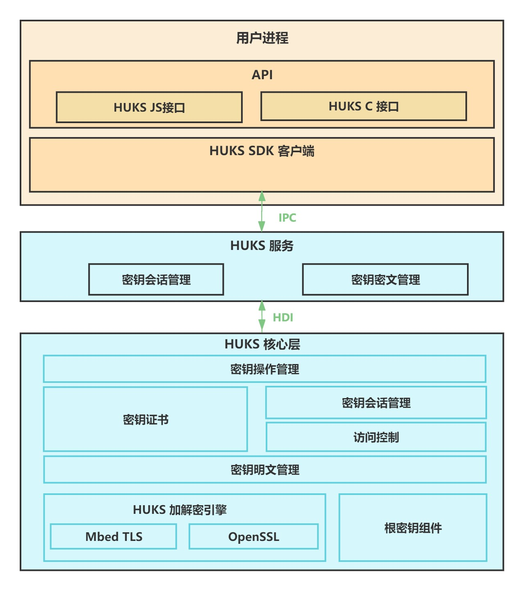

# Universal Keystore Kit简介

Universal Keystore Kit（密钥管理服务，下述简称为HUKS）向业务/应用提供各类密钥的统一安全操作能力，包括密钥管理（密钥生成/销毁、密钥导入、密钥证明、密钥协商、密钥派生）及密钥使用（加密/解密、签名/验签、访问控制）等功能。

HUKS管理的密钥可以由业务/应用导入或调用HUKS的接口生成。同时，HUKS提供了密钥访问控制能力，确保存储在HUKS中的密钥被合法正确的访问。

## 整体架构

如图所示，HUKS模块可以分为如下三大部分：

- SDK：提供密钥管理的接口供开发者调用，开发者可以根据实际业务，选择ArkTS或C API。

- HUKS服务层：实现密钥会话管理及存储管理。

- HUKS核心层：承载HUKS的核心功能，包括密钥的密码学运算、明文密钥的加解密、密钥访问控制等。
  > **说明：**
  > 对于具备安全环境（如[TEE](huks-concepts.md)、安全芯片）的系统/设备，HUKS核心层必须运行在安全环境内。由于安全环境依赖硬件支持，在开源仓中仅为模拟实现，需OEM厂商适配。

## 核心功能

HUKS为开发者提供了密钥全生命周期的管理能力，其核心功能按照密钥生命周期划分如下：

### 密钥生成

| 功能 | 说明 |
| -------- | -------- |
| **[密钥生成](huks-key-generation-overview.md)** | 随机生成密钥，且在密钥的全生命周期内，其明文仅在安全环境中进行访问操作，不会将明文传递出安全环境。 |
| **[密钥导入](huks-key-import-overview.md)** | 业务可以将外部生成的密钥导入到HUKS进行管理。 |

### 密钥使用

| 功能 | 说明 |
| -------- | -------- |
| **[加密/解密](huks-encryption-decryption-overview.md)** | 使用密钥将数据加密为攻击者无法理解的密文，或使用密钥将数据解密为业务可用的明文。 |
| **[签名/验签](huks-signing-signature-verification-overview.md)** | 用于认证消息内容以及消息发送者身份的真实性。 |
| **[密钥协商](huks-key-agreement-overview.md)** | 两个或多个实体通过协商，共同建立会话密钥。 |
| **[密钥派生](huks-key-derivation-overview.md)** | 从一个现有密钥派生出一个或多个新密钥。 |
| **[访问控制](huks-identity-authentication-overview.md)** | 确保存储在HUKS中的密钥，不会被越权访问。 |

### 密钥删除

| 功能 | 说明 |
| -------- | -------- |
| **[密钥删除](huks-delete-key-arkts.md)** | 安全地删除存储在HUKS中的密钥数据。 |

### 密钥证明

| 功能 | 说明 |
| -------- | -------- |
| **[密钥证明](huks-key-attestation-overview.md)** | 为存储在HUKS中的非对称密钥对中的公钥签发证书，从而证明密钥的合法性（如密钥在安全环境中生成）。 |

## 与相关Kit的关系

[基于用户身份认证的密钥访问控制](huks-identity-authentication-overview.md)，依赖于[User Authentication Kit（用户身份认证）](../UserAuthenticationKit/user-authentication-overview.md)。