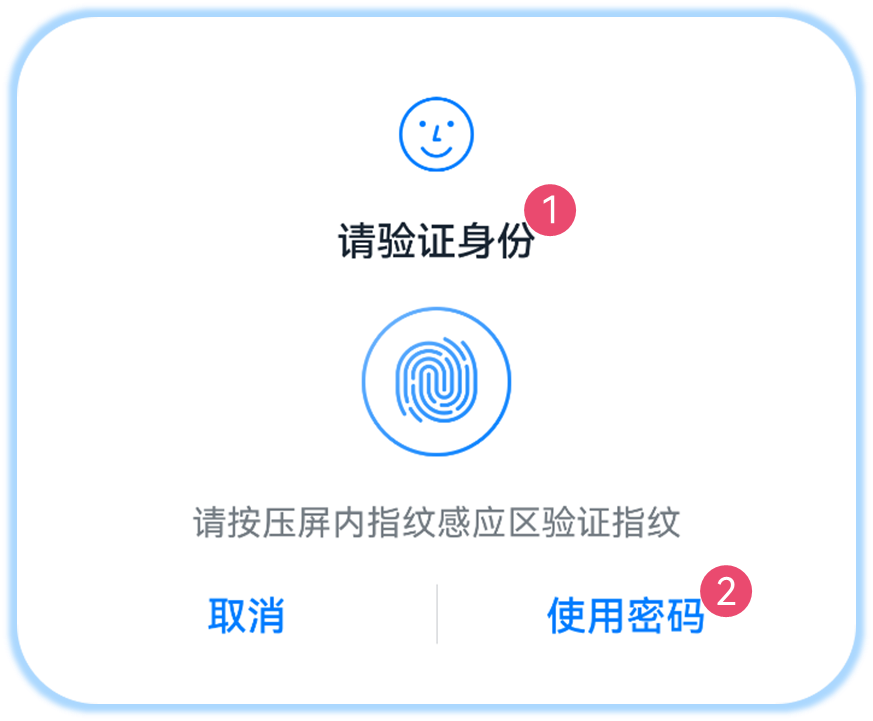

# 发起认证

应用发起身份认证请求，获取身份认证结果，从而访问受保护的系统/服务/应用的功能和数据（包括用户个人数据）。

## 接口说明

具体参数、返回值、错误码等描述，请参考对应的[API文档](../../reference/apis-user-authentication-kit/js-apis-useriam-userauth.md#userauthgetuserauthinstance10)。

| 接口名称 | 功能描述 | 
| -------- | -------- |
| getUserAuthInstance(authParam: AuthParam, widgetParam: WidgetParam): UserAuthInstance | 获取UserAuthInstance对象，用于执行用户身份认证，并支持使用统一[用户身份认证控件](#用户身份认证控件介绍)。 | 
| on(type: 'result', callback: IAuthCallback): void | 订阅用户身份认证结果。 | 
| off(type: 'result', callback?: IAuthCallback): void | 取消订阅用户身份认证结果。 | 
| start(): void | 执行用户认证。 | 

## 用户身份认证控件介绍

系统提供了统一的用户认证控件供应用调用，使用用户认证控件的优势：

- 统一用户认证服务将通过该控件完成信息的识别和认证，再将认证结果返回给应用，整体过程安全可控，可以更好地保护用户的生物特征信息。

- 统一固定的UI组件样式，便于用户识别。

认证控件的样式如图所示，通过[WidgetParam](../../reference/apis-user-authentication-kit/js-apis-useriam-userauth.md#widgetparam10)配置对应参数。



- 标注1：用户认证界面的标题（WidgetParam.title），最大长度为500字符。应用可在此配置符合场景的字符串。

- 标注2：导航按键上显示的文本（WidgetParam.navigationButtonText），最大长度为60字符。API 10-17仅在单指纹、单人脸场景下支持配置。从API 18开始，增加支持人脸+指纹场景。
   
  当生物认证失败后，将出现该按钮，点击后从生物认证切换到应用自定义认证。

<!--Del-->
- 如图所示，认证控件的显示形式（WidgetParam.windowMode）为弹窗。
  
  认证控件分为弹窗、全屏两种显示形式，如下图所示，左侧为默认的弹窗样式，右侧为全屏样式。

  当前仅系统应用可以选择和使用全屏类型的认证界面。

  
<!--DelEnd-->

当前支持使用认证控件的认证类型包括：

- 锁屏密码认证

- 人脸认证

- 指纹认证

- 人脸+锁屏密码认证

- 指纹+锁屏密码认证

- 人脸+指纹+锁屏密码认证

- 人脸+自定义导航按键

- 指纹+自定义导航按键

- 人脸+指纹+自定义导航按键<sup>18+</sup>

## 开发步骤

1. [申请权限](prerequisites.md#申请权限)：ohos.permission.ACCESS_BIOMETRIC。

2. 指定用户认证相关参数[AuthParam](../../reference/apis-user-authentication-kit/js-apis-useriam-userauth.md#authparam10)（包括挑战值、认证类型[UserAuthType](../../reference/apis-user-authentication-kit/js-apis-useriam-userauth.md#userauthtype8)列表和认证等级[AuthTrustLevel](../../reference/apis-user-authentication-kit/js-apis-useriam-userauth.md#authtrustlevel8)）、配置认证控件界面[WidgetParam](../../reference/apis-user-authentication-kit/js-apis-useriam-userauth.md#widgetparam10)，调用[getUserAuthInstance](../../reference/apis-user-authentication-kit/js-apis-useriam-userauth.md#userauthgetuserauthinstance10)获取认证对象。

3. 调用[UserAuthInstance.on](../../reference/apis-user-authentication-kit/js-apis-useriam-userauth.md#on10)接口订阅认证结果。

4. 调用[UserAuthInstance.start](../../reference/apis-user-authentication-kit/js-apis-useriam-userauth.md#start10)接口发起认证，通过[IAuthCallback](../../reference/apis-user-authentication-kit/js-apis-useriam-userauth.md#iauthcallback10)回调返回认证结果[UserAuthResult](../../reference/apis-user-authentication-kit/js-apis-useriam-userauth.md#userauthresult10)。当认证成功时返回认证通过类型（[UserAuthType](../../reference/apis-user-authentication-kit/js-apis-useriam-userauth.md#userauthtype8)）和令牌信息（AuthToken）。

**示例1：**

 发起用户认证，采用认证可信等级≥ATL3的人脸+锁屏密码认证，获取认证结果：

```ts
// API version 10
import { BusinessError } from '@kit.BasicServicesKit';
import { cryptoFramework } from '@kit.CryptoArchitectureKit';
import { userAuth } from '@kit.UserAuthenticationKit';

try {
  const rand = cryptoFramework.createRandom();
  const len: number = 16; // Generate a 16-byte random number.
  const randData: Uint8Array = rand?.generateRandomSync(len)?.data;
  // 设置认证参数。
  const authParam: userAuth.AuthParam = {
    challenge: randData,
    authType: [userAuth.UserAuthType.PIN, userAuth.UserAuthType.FACE],
    authTrustLevel: userAuth.AuthTrustLevel.ATL3,
  };
  // 配置认证界面。
  const widgetParam: userAuth.WidgetParam = {
    title: '请进行身份认证',
  };
  // 获取认证对象。
  const userAuthInstance = userAuth.getUserAuthInstance(authParam, widgetParam);
  console.info('get userAuth instance success');
  // 订阅认证结果。
  userAuthInstance.on('result', {
    onResult(result) {
      console.info(`userAuthInstance callback result: ${JSON.stringify(result)}`);
      // 可在认证结束或其他业务需要场景，取消订阅认证结果。
      userAuthInstance.off('result');
    }
  });
  console.info('auth on success');
  userAuthInstance.start();
  console.info('auth start success');
} catch (error) {
  const err: BusinessError = error as BusinessError;
  console.error(`auth catch error. Code is ${err?.code}, message is ${err?.message}`);
}
```
**示例2：**

发起用户认证，采用认证可信等级≥ATL3的人脸 + 认证类型相关 + 复用设备解锁最大有效时长认证，获取认证结果：

```ts
// API version 10
import { BusinessError } from  '@kit.BasicServicesKit';
import { cryptoFramework } from '@kit.CryptoArchitectureKit';
import { userAuth } from '@kit.UserAuthenticationKit';

// 设置认证参数。
let reuseUnlockResult: userAuth.ReuseUnlockResult = {
  reuseMode: userAuth.ReuseMode.AUTH_TYPE_RELEVANT,
  reuseDuration: userAuth.MAX_ALLOWABLE_REUSE_DURATION,
}
try {
  const rand = cryptoFramework.createRandom();
  const len: number = 16;
  const randData: Uint8Array = rand?.generateRandomSync(len)?.data;
  const authParam: userAuth.AuthParam = {
    challenge: randData,
    authType: [userAuth.UserAuthType.FACE],
    authTrustLevel: userAuth.AuthTrustLevel.ATL3,
    reuseUnlockResult: reuseUnlockResult,
  };
  // 配置认证界面。
  const widgetParam: userAuth.WidgetParam = {
    title: '请进行身份认证',
  };
  // 获取认证对象。
  const userAuthInstance = userAuth.getUserAuthInstance(authParam, widgetParam);
  console.info('get userAuth instance success');
  // 订阅认证结果。
  userAuthInstance.on('result', {
    onResult(result) {
      console.info(`userAuthInstance callback result: ${JSON.stringify(result)}`);
      // 可在认证结束或其他业务需要场景，取消订阅认证结果。
      userAuthInstance.off('result');
    }
  });
  console.info('auth on success');
  userAuthInstance.start();
  console.info('auth start success');
} catch (error) {
  const err: BusinessError = error as BusinessError;
  console.error(`auth catch error. Code is ${err?.code}, message is ${err?.message}`);
}
```
**示例3：**

发起用户认证，采用认证可信等级≥ATL3的人脸 + 任意应用认证类型相关 + 复用任意应用最大有效时长认证，获取认证结果：

```ts
// API version 14
import { BusinessError } from  '@kit.BasicServicesKit';
import { cryptoFramework } from '@kit.CryptoArchitectureKit';
import { userAuth } from '@kit.UserAuthenticationKit';

// 设置认证参数。
let reuseUnlockResult: userAuth.ReuseUnlockResult = {
  reuseMode: userAuth.ReuseMode.CALLER_IRRELEVANT_AUTH_TYPE_RELEVANT,
  reuseDuration: userAuth.MAX_ALLOWABLE_REUSE_DURATION,
}
try {
  const rand = cryptoFramework.createRandom();
  const len: number = 16;
  const randData: Uint8Array = rand?.generateRandomSync(len)?.data;
  const authParam: userAuth.AuthParam = {
    challenge: randData,
    authType: [userAuth.UserAuthType.FACE],
    authTrustLevel: userAuth.AuthTrustLevel.ATL3,
    reuseUnlockResult: reuseUnlockResult,
  };
  // 配置认证界面。
  const widgetParam: userAuth.WidgetParam = {
    title: '请进行身份认证',
  };
  // 获取认证对象。
  const userAuthInstance = userAuth.getUserAuthInstance(authParam, widgetParam);
  console.info('get userAuth instance success');
  // 订阅认证结果。
  userAuthInstance.on('result', {
    onResult(result) {
      console.info(`userAuthInstance callback result: ${JSON.stringify(result)}`);
      // 可在认证结束或其他业务需要场景，取消订阅认证结果。
      userAuthInstance.off('result');
    }
  });
  console.info('auth on success');
  userAuthInstance.start();
  console.info('auth start success');
} catch (error) {
  const err: BusinessError = error as BusinessError;
  console.error(`auth catch error. Code is ${err?.code}, message is ${err?.message}`);
}
```

**示例4：**

以模应用方式进行用户身份认证：

```ts
// API version 16
import { BusinessError } from '@kit.BasicServicesKit';
import { cryptoFramework } from '@kit.CryptoArchitectureKit';
import { userAuth } from '@kit.UserAuthenticationKit';

try {
  const rand = cryptoFramework.createRandom();
  const len: number = 16;
  const randData: Uint8Array = rand?.generateRandomSync(len)?.data;
  const authParam: userAuth.AuthParam = {
    challenge: randData,
    authType: [userAuth.UserAuthType.PIN],
    authTrustLevel: userAuth.AuthTrustLevel.ATL3,
  };
  const widgetParam: userAuth.WidgetParam = {
    title: '请输入密码',
    uiContext: this.getUIContext().getHostContext(),
  };
  const userAuthInstance = userAuth.getUserAuthInstance(authParam, widgetParam);
  console.info('get userAuth instance success');
  // 需要调用UserAuthInstance的start()接口，启动认证后，才能通过onResult获取到认证结果。
  userAuthInstance.on('result', {
    onResult (result) {
      console.info(`userAuthInstance callback result = ${JSON.stringify(result)}`);
    }
  });
  console.info('auth on success');
} catch (error) {
  const err: BusinessError = error as BusinessError;
  console.error(`auth catch error. Code is ${err?.code}, message is ${err?.message}`);
}
```