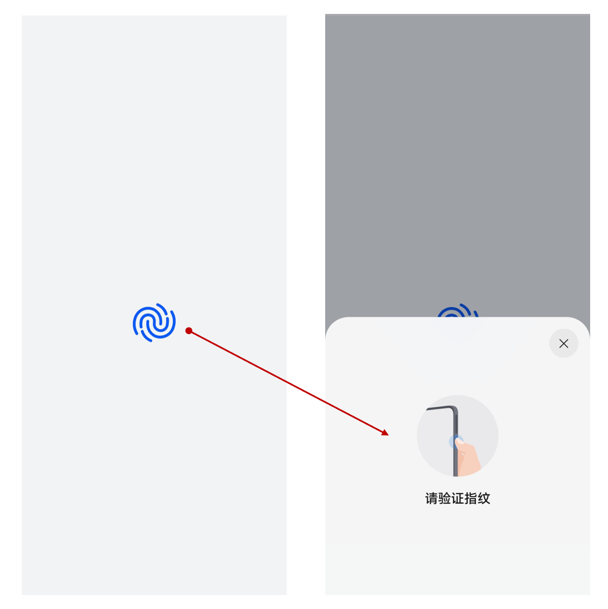

# 使用嵌入式用户身份认证控件

主要用于提供应用界面上展示的人脸、指纹认证图标，具体功能如下：

1. 提供嵌入式人脸、指纹认证控件图标，可被应用集成。
2. 支持自定义图标的颜色和大小，但图标样式不可变更。
3. 点击控件图标后可拉起系统弹窗式人脸、指纹认证控件。

当前支持使用认证控件的认证类型包括：

- 人脸认证
- 指纹认证
- 人脸+锁屏密码认证
- 指纹+锁屏密码认证
- 人脸+指纹+锁屏密码认证

以指纹认证为例，控件使用效果如图所示。应用集成嵌入式用户身份认证控件后，用户点击左图中的指纹图标（即嵌入式用户身份认证控件），系统将会拉起右图中系统身份认证控件完成身份认证功能，开发者无需通过接口发起身份认证请求，使得身份认证的流程更为简单、便捷。

## 示例

具体参数、使用方式等信息，请参考对应的[API文档](../../reference/apis-user-authentication-kit/ohos-useriam-userauthicon.md)。
