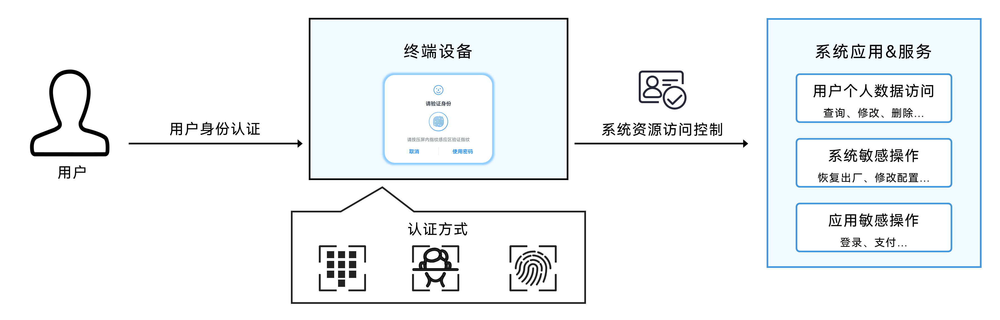
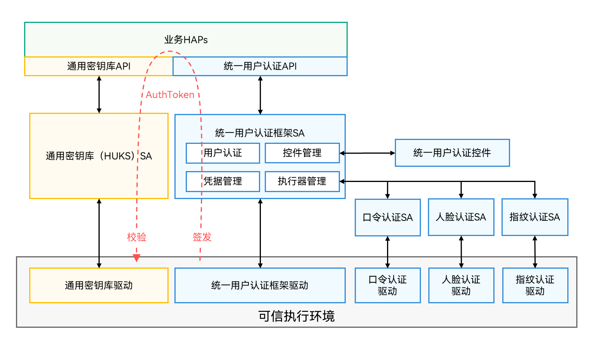

# User Authentication Kit简介

<!--Kit: User Authentication Kit-->
<!--Subsystem: UserIAM-->
<!--Owner: @WALL_EYE-->
<!--Designer: @lichangting518-->
<!--Tester: @jane_lz-->
<!--Adviser: @zengyawen-->

User Authentication Kit（用户认证服务）提供了基于用户在设备本地注册的锁屏口令、人脸和指纹来认证用户身份的能力。

提供了系统级用户身份认证功能，并提供了多设备统一的、集多种认证方式（人脸、指纹、口令）于一体的系统级用户身份认证控件。

用户向应用/系统服务请求访问某些个人数据或执行某些敏感操作时，应用/系统服务将调用系统用户身份认证控件对用户身份进行认证，认证通过后，响应用户对于数据或敏感操作的执行请求。

用户身份认证可用于各种鉴权场景，如应用内账号登录、支付认证等。

<!--RP1-->

<!--RP1End-->

## 亮点/特征

- **归一化认证接口**

    屏蔽不同认证因子的差异，调用锁屏口令、人脸、指纹认证的接口归一。

    同一套接口提供人脸、指纹、锁屏口令的组合认证方式。

    同一套接口提供人脸认证、指纹认证和业务自定义认证的组合。

- **支持感知认证可信等级差异**

    支持调用者指定期望的认证可信等级，避免将低安认证能力应用在高风险操作的用户鉴权场景，例如将防伪能力不够的2D人脸认证用于支付场景。

- **支持业务自定义认证方式**

    支持带导航键的认证界面，用户点击导航键可切换业务自定义认证界面。

- **支持短时间内复用任意应用的认证结果**

    支持选择复用锁屏认证结果或任意应用的身份认证结果，认证后调用者指定的时间范围内（最长5min），可直接返回认证通过结果，无需重复认证。

    支持认证方式无关的复用模式，采用此模式，无论上次认证使用何种方式，只要在认证后调用者指定的时间范围内（最长5min），可直接返回认证通过结果，无需重复认证。

    支持认证方式匹配的复用模式，采用此模式，不仅需要处于调用者指定的认证后时间范围内（最长5min），还需要认证使用的认证方式与调用者指定的一致，才能复用解锁认证结果并返回认证通过。

- **提供系统级用户身份认证界面**

    支持调用者自定义认证界面的标题和导航键文字。

    用户身份认证控件会根据设备屏幕状态自适应调整窗口显示模式。

- **支持感知注册凭据的变化**

    业务开通时，从认证成功结果中获取用户凭据的状态，或者直接查询用户凭据的状态，并存储注册的凭据状态。当调用者需要感知用户凭据变化时，需要从当前认证成功结果获取凭据的状态，或者查询当前凭据的状态，通过对比差异感知凭据状态的变化。

## 运作机制

统一用户认证框架架构如下图所示。

用户认证框架主要包括四个部分：

1. 统一用户认证API：提供归一化的系统用户身份认证能力调用接口。屏蔽认证差异，便于开发者调用系统能力认证用户身份。

2. 统一用户认证框架：包括框架层的SA和驱动，负责调度系统上的各种身份认证能力和用户认证控件，来完成业务通过统一用户认证API发起的用户认证请求。

3. 统一用户认证控件：实现了各种认证方式的用户身份认证交互界面，确保一致的用户身份认证体验，供统一身份认证框架调用。

4. 各种认证能力：包括口令认证、人脸认证和指纹认证，分别实现了基于锁屏口令、人脸和指纹认证用户身份的能力，供统一用户认证框架调度。

用户身份认证通过后，统一用户认证框架会在设备可信执行环境中签发用户身份认证通过证明，简称AuthToken。

从图的左侧，可以看到应用使用用户身份认证功能完成用户鉴权的过程：当应用需要调用通用密钥库服务中需用户授权才能访问的密钥时，应用可以将获取到的AuthToken随密钥调用请求一同提供给[通用密钥库服务](../UniversalKeystoreKit/huks-overview.md)，作为密钥二次访问控制的用户鉴权证明。通用密钥库服务在可信执行环境中校验了AuthToken的合法性和有效性后，便会响应业务请求，执行对应的密钥操作。

### AuthToken数据结构

**明文段**

| 名称 | 内容 | 类型 | 说明 |
| -------- | -------- | -------- | -------- |
| version | token版本号 | uint32_t | 当前为2.0。 |
| challenge | 认证随机挑战 | uint8_t[32] | 需要校验认证结果的业务方生成的一次性随机挑战。 |
| time | 认证通过时戳 | uint64_t | 认证通过时戳。在复用场景中，该时戳为用户认证通过的时间，而不是复用认证结果时AuthToken的签发时间。|
| authTrustLevel | 认证可信等级 | uint32_t | 表示用户认证结果的可信等级，取决于设备上认证执行器本身的能力，正常情况下应该大于或者等于调用者传入的authTrustLevel。见[生物认证可信等级划分原则](#生物认证可信等级划分原则)。 |
| authType | 认证类型 | uint32_t | 认证通过采用的认证类型，包括人脸、指纹、口令（特指锁屏口令认证）。 |
| authMode | 操作类型 | uint32_t | 操作类型：识别/认证。 |
| securityLevel | token签发环境安全等级 | uint32_t | token签发环境安全等级。 |

**密文段**

| 名称 | 内容 | 类型 | 说明 |
| -------- | -------- | -------- | -------- |
| userId | 用户ID | int32_t | 系统在创建用户时给用户分配的ID。 |
| secureUid | 安全用户ID | uint64_t | 用户注册系统口令时为用户随机分配的ID，在用户删除口令时删除，变更口令时该ID不变。 |
| enrolledId | 凭据注册ID | uint64_t | 用户每录入一个凭据，该用户的该类型凭据的enrolledId便会更换一个随机值，删除凭据时该ID不变。 |
| credentialId | 匹配上的凭据ID | uint64_t | 随机分配给用户注册的人脸、指纹等凭据的ID。 |

**标签段**

| 名称 | 内容 | 类型 | 说明 |
| -------- | -------- | -------- | -------- |
| tag | 密文段的TAG | uint8_t[16] | 密文字段采用AES-GCM加密生成的TAG。 |
| iv | 密文段加密使用的IV | uint8_t[12] | 密文字段采用AES-GCM加密采用的随机IV。 |
| sign | token的完整性保护签名 | uint8_t[32] | 保护AuthToken的完整性。 |

### 生物认证可信等级划分原则

认证可信等级评估的是系统用户身份认证能力的安全性，取决于认证方案能力等级（Authentication Capability Level，ACL）和该认证系统的实现安全等级（Authentication Security Level，ASL）。

系统采用三种指标来衡量生物认证方案能力等级，具体定义如下表所示。

- FRR（False Rejection Rate）：将合法用户当做非法用户拒绝的概率。

- FAR（False Acceptance Rate）：将非法用户当做合法用户接受的概率，又称为误闯率。

- SAR（Spoof Acceptance Rate）：接受一个基于合法生物特征复制的、非活体的样本概率。

FAR越低，FRR越高，认证的安全性越高，但合法用户被错误拒绝的概率越高，导致使用便捷性越差；
反之FAR越高，FRR越低，则认证安全性越差，使用便捷性越好。

| 认证可信等级 | 认证能力指标 |
| -------- | -------- |
| ATL4 | FRR=10%时，FAR≤0.0001%，SAR≤3% |
| ATL3 | FRR=10%时，FAR≤0.002%，SAR≤7% |
| ATL2 | FRR=10%时，FAR≤0.002%，7%&lt;SAR≤20% |
| ATL1 | FRR=10%时，FAR≤1%，7%&lt;SAR≤20% |

生物认证系统一般分为以下5个执行单元：生物特征源数据的采集、生物特征的提取、生物特征的存储、生物特征的比对和认证结果的签发。系统将认证过程中的各个执行单元的运行环境安全ESL（Executor Security Level）分为以下4个等级：

| 执行单元安全等级 | 定义 |
| -------- | -------- |
| ESL3 | 操作在高安硬件可信环境中完成，如安全协处理器、安全芯片等。 |
| ESL2 | 操作在基于硬件可信根隔离的可信执行环境中完成，如TEE、SGX。 |
| ESL1 | 操作在有访问控制的执行环境中完成，如Linux。 |
| ESL0 | 操作在无访问控制的运行环境中完成，如单进程的轻量级系统。 |

整个认证系统的实现安全等级ASL等于生物认证5个执行单元中最低的ESL级别。例如，有一个人脸认证系统，其特征存储和比对都在安全隔离环境TEE中执行（即ESL=2），但特征提取算法运行在普通系统环境中（即ESL=1），则该人脸认证系统的ASL=1。

由认证方案能力等级和认证方案安全等级映射得到认证结果可信等级的具体规则如下表：

| 认证可信等级 | 映射规则 | 说明&amp;举例 | 典型应用场景 |
| -------- | ------------ | -------- | -------- |
| ATL4 | ACL≥3，ASL≥2 | 能高精度地识别用户个体，有很强的活体检测能力，如：有特殊安全增强的指纹与3D人脸认证。 | 小额支付 |
| ATL3 | ACL≥3，ASL≥1 ACL≥2，ASL≥2 | 能精确识别用户个体，有较强的活体检测能力，如：有特殊安全增强的2D人脸认证。 | 设备解锁、应用登录、账号登录 |
| ATL2 | ACL≥2，ASL≥1 ACL≥1，ASL≥2 | 能精确识别用户个体，有一定的活体检测能力，如：使用普通相机采集图像的2D人脸认证。 | 维持设备解锁状态 |
| ATL1 | ACL=1，ASL=1 | 能识别用户个体，有一定的活体检测能力，如声纹认证。 | 业务风控、精准推荐、个性化服务 |

## 系统身份认证约束与限制

- 三方应用调用系统本地身份认证能力，必须使用系统自带的身份认证控件。

- 不允许三方应用在后台发起身份认证请求。