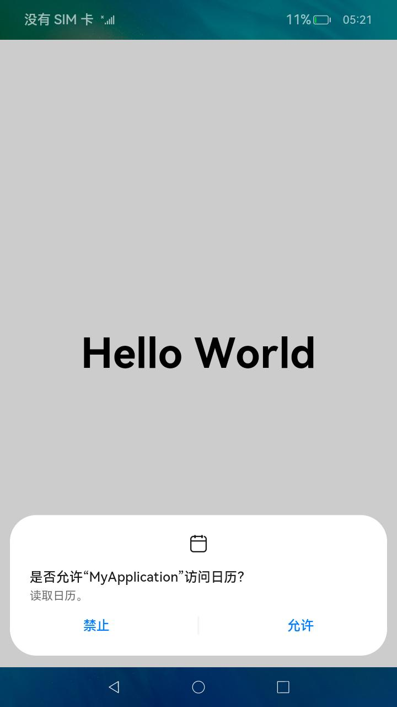

# 访问控制授权申请

## 场景介绍

[应用的APL（Ability Privilege Level）等级](accesstoken-overview.md#应用apl等级说明)分为`normal`、`system_basic`和`system_core`三个等级，默认情况下，应用的APL等级都为`normal`等级。[权限类型](accesstoken-overview.md#权限类型说明)分为`system_grant`和`user_grant`两种类型。应用可申请的权限项参见[应用权限列表](permission-list.md)。

本文将从如下场景分别介绍：

- [配置文件权限声明](#配置文件权限声明)
- [ACL方式声明](#acl方式声明)
- [向用户申请授权](#向用户申请授权)
- [user_grant权限预授权](#user_grant权限预授权)

## 配置文件权限声明

应用需要在工程配置文件中，对需要的权限逐个声明，未在配置文件中声明的权限，应用将无法获得授权。OpenHarmony提供了两种应用模型，分别为FA模型和Stage模型，更多信息可以参考[应用模型解读](../application-models/application-model-description.md)。不同的应用模型的应用包结构不同，所使用的配置文件不同。

配置文件标签说明如下表所示。

| 标签      | 是否必填 | 说明                                                         |
| --------- | -------- | ------------------------------------------------------------ |
| name      | 是       | 权限名称。                                                   |
| reason    | 否       | 描述申请权限的原因。<br />> 说明：当申请的权限为user_grant权限时，此字段必填。 |
| usedScene | 否       | 描述权限使用的场景和时机。<br />> 说明：当申请的权限为user_grant权限时，此字段必填。 |
| abilities | 否       | 标识需要使用到该权限的Ability，标签为数组形式。<br/>**适用模型**：Stage模型 |
| ability   | 否       | 标识需要使用到该权限的Ability，标签为数组形式。<br/>**适用模型**：FA模型 |
| when      | 否       | 标识权限使用的时机，值为`inuse/always`。<br />- inuse：表示为仅允许前台使用。<br />- always：表示前后台都可使用。 |

### Stage模型

使用Stage模型的应用，需要在[module.json5配置文件](../quick-start/module-configuration-file.md)中声明权限。

```json
{
  "module" : {
    // ...
    "requestPermissions":[
      {
        "name" : "ohos.permission.PERMISSION1",
        "reason": "$string:reason",
        "usedScene": {
          "abilities": [
            "FormAbility"
          ],
          "when":"inuse"
        }
      },
      {
        "name" : "ohos.permission.PERMISSION2",
        "reason": "$string:reason",
        "usedScene": {
          "abilities": [
            "FormAbility"
          ],
          "when":"always"
        }
      }
    ]
  }
}
```

### FA模型

使用FA模型的应用，需要在config.json配置文件中声明权限。

```json
{
  "module" : {
    // ...
    "reqPermissions":[
      {
        "name" : "ohos.permission.PERMISSION1",
        "reason": "$string:reason",
        "usedScene": {
          "ability": [
            "FormAbility"
          ],
          "when":"inuse"
        }
      },
      {
        "name" : "ohos.permission.PERMISSION2",
        "reason": "$string:reason",
        "usedScene": {
          "ability": [
            "FormAbility"
          ],
          "when":"always"
        }
      }
    ]
  }
}
```

## ACL方式声明

应用在申请`system_basic`等级权限时，高于应用默认的`normal`等级。当应用需要申请权限项的等级高于应用默认的等级时，需要通过ACL方式进行声明使用。

例如应用在申请访问用户公共目录下音乐类型的文件，需要申请` ohos.permission.WRITE_AUDIO`权限，该权限为`system_basic`等级；以及应用在申请截取屏幕图像功能，该权限为`system_core`等级，需要申请` ohos.permission.CAPTURE_SCREEN`权限。此时需要将相关权限项配置到[HarmonyAppProvision配置文件](app-provision-structure.md)的`acl`字段中。

```json
{
	// ...
	"acls":{
		"allowed-acls":[
			"ohos.permission.WRITE_AUDIO",
            "ohos.permission.CAPTURE_SCREEN"
		]
	}
}
```

## 向用户申请授权

应用需要获取用户的隐私信息或使用系统能力时，例如获取位置信息、访问日历、使用相机拍摄照片或者录制视频等，需要向用户申请授权。此时应用申请的权限包括了`user_grant`类型权限，需要先通过权限校验，判断当前调用者是否具备相应权限。当权限校验结果显示当前应用尚未被授权该权限时，再通过动态弹框授权方式给用户提供手动授权入口。示意效果如下图所示。


> **说明**：每次访问受目标权限保护的接口前，都需要调用[requestPermissionsFromUser()](../reference/apis/js-apis-abilityAccessCtrl.md#requestpermissionsfromuser9)接口请求权限，用户在动态授予后可能通过设置取消应用的权限，因此不能把之前授予的授权状态持久化。

### Stage模型

以允许应用读取日历信息为例进行说明。

1. 申请`ohos.permission.READ_CALENDAR`权限，配置方式请参见[访问控制授权申请](#stage模型)。

2. 可以在UIAbility的onWindowStageCreate()回调中调用[requestPermissionsFromUser()](../reference/apis/js-apis-abilityAccessCtrl.md#requestpermissionsfromuser9)接口动态申请权限，也可以根据业务需要在UI界面中向用户申请授权。根据[requestPermissionsFromUser()](../reference/apis/js-apis-abilityAccessCtrl.md#requestpermissionsfromuser9)接口返回值判断是否已获取目标权限，如果当前已经获取权限，则可以继续正常访问目标接口。
   
   在UIAbility中动态申请授权。
   
   ```typescript
   import UIAbility from '@ohos.app.ability.UIAbility';
   import Window from '@ohos.window';
   import abilityAccessCtrl from '@ohos.abilityAccessCtrl';
   import { Permissions } from '@ohos.abilityAccessCtrl';
   
   export default class EntryAbility extends UIAbility {
       // ...
   
       onWindowStageCreate(windowStage: Window.WindowStage) {
           // Main window is created, set main page for this ability
           let context = this.context;
           let AtManager = abilityAccessCtrl.createAtManager();
           // requestPermissionsFromUser会判断权限的授权状态来决定是否唤起弹窗
           const permissions: Array<Permissions> = ['ohos.permission.READ_CALENDAR'];
           AtManager.requestPermissionsFromUser(context, permissions).then((data) => {
               console.info(`[requestPermissions] data: ${JSON.stringify(data)}`);
               let grantStatus: Array<number> = data.authResults;
               if (grantStatus[0] === -1) {
                   // 授权失败
               } else {
                   // 授权成功
               }
           }).catch((err) => {
               console.error(`[requestPermissions] Failed to start request permissions. Error: ${JSON.stringify(err)}`);
           })
           
           // ...
       }
   }
   ```
   
   在UI界面中向用户申请授权。
   ```typescript
   import abilityAccessCtrl from '@ohos.abilityAccessCtrl';
   import { Permissions } from '@ohos.abilityAccessCtrl';
   import common from '@ohos.app.ability.common';
   
   @Entry
   @Component
   struct Index {
     reqPermissions() {
       let context = getContext(this) as common.UIAbilityContext;
       let AtManager = abilityAccessCtrl.createAtManager();
       // requestPermissionsFromUser会判断权限的授权状态来决定是否唤起弹窗
       const permissions: Array<Permissions> = ['ohos.permission.READ_CALENDAR'];
       AtManager.requestPermissionsFromUser(context, permissions).then((data) => {
         console.info(`[requestPermissions] data: ${JSON.stringify(data)}`);
         let grantStatus: Array<number> = data.authResults;
         if (grantStatus[0] === -1) {
           // 授权失败
         } else {
           // 授权成功
         }
       }).catch((err) => {
         console.error(`[requestPermissions] Failed to start request permissions. Error: ${JSON.stringify(err)}`);
       })
     }
   
     // 页面展示
     build() {
       // ...
     }
   }
   ```

### FA模型

通过调用[requestPermissionsFromUser()](../reference/apis/js-apis-inner-app-context.md#contextrequestpermissionsfromuser7)接口向用户动态申请授权。

```js
// Ability的onWindowStageCreate()生命周期
onWindowStageCreate() {
    let context = this.context;
    let array:Array<string> = ["ohos.permission.PERMISSION2"];
    //requestPermissionsFromUser会判断权限的授权状态来决定是否唤起弹窗
    context.requestPermissionsFromUser(array).then(function(data) {
        console.log("data:" + JSON.stringify(data));
        console.log("data permissions:" + JSON.stringify(data.permissions));
        console.log("data result:" + JSON.stringify(data.authResults));
    }, (err) => {
        console.error('Failed to start ability', err.code);
    });
}
```
## user_grant权限预授权
应用在申请`user_grant`类型的权限默认未授权，需要通过拉起弹框由用户确认是否授予该权限。对于一些预制应用，不希望出现弹窗申请`user_grant`类型的权限，例如系统相机应用需要使用麦克风` ohos.permission.MICROPHONE`等权限，需要对麦克风等权限进行预授权，可以通过预授权的方式完成`user_grant`类型权限的授权。[预置配置文件](https://gitee.com/openharmony/vendor_hihope/blob/master/rk3568/preinstall-config/install_list_permissions.json)在设备上的路径为`/system/etc/app/install_list_permission.json`，设备开机启动时会读取该配置文件，在应用安装会对在文件中配置的`user_grant`类型权限授权。预授权配置文件字段内容包括`bundleName`、`app_signature`和`permissions`。

- `bundleName`字段配置为应用的Bundle名称。
- `app_signature`字段配置为应用的指纹信息。指纹信息的配置参见[应用特权配置指南](../../device-dev/subsystems/subsys-app-privilege-config-guide.md#install_list_capabilityjson中配置)。
- `permissions`字段中`name`配置为需要预授权的`user_grant`类型的权限名；`permissions`字段中`userCancellable`表示为用户是否能够取消该预授权，配置为true，表示支持用户取消授权，为false则表示不支持用户取消授权。

> 说明：当前仅支持预置应用配置该文件。

```json
[
  // ...
  {
    "bundleName": "com.example.myapplication", // Bundle名称
    "app_signature": ["****"], // 指纹信息
    "permissions":[
      {
        "name": "ohos.permission.PERMISSION_X", // user_grant类型预授权的权限名
        "userCancellable": false // 用户不可取消授权
      },
      {
        "name": "ohos.permission.PERMISSION_Y", // user_grant类型预授权的权限名
        "userCancellable": true // 用户可取消授权
      }
    ]
  }
]
```

## 相关实例

针对访问控制，有以下相关实例可供参考：

- [AbilityAccessCtrl：访问权限控制（ArkTS）（API8）（Full SDK）](https://gitee.com/openharmony/applications_app_samples/tree/master/Safety/AbilityAccessCtrl)
- [为应用添加运行时权限（ArkTS）（API 9）](https://gitee.com/openharmony/codelabs/tree/master/Ability/AccessPermission)