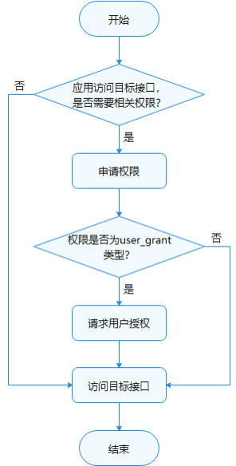

# 访问控制开发概述

## 简介
ATM(AccessTokenManager)是OpenHarmony上基于AccessToken构建的统一的应用权限管理能力。

默认情况下，应用只能访问有限的系统资源。但某些情况下，应用为了扩展功能的诉求，需要访问额外的系统或其他应用的数据（包括用户个人数据）、功能。系统或应用也必须以明确的方式对外提供接口来共享其数据或功能。OpenHarmony提供了一种访问控制机制来保证这些数据或功能不会被不当或恶意使用，即应用权限。

应用权限保护的对象可以分为数据和功能：

- 数据包含了个人数据（如照片、通讯录、日历、位置等）、设备数据（如设备标识、相机、麦克风等）、应用数据。
- 功能则包括了设备功能（如打电话、发短信、联网等）、应用功能（如弹出悬浮框、创建快捷方式等）等。

应用权限是程序访问操作某种对象的通行证。权限在应用层面要求有明确定义，应用权限使得系统可以规范各类应用程序的行为准则，实现用户隐私的保护机制。当应用访问操作目标对象时，目标对象会对应用进行权限检查，如果没有对应权限，则访问操作将被拒绝。

当前，ATM提供的应用权限校验功能是基于统一管理的TokenID（Token identity）。TokenID是每个应用的身份标识，ATM通过应用的TokenID来管理应用的权限。

## 权限的工作流程

应用在访问数据或者执行操作时，需要评估该行为是否需要应用具备相关的权限。如果确认需要目标权限，则需要在应用安装包中申请目标权限。

然后，需要判断目标权限是否属于用户授权类。如果是，应用需要使用动态授权弹框来提供用户授权界面，请求用户授权目标权限。

当用户授予应用所需权限后，应用可成功访问目标数据或执行目标操作。

应用使用权限的工作流程如图所示。

## 权限使用场景说明

### 场景示例

下面列举两种应用需要使用权限的常见场景，用作参考。

- **视频播放类应用**

    视频播放类应用要使用多媒体功能，应用必须对用户外部存储的媒体文件信息进行读取和写入，所以应用需要至少申请以下两个权限：

    (1) ohos.permission.READ_MEDIA 允许应用读取用户外部存储中的媒体文件信息。

    (2) ohos.permission.WRITE_MEDIA 允许应用读写用户外部存储中的媒体文件信息。

- **摄影美图类应用**

    摄影美图类应用需要使用到相机功能，那么应用访问相机服务前，需要申请到相机权限：

    (1) ohos.permission.CAMERA 允许应用使用相机拍摄照片和录制视频。

### 基本原则

在进行权限的申请和使用时，需要满足以下基本原则：

- 应用申请的权限，都必须有明确、合理的使用场景和功能说明，确保用户能够清晰明了地知道申请权限的目的、场景、用途；禁止诱导、误导用户授权；应用使用权限必须与申请所述一致。
- 应用权限申请遵循最小化原则，只申请业务功能所必要的权限，禁止申请不必要的权限。
- 应用在首次启动时，避免频繁弹窗申请多个权限；权限须在用户使用对应业务功能时动态申请。
- 用户拒绝授予某个权限时，与此权限无关的其他业务功能应能正常使用，不能影响应用的正常注册或登录。
- 业务功能所需要的权限被用户拒绝且禁止后不再提示，当用户主动触发使用此业务功能或为实现业务功能所必须时，应用程序可通过界面内文字引导，让用户主动到“系统设置”中授权。

- 当前不允许应用自行定义权限，应用申请的权限应该从已有的权限列表中选择。

## 权限等级说明

根据接口所涉数据的敏感程度或所涉能力的安全威胁影响，ATM模块定义了不同开放范围的权限等级来保护用户隐私。

### 应用APL等级说明

元能力权限等级APL（Ability Privilege Level）指的是应用的权限申请优先级的定义，不同APL等级的应用能够申请的权限等级不同。

应用的等级可以分为三个等级，分别是：

| APL级别          | 说明                                   |
| ---------------- | -------------------------------------- |
| system_core等级  | 该等级的应用服务提供操作系统核心能力。 |
| system_basic等级 | 该等级的应用服务提供系统基础服务。     |
| normal等级       | 普通应用。                             |

默认情况下，应用的APL等级都为normal等级，如果应用需要将自身的APL等级声明为system_basic及以上的APL等级，需要进行以下步骤：
- 开发应用安装包时，需要修改应用的profile文件，在文件的"apl"字段声明应用的APL等级，并使用profile签名工具生成证书。具体签名流程可以查看页面[Hap包签名工具指导](hapsigntool-guidelines.md)。

### 权限等级说明

根据权限对于不同等级应用有不同的开放范围，权限类型对应分为以下三种，等级依次提高。

- **normal权限**

    normal 权限允许应用访问超出默认规则外的普通系统资源。这些系统资源的开放（包括数据和功能）对用户隐私以及其他应用带来的风险很小。

    该类型的权限仅向APL等级为normal及以上的应用开放。

- **system_basic权限**

    system_basic权限允许应用访问操作系统基础服务相关的资源。这部分系统基础服务属于系统提供或者预置的基础功能，比如系统设置、身份认证等。这些系统资源的开放对用户隐私以及其他应用带来的风险较大。

    该类型的权限仅向APL等级为system_basic等级的应用开放。

- **system_core权限**

    system_core权限涉及到开放操作系统核心资源的访问操作。这部分系统资源是系统最核心的底层服务，如果遭受破坏，操作系统将无法正常运行。
    
    鉴于该类型权限对系统的影响程度非常大，目前暂不向任何应用开放。

### 访问控制列表（ACL）说明

如上所述，权限等级和应用的APL等级是一一对应的。原则上，**拥有低APL等级的应用默认无法申请更高等级的权限**。

访问控制列表ACL（Access Control List）提供了解决低等级应用访问高等级权限问题的特殊渠道。

**场景举例：**

开发者正在开发应用A，该应用的APL等级为normal级别。由于功能场景需要，应用A必须申请到权限B和权限C，其中，权限B的权限等级为system_basic，权限C的权限等级为normal级别。此时，推荐开发者使用ACL方式来申请权限B。

ACL方式的工作流程可以参考[ACL方式使用说明](#ACL方式使用说明)。

## 权限类型说明

根据授权方式的不同，权限类型可分为system_grant（系统授权）和user_grant（用户授权）。

- **system_grant**

   system_grant指的是系统授权类型，在该类型的权限许可下，应用被允许访问的数据不会涉及到用户或设备的敏感信息，应用被允许执行的操作不会对系统或者其他应用产生大的不利影响。

    如果在应用中申请了system_grant权限，那么系统会在用户安装应用时，自动把相应权限授予给应用。应用需要在应用商店的详情页面，向用户展示所申请的system_grant权限列表。

- **user_grant**

    user_grant指的是用户授权类型，在该类型的权限许可下，应用被允许访问的数据将会涉及到用户或设备的敏感信息，应用被允许执行的操作可能对系统或者其他应用产生严重的影响。

    该类型权限不仅需要在安装包中申请权限，还需要在应用动态运行时，通过发送弹窗的方式请求用户授权。在用户手动允许授权后，应用才会真正获取相应权限，从而成功访问操作目标对象。

    比如说，在[权限定义列表](#权限定义列表)中，麦克风和摄像头对应的权限都是属于用户授权权限，列表中给出了详细的权限使用理由。

    应用需要在应用商店的详情页面，向用户展示所申请的user_grant权限列表。

## 不同权限类型的授权流程

如[权限的工作流程](#权限的工作流程)所示，如果应用需要获取目标权限，那么需要先进行权限申请。

应用获取权限的流程取决于相应的权限类型：

- 如果目标权限是system_grant类型，开发者需要在config.json文件中[声明目标权限](accesstoken-guidelines.md)，系统会在安装应用时为其进行权限预授予。

- 如果目标权限是user_grant类型，开发者需要先在config.json文件中[声明目标权限](accesstoken-guidelines.md)，然后运行时发送弹窗，请求用户授权。

### user_grant权限请求授权的步骤详解

在应用需要获取user_grant权限时，请完成以下步骤：

1. 在config.json文件中，声明应用需要请求的权限，详见[访问控制开发指导](accesstoken-guidelines.md)。

2. 将应用中需要申请权限的目标对象与对应目标权限进行关联，让用户明确地知道，哪些操作需要用户向应用授予指定的权限。

3. 运行应用时，需要检查当前用户是否以及授权应用所需的权限，如果已授权，那么应用可以直接访问操作目标对象。如果当前用户尚未授予应用所需的权限，在用户触发访问操作目标对象时精准触发动态授权弹框。

4. 检查用户的授权结果。确认用户已授权才可以进行下一步操作。

**注意事项：** 

- 每次执行需要目标权限的操作时，应用都必须检查自己是否已经具有该权限。

- 如需检查用户是否已向您的应用授予特定权限，可以使用[verifyAccessToken](../reference/apis/js-apis-abilityAccessCtrl.md)函数，此方法会返回  [PERMISSION_GRANTED](../reference/apis/js-apis-abilityAccessCtrl.md)或[PERMISSION_DENIED](../reference/apis/js-apis-abilityAccessCtrl.md)。具体的示例代码可以查看[访问控制开发指导](accesstoken-guidelines.md)。
- user_grant权限授权要基于用户可知可控的原则，需要应用在运行时主动调用系统动态申请权限的接口，系统弹框由用户授权，用户结合应用运行场景的上下文，识别出应用申请相应敏感权限的合理性，从而做出正确的选择。
- 即使用户向应用授予过请求的权限，应用在调用受此权限管控的接口前，也应该先检查自己有无此权限，而不能把之前授予的状态持久化，因为用户在动态授予后还可以通过设置取消应用的权限。

### ACL方式使用说明

如果应用申请的权限中，存在部分权限的权限等级比应用APL等级高，开发者可以选择通过ACL方式来解决这个等级不匹配的问题。

在上述的[授权流程](#不同权限类型的授权流程)的基础上，应用需要进行额外的ACL声明步骤。

应用除了需要在config.json文件声明所需申请的权限，还需要在应用的[profile文件中声明](accesstoken-guidelines.md)不满足申请条件的高等级权限，接下来的授权流程不变。

**ACL申请方式须知**

* 开发应用安装包时，需要修改应用的profile文件，在文件的"acl"字段声明目标的访问控制列表，并使用profile签名工具生成证书。具体签名流程可以查看页面[Hap包签名工具指导](hapsigntool-guidelines.md)。

## 权限定义列表

以下给出当前系统定义的权限信息列表。

| 权限名                                                   | 权限级别     | 授权方式     | ACL使能 | 权限说明                                                     |
| -------------------------------------------------------- | ------------ | ------------ | ------- | ------------------------------------------------------------ |
| ohos.permission.USE_BLUETOOTH                            | normal       | system_grant | TRUE    | 允许应用查看蓝牙的配置。                                     |
| ohos.permission.DISCOVER_BLUETOOTH                       | normal       | system_grant | TRUE    | 允许应用配置本地蓝牙，查找远端设备且与之配对连接。           |
| ohos.permission.MANAGE_BLUETOOTH                         | system_basic | system_grant | TRUE    | 允许应用配对蓝牙设备，并对设备的电话簿或消息进行访问。       |
| ohos.permission.INTERNET                                 | normal       | system_grant | TRUE    | 允许使用Internet网络。                                       |
| ohos.permission.MODIFY_AUDIO_SETTINGS                    | normal       | system_grant | TRUE    | 允许应用修改音频设置。                                       |
| ohos.permission.ACCESS_NOTIFICATION_POLICY               | normal       | system_grant | FALSE   | 在本设备上允许应用访问通知策略。                              |
| ohos.permission.GET_TELEPHONY_STATE                      | system_basic | system_grant | TRUE    | 允许应用读取电话信息。                                       |
| ohos.permission.REQUIRE_FORM                             | system_basic | system_grant | TRUE    | 允许应用获取Ability Form。                                   |
| ohos.permission.GET_NETWORK_INFO                         | normal       | system_grant | TRUE    | 允许应用获取数据网络信息。                                   |
| ohos.permission.PLACE_CALL                               | system_basic | system_grant | TRUE    | 允许应用直接拨打电话。                                       |
| ohos.permission.SET_NETWORK_INFO                         | normal       | system_grant | TRUE    | 允许应用配置数据网络。                                       |
| ohos.permission.REMOVE_CACHE_FILES                       | system_basic | system_grant | TRUE    | 允许清理指定应用的缓存。                                     |
| ohos.permission.REBOOT                                   | system_basic | system_grant | TRUE    | 允许应用重启设备。                                           |
| ohos.permission.RUNNING_LOCK                             | normal       | system_grant | TRUE    | 允许应用获取运行锁，保证应用在后台的持续运行。               |
| ohos.permission.ENROLL_BIOMETRIC                         | system_core  | system_grant | FALSE   | 允许应用录入或删除生物特征数据。                             |
| ohos.permission.ACCESS_BIOMETRIC                         | normal       | system_grant | FALSE   | 允许应用使用生物特征识别能力进行身份认证。                   |
| ohos.permission.ACCESS_BIOMETRIC_INTERNAL                | system_core  | system_grant | FALSE   | 允许应用申请或释放生物特征识别的资源。                       |
| ohos.permission.RESET_BIOMETRIC_LOCKOUT                  | system_core  | system_grant | FALSE   | 允许应用重置生物特征识别的认证失败计数。                     |
| ohos.permission.SET_TIME                                 | system_basic | system_grant | TRUE    | 允许应用修改系统时间。                                       |
| ohos.permission.SET_TIME_ZONE                            | system_basic | system_grant | TRUE    | 允许应用修改系统时区。                                       |
| ohos.permission.DOWNLOAD_SESSION_MANAGER                 | system_core  | system_grant | TRUE    | 允许应用管理下载任务会话。                                   |
| ohos.permission.COMMONEVENT_STICKY                       | normal       | system_grant | TRUE    | 允许应用发布粘性公共事件。                                   |
| ohos.permission.SYSTEM_FLOAT_WINDOW                      | normal       | system_grant | TRUE    | 允许应用使用悬浮窗的能力。                                   |
| ohos.permission.POWER_MANAGER                            | system_core  | system_grant | TRUE    | 允许应用调用电源管理子系统的接口，休眠或者唤醒设备。         |
| ohos.permission.REFRESH_USER_ACTION                      | system_basic | system_grant | TRUE    | 允许应用在收到用户事件时，重新计算超时时间。                 |
| ohos.permission.POWER_OPTIMIZATION                       | system_basic | system_grant | TRUE    | 允许系统应用设置省电模式、获取省电模式的配置信息并接收配置变化的通知。 |
| ohos.permission.REBOOT_RECOVERY                          | system_basic | system_grant | TRUE    | 允许系统应用重启设备并进入恢复模式。                         |
| ohos.permission.MANAGE_LOCAL_ACCOUNTS                    | system_basic | system_grant | TRUE    | 允许应用管理本地用户账号。                                   |
| ohos.permission.INTERACT_ACROSS_LOCAL_ACCOUNTS           | system_basic | system_grant | TRUE    | 允许多个系统账号之间相互访问。                               |
| ohos.permission.VIBRATE                                  | normal       | system_grant | TRUE    | 允许应用控制马达振动。                                       |
| ohos.permission.CONNECT_IME_ABILITY                      | system_core  | system_grant | TRUE    | 允许绑定输入法Ability(InputMethodAbility)。                  |
| ohos.permission.CONNECT_SCREEN_SAVER_ABILITY             | system_core  | system_grant | TRUE    | 允许绑定屏保Ability(ScreenSaverAbility)。                    |
| ohos.permission.READ_SCREEN_SAVER                        | system_basic | system_grant | TRUE    | 允许应用查询屏保状态信息。                                   |
| ohos.permission.WRITE_SCREEN_SAVER                       | system_basic | system_grant | TRUE    | 允许应用修改屏保状态信息。                                   |
| ohos.permission.SET_WALLPAPER                            | normal       | system_grant | TRUE    | 允许应用设置静态壁纸。                                       |
| ohos.permission.GET_WALLPAPER                            | system_basic | system_grant | TRUE    | 允许应用读取壁纸文件。                                       |
| ohos.permission.CHANGE_ABILITY_ENABLED_STATE             | system_basic | system_grant | TRUE    | 允许改变应用或者组件的使能状态。                             |
| ohos.permission.ACCESS_MISSIONS                          | system_basic | system_grant | TRUE    | 允许应用访问任务栈信息。                                     |
| ohos.permission.CLEAN_BACKGROUND_PROCESSES               | normal       | system_grant | TRUE    | 允许应用根据包名清理相关后台进程。                           |
| ohos.permission.KEEP_BACKGROUND_RUNNING                  | normal       | system_grant | TRUE    | 允许Service Ability在后台持续运行。                          |
| ohos.permission.UPDATE_CONFIGURATION                     | system_basic | system_grant | TRUE    | 允许更新系统配置。                                           |
| ohos.permission.UPDATE_SYSTEM                            | system_basic | system_grant | TRUE    | 允许调用升级接口。                                           |
| ohos.permission.FACTORY_RESET                            | system_basic | system_grant | TRUE    | 允许调用回复出厂接口。                                       |
| ohos.permission.GRANT_SENSITIVE_PERMISSIONS              | system_core  | system_grant | TRUE    | 允许应用为其他应用授予敏感权限。                             |
| ohos.permission.REVOKE_SENSITIVE_PERMISSIONS             | system_core  | system_grant | TRUE    | 允许应用撤销给其他应用授予的敏感信息。                       |
| ohos.permission.GET_SENSITIVE_PERMISSIONS                | system_core  | system_grant | TRUE    | 允许应用读取其他应用的敏感权限的状态。                       |
| ohos.permission.INTERACT_ACROSS_LOCAL_ACCOUNTS_EXTENSION | system_core  | system_grant | TRUE    | 允许应用跨用户对其他应用的属性进行设置。                     |
| ohos.permission.LISTEN_BUNDLE_CHANGE                     | system_basic | system_grant | TRUE    | 允许应用监听其他应用安装、更新、卸载状态的变化。             |
| ohos.permission.GET_BUNDLE_INFO                          | normal       | system_grant | TRUE    | 允许应用查询其他应用的信息。                                 |
| ohos.permission.ACCELEROMETER                            | normal       | system_grant | TRUE    | 允许应用读取加速度传感器的数据。                             |
| ohos.permission.GYROSCOPE                                | normal       | system_grant | TRUE    | 允许应用读取陀螺仪传感器的数据。                             |
| ohos.permission.GET_BUNDLE_INFO_PRIVILEGED               | system_basic | system_grant | TRUE    | 允许应用查询其他应用的信息。                                 |
| ohos.permission.INSTALL_BUNDLE                           | system_core  | system_grant | TRUE    | 允许应用安装、卸载其他应用。                                 |
| ohos.permission.MANAGE_SHORTCUTS                         | system_core  | system_grant | TRUE    | 允许应用查询其他应用的快捷方式信息、启动其他应用的快捷方式。 |
| ohos.permission.radio.ACCESS_FM_AM                       | system_core  | system_grant | TRUE    | 允许应用获取收音机相关服务。                                 |
| ohos.permission.SET_TELEPHONY_STATE                      | system_basic | system_grant | TRUE    | 允许应用修改telephone的状态。                                |
| ohos.permission.START_ABILIIES_FROM_BACKGROUND           | system_basic | system_grant | TRUE    | 允许应用在后台启动FA。                                       |
| ohos.permission.BUNDLE_ACTIVE_INFO                       | system_basic | system_grant | TRUE    | 允许系统应用查询其他应用在前台或后台的运行时间。             |
| ohos.permission.START_INVISIBLE_ABILITY                  | system_core  | system_grant | TRUE    | 无论Ability是否可见，都允许应用进行调用。                    |
| ohos.permission.sec.ACCESS_UDID                          | system_basic | system_grant | TRUE    | 允许系统应用获取UDID                                         |
| ohos.permission.LAUNCH_DATA_PRIVACY_CENTER               | system_basic | system_grant | TRUE    | 允许应用从其隐私声明页面跳转至"数据与隐私"页面。             |
| ohos.permission.MANAGE_MEDIA_RESOURCES                   | system_basic | system_grant | TRUE    | 允许应用程序获取当前设备正在播放的媒体资源，并对其进行管理。 |
| ohos.permission.PUBLISH_AGENT_REMINDER                   | normal       | system_grant | TRUE    | 允许该应用使用后台代理提醒。                                 |
| ohos.permission.CONTROL_TASK_SYNC_ANIMATOR               | system_core  | system_grant | TRUE    | 允许应用使用同步任务动画。                                   |
| ohos.permission.INPUT_MONITORING                         | system_core  | system_grant | TRUE    | 允许应用监听输入事件，仅系统签名应用可申请此权限。           |
| ohos.permission.MANAGE_MISSIONS                          | system_core  | system_grant | TRUE    | 允许用户管理元能力任务栈。                                   |
| ohos.permission.NOTIFICATION_CONTROLLER                  | system_core  | system_grant | TRUE    | 允许应用管理通知和订阅通知。   |
| ohos.permission.CONNECTIVITY_INTERNAL                    | system_basic | system_grant | TRUE    | 允许应用程序获取网络相关的信息或修改网络相关设置。 |
| ohos.permission.SET_ABILITY_CONTROLLER                   | system_basic | system_grant | TRUE    | 允许设置ability组件启动和停止控制权。   |
| ohos.permission.USE_USER_IDM                             | system_basic | system_grant | FALSE   | 允许应用访问系统身份凭据信息。   |
| ohos.permission.MANAGE_USER_IDM                          | system_basic | system_grant | FALSE   | 允许应用使用系统身份凭据管理能力进行口令、人脸、指纹等录入、修改、删除等操作。   |
| ohos.permission.ACCESS_BIOMETRIC                         | normal       | system_grant | TRUE    | 允许应用使用生物特征识别能力进行身份认证。   |
| ohos.permission.ACCESS_USER_AUTH_INTERNAL                | system_basic | system_grant | FALSE   | 允许应用使用系统身份认证能力进行用户身份认证或身份识别。   |
| ohos.permission.ACCESS_PIN_AUTH                          | system_basic | system_grant | FALSE   | 允许应用使用口令输入接口，用于系统应用完成口令输入框绘制场景。   |
| ohos.permission.GET_RUNNING_INFO                         | system_basic | system_grant | TRUE    | 允许应用获取运行态信息。   |
| ohos.permission.CLEAN_APPLICATION_DATA                   | system_basic | system_grant | TRUE    | 允许应用清理应用数据。   |
| ohos.permission.RUNNING_STATE_OBSERVER                   | system_basic | system_grant | TRUE    | 允许应用观察应用状态。   |
| ohos.permission.CAPTURE_SCREEN                           | system_core  | system_grant | TRUE    | 允许应用截取屏幕图像。   |
| ohos.permission.GET_WIFI_INFO                            | normal       | system_grant | TRUE    | 允许应用获取WLAN信息。   |
| ohos.permission.GET_WIFI_INFO_INTERNAL                   | system_core  | system_grant | TRUE    | 允许应用获取WLAN信息。  |
| ohos.permission.SET_WIFI_INFO                            | normal       | system_grant | TRUE    | 允许应用配置WLAN设备。   |
| ohos.permission.GET_WIFI_PEERS_MAC                       | system_core  | system_grant | TRUE    | 允许应用获取对端WLAN或者蓝牙设备的MAC地址。   |
| ohos.permission.GET_WIFI_LOCAL_MAC                       | system_basic | system_grant | TRUE    | 允许应用获取本机WLAN或者蓝牙设备的MAC地址。   |
| ohos.permission.GET_WIFI_CONFIG                          | system_basic | system_grant | TRUE    | 允许应用获取WLAN配置信息。   |
| ohos.permission.SET_WIFI_CONFIG                          | system_basic | system_grant | TRUE    | 允许应用配置WLAN信息。   |
| ohos.permission.MANAGE_WIFI_CONNECTION                   | system_core  | system_grant | TRUE    | 允许应用管理WLAN连接。   |
| ohos.permission.MANAGE_WIFI_HOTSPOT                      | system_core  | system_grant | TRUE    | 允许应用开启或者关闭WLAN热点。   |
| ohos.permission.GET_ALL_APP_ACCOUNTS                     | system_core  | system_grant | FALSE   | 允许应用获取所有应用账户信息。   |
| ohos.permission.MANAGE_SECURE_SETTINGS                   | system_basic | system_grant | TRUE    | 允许应用修改安全类系统设置。   |
| ohos.permission.READ_DFX_SYSEVENT                        | system_basic | system_grant | FALSE   | 允许获取所有应用账号信息。  |
| ohos.permission.MANAGE_ADMIN                             | system_core  | system_grant | TRUE    | 允许应用激活设备管理员应用。   |
| ohos.permission.EDM_MANAGE_DATETIME                      | normal       | system_grant | FALSE   | 允许设备管理员应用设置系统时间。   |
| ohos.permission.NFC_TAG                                  | normal       | system_grant | FALSE   | 允许应用读取Tag卡片。                                      |
| ohos.permission.NFC_CARD_EMULATION                       | normal       | system_grant | FALSE   | 允许应用实现卡模拟功能。                           |
| ohos.permission.PERMISSION_USED_STATS                    | system_core  | system_grant | TRUE    | 允许系统应用访问权限使用记录。                           |
| ohos.permission.NOTIFICATION_AGENT_CONTROLLER            | system_core  | system_grant | TRUE    | 允许应用发送代理通知。                           |
| ohos.permission.ANSWER_CALL                              | system_basic | user_grant   | TRUE    | 允许应用接听来电。                                           |
| ohos.permission.READ_CALENDAR                            | normal       | user_grant   | TRUE    | 允许应用读取日历信息。                                       |
| ohos.permission.READ_CALL_LOG                            | system_basic | user_grant   | TRUE    | 允许应用读取通话记录。                                       |
| ohos.permission.READ_CELL_MESSAGES                       | system_basic | user_grant   | TRUE    | 允许应用读取设备收到的小区广播信息。                         |
| ohos.permission.READ_CONTACTS                            | system_basic | user_grant   | TRUE    | 允许应用读取联系人数据。                                     |
| ohos.permission.READ_MESSAGES                            | system_basic | user_grant   | TRUE    | 允许应用读取短信息。                                         |
| ohos.permission.RECEIVE_MMS                              | system_basic | user_grant   | TRUE    | 允许应用接收和处理彩信。                                     |
| ohos.permission.RECEIVE_SMS                              | system_basic | user_grant   | TRUE    | 允许应用接收和处理短信。                                     |
| ohos.permission.RECEIVE_WAP_MESSAGES                     | system_basic | user_grant   | TRUE    | 允许应用接收和处理WAP消息。                                  |
| ohos.permission.MICROPHONE                               | normal       | user_grant   | TRUE    | 允许应用使用麦克风。                                         |
| ohos.permission.SEND_MESSAGES                            | system_basic | user_grant   | TRUE    | 允许应用发送短信。                                           |
| ohos.permission.WRITE_CALENDAR                           | normal       | user_grant   | TRUE    | 允许应用添加、移除或更改日历活动。                           |
| ohos.permission.WRITE_CALL_LOG                           | system_basic | user_grant   | TRUE    | 允许应用添加、移除或更改通话记录。                           |
| ohos.permission.WRITE_CONTACTS                           | system_basic | user_grant   | TRUE    | 允许应用添加、移除或更改联系人数据。                         |
| ohos.permission.DISTRIBUTED_DATASYNC                     | normal       | user_grant   | TRUE    | 允许不同设备间的数据交换。                                   |
| ohos.permission.MANAGE_VOICEMAIL                         | system_basic | user_grant   | TRUE    | 允许应用在语音信箱中留言                                     |
| ohos.permission.LOCATION_IN_BACKGROUND                   | normal       | user_grant   | FALSE   | 允许应用在后台运行时获取设备位置信息。                       |
| ohos.permission.LOCATION                                 | normal       | user_grant   | TRUE    | 允许应用获取设备位置信息。                                   |
| ohos.permission.MEDIA_LOCATION                           | normal       | user_grant   | TRUE    | 允许应用访问用户媒体文件中的地理位置信息。                   |
| ohos.permission.CAMERA                                   | normal       | user_grant   | TRUE    | 允许应用使用相机拍摄照片和录制视频。                         |
| ohos.permission.READ_MEDIA                               | normal       | user_grant   | TRUE    | 允许应用读取用户外部存储中的媒体文件信息。                   |
| ohos.permission.WRITE_MEDIA                              | normal       | user_grant   | TRUE    | 允许应用读写用户外部存储中的媒体文件信息。                   |
| ohos.permission.ACTIVITY_MOTION                          | normal       | user_grant   | TRUE    | 允许应用读取用户当前的运动状态。                             |
| ohos.permission.READ_HEALTH_DATA                         | normal       | user_grant   | TRUE    | 允许应用读取用户的健康数据。                                 |
| ohos.permission.GET_DEFAULT_APPLICATION                  | system_core  | system_grant | TRUE    | 允许应用查询默认应用。    |
| ohos.permission.SET_DEFAULT_APPLICATION                  | system_core  | system_grant | TRUE    | 允许应用设置、重置默认应用。    |
| ohos.permission.MANAGE_DISPOSED_APP_STATUS               | system_core  | system_grant | TRUE    | 允许设置和查询应用的处置状态。    |
