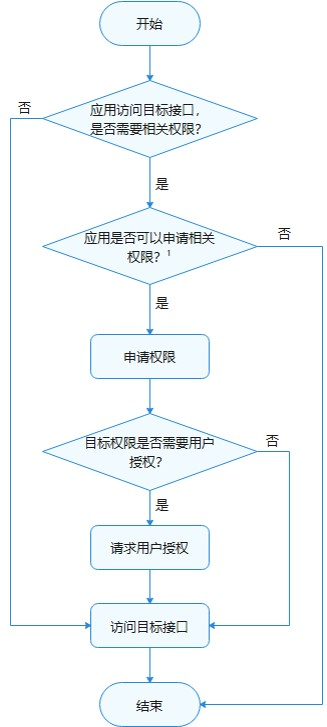
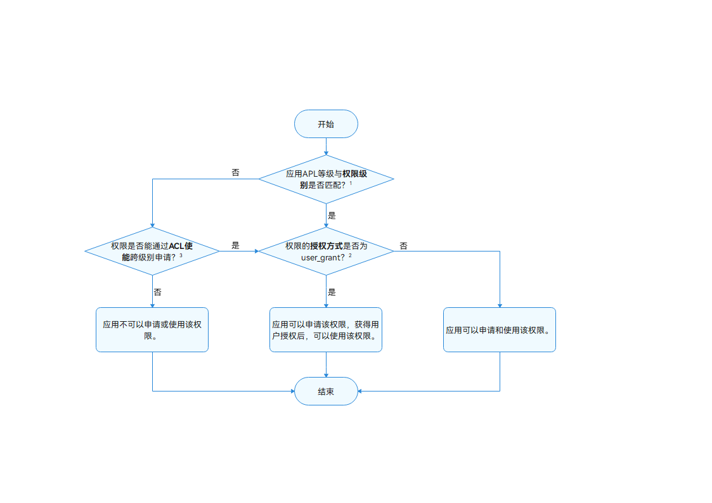
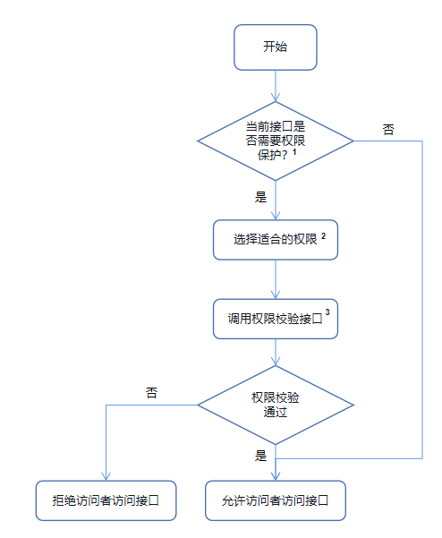

# 访问控制（权限）开发概述

ATM (AccessTokenManager) 是OpenHarmony上基于AccessToken构建的统一的应用权限管理能力。

默认情况下，应用只能访问有限的系统资源。但某些情况下，应用为了扩展功能的诉求，需要访问额外的系统或其他应用的数据（包括用户个人数据）、功能。系统或应用也必须以明确的方式对外提供接口来共享其数据或功能。OpenHarmony提供了一种访问控制机制来保证这些数据或功能不会被不当或恶意使用，即应用权限。

应用权限保护的对象可以分为数据和功能：

- 数据包含了个人数据（如照片、通讯录、日历、位置等）、设备数据（如设备标识、相机、麦克风等）、应用数据。
- 功能则包括了设备功能（如打电话、发短信、联网等）、应用功能（如弹出悬浮框、创建快捷方式等）等。

应用权限是程序访问操作某种对象的通行证。权限在应用层面要求有明确定义，应用权限使得系统可以规范各类应用程序的行为准则，实现用户隐私的保护机制。当应用访问操作目标对象时，目标对象会对应用进行权限检查，如果没有对应权限，则访问操作将被拒绝。

当前，ATM提供的应用权限校验功能是基于统一管理的TokenID（Token identity）。TokenID是每个应用的身份标识，ATM通过应用的TokenID来管理应用的权限。

## 权限使用的基本原则

在进行权限的申请和使用时，需要满足以下基本原则：

- 应用申请的权限，都必须有明确、合理的使用场景和功能说明，确保用户能够清晰明了地知道申请权限的目的、场景、用途；禁止诱导、误导用户授权；应用使用权限必须与申请所述一致。
- 应用权限申请遵循最小化原则，只申请业务功能所必要的权限，禁止申请不必要的权限。
- 应用在首次启动时，避免频繁弹窗申请多个权限；权限须在用户使用对应业务功能时动态申请。
- 用户拒绝授予某个权限时，与此权限无关的其他业务功能应能正常使用，不能影响应用的正常注册或登录。
- 业务功能所需要的权限被用户拒绝且禁止后不再提示，当用户主动触发使用此业务功能或为实现业务功能所必须时，应用程序可通过界面内文字引导，让用户主动到“系统设置”中授权。

- 当前不允许应用自行定义权限，应用申请的权限应该从[已有的权限列表](permission-list.md)中选择。

## 权限的工作流程

### 权限申请使用的工作流程

应用在访问数据或者执行操作时，需要评估该行为是否需要应用具备相关的权限。如果确认需要目标权限，则需要在应用安装包中申请目标权限。

然后，需要判断目标权限是否属于用户授权类。如果是，应用需要使用动态授权弹框来提供用户授权界面，请求用户授权目标权限。

当用户授予应用所需权限后，应用可成功访问目标数据或执行目标操作。

应用使用权限的工作流程如图所示。



1：开发者可以参考下图，判断应用能否申请目标权限。



1：应用APL等级与权限等级的匹配关系请参考[权限等级说明](#权限等级说明)。

2：权限的授权方式分为user_grant（用户授权）和system_grant（系统授权），具体请参考[权限类型说明](#权限类型说明)。

3：应用可以通过ACL（访问控制列表）方式申请高级别的权限，具体请参考[访问控制列表（ACL）说明](#访问控制列表acl说明)。

### 权限校验的工作流程
应用在提供对外功能服务接口时，可以根据接口涉数据的敏感程度或所涉能力的安全威胁影响，在[权限定义列表](permission-list.md)选择合适的权限保护当前接口，对访问者进行权限校验。

当且仅当访问者获取当前接口所需权限后，才能通过当前接口的权限校验，并正常使用当前应用提供的目标功能。

应用使用权限校验的工作流程如图所示。



1：根据应用当前提供的接口是否涉及敏感的数据或者功能，使用应用权限对当前接口进行访问控制。

2：应用可以在系统已经存在的权限中[访问控制列表（ACL）说明](#访问控制列表acl说明)选择适合的权限。比如应用提供的接口会涉及到联系人信息的话，推荐使用联系人相关的权限对接口进行保护。

3：应用可以使用权限校验接口对访问者进行鉴权，可参考[权限校验说明](permission-verify-guidelines.md)。

## 权限等级说明

根据接口所涉数据的敏感程度或所涉能力的安全威胁影响，ATM模块定义了不同开放范围的权限等级来保护用户隐私。

### 应用APL等级说明

元能力权限等级APL（Ability Privilege Level）指的是应用的权限申请优先级的定义，不同APL等级的应用能够申请的权限等级不同。

应用的等级可以分为三个等级，分别是：

| APL级别          | 说明                                   |
| ---------------- | -------------------------------------- |
| system_core等级  | 该等级的应用服务提供操作系统核心能力。 |
| system_basic等级 | 该等级的应用服务提供系统基础服务。     |
| normal等级       | 普通应用。                             |

默认情况下，应用的APL等级都为normal等级。

如果应用需要将自身的APL等级声明为system_basic及以上的APL等级，在开发应用安装包时，要修改应用的Profile文件。

在文件"bundle-info"的"apl"字段声明应用的APL等级后，使用[hap包签名工具](hapsigntool-overview.md)生成证书；也可以使用DevEco Studio[自动签名](https://developer.harmonyos.com/cn/docs/documentation/doc-guides/ohos-auto-configuring-signature-information-0000001271659465#section161281722111)。

> **注意：**<br>直接修改应用Profile文件的方式，仅用于应用/服务调试阶段使用，不可用于发布上架应用市场。如果需要开发商用版本的应用，请在对应的应用市场进行发布证书和Profile文件的申请。

示例如下：

该示例仅涉及修改"apl"字段，其余信息请根据实际情况。Profile文件的字段说明可参考[HarmonyAppProvision配置文件的说明](app-provision-structure.md)。

```json
{
	"bundle-info" : {
		"developer-id": "OpenHarmony",
		"development-certificate": "Base64 string",
		"distribution-certificate": "Base64 string",
		"bundle-name": "com.OpenHarmony.app.test",
		"apl": "system_basic",
        "app-feature": "hos_normal_app"
	},
}
```

### 权限等级说明

根据权限对于不同等级应用有不同的开放范围，权限类型对应分为以下三种，等级依次提高。

- **normal权限**

    normal 权限允许应用访问超出默认规则外的普通系统资源。这些系统资源的开放（包括数据和功能）对用户隐私以及其他应用带来的风险很小。

    该类型的权限仅向APL等级为normal及以上的应用开放。

- **system_basic权限**

    system_basic权限允许应用访问操作系统基础服务相关的资源。这部分系统基础服务属于系统提供或者预置的基础功能，比如系统设置、身份认证等。这些系统资源的开放对用户隐私以及其他应用带来的风险较大。

    该类型的权限仅向APL等级为system_basic及以上的应用开放。

- **system_core权限**

    system_core权限涉及到开放操作系统核心资源的访问操作。这部分系统资源是系统最核心的底层服务，如果遭受破坏，操作系统将无法正常运行。
    
    鉴于该类型权限对系统的影响程度非常大，目前暂不向任何三方应用开放。

## 权限类型说明

根据授权方式的不同，权限类型可分为system_grant（系统授权）和user_grant（用户授权）。

- **system_grant**

   system_grant指的是系统授权类型，在该类型的权限许可下，应用被允许访问的数据不会涉及到用户或设备的敏感信息，应用被允许执行的操作不会对系统或者其他应用产生大的不利影响。

    如果在应用中申请了system_grant权限，那么系统会在用户安装应用时，自动把相应权限授予给应用。应用需要在应用商店的详情页面，向用户展示所申请的system_grant权限列表。

- **user_grant**

    user_grant指的是用户授权类型，在该类型的权限许可下，应用被允许访问的数据将会涉及到用户或设备的敏感信息，应用被允许执行的操作可能对系统或者其他应用产生严重的影响。

    该类型权限不仅需要在安装包中申请权限，还需要在应用动态运行时，通过发送弹窗的方式请求用户授权。在用户手动允许授权后，应用才会真正获取相应权限，从而成功访问操作目标对象。

    比如说，在[权限定义列表](permission-list.md)中，麦克风和摄像头对应的权限都是属于用户授权权限，列表中给出了详细的权限使用理由。

    应用需要在应用商店的详情页面，向用户展示所申请的user_grant权限列表。

### 不同权限类型的授权流程

如[权限的工作流程](#权限的工作流程)所示，如果应用需要获取目标权限，那么需要先进行权限申请。

- 权限申请

   开发者需要在配置文件中[声明目标权限](accesstoken-guidelines.md#权限申请声明)。

- 权限授权

   - 如果目标权限是system_grant类型，开发者在进行权限申请后，系统会在安装应用时自动为其进行权限预授予，开发者不需要做其他操作即可使用权限。
   - 如果目标权限是user_grant类型，开发者在进行权限申请后，在运行时触发动态弹窗，请求用户授权，具体操作见[user_grant权限请求授权的步骤详解](#user_grant权限请求授权的步骤详解)。

### user_grant权限请求授权的步骤详解

在应用需要获取user_grant权限时，请完成以下步骤：

1. 在配置文件中，声明应用需要请求的权限，详见[访问控制开发指导](accesstoken-guidelines.md)。

2. 将应用中需要申请权限的目标对象与对应目标权限进行关联，让用户明确地知道，哪些操作需要用户向应用授予指定的权限。

3. 运行应用时，在用户触发访问操作目标对象时应该调用接口，精准触发动态授权弹框。该接口的内部会检查当前用户是否已经授权应用所需的权限，如果当前用户尚未授予应用所需的权限，该接口会拉起动态授权弹框，向用户请求授权。

4. 检查用户的授权结果，确认用户已授权才可以进行下一步操作。

**注意事项：** 

- 每次执行需要目标权限的操作时，应用都必须检查自己是否已经具有该权限。
- 如需检查用户是否已向您的应用授予特定权限，可以使用[verifyAccessToken](../reference/apis/js-apis-abilityAccessCtrl.md)函数，此方法会返回  [PERMISSION_GRANTED](../reference/apis/js-apis-abilityAccessCtrl.md)或[PERMISSION_DENIED](../reference/apis/js-apis-abilityAccessCtrl.md)。具体的示例代码可以查看[访问控制开发指导](accesstoken-guidelines.md)。
- user_grant权限授权要基于用户可知可控的原则，需要应用在运行时主动调用系统动态申请权限的接口，系统弹框由用户授权，用户结合应用运行场景的上下文，识别出应用申请相应敏感权限的合理性，从而做出正确的选择。
- 即使用户向应用授予过请求的权限，应用在调用受此权限管控的接口前，也应该先检查自己有无此权限，而不能把之前授予的状态持久化，因为用户在动态授予后还可以通过设置取消应用的权限。

## 访问控制列表（ACL）说明

如上所述，权限等级和应用的APL等级是一一对应的。原则上，**拥有低APL等级的应用默认无法申请更高等级的权限**。

访问控制列表ACL（Access Control List）提供了解决低等级应用访问高等级权限问题的特殊渠道。

**场景举例：**

开发者正在开发应用A，该应用的APL等级为normal级别。由于功能场景需要，应用A必须申请到权限B和权限C，其中，权限B的权限等级为system_basic，权限C的权限等级为normal级别。

在权限B的ACL使能为TRUE的情况下，此时，开发者可以使用ACL方式来申请权限B。

ACL方式的工作流程可以参考[ACL方式使用说明](#acl方式使用说明)。
具体某个权限能否通过ACL使能情况可查阅[权限定义列表](permission-list.md)。

### ACL方式使用说明

如果应用申请的权限中，存在部分权限的权限等级比应用APL等级高，开发者可以选择通过ACL方式来解决这个等级不匹配的问题。

在上述的[授权流程](#不同权限类型的授权流程)的基础上，应用需要进行额外的ACL声明步骤。

应用除了需要在应用配置文件声明所需申请的权限，还需要在应用的[Profile文件中声明](accesstoken-guidelines.md#acl方式声明)不满足申请条件的高等级权限，接下来的授权流程不变。

**ACL申请方式须知**

开发应用安装包时，需要修改应用的Profile文件，在文件的"acl"字段声明目标的访问控制列表。然后使用[hap包签名工具](hapsigntool-overview.md)生成证书。

> **注意：**<br>直接修改应用Profile文件的方式，仅用于应用/服务调试阶段使用，不可用于发布上架应用市场。如果需要开发商用版本的应用，请在对应的应用市场进行发布证书和Profile文件的申请。

```json
{
    "acls": {
        "allowed-acls": [
            "ohos.permission.PERMISSION"
        ]
    },
}
```

Profile文件的字段说明可参考[HarmonyAppProvision配置文件的说明](app-provision-structure.md)。
