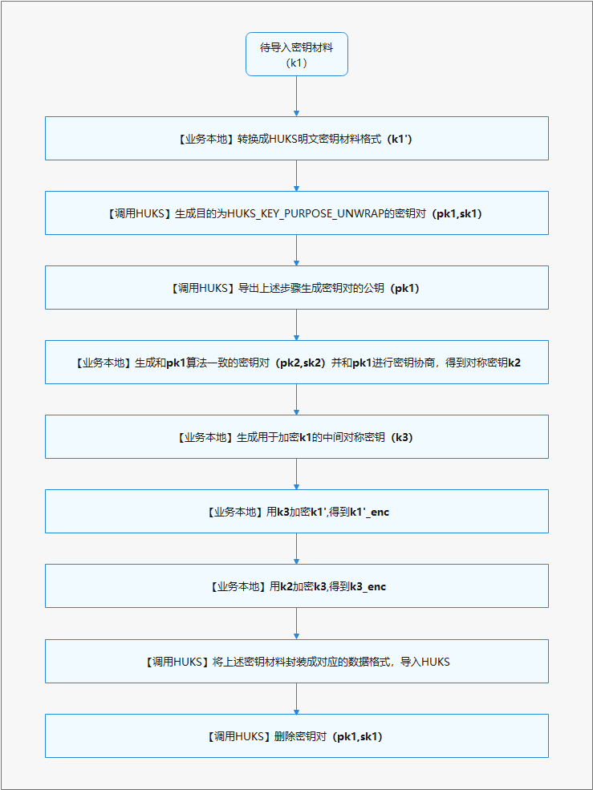
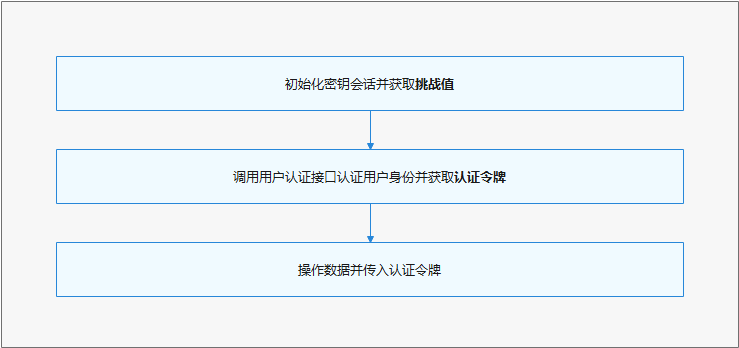

# 通用密钥库开发指导

## 生成新密钥

HUKS提供为业务安全随机生成密钥的能力。通过HUKS生成的密钥，密钥的全生命周期明文不会出安全环境，能保证任何人都无法接触获取到密钥的明文。即使生成密钥的业务自身，后续也只能通过HUKS提供的接口请求执行密钥操作，获取操作结果，但无法接触到密钥自身。


**<font size=5>开发步骤</font>**

生成密钥时使用[huks.generateKeyItem(keyAlias,options,callback)](../reference/apis/js-apis-huks.md#huksgeneratekeyitem9)方法，传入keyAlias作为密钥别名，传入options包含该密钥的属性集，传入callback用于回调异步结果。关于接口的具体信息，可在[API参考文档](../reference/apis/js-apis-huks.md)中查看。


1. 确定密钥别名；
2. 初始化密钥属性集：通过[HuksParam](../reference/apis/js-apis-huks.md#huksparam)封装密钥属性，搭配Array组成密钥属性集，并赋值给[HuksOptions](../reference/apis/js-apis-huks.md#huksoptions)（properties字段），其中必须包含[HuksKeyAlg](../reference/apis/js-apis-huks.md#hukskeyalg),[HuksKeySize](../reference/apis/js-apis-huks.md#hukskeysize),[HuksKeyPurpose](../reference/apis/js-apis-huks.md#hukskeypurpose)属性；
3. 将密钥别名与密钥参数集作为参数传入，生成密钥。


> **说明**
>
> 存储的 keyAlias 密钥别名最大为64字节

**代码示例：**

```ts
/*
 * 以下以生成DH密钥的Callback操作使用为例
 */
import huks from '@ohos.security.huks';

/*
 * 确定密钥别名和封装密钥属性参数集
 */
let keyAlias = 'dh_key';
let properties = new Array();
properties[0] = {
    tag: huks.HuksTag.HUKS_TAG_ALGORITHM,
    value: huks.HuksKeyAlg.HUKS_ALG_DH
}
properties[1] = {
    tag: huks.HuksTag.HUKS_TAG_PURPOSE,
    value: huks.HuksKeyPurpose.HUKS_KEY_PURPOSE_AGREE
}
properties[2] = {
    tag: huks.HuksTag.HUKS_TAG_KEY_SIZE,
    value: huks.HuksKeySize.HUKS_DH_KEY_SIZE_2048
}
properties[3] = {
    tag: huks.HuksTag.HUKS_TAG_DIGEST,
    value: huks.HuksKeyDigest.HUKS_DIGEST_SHA256
}
let huksOptions = {
    properties: properties,
    inData: new Uint8Array(new Array())
}

/*
 * 生成密钥
 */
function generateKeyItem(keyAlias: string, huksOptions: huks.HuksOptions) {
    return new Promise((resolve, reject) => {
        try {
            huks.generateKeyItem(keyAlias, huksOptions, function (error, data) {
                if (error) {
                    reject(error);
                } else {
                    resolve(data);
                }
            });
        } catch (error) {
            throw (error);
        }
    });
}

async function publicGenKeyFunc(keyAlias: string, huksOptions: huks.HuksOptions) {
    console.info(`enter callback generateKeyItem`);
    try {
        await generateKeyItem(keyAlias, huksOptions)
            .then((data) => {
                console.info(`callback: generateKeyItem success, data = ${JSON.stringify(data)}`);
            })
            .catch(error => {
                console.error(`callback: generateKeyItem failed, code: ${error.code}, msg: ${error.message}`);
            });
    } catch (error) {
        console.error(`callback: generateKeyItem input arg invalid, code: ${error.code}, msg: ${error.message}`);
    }
}


async function TestGenKey() {
    await publicGenKeyFunc(keyAlias, huksOptions);
}
```

## 导入外部密钥
如果密钥是在HUKS外部生成（比如应用间协商生成、服务器端生成），应用可以将密钥导入到HUKS托管。HUKS支持直接将密钥明文导入到HUKS，但是明文导入会导致密钥暴露在REE内存中，一般适用于轻量级设备或低安业务。对于高安敏感业务，HUKS还提供了安全导入密钥的能力，允许业务自己生成密钥，并通过与处于安全环境中的HUKS建立端到端的加密传输通道，将密钥安全加密导入到HUKS中，确保导入传入过程中密钥不被泄露。

与生成密钥一样，密钥一旦导入到HUKS中，密钥的生命周期明文不出安全环境，同样能保证任何人都无法接触获取到密钥的明文。


### 明文导入


导入明文密钥时使用[huks.importKeyItem(keyAlias,options,callback)](../reference/apis/js-apis-huks.md#huksimportkeyitem9)方法，传入keyAlias作为密钥别名，传入options，其中必须包含密钥材料和密钥属性集，传入callback用于回调异步结果。关于接口的具体信息，可在[API参考文档](../reference/apis/js-apis-huks.md)中查看。


1. 确定密钥别名；
2. 封装密钥材料和密钥属性集：密钥材料须符合[HUKS密钥材料格式](./huks-appendix.md#密钥材料格式)并以Uint8Array形式赋值给[HuksOptions](../reference/apis/js-apis-huks.md#huksoptions)的inData字段；另外，通过[HuksParam](../reference/apis/js-apis-huks.md#huksparam)封装密钥属性，搭配Array组成密钥属性集赋值给properties字段，属性集中必须包含[HuksKeyAlg](../reference/apis/js-apis-huks.md#hukskeyalg),[HuksKeySize](../reference/apis/js-apis-huks.md#hukskeysize),[HuksKeyPurpose](../reference/apis/js-apis-huks.md#hukskeypurpose)属性；
3. 导入密钥。


**代码示例：**

```ts
/*
 * 以导入AES256密钥为例
 */
 
/* 密钥 */
let plainTextSize32 = new Uint8Array([
  0xfb, 0x8b, 0x9f, 0x12, 0xa0, 0x83, 0x19, 0xbe, 0x6a, 0x6f, 0x63, 0x2a, 0x7c, 0x86, 0xba, 0xca,
  0x64, 0x0b, 0x88, 0x96, 0xe2, 0xfa, 0x77, 0xbc, 0x71, 0xe3, 0x0f, 0x0f, 0x9e, 0x3c, 0xe5, 0xf9
]);

/*
 * 确定密钥别名
 */
let keyAlias = 'AES256Alias_sample';

/*
 * 封装密钥属性集和密钥材料
 */ 
let properties = new Array();
properties[0] = {
    tag: huks.HuksTag.HUKS_TAG_ALGORITHM,
    value: huks.HuksKeyAlg.HUKS_ALG_AES
};
properties[1] = {
    tag: huks.HuksTag.HUKS_TAG_KEY_SIZE,
    value: huks.HuksKeySize.HUKS_AES_KEY_SIZE_256
};
properties[2] = {
    tag: huks.HuksTag.HUKS_TAG_PURPOSE,
    value:
    huks.HuksKeyPurpose.HUKS_KEY_PURPOSE_ENCRYPT | huks.HuksKeyPurpose.HUKS_KEY_PURPOSE_DECRYPT
};
let options = {
    properties: properties,
    inData: plainTextSize32
};

/*
 * 导入密钥
 */
try {
    huks.importKeyItem(keyAlias, options, function (error, data) {
        if (error) {
            console.error(`callback: importKeyItem failed, code: ${error.code}, msg: ${error.message}`);
        } else {
            console.info(`callback: importKeyItem success`);
        }
    });
} catch (error) {
    console.error(`callback: importKeyItem input arg invalid, code: ${error.code}, msg: ${error.message}`);
}
```

**调测验证**

验证时查询密钥是否存在，如密钥存在即表示生成密钥成功。

**代码示例：**

```ts
import huks from '@ohos.security.huks';

let keyAlias = 'AES256Alias_sample';
let isKeyExist;

let keyProperties = new Array();
keyProperties[0] = {
    tag: huks.HuksTag.HUKS_TAG_ALGORITHM,
    value: huks.HuksKeyAlg.HUKS_ALG_AES,
}
let huksOptions = {
    properties: keyProperties, // 非空填充
    inData: new Uint8Array(new Array()) // 非空填充
}
try {
    huks.isKeyItemExist(keyAlias, huksOptions, function (error, data) {
        if (error) {
            console.error(`callback: isKeyItemExist failed, code: ${error.code}, msg: ${error.message}`);
        } else {
            if (data !== null && data.valueOf() !== null) {
                isKeyExist = data.valueOf();
                console.info(`callback: isKeyItemExist success, isKeyExist = ${isKeyExist}`);
            }
        }
    });
} catch (error) {
    console.error(`callback: isKeyItemExist input arg invalid, code: ${error.code}, msg: ${error.message}`);
}
```

### 加密导入

相比明文导入，加密导入步骤更多，密钥材料更复杂，此章节将展示开发过程中关键的开发流程和密钥材料数据结构。下图是加密导入的基本开发流程。


**图2** 加密导入开发流程




**接口说明**

根据开发流程，在导入加密密钥过程中，需要依次调用HUKS的生成密钥、导出公钥、导入加密密钥、删除密钥接口。
| 接口名                      | 描述                 |
| -------------------------------------- | ----------------------------|
|generateKeyItem(keyAlias: string, options: HuksOptions, callback: AsyncCallback\<void>) : void| 生成新密钥|
|exportKeyItem(keyAlias: string, options: HuksOptions, callback: AsyncCallback<HuksReturnResult>) : void| 导出密钥对的公钥|
|importWrappedKeyItem(keyAlias: string, wrappingKeyAlias: string, options: HuksOptions, callback: AsyncCallback<void>) : void|导入加密密钥|
|deleteKeyItem(keyAlias: string, options: HuksOptions, callback: AsyncCallback<void>) : void|删除密钥|

需要注意的是，导出密钥接口返回的公钥明文材料是按照**X.509**格式封装，导入加密密钥接口中的密钥材料需满足**Length<sub>Data</sub>-Data** 的格式封装。具体，应用需要申请一个Uint8Array按照以下表格中的顺序依次封装。

**表2** 加密密钥材料格式

| 内容 | 业务公钥长度L<sub>pk2</sub> | 业务公钥pk2 | k2加密参数AAD2长度L<sub>AAD2</sub> | k2加密参数AAD2 |  k2加密参数Nonce2长度L<sub>Nonce2</sub> | k2加密参数Nonce2 | 
| :--: |:----:|:----: |:----: | :----:  | :----:|:----:|
|长度| 4字节 |L<sub>pk2</sub>字节| 4字节 | L<sub>AAD2</sub>字节 | 4字节 | L<sub>Nonce2</sub>字节 |
| 内容 | k2加密参数AEAD2长度L<sub>AEAD2</sub> | k2加密参数AEAD2 | k3密文长度L<sub>k3_enc</sub> | k3密文k3_enc |  k3加密参数AAD3长度L<sub>AAD3</sub> | k3加密参数AAD3 | 
|长度| 4字节 |L<sub>AEAD2</sub>字节| 4字节 | L<sub>k3_enc</sub>字节 | 4字节 | L<sub>AAD3</sub>字节 |
| 内容| k3加密参数Nonce3长度L<sub>Nonce3</sub> | k3加密参数Nonce3 | k3加密参数AEAD3长度L<sub>AEAD3</sub> | k3加密参数AEAD3 |  **密钥明文材料长度** 的长度L<sub>k1'_size</sub> | 密钥明文材料长度k1'_size | 
|长度| 4字节 |L<sub>Nonce3</sub>字节| 4字节 | L<sub>AEAD3</sub>字节 | 4字节 | L<sub>k1'_size</sub>字节 |
|内容|k1'密文长度L<sub>k1'_enc</sub>| k1'密文k1'_enc| | | | |
|长度| 4字节 |L<sub>k1'_enc</sub>字节| | | | |

**开发步骤**

这里主要展示涉及调用HUKS的开发样例（使用ECDH密钥协商套件），部分在业务本地执行的步骤不在这里展示详细样例。
1. 转换成HUKS格式的密钥材料
2. 生成加密导入用途的密钥
3. 导出公钥材料
4. 封装加密导入密钥材料
5. 导入封装的加密密钥材料
6. 删除用于加密导入的密钥

**代码示例：**

```ts
/*
 * 以下以SM2密钥的Callback操作验证为例
 */
import huks from '@ohos.security.huks';

/*
 * 确定密钥别名
 */
let importAlias = "importAlias";
let wrapAlias = "wrappingKeyAlias";
let exportKey;

/*
 * 加密导入用途的密钥材料原文：转换成HUKS ECC-P-256密钥对格式的密钥材料
 */
let inputEccPair = new Uint8Array([
    0x02, 0x00, 0x00, 0x00, // 密钥算法：huks.HuksKeyAlg.HUKS_ALG_ECC = 2
    0x00, 0x01, 0x00, 0x00, // 密钥大小（比特）：256
    0x20, 0x00, 0x00, 0x00, // 坐标x长度（字节）：32
    0x20, 0x00, 0x00, 0x00, // 坐标y长度（字节）：32
    0x20, 0x00, 0x00, 0x00, // 坐标z长度（字节）：32
    // 坐标x
    0xa5, 0xb8, 0xa3, 0x78, 0x1d, 0x6d, 0x76, 0xe0, 0xb3, 0xf5, 0x6f, 0x43, 0x9d, 0xcf, 0x60, 0xf6,
    0x0b, 0x3f, 0x64, 0x45, 0xa8, 0x3f, 0x1a, 0x96, 0xf1, 0xa1, 0xa4, 0x5d, 0x3e, 0x2c, 0x3f, 0x13,
    // 坐标y
    0xd7, 0x81, 0xf7, 0x2a, 0xb5, 0x8d, 0x19, 0x3d, 0x9b, 0x96, 0xc7, 0x6a, 0x10, 0xf0, 0xaa, 0xbc,
    0x91, 0x6f, 0x4d, 0xa7, 0x09, 0xb3, 0x57, 0x88, 0x19, 0x6f, 0x00, 0x4b, 0xad, 0xee, 0x34, 0x35,
    // 坐标z
    0xfb, 0x8b, 0x9f, 0x12, 0xa0, 0x83, 0x19, 0xbe, 0x6a, 0x6f, 0x63, 0x2a, 0x7c, 0x86, 0xba, 0xca,
    0x64, 0x0b, 0x88, 0x96, 0xe2, 0xfa, 0x77, 0xbc, 0x71, 0xe3, 0x0f, 0x0f, 0x9e, 0x3c, 0xe5, 0xf9
    ]);

/*
 * 封装密钥属性参数集
 */
// 生成加密导入用途的密钥的属性集
let properties = new Array();
properties[0] = {
    tag: huks.HuksTag.HUKS_TAG_ALGORITHM,
    value: huks.HuksKeyAlg.HUKS_ALG_ECC
};
properties[1] = {
    tag: huks.HuksTag.HUKS_TAG_KEY_SIZE,
    value: huks.HuksKeySize.HUKS_ECC_KEY_SIZE_256
};
properties[2] = {
    tag: huks.HuksTag.HUKS_TAG_PURPOSE,
    value: huks.HuksKeyPurpose.HUKS_KEY_PURPOSE_UNWRAP
};
properties[3] = {
    tag: huks.HuksTag.HUKS_TAG_DIGEST,
    value: huks.HuksKeyDigest.HUKS_DIGEST_SHA256
};
properties[4] = {
    tag: huks.HuksTag.HUKS_TAG_IMPORT_KEY_TYPE,
    value: huks.HuksImportKeyType.HUKS_KEY_TYPE_KEY_PAIR,
};
let huksOptions = {
    properties: properties,
    inData: inputEccPair
};

// 待导入密钥的属性集:AES256
let importProperties = new Array();
importProperties[0] = {
    tag: huks.HuksTag.HUKS_TAG_ALGORITHM,
    value: huks.HuksKeyAlg.HUKS_ALG_AES
};
importProperties[1] = {
    tag: huks.HuksTag.HUKS_TAG_KEY_SIZE,
    value: huks.HuksKeySize.HUKS_AES_KEY_SIZE_256
};
importProperties[2] = {
    tag: huks.HuksTag.HUKS_TAG_PURPOSE,
    value: huks.HuksKeyPurpose.HUKS_KEY_PURPOSE_ENCRYPT | huks.HuksKeyPurpose.HUKS_KEY_PURPOSE_DECRYPT
};
importProperties[3] = {
    tag: huks.HuksTag.HUKS_TAG_BLOCK_MODE,
    value: huks.HuksCipherMode.HUKS_MODE_CBC
};
importProperties[4] = {
    tag: huks.HuksTag.HUKS_TAG_PADDING,
    value: huks.HuksKeyPadding.HUKS_PADDING_NONE
};
importProperties[5] = {
    tag: huks.HuksTag.HUKS_TAG_UNWRAP_ALGORITHM_SUITE,
    value: huks.HuksUnwrapSuite.HUKS_UNWRAP_SUITE_ECDH_AES_256_GCM_NOPADDING // 使用“ECDH+AES256GCM”加密导入套件
};
let importOptions = {
    properties: importProperties,
    inData: new Uint8Array(new Array())
};

// 导出加密导入用途的公钥
function exportKeyItem(keyAlias:string, huksOptions:huks.HuksOptions, throwObject) : Promise<huks.HuksReturnResult> {
    return new Promise((resolve, reject) => {
        try {
            huks.exportKeyItem(keyAlias, huksOptions, function (error, data) {
                if (error) {
                    reject(error);
                } else {
                    resolve(data);
                }
            });
        } catch (error) {
            throwObject.isThrow = true;
            throw(error);
        }
    });
}

async function publicExportKeyFunc(keyAlias:string, huksOptions:huks.HuksOptions) {
    console.info(`enter callback export`);
    let throwObject = {isThrow: false};
    try {
        await exportKeyItem(keyAlias, huksOptions, throwObject)
            .then ((data) => {
                console.info(`callback: exportKeyItem success, data = ${JSON.stringify(data)}`);
                exportKey = data.outData;
            })
            .catch(error => {
                if (throwObject.isThrow) {
                    throw(error);
                } else {
                    console.error(`callback: exportKeyItem failed, code: ${error.code}, msg: ${error.message}`);
                }
            });
    } catch (error) {
        console.error(`callback: exportKeyItem input arg invalid, code: ${error.code}, msg: ${error.message}`);
    }
}

// 此处用导入密钥来模拟“生成加密导入用途的密钥”
function importKeyItem(keyAlias:string, huksOptions:huks.HuksOptions, throwObject) {
    return new Promise((resolve, reject) => {
        try {
            huks.importKeyItem(keyAlias, huksOptions, function (error, data) {
                if (error) {
                    reject(error);
                } else {
                    resolve(data);
                }
            });
        } catch (error) {
            throwObject.isThrow = true;
            throw(error);
        }
    });
}

async function publicImportKeyFunc(keyAlias:string, huksOptions:huks.HuksOptions) {
    console.info(`enter promise importKeyItem`);
    let throwObject = {isThrow: false};
    try {
        await importKeyItem(keyAlias, huksOptions, throwObject)
            .then ((data) => {
                console.info(`callback: importKeyItem success, data = ${JSON.stringify(data)}`);
            })
            .catch(error => {
                if (throwObject.isThrow) {
                    throw(error);
                } else {
                    console.error(`callback: importKeyItem failed, code: ${error.code}, msg: ${error.message}`);
                }
            });
    } catch (error) {
        console.error(`callback: importKeyItem input arg invalid, code: ${error.code}, msg: ${error.message}`);
    }
}

// 执行加密导入
async function publicImportWrappedKey(keyAlias:string, wrappingKeyAlias:string, huksOptions:huks.HuksOptions) {
    console.info(`enter callback importWrappedKeyItem`);
    var throwObject = {isThrow: false};
    try {
        await importWrappedKeyItem(keyAlias, wrappingKeyAlias, huksOptions, throwObject)
            .then ((data) => {
                console.info(`callback: importWrappedKeyItem success, data = ${JSON.stringify(data)}`);
            })
            .catch(error => {
                if (throwObject.isThrow) {
                    throw(error);
                } else {
                    console.error(`callback: importWrappedKeyItem failed, code: ${error.code}, msg: ${error.message}`);
                }
            });
    } catch (error) {
        console.error(`callback: importWrappedKeyItem input arg invalid, code: ${error.code}, msg: ${error.message}`);
    }
}

function importWrappedKeyItem(keyAlias:string, wrappingKeyAlias:string, huksOptions:huks.HuksOptions, throwObject) {
    return new Promise((resolve, reject) => {
        try {
            huks.importWrappedKeyItem(keyAlias, wrappingKeyAlias, huksOptions, function (error, data) {
                if (error) {
                    reject(error);
                } else {
                    resolve(data);
                }
            });
        } catch (error) {
            throwObject.isThrow = true;
            throw(error);
        }
    });
}

// 删除加密导入用途的密钥
function deleteKeyItem(keyAlias:string, huksOptions:huks.HuksOptions, throwObject) {
    return new Promise((resolve, reject) => {
        try {
            huks.deleteKeyItem(keyAlias, huksOptions, function (error, data) {
                if (error) {
                    reject(error);
                } else {
                    resolve(data);
                }
            });
        } catch (error) {
            throwObject.isThrow = true;
            throw(error);
        }
    });
}

async function publicDeleteKeyFunc(keyAlias:string, huksOptions:huks.HuksOptions) {
    console.info(`enter callback deleteKeyItem`);
    let throwObject = {isThrow: false};
    try {
        await deleteKeyItem(keyAlias, huksOptions, throwObject)
            .then ((data) => {
                console.info(`callback: deleteKeyItem key success, data = ${JSON.stringify(data)}`);
            })
            .catch(error => {
                if (throwObject.isThrow) {
                    throw(error);
                } else {
                    console.error(`callback: deleteKeyItem failed, code: ${error.code}, msg: ${error.message}`);
                }
            });
    } catch (error) {
        console.error(`callback: deletKeeyItem input arg invalid, code: ${error.code}, msg: ${error.message}`);
    }
}

async function ImportWrappedKeyNormalTest() {
    console.info(`enter ImportWrapKey test`);
    /*
     * 生成加密导入用途的密钥（此处使用导入进行模拟）
     */
    await publicImportKeyFunc(wrapAlias, huksOptions);

    /*
     * 导出加密导入用途密钥的公钥材料
     */
    await publicExportKeyFunc(wrapAlias, huksOptions);

    /*----------------------------------------------------------------------------------------------
     * 此处省略业务本地生成ECC密钥对、业务本地ECDH密钥协商、业务本地生成密钥加密密钥K3、业务本地加密K1'和K3的流程
     *----------------------------------------------------------------------------------------------*/

    /* 封装加密导入密钥材料：参考加密导入
     * 拼接importOptions.inData字段，满足以下格式:
     * PK2长度（4字节）     + PK2的数据     + AAD2的长度（4字节） + AAD2的数据 +
     * Nonce2的长度（4字节）+ Nonce2的数据  + AEAD2的长度（4字节） + AEAD2的数据 +
     * K3密文的长度（4字节） + K3密文的数据  + AAD3的长度（4字节） + AAD3的数据 +
     * Nonce3的长度（4字节） + Nonce3的数据  + AEAD3的长度（4字节） + AEAD3的数据 +
     * K1'_size的长度（4字节） + K1'_size   + K1'_enc的长度（4字节） + K1'_enc的数据
     */
    let inputKey = new Uint8Array([
        0x5b, 0x00, 0x00, 0x00, // ECC-P-256 公钥长度（X.509规范DER格式）：91
        // ECC-P-256 公钥
        0x30, 0x59, 0x30, 0x13, 0x06, 0x07, 0x2a, 0x86, 0x48, 0xce, 0x3d, 0x02, 0x01, 0x06, 0x08, 0x2a,
        0x86, 0x48, 0xce, 0x3d, 0x03, 0x01, 0x07, 0x03, 0x42, 0x00, 0x04, 0xc0, 0xfe, 0x1c, 0x67, 0xde,
        0x86, 0x0e, 0xfb, 0xaf, 0xb5, 0x85, 0x52, 0xb4, 0x0e, 0x1f, 0x6c, 0x6c, 0xaa, 0xc5, 0xd9, 0xd2,
        0x4d, 0xb0, 0x8a, 0x72, 0x24, 0xa1, 0x99, 0xaf, 0xfc, 0x3e, 0x55, 0x5a, 0xac, 0x99, 0x3d, 0xe8,
        0x34, 0x72, 0xb9, 0x47, 0x9c, 0xa6, 0xd8, 0xfb, 0x00, 0xa0, 0x1f, 0x9f, 0x7a, 0x41, 0xe5, 0x44,
        0x3e, 0xb2, 0x76, 0x08, 0xa2, 0xbd, 0xe9, 0x41, 0xd5, 0x2b, 0x9e,

        0x10, 0x00, 0x00, 0x00, // AAD2长度：16
        // AAD2
        0xbf, 0xf9, 0x69, 0x41, 0xf5, 0x49, 0x85, 0x31, 0x35, 0x14, 0x69, 0x12, 0x57, 0x9c, 0xc8, 0xb7,

        0x10, 0x00, 0x00, 0x00, // Nonce2长度：16
        // Nonce2
        0x2d, 0xb7, 0xf1, 0x5a, 0x0f, 0xb8, 0x20, 0xc5, 0x90, 0xe5, 0xca, 0x45, 0x84, 0x5c, 0x08, 0x08,

        0x10, 0x00, 0x00, 0x00, // AEAD2长度：16
        // AEAD2
        0x43, 0x25, 0x1b, 0x2f, 0x5b, 0x86, 0xd8, 0x87, 0x04, 0x4d, 0x38, 0xc2, 0x65, 0xcc, 0x9e, 0xb7,

        0x20, 0x00, 0x00, 0x00, // K3密文长度：32
        // K3密文
        0xf4, 0xe8, 0x93, 0x28, 0x0c, 0xfa, 0x4e, 0x11, 0x6b, 0xe8, 0xbd, 0xa8, 0xe9, 0x3f, 0xa7, 0x8f,
        0x2f, 0xe3, 0xb3, 0xbf, 0xaf, 0xce, 0xe5, 0x06, 0x2d, 0xe6, 0x45, 0x5d, 0x19, 0x26, 0x09, 0xe7,

        0x10, 0x00, 0x00, 0x00, // AAD3长度：16
        // AAD3
        0xf4, 0x1e, 0x7b, 0x01, 0x7a, 0x84, 0x36, 0xa4, 0xa8, 0x1c, 0x0d, 0x3d, 0xde, 0x57, 0x66, 0x73,

        0x10, 0x00, 0x00, 0x00, // Nonce3长度：16
        // Nonce3
        0xe3, 0xff, 0x29, 0x97, 0xad, 0xb3, 0x4a, 0x2c, 0x50, 0x08, 0xb5, 0x68, 0xe1, 0x90, 0x5a, 0xdc,

        0x10, 0x00, 0x00, 0x00, // AEAD3长度：16
        // AEAD3
        0x26, 0xae, 0xdc, 0x4e, 0xa5, 0x6e, 0xb1, 0x38, 0x14, 0x24, 0x47, 0x1c, 0x41, 0x89, 0x63, 0x11,

        0x04, 0x00, 0x00, 0x00, // “密钥明文材料长度”的长度（字节）：4
        // 密钥明文材料的长度：32字节
        0x20, 0x00, 0x00, 0x00,

        0x20, 0x00, 0x00, 0x00, // 待导入密钥密文长度（字节）：32
        // 待导入密钥密文
        0x0b, 0xcb, 0xa9, 0xa8, 0x5f, 0x5a, 0x9d, 0xbf, 0xa1, 0xfc, 0x72, 0x74, 0x87, 0x79, 0xf2, 0xf4,
        0x22, 0x0c, 0x8a, 0x4d, 0xd8, 0x7e, 0x10, 0xc8, 0x44, 0x17, 0x95, 0xab, 0x3b, 0xd2, 0x8f, 0x0a
    ]);
    importOptions.inData = inputKey;

    /*
     * 导入封装的加密密钥材料
     */
    await publicImportWrappedKey(importAlias, wrapAlias, importOptions);

    /*
     * 删除用于加密导入的密钥
     */
    await publicDeleteKeyFunc(wrapAlias, huksOptions);
}
```

**调测验证**

验证时查询密钥是否存在，如密钥存在即表示生成密钥成功。

**代码示例：**

```ts
import huks from '@ohos.security.huks';

/*
 * 确定密钥别名和封装密钥属性参数集
 */
let keyAlias = 'importAlias';
let isKeyExist;

let keyProperties = new Array();
keyProperties[0] = {
    tag: huks.HuksTag.HUKS_TAG_ALGORITHM,
    value: huks.HuksKeyAlg.HUKS_ALG_AES,
}
let huksOptions = {
    properties: keyProperties, // 非空填充
    inData: new Uint8Array(new Array()) // 非空填充
}
try {
    huks.isKeyItemExist(keyAlias, huksOptions, function (error, data) {
        if (error) {
            console.error(`callback: isKeyItemExist failed, code: ${error.code}, msg: ${error.message}`);
        } else {
            if (data !== null && data.valueOf() !== null) {
                isKeyExist = data.valueOf();
                console.info(`callback: isKeyItemExist success, isKeyExist = ${isKeyExist}`);
            }
        }
    });
} catch (error) {
    console.error(`callback: isKeyItemExist input arg invalid, code: ${error.code}, msg: ${error.message}`);
}
```


## 常见密钥操作

**场景概述**

为了实现对数据机密性、完整性等保护，在生成/导入密钥后，需要对数据进行密钥操作，比如加密解密、签名验签、密钥协商、密钥派生等，本章节提供了常用的密钥操作的示例。本章节提供的示例都没有设置二次身份访问控制，如设置了密钥访问控制请参考[密钥访问控制](#密钥访问控制)用法。

**通用开发流程**

HUKS基于密钥会话来操作数据，使用密钥时基于以下流程：
1. **初始化密钥会话[huks.initSession()](../reference/apis/js-apis-huks.md#huksinitsession9)：** 传入密钥别名和密钥操作参数，初始化一个密钥会话并获取会话句柄。其中密钥操作参数中必须包含对应密码算法所必须的参数，包括密码算法、密钥大小、密钥目的、工作模式、填充模式、散列模式、IV、Nonce、AAD等。如果密钥设置了访问控制属性，还需要其他参数具体[密钥访问控制](#密钥访问控制)。此步骤必选！
2. **分段操作数据[huks.updateSession()](../reference/apis/js-apis-huks.md#huksupdatesession9)：** 如数据过大（超过100K）或密码算法的要求需要对数据进行分段操作，反之可跳过此步。此步骤可选！
3. **结束密钥会话[huks.finishSession()](../reference/apis/js-apis-huks.md#huksfinishsession9)：** 操作最后一段数据并结束密钥会话，如过程中发生错误或不需要此次密钥操作数据，必须取消会话[huks.abortSession()](../reference/apis/js-apis-huks.md#huksabortsession9)。此步骤必选！

### 加密解密
```ts
/*
 * 以下以SM4 128密钥的Callback操作使用为例
 */
import huks from '@ohos.security.huks';

/*
 * 确定密钥别名和封装密钥属性参数集
 */
let srcKeyAlias = 'sm4_Key';
let IV = '0000000000000000';
let cipherInData = 'Hks_SM4_Cipher_Test_101010101010101010110_string';
let encryptUpdateResult = new Array();
let handle;
let updateResult = new Array();
let finishOutData;

/* 集成生成密钥参数集 & 加密参数集 */
let properties = new Array();
properties[0] = {
    tag: huks.HuksTag.HUKS_TAG_ALGORITHM,
    value: huks.HuksKeyAlg.HUKS_ALG_SM4,
}
properties[1] = {
    tag: huks.HuksTag.HUKS_TAG_PURPOSE,
    value: huks.HuksKeyPurpose.HUKS_KEY_PURPOSE_ENCRYPT | huks.HuksKeyPurpose.HUKS_KEY_PURPOSE_DECRYPT,
}
properties[2] = {
    tag: huks.HuksTag.HUKS_TAG_KEY_SIZE,
    value: huks.HuksKeySize.HUKS_SM4_KEY_SIZE_128,
}
properties[3] = {
    tag: huks.HuksTag.HUKS_TAG_BLOCK_MODE,
    value: huks.HuksCipherMode.HUKS_MODE_CBC,
}
properties[4] = {
    tag: huks.HuksTag.HUKS_TAG_PADDING,
    value: huks.HuksKeyPadding.HUKS_PADDING_NONE,
}
let huksOptions = {
    properties: properties,
    inData: new Uint8Array(new Array())
}

let propertiesEncrypt = new Array();
propertiesEncrypt[0] = {
    tag: huks.HuksTag.HUKS_TAG_ALGORITHM,
    value: huks.HuksKeyAlg.HUKS_ALG_SM4,
}
propertiesEncrypt[1] = {
    tag: huks.HuksTag.HUKS_TAG_PURPOSE,
    value: huks.HuksKeyPurpose.HUKS_KEY_PURPOSE_ENCRYPT,
}
propertiesEncrypt[2] = {
    tag: huks.HuksTag.HUKS_TAG_KEY_SIZE,
    value: huks.HuksKeySize.HUKS_SM4_KEY_SIZE_128,
}
propertiesEncrypt[3] = {
    tag: huks.HuksTag.HUKS_TAG_PADDING,
    value: huks.HuksKeyPadding.HUKS_PADDING_NONE,
}
propertiesEncrypt[4] = {
    tag: huks.HuksTag.HUKS_TAG_BLOCK_MODE,
    value: huks.HuksCipherMode.HUKS_MODE_CBC,
}
propertiesEncrypt[5] = {
    tag: huks.HuksTag.HUKS_TAG_IV,
    value: StringToUint8Array(IV),
}
let encryptOptions = {
    properties: propertiesEncrypt,
    inData: new Uint8Array(new Array())
}

/* 修改加密参数集为解密参数集 */
propertiesEncrypt.splice(1, 1, {
    tag: huks.HuksTag.HUKS_TAG_PURPOSE,
    value: huks.HuksKeyPurpose.HUKS_KEY_PURPOSE_DECRYPT,
});
let decryptOptions = {
    properties: propertiesEncrypt,
    inData: new Uint8Array(new Array())
}

function StringToUint8Array(str) {
    let arr = [];
    for (let i = 0, j = str.length; i < j; ++i) {
        arr.push(str.charCodeAt(i));
    }
    return new Uint8Array(arr);
}

function Uint8ArrayToString(fileData) {
    let dataString = '';
    for (let i = 0; i < fileData.length; i++) {
        dataString += String.fromCharCode(fileData[i]);
    }
    return dataString;
}

function generateKeyItem(keyAlias:string, huksOptions:huks.HuksOptions, throwObject) {
    return new Promise((resolve, reject) => {
        try {
            huks.generateKeyItem(keyAlias, huksOptions, function (error, data) {
                if (error) {
                    reject(error);
                } else {
                    resolve(data);
                }
            });
        } catch (error) {
            throwObject.isThrow = true;
            throw(error);
        }
    });
}

async function publicGenKeyFunc(keyAlias:string, huksOptions:huks.HuksOptions) {
    console.info(`enter callback generateKeyItem`);
    let throwObject = {isThrow: false};
    try {
        await generateKeyItem(keyAlias, huksOptions, throwObject)
            .then((data) => {
                console.info(`callback: generateKeyItem success, data = ${JSON.stringify(data)}`);
            })
            .catch(error => {
                if (throwObject.isThrow) {
                    throw(error);
                } else {
                    console.error(`callback: generateKeyItem failed, code: ${error.code}, msg: ${error.message}`);
                }
            });
    } catch (error) {
        console.error(`callback: generateKeyItem input arg invalid, code: ${error.code}, msg: ${error.message}`);
    }
}

function initSession(keyAlias:string, huksOptions:huks.HuksOptions, throwObject) : Promise<huks.HuksSessionHandle> {
    return new Promise((resolve, reject) => {
        try {
            huks.initSession(keyAlias, huksOptions, function (error, data) {
                if (error) {
                    reject(error);
                } else {
                    resolve(data);
                }
            });
        } catch (error) {
            throwObject.isThrow = true;
            throw(error);
        }
    });
}

async function publicInitFunc(keyAlias:string, huksOptions:huks.HuksOptions) {
    console.info(`enter callback doInit`);
    let throwObject = {isThrow: false};
    try {
        await initSession(keyAlias, huksOptions, throwObject)
            .then ((data) => {
                console.info(`callback: doInit success, data = ${JSON.stringify(data)}`);
                handle = data.handle;
            })
            .catch((error) => {
                if (throwObject.isThrow) {
                    throw(error);
                } else {
                    console.error(`callback: doInit failed, code: ${error.code}, msg: ${error.message}`);
                }
            });
    } catch (error) {
        console.error(`callback: doInit input arg invalid, code: ${error.code}, msg: ${error.message}`);
    }
}

function updateSession(handle:number, huksOptions:huks.HuksOptions, throwObject) : Promise<huks.HuksReturnResult> {
    return new Promise((resolve, reject) => {
        try {
            huks.updateSession(handle, huksOptions, function (error, data) {
                if (error) {
                    reject(error);
                } else {
                    resolve(data);
                }
            });
        } catch (error) {
            throwObject.isThrow = true;
            throw(error);
        }
    });
}

async function publicUpdateFunc(handle:number, huksOptions:huks.HuksOptions) {
    console.info(`enter callback doUpdate`);
    let throwObject = {isThrow: false};
    try {
        await updateSession(handle, huksOptions, throwObject)
            .then ((data) => {
                console.info(`callback: doUpdate success, data = ${JSON.stringify(data)}`);
            })
            .catch(error => {
                if (throwObject.isThrow) {
                    throw(error);
                } else {
                    console.error(`callback: doUpdate failed, code: ${error.code}, msg: ${error.message}`);
                }
            });
    } catch (error) {
        console.error(`callback: doUpdate input arg invalid, code: ${error.code}, msg: ${error.message}`);
    }
}

function finishSession(handle:number, huksOptions:huks.HuksOptions, throwObject) : Promise<huks.HuksReturnResult> {
    return new Promise((resolve, reject) => {
        try {
            huks.finishSession(handle, huksOptions, function (error, data) {
                if (error) {
                    reject(error);
                } else {
                    resolve(data);
                }
            });
        } catch (error) {
            throwObject.isThrow = true;
            throw(error);
        }
    });
}

async function publicFinishFunc(handle:number, huksOptions:huks.HuksOptions) {
    console.info(`enter callback doFinish`);
    let throwObject = {isThrow: false};
    try {
        await finishSession(handle, huksOptions, throwObject)
            .then ((data) => {
                finishOutData = data.outData;
                console.info(`callback: doFinish success, data = ${JSON.stringify(data)}`);
            })
            .catch(error => {
                if (throwObject.isThrow) {
                    throw(error);
                } else {
                    console.error(`callback: doFinish failed, code: ${error.code}, msg: ${error.message}`);
                }
            });
    } catch (error) {
        console.error(`callback: doFinish input arg invalid, code: ${error.code}, msg: ${error.message}`);
    }
}

function deleteKeyItem(keyAlias:string, huksOptions:huks.HuksOptions, throwObject) {
    return new Promise((resolve, reject) => {
        try {
            huks.deleteKeyItem(keyAlias, huksOptions, function (error, data) {
                if (error) {
                    reject(error);
                } else {
                    resolve(data);
                }
            });
        } catch (error) {
            throwObject.isThrow = true;
            throw(error);
        }
    });
}

async function publicDeleteKeyFunc(keyAlias:string, huksOptions:huks.HuksOptions) {
    console.info(`enter callback deleteKeyItem`);
    let throwObject = {isThrow: false};
    try {
        await deleteKeyItem(keyAlias, huksOptions, throwObject)
            .then ((data) => {
                console.info(`callback: deleteKeyItem key success, data = ${JSON.stringify(data)}`);
            })
            .catch(error => {
                if (throwObject.isThrow) {
                    throw(error);
                } else {
                    console.error(`callback: deleteKeyItem failed, code: ${error.code}, msg: ${error.message}`);
                }
            });
    } catch (error) {
        console.error(`callback: deletKeeyItem input arg invalid, code: ${error.code}, msg: ${error.message}`);
    }
}

async function testSm4Cipher() {
    /* 生成密钥 */
    await publicGenKeyFunc(srcKeyAlias, huksOptions);

    /* 进行密钥加密操作 */
    await publicInitFunc(srcKeyAlias, encryptOptions);

    encryptOptions.inData = StringToUint8Array(cipherInData);
    await publicUpdateFunc(handle, encryptOptions);
    encryptUpdateResult = updateResult;

    encryptOptions.inData = new Uint8Array(new Array());
    await publicFinishFunc(handle, encryptOptions);
    if (finishOutData === cipherInData) {
        console.info('test finish encrypt err ');
    } else {
        console.info('test finish encrypt success');
    }

    /* 进行解密操作 */
    await publicInitFunc(srcKeyAlias, decryptOptions);

    decryptOptions.inData = new Uint8Array(encryptUpdateResult);
    await publicUpdateFunc(handle, decryptOptions);

    decryptOptions.inData = new Uint8Array(new Array());
    await publicFinishFunc(handle, decryptOptions);
    if (finishOutData === cipherInData) {
        console.info('test finish decrypt success ');
    } else {
        console.info('test finish decrypt err');
    }

    await publicDeleteKeyFunc(srcKeyAlias, huksOptions);
}
```

### 签名验签
```ts
/*
 * 以下以SM2密钥的Callback操作使用为例
 */
import huks from '@ohos.security.huks';

/*
 * 确定密钥别名和封装密钥属性参数集
 */
let generateKeyAlias = 'sm2_Key';
let importKeyAlias = 'importKeyAlias';
let signVerifyInData = 'signVerifyInDataForTest';
let handle;
let exportKey;
let finishOutData;

/* 集成生成密钥参数集 */
let generateKeyProperties = new Array();
generateKeyProperties[0] = {
    tag: huks.HuksTag.HUKS_TAG_ALGORITHM,
    value: huks.HuksKeyAlg.HUKS_ALG_SM2,
}
generateKeyProperties[1] = {
    tag: huks.HuksTag.HUKS_TAG_PURPOSE,
    value:
    huks.HuksKeyPurpose.HUKS_KEY_PURPOSE_SIGN |
    huks.HuksKeyPurpose.HUKS_KEY_PURPOSE_VERIFY,
}
generateKeyProperties[2] = {
    tag: huks.HuksTag.HUKS_TAG_KEY_SIZE,
    value: huks.HuksKeySize.HUKS_SM2_KEY_SIZE_256,
}
generateKeyProperties[3] = {
    tag: huks.HuksTag.HUKS_TAG_DIGEST,
    value: huks.HuksKeyDigest.HUKS_DIGEST_SM3,
}
let genrateKeyOptions = {
    properties: generateKeyProperties,
    inData: new Uint8Array(new Array())
}

/* 集成签名参数集 */
let signProperties = new Array();
signProperties[0] = {
    tag: huks.HuksTag.HUKS_TAG_ALGORITHM,
    value: huks.HuksKeyAlg.HUKS_ALG_SM2,
}
signProperties[1] = {
    tag: huks.HuksTag.HUKS_TAG_PURPOSE,
    value:
    huks.HuksKeyPurpose.HUKS_KEY_PURPOSE_SIGN
}
signProperties[2] = {
    tag: huks.HuksTag.HUKS_TAG_DIGEST,
    value: huks.HuksKeyDigest.HUKS_DIGEST_SM3,
}
signProperties[3] = {
    tag: huks.HuksTag.HUKS_TAG_KEY_SIZE,
    value: huks.HuksKeySize.HUKS_SM2_KEY_SIZE_256,
}
let signOptions = {
    properties: signProperties,
    inData: new Uint8Array(new Array())
}

/* 集成验签参数集 */
let verifyProperties = new Array();
verifyProperties[0] = {
    tag: huks.HuksTag.HUKS_TAG_ALGORITHM,
    value: huks.HuksKeyAlg.HUKS_ALG_SM2,
}
verifyProperties[1] = {
    tag: huks.HuksTag.HUKS_TAG_PURPOSE,
    value: huks.HuksKeyPurpose.HUKS_KEY_PURPOSE_VERIFY
}
verifyProperties[2] = {
    tag: huks.HuksTag.HUKS_TAG_DIGEST,
    value: huks.HuksKeyDigest.HUKS_DIGEST_SM3,
}
verifyProperties[3] = {
    tag: huks.HuksTag.HUKS_TAG_KEY_SIZE,
    value: huks.HuksKeySize.HUKS_SM2_KEY_SIZE_256,
}
let verifyOptions = {
    properties: verifyProperties,
    inData: new Uint8Array(new Array())
}

function StringToUint8Array(str) {
    let arr = [];
    for (let i = 0, j = str.length; i < j; ++i) {
        arr.push(str.charCodeAt(i));
    }
    return new Uint8Array(arr);
}

function generateKeyItem(keyAlias:string, huksOptions:huks.HuksOptions, throwObject) {
    return new Promise((resolve, reject) => {
        try {
            huks.generateKeyItem(keyAlias, huksOptions, function (error, data) {
                if (error) {
                    reject(error);
                } else {
                    resolve(data);
                }
            });
        } catch (error) {
            throwObject.isThrow = true;
            throw(error);
        }
    });
}

async function publicGenKeyFunc(keyAlias:string, huksOptions:huks.HuksOptions) {
    console.info(`enter callback generateKeyItem`);
    let throwObject = {isThrow: false};
    try {
        await generateKeyItem(keyAlias, huksOptions, throwObject)
            .then((data) => {
                console.info(`callback: generateKeyItem success, data = ${JSON.stringify(data)}`);
            })
            .catch(error => {
                if (throwObject.isThrow) {
                    throw(error);
                } else {
                    console.error(`callback: generateKeyItem failed, code: ${error.code}, msg: ${error.message}`);
                }
            });
    } catch (error) {
        console.error(`callback: generateKeyItem input arg invalid, code: ${error.code}, msg: ${error.message}`);
    }
}

function initSession(keyAlias:string, huksOptions:huks.HuksOptions, throwObject) : Promise<huks.HuksSessionHandle> {
    return new Promise((resolve, reject) => {
        try {
            huks.initSession(keyAlias, huksOptions, function (error, data) {
                if (error) {
                    reject(error);
                } else {
                    resolve(data);
                }
            });
        } catch (error) {
            throwObject.isThrow = true;
            throw(error);
        }
    });
}

async function publicInitFunc(keyAlias:string, huksOptions:huks.HuksOptions) {
    console.info(`enter callback doInit`);
    let throwObject = {isThrow: false};
    try {
        await initSession(keyAlias, huksOptions, throwObject)
            .then ((data) => {
                console.info(`callback: doInit success, data = ${JSON.stringify(data)}`);
                handle = data.handle;
            })
            .catch((error) => {
                if (throwObject.isThrow) {
                    throw(error);
                } else {
                    console.error(`callback: doInit failed, code: ${error.code}, msg: ${error.message}`);
                }
            });
    } catch (error) {
        console.error(`callback: doInit input arg invalid, code: ${error.code}, msg: ${error.message}`);
    }
}

function updateSession(handle:number, huksOptions:huks.HuksOptions, throwObject) : Promise<huks.HuksReturnResult> {
    return new Promise((resolve, reject) => {
        try {
            huks.updateSession(handle, huksOptions, function (error, data) {
                if (error) {
                    reject(error);
                } else {
                    resolve(data);
                }
            });
        } catch (error) {
            throwObject.isThrow = true;
            throw(error);
        }
    });
}

async function publicUpdateFunc(handle:number, huksOptions:huks.HuksOptions) {
    console.info(`enter callback doUpdate`);
    let throwObject = {isThrow: false};
    try {
        await updateSession(handle, huksOptions, throwObject)
            .then ((data) => {
                console.info(`callback: doUpdate success, data = ${JSON.stringify(data)}`);
            })
            .catch(error => {
                if (throwObject.isThrow) {
                    throw(error);
                } else {
                    console.error(`callback: doUpdate failed, code: ${error.code}, msg: ${error.message}`);
                }
            });
    } catch (error) {
        console.error(`callback: doUpdate input arg invalid, code: ${error.code}, msg: ${error.message}`);
    }
}

function finishSession(handle:number, huksOptions:huks.HuksOptions, throwObject) : Promise<huks.HuksReturnResult> {
    return new Promise((resolve, reject) => {
        try {
            huks.finishSession(handle, huksOptions, function (error, data) {
                if (error) {
                    reject(error);
                } else {
                    resolve(data);
                }
            });
        } catch (error) {
            throwObject.isThrow = true;
            throw(error);
        }
    });
}

async function publicFinishFunc(handle:number, huksOptions:huks.HuksOptions) {
    console.info(`enter callback doFinish`);
    let throwObject = {isThrow: false};
    try {
        await finishSession(handle, huksOptions, throwObject)
            .then ((data) => {
                finishOutData = data.outData;
                console.info(`callback: doFinish success, data = ${JSON.stringify(data)}`);
            })
            .catch(error => {
                if (throwObject.isThrow) {
                    throw(error);
                } else {
                    console.error(`callback: doFinish failed, code: ${error.code}, msg: ${error.message}`);
                }
            });
    } catch (error) {
        console.error(`callback: doFinish input arg invalid, code: ${error.code}, msg: ${error.message}`);
    }
}

function exportKeyItem(keyAlias:string, huksOptions:huks.HuksOptions, throwObject) : Promise<huks.HuksReturnResult> {
    return new Promise((resolve, reject) => {
        try {
            huks.exportKeyItem(keyAlias, huksOptions, function (error, data) {
                if (error) {
                    reject(error);
                } else {
                    resolve(data);
                }
            });
        } catch (error) {
            throwObject.isThrow = true;
            throw(error);
        }
    });
}

async function publicExportKeyFunc(keyAlias:string, huksOptions:huks.HuksOptions) {
    console.info(`enter callback export`);
    let throwObject = {isThrow: false};
    try {
        await exportKeyItem(keyAlias, huksOptions, throwObject)
            .then ((data) => {
                console.info(`callback: exportKeyItem success, data = ${JSON.stringify(data)}`);
                exportKey = data.outData;
            })
            .catch(error => {
                if (throwObject.isThrow) {
                    throw(error);
                } else {
                    console.error(`callback: exportKeyItem failed, code: ${error.code}, msg: ${error.message}`);
                }
            });
    } catch (error) {
        console.error(`callback: exportKeyItem input arg invalid, code: ${error.code}, msg: ${error.message}`);
    }
}

function importKeyItem(keyAlias:string, huksOptions:huks.HuksOptions, throwObject) {
    return new Promise((resolve, reject) => {
        try {
            huks.importKeyItem(keyAlias, huksOptions, function (error, data) {
                if (error) {
                    reject(error);
                } else {
                    resolve(data);
                }
            });
        } catch (error) {
            throwObject.isThrow = true;
            throw(error);
        }
    });
}

async function publicImportKeyFunc(keyAlias:string, huksOptions:huks.HuksOptions) {
    console.info(`enter promise importKeyItem`);
    let throwObject = {isThrow: false};
    try {
        await importKeyItem(keyAlias, huksOptions, throwObject)
            .then ((data) => {
                console.info(`callback: importKeyItem success, data = ${JSON.stringify(data)}`);
            })
            .catch(error => {
                if (throwObject.isThrow) {
                    throw(error);
                } else {
                    console.error(`callback: importKeyItem failed, code: ${error.code}, msg: ${error.message}`);
                }
            });
    } catch (error) {
        console.error(`callback: importKeyItem input arg invalid, code: ${error.code}, msg: ${error.message}`);
    }
}

function deleteKeyItem(keyAlias:string, huksOptions:huks.HuksOptions, throwObject) {
    return new Promise((resolve, reject) => {
        try {
            huks.deleteKeyItem(keyAlias, huksOptions, function (error, data) {
                if (error) {
                    reject(error);
                } else {
                    resolve(data);
                }
            });
        } catch (error) {
            throwObject.isThrow = true;
            throw(error);
        }
    });
}

async function publicDeleteKeyFunc(keyAlias:string, huksOptions:huks.HuksOptions) {
    console.info(`enter callback deleteKeyItem`);
    let throwObject = {isThrow: false};
    try {
        await deleteKeyItem(keyAlias, huksOptions, throwObject)
            .then ((data) => {
                console.info(`callback: deleteKeyItem key success, data = ${JSON.stringify(data)}`);
            })
            .catch(error => {
                if (throwObject.isThrow) {
                    throw(error);
                } else {
                    console.error(`callback: deleteKeyItem failed, code: ${error.code}, msg: ${error.message}`);
                }
            });
    } catch (error) {
        console.error(`callback: deletKeeyItem input arg invalid, code: ${error.code}, msg: ${error.message}`);
    }
}

async function testSm2SignVerify() {
    /* 生成密钥 */
    await publicGenKeyFunc(generateKeyAlias, genrateKeyOptions);

    /* 签名 */
    let signHandle;
    let signFinishOutData;
    await publicInitFunc(generateKeyAlias, signOptions);

    signHandle = handle;
    signOptions.inData = StringToUint8Array(signVerifyInData)
    await publicUpdateFunc(signHandle, signOptions);

    signOptions.inData = new Uint8Array(new Array());
    await publicFinishFunc(signHandle, signOptions);
    signFinishOutData = finishOutData;

    /* 导出密钥 */
    await publicExportKeyFunc(generateKeyAlias, genrateKeyOptions);

    /* 导入密钥 */
    verifyOptions.inData = exportKey;
    await publicImportKeyFunc(importKeyAlias, verifyOptions);

    /* 验证签名 */
    let verifyHandle;
    await publicInitFunc(importKeyAlias, verifyOptions);

    verifyHandle = handle;

    verifyOptions.inData = StringToUint8Array(signVerifyInData)
    await publicUpdateFunc(verifyHandle, verifyOptions);

    verifyOptions.inData = signFinishOutData;
    await publicFinishFunc(verifyHandle, verifyOptions);

    await publicDeleteKeyFunc(generateKeyAlias, genrateKeyOptions);
    await publicDeleteKeyFunc(importKeyAlias, genrateKeyOptions);
}
```

### 密钥协商
```ts
/*
 * 以下以X25519 256 TEMP密钥的Callback操作使用为例
 */
import huks from '@ohos.security.huks';

/*
 * 确定密钥别名和封装密钥属性参数集
 */
let srcKeyAliasFirst = "AgreeX25519KeyFirstAlias";
let srcKeyAliasSecond = "AgreeX25519KeySecondAlias";
let agreeX25519InData = 'AgreeX25519TestIndata';
let finishOutData;
let handle;
let exportKey;
let exportKeyFrist;
let exportKeySecond;

/* 集成生成密钥参数集 */
let properties = new Array();
properties[0] = {
    tag: huks.HuksTag.HUKS_TAG_ALGORITHM,
    value: huks.HuksKeyAlg.HUKS_ALG_X25519,
}
properties[1] = {
    tag: huks.HuksTag.HUKS_TAG_PURPOSE,
    value: huks.HuksKeyPurpose.HUKS_KEY_PURPOSE_AGREE,
}
properties[2] = {
    tag: huks.HuksTag.HUKS_TAG_KEY_SIZE,
    value: huks.HuksKeySize.HUKS_CURVE25519_KEY_SIZE_256,
}
properties[3] = {
    tag: huks.HuksTag.HUKS_TAG_DIGEST,
    value: huks.HuksKeyDigest.HUKS_DIGEST_NONE,
}
properties[4] = {
    tag: huks.HuksTag.HUKS_TAG_PADDING,
    value: huks.HuksKeyPadding.HUKS_PADDING_NONE,
}
properties[5] = {
    tag: huks.HuksTag.HUKS_TAG_BLOCK_MODE,
    value: huks.HuksCipherMode.HUKS_MODE_CBC,
}
let HuksOptions = {
    properties: properties,
    inData: new Uint8Array(new Array())
}

/* 集成第一个协商参数集 */
let finishProperties = new Array();
finishProperties[0] = {
    tag: huks.HuksTag.HUKS_TAG_KEY_STORAGE_FLAG,
    value: huks.HuksKeyStorageType.HUKS_STORAGE_TEMP,
}
finishProperties[1] = {
    tag: huks.HuksTag.HUKS_TAG_IS_KEY_ALIAS,
    value: true
}
finishProperties[2] = {
    tag: huks.HuksTag.HUKS_TAG_ALGORITHM,
    value: huks.HuksKeyAlg.HUKS_ALG_AES,
}
finishProperties[3] = {
    tag: huks.HuksTag.HUKS_TAG_KEY_SIZE,
    value: huks.HuksKeySize.HUKS_AES_KEY_SIZE_256,
}
finishProperties[4] = {
    tag: huks.HuksTag.HUKS_TAG_PURPOSE,
    value:
    huks.HuksKeyPurpose.HUKS_KEY_PURPOSE_ENCRYPT |
    huks.HuksKeyPurpose.HUKS_KEY_PURPOSE_DECRYPT,
}
finishProperties[5] = {
    tag: huks.HuksTag.HUKS_TAG_DIGEST,
    value: huks.HuksKeyDigest.HUKS_DIGEST_NONE,
}
finishProperties[6] = {
    tag: huks.HuksTag.HUKS_TAG_KEY_ALIAS,
    value: StringToUint8Array(srcKeyAliasFirst+ 'final'),
}
finishProperties[7] = {
    tag: huks.HuksTag.HUKS_TAG_PADDING,
    value: huks.HuksKeyPadding.HUKS_PADDING_NONE,
}
finishProperties[8] = {
    tag: huks.HuksTag.HUKS_TAG_BLOCK_MODE,
    value: huks.HuksCipherMode.HUKS_MODE_ECB,
}
let finishOptionsFrist = {
    properties: finishProperties,
    inData: StringToUint8Array(agreeX25519InData)
}
/* 集成第二个协商参数集 */
let finishOptionsSecond = {
    properties: finishProperties,
    inData: StringToUint8Array(agreeX25519InData)
}
finishOptionsSecond.properties.splice(6, 1, {
    tag: huks.HuksTag.HUKS_TAG_KEY_ALIAS,
    value: StringToUint8Array(srcKeyAliasSecond + 'final'),
})

function StringToUint8Array(str) {
    let arr = [];
    for (let i = 0, j = str.length; i < j; ++i) {
        arr.push(str.charCodeAt(i));
    }
    return new Uint8Array(arr);
}

function generateKeyItem(keyAlias:string, huksOptions:huks.HuksOptions, throwObject) {
    return new Promise((resolve, reject) => {
        try {
            huks.generateKeyItem(keyAlias, huksOptions, function (error, data) {
                if (error) {
                    reject(error);
                } else {
                    resolve(data);
                }
            });
        } catch (error) {
            throwObject.isThrow = true;
            throw(error);
        }
    });
}

async function publicGenKeyFunc(keyAlias:string, huksOptions:huks.HuksOptions) {
    console.info(`enter callback generateKeyItem`);
    let throwObject = {isThrow: false};
    try {
        await generateKeyItem(keyAlias, huksOptions, throwObject)
            .then((data) => {
                console.info(`callback: generateKeyItem success, data = ${JSON.stringify(data)}`);
            })
            .catch(error => {
                if (throwObject.isThrow) {
                    throw(error);
                } else {
                    console.error(`callback: generateKeyItem failed, code: ${error.code}, msg: ${error.message}`);
                }
            });
    } catch (error) {
        console.error(`callback: generateKeyItem input arg invalid, code: ${error.code}, msg: ${error.message}`);
    }
}

function initSession(keyAlias:string, huksOptions:huks.HuksOptions, throwObject) : Promise<huks.HuksSessionHandle> {
    return new Promise((resolve, reject) => {
        try {
            huks.initSession(keyAlias, huksOptions, function (error, data) {
                if (error) {
                    reject(error);
                } else {
                    resolve(data);
                }
            });
        } catch (error) {
            throwObject.isThrow = true;
            throw(error);
        }
    });
}

async function publicInitFunc(keyAlias:string, huksOptions:huks.HuksOptions) {
    console.info(`enter callback doInit`);
    let throwObject = {isThrow: false};
    try {
        await initSession(keyAlias, huksOptions, throwObject)
            .then ((data) => {
                console.info(`callback: doInit success, data = ${JSON.stringify(data)}`);
                handle = data.handle;
            })
            .catch((error) => {
                if (throwObject.isThrow) {
                    throw(error);
                } else {
                    console.error(`callback: doInit failed, code: ${error.code}, msg: ${error.message}`);
                }
            });
    } catch (error) {
        console.error(`callback: doInit input arg invalid, code: ${error.code}, msg: ${error.message}`);
    }
}

function updateSession(handle:number, huksOptions:huks.HuksOptions, throwObject) : Promise<huks.HuksReturnResult> {
    return new Promise((resolve, reject) => {
        try {
            huks.updateSession(handle, huksOptions, function (error, data) {
                if (error) {
                    reject(error);
                } else {
                    resolve(data);
                }
            });
        } catch (error) {
            throwObject.isThrow = true;
            throw(error);
        }
    });
}

async function publicUpdateFunc(handle:number, huksOptions:huks.HuksOptions) {
    console.info(`enter callback doUpdate`);
    let throwObject = {isThrow: false};
    try {
        await updateSession(handle, huksOptions, throwObject)
            .then ((data) => {
                console.info(`callback: doUpdate success, data = ${JSON.stringify(data)}`);
            })
            .catch(error => {
                if (throwObject.isThrow) {
                    throw(error);
                } else {
                    console.error(`callback: doUpdate failed, code: ${error.code}, msg: ${error.message}`);
                }
            });
    } catch (error) {
        console.error(`callback: doUpdate input arg invalid, code: ${error.code}, msg: ${error.message}`);
    }
}

function finishSession(handle:number, huksOptions:huks.HuksOptions, throwObject) : Promise<huks.HuksReturnResult> {
    return new Promise((resolve, reject) => {
        try {
            huks.finishSession(handle, huksOptions, function (error, data) {
                if (error) {
                    reject(error);
                } else {
                    resolve(data);
                }
            });
        } catch (error) {
            throwObject.isThrow = true;
            throw(error);
        }
    });
}

async function publicFinishFunc(handle:number, huksOptions:huks.HuksOptions) {
    console.info(`enter callback doFinish`);
    let throwObject = {isThrow: false};
    try {
        await finishSession(handle, huksOptions, throwObject)
            .then ((data) => {
                finishOutData = data.outData;
                console.info(`callback: doFinish success, data = ${JSON.stringify(data)}`);
            })
            .catch(error => {
                if (throwObject.isThrow) {
                    throw(error);
                } else {
                    console.error(`callback: doFinish failed, code: ${error.code}, msg: ${error.message}`);
                }
            });
    } catch (error) {
        console.error(`callback: doFinish input arg invalid, code: ${error.code}, msg: ${error.message}`);
    }
}

function exportKeyItem(keyAlias:string, huksOptions:huks.HuksOptions, throwObject) : Promise<huks.HuksReturnResult> {
    return new Promise((resolve, reject) => {
        try {
            huks.exportKeyItem(keyAlias, huksOptions, function (error, data) {
                if (error) {
                    reject(error);
                } else {
                    resolve(data);
                }
            });
        } catch (error) {
            throwObject.isThrow = true;
            throw(error);
        }
    });
}

async function publicExportKeyFunc(keyAlias:string, huksOptions:huks.HuksOptions) {
    console.info(`enter callback export`);
    let throwObject = {isThrow: false};
    try {
        await exportKeyItem(keyAlias, huksOptions, throwObject)
            .then ((data) => {
                console.info(`callback: exportKeyItem success, data = ${JSON.stringify(data)}`);
                exportKey = data.outData;
            })
            .catch(error => {
                if (throwObject.isThrow) {
                    throw(error);
                } else {
                    console.error(`callback: exportKeyItem failed, code: ${error.code}, msg: ${error.message}`);
                }
            });
    } catch (error) {
        console.error(`callback: exportKeyItem input arg invalid, code: ${error.code}, msg: ${error.message}`);
    }
}

function deleteKeyItem(keyAlias:string, huksOptions:huks.HuksOptions, throwObject) {
    return new Promise((resolve, reject) => {
        try {
            huks.deleteKeyItem(keyAlias, huksOptions, function (error, data) {
                if (error) {
                    reject(error);
                } else {
                    resolve(data);
                }
            });
        } catch (error) {
            throwObject.isThrow = true;
            throw(error);
        }
    });
}

async function publicDeleteKeyFunc(keyAlias:string, huksOptions:huks.HuksOptions) {
    console.info(`enter callback deleteKeyItem`);
    let throwObject = {isThrow: false};
    try {
        await deleteKeyItem(keyAlias, huksOptions, throwObject)
            .then ((data) => {
                console.info(`callback: deleteKeyItem key success, data = ${JSON.stringify(data)}`);
            })
            .catch(error => {
                if (throwObject.isThrow) {
                    throw(error);
                } else {
                    console.error(`callback: deleteKeyItem failed, code: ${error.code}, msg: ${error.message}`);
                }
            });
    } catch (error) {
        console.error(`callback: deletKeeyItem input arg invalid, code: ${error.code}, msg: ${error.message}`);
    }
}

async function testAgree() {
    /* 1.生成两个密钥并导出 */
    await publicGenKeyFunc(srcKeyAliasFirst, HuksOptions);
    await publicGenKeyFunc(srcKeyAliasSecond, HuksOptions);

    await publicExportKeyFunc(srcKeyAliasFirst, HuksOptions);
    exportKeyFrist = exportKey;
    await publicExportKeyFunc(srcKeyAliasFirst, HuksOptions);
    exportKeySecond = exportKey;

    /* 对第一个密钥进行协商 */
    await publicInitFunc(srcKeyAliasFirst, HuksOptions);
    HuksOptions.inData = exportKeySecond;
    await publicUpdateFunc(handle, HuksOptions);
    await publicFinishFunc(handle, finishOptionsFrist);

    /* 对第二个密钥进行协商 */
    await publicInitFunc(srcKeyAliasSecond, HuksOptions);
    HuksOptions.inData = exportKeyFrist;
    await publicUpdateFunc(handle, HuksOptions);
    await publicFinishFunc(handle, finishOptionsSecond);

    await publicDeleteKeyFunc(srcKeyAliasFirst, HuksOptions);
    await publicDeleteKeyFunc(srcKeyAliasSecond, HuksOptions);
}
```

### 密钥派生
```ts
/*
 * 以下以HKDF256密钥的Promise操作使用为例
 */
import huks from '@ohos.security.huks';

/*
 * 确定密钥别名和封装密钥属性参数集
 */
let srcKeyAlias = "hkdf_Key";
let deriveHkdfInData = "deriveHkdfTestIndata";
let handle;
let finishOutData;
let HuksKeyDeriveKeySize = 32;

/* 集成生成密钥参数集 */
let properties = new Array();
properties[0] = {
    tag: huks.HuksTag.HUKS_TAG_ALGORITHM,
    value: huks.HuksKeyAlg.HUKS_ALG_AES,
}
properties[1] = {
    tag: huks.HuksTag.HUKS_TAG_PURPOSE,
    value: huks.HuksKeyPurpose.HUKS_KEY_PURPOSE_DERIVE,
}
properties[2] = {
    tag: huks.HuksTag.HUKS_TAG_DIGEST,
    value: huks.HuksKeyDigest.HUKS_DIGEST_SHA256,
}
properties[3] = {
    tag: huks.HuksTag.HUKS_TAG_KEY_SIZE,
    value: huks.HuksKeySize.HUKS_AES_KEY_SIZE_128,
}
let huksOptions = {
    properties: properties,
    inData: new Uint8Array(new Array())
}

/* 集成init时密钥参数集 */
let initProperties = new Array();
initProperties[0] = {
    tag: huks.HuksTag.HUKS_TAG_ALGORITHM,
    value: huks.HuksKeyAlg.HUKS_ALG_HKDF,
}
initProperties[1] = {
    tag: huks.HuksTag.HUKS_TAG_PURPOSE,
    value: huks.HuksKeyPurpose.HUKS_KEY_PURPOSE_DERIVE,
}
initProperties[2] = {
    tag: huks.HuksTag.HUKS_TAG_DIGEST,
    value: huks.HuksKeyDigest.HUKS_DIGEST_SHA256,
}
initProperties[3] = {
    tag: huks.HuksTag.HUKS_TAG_DERIVE_KEY_SIZE,
    value: HuksKeyDeriveKeySize,
}
let initOptions = {
    properties: initProperties,
    inData: new Uint8Array(new Array())
}

/* 集成finish时密钥参数集 */
let finishProperties = new Array();
finishProperties[0] = {
    tag: huks.HuksTag.HUKS_TAG_KEY_STORAGE_FLAG,
    value: huks.HuksKeyStorageType.HUKS_STORAGE_PERSISTENT,
}
finishProperties[1] = {
    tag: huks.HuksTag.HUKS_TAG_IS_KEY_ALIAS,
    value: true,
}
finishProperties[2] = {
    tag: huks.HuksTag.HUKS_TAG_ALGORITHM,
    value: huks.HuksKeyAlg.HUKS_ALG_AES,
}
finishProperties[3] = {
    tag: huks.HuksTag.HUKS_TAG_KEY_SIZE,
    value: huks.HuksKeySize.HUKS_AES_KEY_SIZE_256,
}
finishProperties[4] = {
    tag: huks.HuksTag.HUKS_TAG_PURPOSE,
    value:
    huks.HuksKeyPurpose.HUKS_KEY_PURPOSE_ENCRYPT |
    huks.HuksKeyPurpose.HUKS_KEY_PURPOSE_DECRYPT,
}
finishProperties[5] = {
    tag: huks.HuksTag.HUKS_TAG_DIGEST,
    value: huks.HuksKeyDigest.HUKS_DIGEST_NONE,
}
finishProperties[6] = {
    tag: huks.HuksTag.HUKS_TAG_KEY_ALIAS,
    value: StringToUint8Array(srcKeyAlias),
}
finishProperties[7] = {
    tag: huks.HuksTag.HUKS_TAG_PADDING,
    value: huks.HuksKeyPadding.HUKS_PADDING_NONE,
}
finishProperties[8] = {
    tag: huks.HuksTag.HUKS_TAG_BLOCK_MODE,
    value: huks.HuksCipherMode.HUKS_MODE_ECB,
}
let finishOptions = {
    properties: finishProperties,
    inData: new Uint8Array(new Array())
}

function StringToUint8Array(str) {
    let arr = [];
    for (let i = 0, j = str.length; i < j; ++i) {
        arr.push(str.charCodeAt(i));
    }
    return new Uint8Array(arr);
}

function generateKeyItem(keyAlias:string, huksOptions:huks.HuksOptions, throwObject) {
    return new Promise((resolve, reject) => {
        try {
            huks.generateKeyItem(keyAlias, huksOptions, function (error, data) {
                if (error) {
                    reject(error);
                } else {
                    resolve(data);
                }
            });
        } catch (error) {
            throwObject.isThrow = true;
            throw(error);
        }
    });
}

async function publicGenKeyFunc(keyAlias:string, huksOptions:huks.HuksOptions) {
    console.info(`enter callback generateKeyItem`);
    let throwObject = {isThrow: false};
    try {
        await generateKeyItem(keyAlias, huksOptions, throwObject)
            .then((data) => {
                console.info(`callback: generateKeyItem success, data = ${JSON.stringify(data)}`);
            })
            .catch(error => {
                if (throwObject.isThrow) {
                    throw(error);
                } else {
                    console.error(`callback: generateKeyItem failed, code: ${error.code}, msg: ${error.message}`);
                }
            });
    } catch (error) {
        console.error(`callback: generateKeyItem input arg invalid, code: ${error.code}, msg: ${error.message}`);
    }
}

function initSession(keyAlias:string, huksOptions:huks.HuksOptions, throwObject) : Promise<huks.HuksSessionHandle> {
    return new Promise((resolve, reject) => {
        try {
            huks.initSession(keyAlias, huksOptions, function (error, data) {
                if (error) {
                    reject(error);
                } else {
                    resolve(data);
                }
            });
        } catch (error) {
            throwObject.isThrow = true;
            throw(error);
        }
    });
}

async function publicInitFunc(keyAlias:string, huksOptions:huks.HuksOptions) {
    console.info(`enter callback doInit`);
    let throwObject = {isThrow: false};
    try {
        await initSession(keyAlias, huksOptions, throwObject)
            .then ((data) => {
                console.info(`callback: doInit success, data = ${JSON.stringify(data)}`);
                handle = data.handle;
            })
            .catch((error) => {
                if (throwObject.isThrow) {
                    throw(error);
                } else {
                    console.error(`callback: doInit failed, code: ${error.code}, msg: ${error.message}`);
                }
            });
    } catch (error) {
        console.error(`callback: doInit input arg invalid, code: ${error.code}, msg: ${error.message}`);
    }
}

function updateSession(handle:number, huksOptions:huks.HuksOptions, throwObject) : Promise<huks.HuksReturnResult> {
    return new Promise((resolve, reject) => {
        try {
            huks.updateSession(handle, huksOptions, function (error, data) {
                if (error) {
                    reject(error);
                } else {
                    resolve(data);
                }
            });
        } catch (error) {
            throwObject.isThrow = true;
            throw(error);
        }
    });
}

async function publicUpdateFunc(handle:number, huksOptions:huks.HuksOptions) {
    console.info(`enter callback doUpdate`);
    let throwObject = {isThrow: false};
    try {
        await updateSession(handle, huksOptions, throwObject)
            .then ((data) => {
                console.info(`callback: doUpdate success, data = ${JSON.stringify(data)}`);
            })
            .catch(error => {
                if (throwObject.isThrow) {
                    throw(error);
                } else {
                    console.error(`callback: doUpdate failed, code: ${error.code}, msg: ${error.message}`);
                }
            });
    } catch (error) {
        console.error(`callback: doUpdate input arg invalid, code: ${error.code}, msg: ${error.message}`);
    }
}

function finishSession(handle:number, huksOptions:huks.HuksOptions, throwObject) : Promise<huks.HuksReturnResult> {
    return new Promise((resolve, reject) => {
        try {
            huks.finishSession(handle, huksOptions, function (error, data) {
                if (error) {
                    reject(error);
                } else {
                    resolve(data);
                }
            });
        } catch (error) {
            throwObject.isThrow = true;
            throw(error);
        }
    });
}

async function publicFinishFunc(handle:number, huksOptions:huks.HuksOptions) {
    console.info(`enter callback doFinish`);
    let throwObject = {isThrow: false};
    try {
        await finishSession(handle, huksOptions, throwObject)
            .then ((data) => {
                finishOutData = data.outData;
                console.info(`callback: doFinish success, data = ${JSON.stringify(data)}`);
            })
            .catch(error => {
                if (throwObject.isThrow) {
                    throw(error);
                } else {
                    console.error(`callback: doFinish failed, code: ${error.code}, msg: ${error.message}`);
                }
            });
    } catch (error) {
        console.error(`callback: doFinish input arg invalid, code: ${error.code}, msg: ${error.message}`);
    }
}

function deleteKeyItem(keyAlias:string, huksOptions:huks.HuksOptions, throwObject) {
    return new Promise((resolve, reject) => {
        try {
            huks.deleteKeyItem(keyAlias, huksOptions, function (error, data) {
                if (error) {
                    reject(error);
                } else {
                    resolve(data);
                }
            });
        } catch (error) {
            throwObject.isThrow = true;
            throw(error);
        }
    });
}

async function publicDeleteKeyFunc(keyAlias:string, huksOptions:huks.HuksOptions) {
    console.info(`enter callback deleteKeyItem`);
    let throwObject = {isThrow: false};
    try {
        await deleteKeyItem(keyAlias, huksOptions, throwObject)
            .then ((data) => {
                console.info(`callback: deleteKeyItem key success, data = ${JSON.stringify(data)}`);
            })
            .catch(error => {
                if (throwObject.isThrow) {
                    throw(error);
                } else {
                    console.error(`callback: deleteKeyItem failed, code: ${error.code}, msg: ${error.message}`);
                }
            });
    } catch (error) {
        console.error(`callback: deletKeeyItem input arg invalid, code: ${error.code}, msg: ${error.message}`);
    }
}

async function testDerive() {
    /* 生成密钥 */
    await publicGenKeyFunc(srcKeyAlias, huksOptions);

    /* 进行派生操作 */
    await publicInitFunc(srcKeyAlias, initOptions);

    initOptions.inData = StringToUint8Array(deriveHkdfInData);
    await publicUpdateFunc(handle, initOptions);
    await publicFinishFunc(handle, finishOptions);

    await publicDeleteKeyFunc(srcKeyAlias, huksOptions);
}
```

## 密钥访问控制

HUKS提供了全面完善的密钥访问控制能力，确保存储在HUKS中的密钥被合法正确的访问。

首先，业务只能访问属于自己的密钥，即只能访问通过HUKS生成或导入的密钥。
其次，支持密钥的用户身份认证访问控制，对于高安敏感的业务密钥，需要在使用密钥的时候，再次要求用户即时的验证锁屏密码或生物特征，验证通过后，才能使用业务密钥。
除此之外，HUKS还支持严格限制密钥的使用用途，如支持只允许AES密钥进行加密解密，只允许RSA密钥进行签名验签。

**<font size=5>用户身份认证访问控制</font>**

生成或导入密钥时，可以指定密钥必须经过用户身份认证后才能使用。您可以指定用于解锁设备锁屏的凭据（锁屏密码、指纹、人脸）的子集进行身份认证。在生成/导入密钥后，即使应用进程被攻击也不会导致未经用户授权的密钥访问，一般用于高敏感且高级别安全保护的场景，比如免密登录、免密支付、自动填充密码保护场景。

除用户身份认证外，应用还须将密钥的授权访问类型（即失效条件）设置为以下两种类型之一：
- **清除锁屏密码后密钥永久无效。** 设置此模式的前提是当前用户已经设置了锁屏密码，在生成/导入密钥后，一旦清除了锁屏密码，此类密钥将永久失效。注意，修改密码不会导致失效情况发生。此模式适合那些需要锁屏密码授权访问或用户强相关的数据保护的场景。
- **用户新录入生物特征后永久无效。** 此模式需要当前用户至少录入了一个生物特征（如指纹）才能生效，在生成/导入密钥后，一旦录入新的生物特征，这些密钥将永久失效。注意，仅删除生物特征不会导致失效情况发生。如果您不希望新录入的生物特征后，用户还可以授权访问原有数据（密钥保护的数据），那么可以使用此模式，如免密登录，免密支付等场景。

此外，为了保证密钥使用时用户认证结果的有效性（不可重放），HUKS支持挑战值校验：在身份认证前，需要从HUKS获取挑战值（调用[huks.initSession()](../reference/apis/js-apis-huks.md#huksinitsession9)返回的[HuksSessionHandle](../reference/apis/js-apis-huks.md#hukssessionhandle9)中）传给用户身份认证方法（[userIAM_userAuth.getAuthInstance](../reference/apis/js-apis-useriam-userauth.md#authinstance9)），然后在密钥操作时校验认证令牌的挑战值。

**开发流程**

设置了二次用户身份认证的密钥，需要先初始化密钥会话并获取挑战值，然后将HUKS生成的挑战值传至用户身份认证方法进行用户身份认证，认证通过后获取一个认证令牌，将认证令牌传至HUKS进行密钥操作。



**接口说明**

1. 生成或导入密钥时，在密钥属性集中需指定三个参数：用户认证类型[HuksUserAuthType](../reference/apis/js-apis-huks.md#huksuserauthtype9)、授权访问类型[HuksAuthAccessType](../reference/apis/js-apis-huks.md#huksauthaccesstype9)、挑战值类型[HuksChallengeType](../reference/apis/js-apis-huks.md#hukschallengetype9)。

	**表3** 用户认证类型：三种类型的子集
	| 名称            | 值  | 说明                      |
	| ------------------------------- |---|------------------------ |
	| HUKS_USER_AUTH_TYPE_FINGERPRINT |0x0001  | 用户认证类型为指纹，允许和人脸、锁屏密码同时设置  |
	| HUKS_USER_AUTH_TYPE_FACE     |0x0002   | 用户认证类型为人脸 ，允许和指纹、锁屏密码同时设置 |
	| HUKS_USER_AUTH_TYPE_PIN      |0x0004  | 用户认证类型为锁屏密码，允许和人脸、指纹同时设置 |

	**表4** 安全访问类型：二选一
	| 名称                                    | 值   | 说明             |
	| --------------------------------------- | ---- | ------------------------------------------------ |
	| HUKS_AUTH_ACCESS_INVALID_CLEAR_PASSWORD | 1    | 清除锁屏密码后密钥无法访问。       |
	| HUKS_AUTH_ACCESS_INVALID_NEW_BIO_ENROLL | 2    | 新录入生物特征后密钥无法访问，用户认证类型须包含生物认证类型。 |

	**表5** 挑战值类型：三选一
	| 名称                            | 值   | 说明                        |
	| ------------------------------- | ---- | ------------------------------ |
	| HUKS_CHALLENGE_TYPE_NORMAL | 0    | 普通类型，每次密钥的使用需要独立的一次用户认证 |
	| HUKS_CHALLENGE_TYPE_CUSTOM        | 1    | 自定义类型，支持和多个密钥共享一次用户认证|
	| HUKS_CHALLENGE_TYPE_NONE         | 2    | 无挑战值类型，用户认证时不需要挑战值 |

	> **注意**
	> 
	> 当指定挑战值类型为**HUKS_CHALLENGE_TYPE_NONE** 时，不需要传递挑战值，但是存在新的限制：在用户身份认证后，一段时间内允许访问该密钥，超时后不能访问，需要重新认证才能访问。因此应用需要额外指定超时时间**HUKS_TAG_AUTH_TIMEOUT**属性（最大60秒）。


2. 使用密钥时，先初始化密钥会话，然后根据密钥生成/导入阶段指定的挑战值类型属性是否需要获取挑战值，或组装新的挑战值。
        
    **表6** 使用密钥的接口介绍

	| 接口名                      | 描述                 |
	| -------------------------------------- | ----------------------------|
	|initSession(keyAlias: string, options: HuksOptions, callback: AsyncCallback\<HuksSessionHandle>) : void| 初始化密钥会话，获取挑战值|
	|updateSession(handle: number, options: HuksOptions, token: Uint8Array, callback: AsyncCallback\<HuksReturnResult>) : void| 分段操作数据，传递认证令牌|
	|finishSession(handle: number, options: HuksOptions, token: Uint8Array, callback: AsyncCallback\<HuksReturnResult>) : void| 结束密钥会话，传递认证令牌|


**开发步骤**

1. 生成密钥并指定指纹访问控制和相关属性
```ts
import huks from '@ohos.security.huks';

/*
 * 确定密钥别名和封装密钥属性参数集
 */
let keyAlias = 'dh_key_fingerprint_access';
let properties = new Array();
properties[0] = {
  tag: huks.HuksTag.HUKS_TAG_ALGORITHM,
  value: huks.HuksKeyAlg.HUKS_ALG_SM4,
}
properties[1] = {
  tag: huks.HuksTag.HUKS_TAG_PURPOSE,
  value: huks.HuksKeyPurpose.HUKS_KEY_PURPOSE_ENCRYPT | huks.HuksKeyPurpose.HUKS_KEY_PURPOSE_DECRYPT,
}
properties[2] = {
  tag: huks.HuksTag.HUKS_TAG_KEY_SIZE,
  value: huks.HuksKeySize.HUKS_SM4_KEY_SIZE_128,
}
properties[3] = {
  tag: huks.HuksTag.HUKS_TAG_BLOCK_MODE,
  value: huks.HuksCipherMode.HUKS_MODE_CBC,
}
properties[4] = {
  tag: huks.HuksTag.HUKS_TAG_PADDING,
  value: huks.HuksKeyPadding.HUKS_PADDING_NONE,
}
// 指定密钥身份认证的类型：指纹
properties[5] = {
  tag: huks.HuksTag.HUKS_TAG_USER_AUTH_TYPE,
  value: huks.HuksUserAuthType.HUKS_USER_AUTH_TYPE_FINGERPRINT
}
// 指定密钥安全授权的类型（失效类型）：新录入生物特征（指纹）后无效
properties[6] = {
  tag: huks.HuksTag.HUKS_TAG_KEY_AUTH_ACCESS_TYPE,
  value: huks.HuksAuthAccessType.HUKS_AUTH_ACCESS_INVALID_NEW_BIO_ENROLL
}
// 指定挑战值的类型：默认类型
properties[7] = {
  tag: huks.HuksTag.HUKS_TAG_CHALLENGE_TYPE,
  value: huks.HuksChallengeType.HUKS_CHALLENGE_TYPE_NORMAL
}
let huksOptions = {
  properties: properties,
  inData: new Uint8Array(new Array())
}

/*
 * 生成密钥
 */
function generateKeyItem(keyAlias:string, huksOptions:huks.HuksOptions, throwObject) {
  return new Promise((resolve, reject) => {
    try {
      huks.generateKeyItem(keyAlias, huksOptions, function (error, data) {
        if (error) {
          reject(error);
        } else {
          resolve(data);
        }
      });
    } catch (error) {
      throwObject.isThrow = true;
      throw(error);
    }
  });
}

async function publicGenKeyFunc(keyAlias:string, huksOptions:huks.HuksOptions) {
  console.info(`enter callback generateKeyItem`);
  let throwObject = {isThrow: false};
  try {
    await generateKeyItem(keyAlias, huksOptions, throwObject)
      .then((data) => {
        console.info(`callback: generateKeyItem success, data = ${JSON.stringify(data)}`);
      })
      .catch(error => {
        if (throwObject.isThrow) {
          throw(error);
        } else {
          console.error(`callback: generateKeyItem failed, code: ${error.code}, msg: ${error.message}`);
        }
      });
  } catch (error) {
    console.error(`callback: generateKeyItem input arg invalid, code: ${error.code}, msg: ${error.message}`);
  }
}

async function TestGenKeyForFingerprintAccessControl() {
  await publicGenKeyFunc(keyAlias, huksOptions);
}
```


2. 初始化密钥会话获取挑战值并发起指纹认证获取认证令牌
```ts
import huks from '@ohos.security.huks';
import userIAM_userAuth from '@ohos.userIAM.userAuth';

/*
 * 确定密钥别名和封装密钥属性参数集
 */
let srcKeyAlias = 'sm4_key_fingerprint_access';
let handle;
let challenge;
let fingerAuthToken;
let authType = userIAM_userAuth.UserAuthType.FINGERPRINT;
let authTrustLevel = userIAM_userAuth.AuthTrustLevel.ATL1;

/* 集成生成密钥参数集 & 加密参数集 */
let properties = new Array();
properties[0] = {
  tag: huks.HuksTag.HUKS_TAG_ALGORITHM,
  value: huks.HuksKeyAlg.HUKS_ALG_SM4,
}
properties[1] = {
  tag: huks.HuksTag.HUKS_TAG_PURPOSE,
  value: huks.HuksKeyPurpose.HUKS_KEY_PURPOSE_ENCRYPT | huks.HuksKeyPurpose.HUKS_KEY_PURPOSE_DECRYPT,
}
properties[2] = {
  tag: huks.HuksTag.HUKS_TAG_KEY_SIZE,
  value: huks.HuksKeySize.HUKS_SM4_KEY_SIZE_128,
}
properties[3] = {
  tag: huks.HuksTag.HUKS_TAG_BLOCK_MODE,
  value: huks.HuksCipherMode.HUKS_MODE_CBC,
}
properties[4] = {
  tag: huks.HuksTag.HUKS_TAG_PADDING,
  value: huks.HuksKeyPadding.HUKS_PADDING_NONE,
}
let huksOptions = {
  properties: properties,
  inData: new Uint8Array(new Array())
}

function initSession(keyAlias:string, huksOptions:huks.HuksOptions, throwObject) : Promise<huks.HuksSessionHandle> {
  return new Promise((resolve, reject) => {
    try {
      huks.initSession(keyAlias, huksOptions, function (error, data) {
        if (error) {
          reject(error);
        } else {
          resolve(data);
        }
      });
    } catch (error) {
      throwObject.isThrow = true;
      throw(error);
    }
  });
}

async function publicInitFunc(keyAlias:string, huksOptions:huks.HuksOptions) {
  console.info(`enter callback doInit`);
  let throwObject = {isThrow: false};
  try {
    await initSession(keyAlias, huksOptions, throwObject)
      .then ((data) => {
        console.info(`callback: doInit success, data = ${JSON.stringify(data)}`);
        handle = data.handle;
        challenge = data.challenge;
      })
      .catch((error) => {
        if (throwObject.isThrow) {
          throw(error);
        } else {
          console.error(`callback: doInit failed, code: ${error.code}, msg: ${error.message}`);
        }
      });
  } catch (error) {
    console.error(`callback: doInit input arg invalid, code: ${error.code}, msg: ${error.message}`);
  }
}

function userIAMAuthFinger(huksChallenge:Uint8Array) {
  // 获取认证对象
  let auth;
  try {
    auth = userIAM_userAuth.getAuthInstance(huksChallenge, authType, authTrustLevel);
    console.log("get auth instance success");
  } catch (error) {
    console.log("get auth instance failed" + error);
  }

  // 订阅认证结果
  try {
    auth.on("result", {
      callback: (result: userIAM_userAuth.AuthResultInfo) => {
        /* 认证成功获取认证令牌 */
        fingerAuthToken = result.token;
      }
    });
    console.log("subscribe authentication event success");
  } catch (error) {
    console.log("subscribe authentication event failed " + error);
  }

  // 开始认证
  try {
    auth.start();
    console.info("authV9 start auth success");
  } catch (error) {
    console.info("authV9 start auth failed, error = " + error);
  }
}

async function testInitAndAuthFinger() {
  /* 初始化密钥会话获取挑战值 */
  await publicInitFunc(srcKeyAlias, huksOptions);
  /* 调用userIAM进行身份认证 */
  userIAMAuthFinger(challenge);
}
```

3. 传入认证令牌进行数据操作
```ts
/*
 * 以下以SM4 128密钥的Callback操作使用为例
 */
import huks from '@ohos.security.huks';

/*
 * 确定密钥别名和封装密钥属性参数集
 */
let srcKeyAlias = 'sm4_key_fingerprint_access';
let IV = '1234567890123456';
let cipherInData = 'Hks_SM4_Cipher_Test_101010101010101010110_string';
let handle;
let fingerAuthToken;
let updateResult = new Array();
let finishOutData;

/* 集成生成密钥参数集 & 加密参数集 */
let propertiesEncrypt = new Array();
propertiesEncrypt[0] = {
  tag: huks.HuksTag.HUKS_TAG_ALGORITHM,
  value: huks.HuksKeyAlg.HUKS_ALG_SM4,
}
propertiesEncrypt[1] = {
  tag: huks.HuksTag.HUKS_TAG_PURPOSE,
  value: huks.HuksKeyPurpose.HUKS_KEY_PURPOSE_ENCRYPT,
}
propertiesEncrypt[2] = {
  tag: huks.HuksTag.HUKS_TAG_KEY_SIZE,
  value: huks.HuksKeySize.HUKS_SM4_KEY_SIZE_128,
}
propertiesEncrypt[3] = {
  tag: huks.HuksTag.HUKS_TAG_PADDING,
  value: huks.HuksKeyPadding.HUKS_PADDING_NONE,
}
propertiesEncrypt[4] = {
  tag: huks.HuksTag.HUKS_TAG_BLOCK_MODE,
  value: huks.HuksCipherMode.HUKS_MODE_CBC,
}
propertiesEncrypt[5] = {
  tag: huks.HuksTag.HUKS_TAG_IV,
  value: StringToUint8Array(IV),
}
let encryptOptions = {
  properties: propertiesEncrypt,
  inData: new Uint8Array(new Array())
}

function StringToUint8Array(str) {
  let arr = [];
  for (let i = 0, j = str.length; i < j; ++i) {
    arr.push(str.charCodeAt(i));
  }
  return new Uint8Array(arr);
}

function updateSession(handle:number, huksOptions:huks.HuksOptions, token:Uint8Array, throwObject) : Promise<huks.HuksReturnResult> {
  return new Promise((resolve, reject) => {
    try {
      huks.updateSession(handle, huksOptions, token, function (error, data) {
        if (error) {
          reject(error);
        } else {
          resolve(data);
        }
      });
    } catch (error) {
      throwObject.isThrow = true;
      throw(error);
    }
  });
}

async function publicUpdateFunc(handle:number, token:Uint8Array, huksOptions:huks.HuksOptions) {
  console.info(`enter callback doUpdate`);
  let throwObject = {isThrow: false};
  try {
    await updateSession(handle, huksOptions, token, throwObject)
      .then ((data) => {
        console.info(`callback: doUpdate success, data = ${JSON.stringify(data)}`);
      })
      .catch(error => {
        if (throwObject.isThrow) {
          throw(error);
        } else {
          console.error(`callback: doUpdate failed, code: ${error.code}, msg: ${error.message}`);
        }
      });
  } catch (error) {
    console.error(`callback: doUpdate input arg invalid, code: ${error.code}, msg: ${error.message}`);
  }
}

function finishSession(handle:number, huksOptions:huks.HuksOptions, token:Uint8Array, throwObject) : Promise<huks.HuksReturnResult> {
  return new Promise((resolve, reject) => {
    try {
      huks.finishSession(handle, huksOptions, token, function (error, data) {
        if (error) {
          reject(error);
        } else {
          resolve(data);
        }
      });
    } catch (error) {
      throwObject.isThrow = true;
      throw(error);
    }
  });
}

async function publicFinishFunc(handle:number, token:Uint8Array, huksOptions:huks.HuksOptions) {
  console.info(`enter callback doFinish`);
  let throwObject = {isThrow: false};
  try {
    await finishSession(handle, huksOptions, token, throwObject)
      .then ((data) => {
        finishOutData = data.outData;
        console.info(`callback: doFinish success, data = ${JSON.stringify(data)}`);
      })
      .catch(error => {
        if (throwObject.isThrow) {
          throw(error);
        } else {
          console.error(`callback: doFinish failed, code: ${error.code}, msg: ${error.message}`);
        }
      });
  } catch (error) {
    console.error(`callback: doFinish input arg invalid, code: ${error.code}, msg: ${error.message}`);
  }
}

async function testSm4Cipher() {
  encryptOptions.inData = StringToUint8Array(cipherInData);
  /* 传入认证令牌 */
  await publicUpdateFunc(handle, fingerAuthToken, encryptOptions);
  encryptUpdateResult = updateResult;

  encryptOptions.inData = new Uint8Array(new Array());
  /* 传入认证令牌 */
  await publicFinishFunc(handle, fingerAuthToken, encryptOptions);
  if (finishOutData === cipherInData) {
    console.info('test finish encrypt err ');
  } else {
    console.info('test finish encrypt success');
  }
}
```

## 密钥证明

HUKS为密钥提供合法性证明能力，主要应用于非对称密钥的公钥的证明。基于PKI证书链技术，HUKS可以为存储在HUKS中的非对称密钥对的公钥签发证书，证明其公钥的合法性。业务可以通过OpenHarmony提供的根CA证书，逐级验证HUKS签发的密钥证明证书，来确保证书中的公钥以及对应的私钥，确实来自合法的硬件设备，且存储管理在HUKS中。

**开发流程**
1. 指定密钥别名和需要证明的密钥属性的标签传入HUKS。
2. 调用HUKS为应用生成一个依次由根CA证书、设备CA证书、设备证书、密钥证书组成的X.509证书链。
3. 将证书链传输至受信任的服务器，并在服务器上解析和验证证书链的有效性和单个证书是否吊销。

**接口说明**

**表7** 密钥认证接口介绍
| 接口名                      | 描述                 |
| -------------------------------------- | ----------------------------|
|attestKeyItem(keyAlias: string, options: HuksOptions, callback: AsyncCallback\<HuksReturnResult>) : void| 密钥认证|

**开发步骤**

```ts
/*
 * 以下以attestKey Callback接口操作验证为例
 */
import huks from '@ohos.security.huks';

/*
 * 确定密钥别名和封装密钥属性参数集
 */
let keyAliasString = "key attest";
let aliasString = keyAliasString;
let aliasUint8 = StringToUint8Array(keyAliasString);
let securityLevel = StringToUint8Array('sec_level');
let challenge = StringToUint8Array('challenge_data');
let versionInfo = StringToUint8Array('version_info');
let attestCertChain;

let genKeyProperties = new Array();
genKeyProperties[0] = {
    tag: huks.HuksTag.HUKS_TAG_ALGORITHM,
    value: huks.HuksKeyAlg.HUKS_ALG_RSA
};
genKeyProperties[1] = {
    tag: huks.HuksTag.HUKS_TAG_KEY_STORAGE_FLAG,
    value: huks.HuksKeyStorageType.HUKS_STORAGE_PERSISTENT
};
genKeyProperties[2] = {
    tag: huks.HuksTag.HUKS_TAG_KEY_SIZE,
    value: huks.HuksKeySize.HUKS_RSA_KEY_SIZE_2048
};
genKeyProperties[3] = {
    tag: huks.HuksTag.HUKS_TAG_PURPOSE,
    value: huks.HuksKeyPurpose.HUKS_KEY_PURPOSE_VERIFY
};
genKeyProperties[4] = {
    tag: huks.HuksTag.HUKS_TAG_DIGEST,
    value: huks.HuksKeyDigest.HUKS_DIGEST_SHA256
};
genKeyProperties[5] = {
    tag: huks.HuksTag.HUKS_TAG_PADDING,
    value: huks.HuksKeyPadding.HUKS_PADDING_PSS
};
genKeyProperties[6] = {
    tag: huks.HuksTag.HUKS_TAG_KEY_GENERATE_TYPE,
    value: huks.HuksKeyGenerateType.HUKS_KEY_GENERATE_TYPE_DEFAULT
};
genKeyProperties[7] = {
    tag: huks.HuksTag.HUKS_TAG_BLOCK_MODE,
    value: huks.HuksCipherMode.HUKS_MODE_ECB
};
let genOptions = {
    properties: genKeyProperties
};

let attestKeyproperties = new Array();
attestKeyproperties[0] = {
    tag: huks.HuksTag.HUKS_TAG_ATTESTATION_ID_SEC_LEVEL_INFO,
    value: securityLevel
};
attestKeyproperties[1] = {
    tag: huks.HuksTag.HUKS_TAG_ATTESTATION_CHALLENGE,
    value: challenge
};
attestKeyproperties[2] = {
    tag: huks.HuksTag.HUKS_TAG_ATTESTATION_ID_VERSION_INFO,
    value: versionInfo
};
attestKeyproperties[3] = {
    tag: huks.HuksTag.HUKS_TAG_ATTESTATION_ID_ALIAS,
    value: aliasUint8
};
let huksOptions = {
    properties: attestKeyproperties
};

function StringToUint8Array(str) {
    let arr = [];
    for (let i = 0, j = str.length; i < j; ++i) {
        arr.push(str.charCodeAt(i));
    }
    return new Uint8Array(arr);
}

function generateKeyItem(keyAlias:string, huksOptions:huks.HuksOptions, throwObject) {
    return new Promise((resolve, reject) => {
        try {
            huks.generateKeyItem(keyAlias, huksOptions, function (error, data) {
                if (error) {
                    reject(error);
                } else {
                    resolve(data);
                }
            });
        } catch (error) {
            throwObject.isThrow = true;
            throw(error);
        }
    });
}

async function publicGenKeyFunc(keyAlias:string, huksOptions:huks.HuksOptions) {
    console.info(`enter callback generateKeyItem`);
    let throwObject = {isThrow: false};
    try {
        await generateKeyItem(keyAlias, huksOptions, throwObject)
            .then((data) => {
                console.info(`callback: generateKeyItem success, data = ${JSON.stringify(data)}`);
            })
            .catch(error => {
                if (throwObject.isThrow) {
                    throw(error);
                } else {
                    console.error(`callback: generateKeyItem failed, code: ${error.code}, msg: ${error.message}`);
                }
            });
    } catch (error) {
        console.error(`callback: generateKeyItem input arg invalid, code: ${error.code}, msg: ${error.message}`);
    }
}

function attestKeyItem(keyAlias:string, huksOptions:huks.HuksOptions, throwObject) : Promise<huks.HuksReturnResult>{
    return new Promise((resolve, reject) => {
        try {
            huks.attestKeyItem(keyAlias, huksOptions, function (error, data) {
                if (error) {
                    reject(error);
                } else {
                    resolve(data);
                }
            });
        } catch (error) {
            throwObject.isThrow = true;
            throw(error);
        }
    });
}

async function publicAttestKey(keyAlias:string, huksOptions:huks.HuksOptions) {
    console.info(`enter callback attestKeyItem`);
    let throwObject = {isThrow: false};
    try {
        await attestKeyItem(keyAlias, huksOptions, throwObject)
            .then ((data) => {
                console.info(`callback: attestKeyItem success, data = ${JSON.stringify(data)}`);
                if (data !== null && data.certChains !== null) {
                    attestCertChain = data.certChains;
                }
            })
            .catch(error => {
                if (throwObject.isThrow) {
                    throw(error);
                } else {
                    console.error(`callback: attestKeyItem failed, code: ${error.code}, msg: ${error.message}`);
                }
            });
    } catch (error) {
        console.error(`callback: attestKeyItem input arg invalid, code: ${error.code}, msg: ${error.message}`);
    }
}

async function AttestKeyTest() {
    await publicGenKeyFunc(aliasString, genOptions);

    await publicAttestKey(aliasString, huksOptions);
    console.info('attest certChain data: ' + attestCertChain)
}
```

> 常见问题

1. Cannot find name 'huks'.

   不能找到huks，使用了接口函数但没导入security.huks.d.ts，添加import huks from '@ohos.security.huks';即可。

2. Property 'finishSession' does not exist on type 'typeof huks'. Did you mean 'finish'?

   不能在huks库中找到finishSession，finishSession是API9版本的，请更新SDK版本或替换新版本的security.huks.d.ts文件。