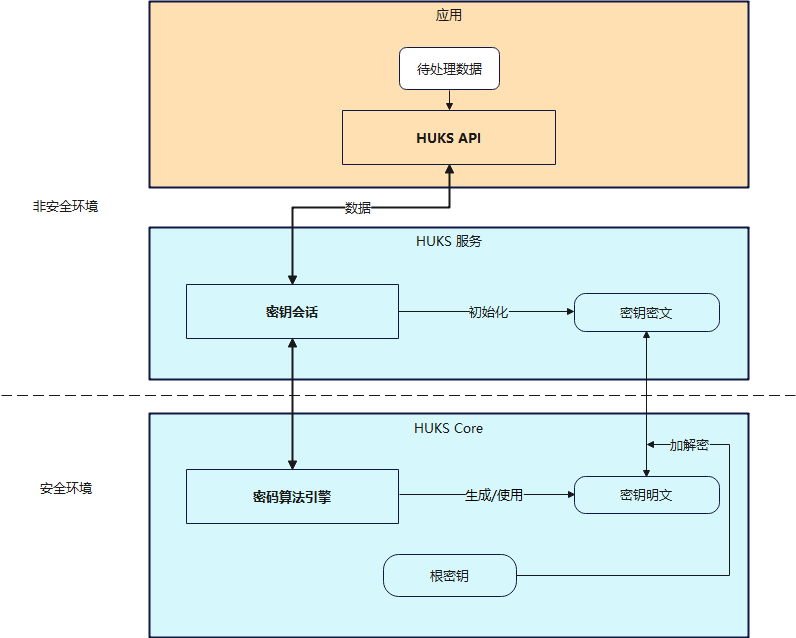

# 通用密钥库开发概述

## 简介

OpenHarmony通用密钥库系统（英文全称：Open**H**armony **U**niversal **K**ey**S**tore，以下简称HUKS）是OpenHarmony提供的系统级的密钥管理系统服务，提供密钥的全生命周期管理能力，包括密钥生成、密钥存储、密钥使用、密钥销毁等功能，以及对存储在HUKS中的密钥提供合法性证明。
HUKS基于系统安全能力，为业务提供密钥全生命周期的安全管理，业务无需自己实现，利用HUKS的系统能力，就能确保业务密钥的安全。

以下目录文档主要介绍了HUKS在典型场景下的用法、原理以及支持的密码算法规格。

- [生成新密钥](huks-guidelines.md#生成新密钥)
- [导入外部密钥](huks-guidelines.md#导入外部密钥)
- [常见密钥操作](huks-guidelines.md#常见密钥操作)
- [密钥访问控制](huks-guidelines.md#密钥访问控制)
- [密钥证明](huks-guidelines.md#密钥证明)
- [支持的算法类型及参数组合](huks-appendix.md#支持的算法类型及参数组合)
- [密钥材料格式](huks-appendix.md#密钥材料格式)

## 基本概念

在使用HUKS开发之前，建议了解以下基本概念：

- **HUKS Core**
  
  HUKS核心组件，承载HUKS的核心功能，包括密钥的密码学运算、明文密钥的加解密、密钥访问控制等。一般运行在设备的安全环境中（如TEE、安全芯片等，不同的厂商有所不同），保证密钥明文不出HUKS Core。

  
- **密钥会话** 

  应用通过指定密钥别名，给当前操作的密钥建立一个会话，HUKS为每个会话生成一个全局唯一的句柄值来索引该会话。它的作用是缓存密钥使用期间的信息，包括操作数据、密钥信息、访问控制属性等。密钥操作一般需要经过**建立会话、传入数据和参数、结束会话（中止会话）** 三个阶段。

## 实现原理

HUKS的核心安全设计包括以下几点：
- **密钥不出安全环境**

  HUKS的核心特点是密钥全生命周期明文不出HUKS Core，在有硬件条件的设备上，如有TEE（Trusted Execution Environment)或安全芯片的设备，HUKS Core运行在硬件安全环境中。能确保即使REE（Rich Execution Environment）环境被攻破，密钥明文也不会泄露。
- **系统级安全加密存储**

  基于设备根密钥加密业务密钥，在有条件的设备上，叠加用户口令加密保护密钥。
- **严格的访问控制**

  只有合法的业务才有权访问密钥，同时支持用户身份认证访问控制以支持业务的高安敏感场景下安全访问密钥的诉求。
- **密钥的合法性证明**

  可为业务提供硬件厂商级别的密钥的合法性证明，证明密钥没有被篡改，并确实存在于有硬件保护的HUKS Core中，以及拥有正确的密钥属性。

此外，密钥会话是HUKS中承载密钥使用的基础，它的主要作用是初始化密钥信息、缓存业务数据等。对数据的密码学运算和对密钥密文的加解密都是在HUKS Core中进行，以此保证密钥明文和运算过程的安全。

**图1** HUKS运行机制

## 约束与限制

  - **基于别名的访问**
      
    由于密钥材料不出HUKS的限制，应用只能以别名的方式访问密钥材料，而且密钥的别名必须保证应用内唯一(否则已存在的同别名密钥会被覆盖），长度不能超过64个字节。
    
  - **数据分片大小限制** 
  
    所有数据需要经过IPC通道传输到HUKS，受IPC缓冲区大小限制，建议对总大小超过100K的数据进行分片传输，且分片大小不超过100K。
    
  - **指定必选参数** 

    在**生成密钥或导入密钥时**，必须指定密码算法、密钥大小和使用目的参数，其他参数可选（如工作模式、填充模式、散列算法等），但是在**使用密钥**时必须传入密码算法相关的完整的参数。
    
  - **密钥材料格式** 
  
    导入/导出密钥时（包括密钥对、公钥、私钥），密钥材料的数据格式必须满足HUKS要求的格式，具体各个密码算法密钥材料见[密钥材料格式](huks-appendix.md#密钥材料格式)。

