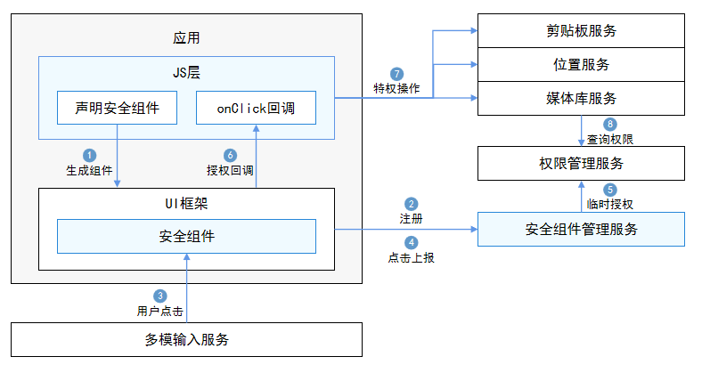

# 安全控件开发概述

安全控件是OpenHarmony提供的一组系统实现的ArkUI组件。当用户点击了这类组件后，应用将被授予临时授权，应用开发者仅需要像使用Button等组件那样集成到应用自己的页面即可。

当前提供了三种安全控件：

- 位置控件：获取精准定位授权。

- 粘贴控件：获取读取剪贴板授权。

- 保存控件：获取媒体库写入授权。

安全控件可以作为一种"特殊的按钮"融入应用页面，无需向用户弹窗授权，实现用户点击即许可的设计思路。精准的场景可以避免权限的滥用，保护用户隐私，同时也减少了弹窗对用户的干扰。

应用集成安全控件后，注册OnClick回调监听用户点击。当用户点击后，安全控件底层将申请权限，并将结果返回给应用。如果成功，应用可以临时使用需要特权的接口。

说明：不同类型的安全控件，对于权限的使用方式不同、授权的有效期也不同，详情请参考开发指导。

安全控件因其自动授权的特性，为了保障用户的隐私不被恶意应用获取，针对安全控件作了很多的限制，例如尺寸不能过小、颜色不能透明、不能被遮挡或者显示不全等等，确保安全控件是可见的且用户能够识别的，所以三方开发者需要合理的配置控件的尺寸、颜色等属性，避免视觉混淆的情况，如果发生因控件的样式不合法导致授权失败的情况，请检查设备错误日志，过滤关键字"SecurityComponentCheckFail"可以获取具体原因。

可能出现的问题（包括但不限于）：

1. 字体、图标尺寸过小。
2. 安全控件整体尺寸过大。
3. 字体、图标、背景按钮的颜色透明度过高。
4. 字体或图标与背景按钮颜色过于相似。
5. 安全控件超出屏幕、超出窗口等导致显示不全。
6. 安全控件被其他组件或窗口遮挡。
7. 安全控件的父组件有类似变形模糊等可能导致安全控件显示不完整的属性。

## 技术框架

安全控件特性有2个主要部件构成。

- 安全控件实现：
  集成在ArkUI中，提供ETS接口负责安全控件的生成、属性配置、布局、绘制、点击回调、销毁等功能。

- 安全控件管理服务：
  独立的服务进程，负责安全控件的注册、临时授权、取消授权、取消注册等管理，以及合法性检查。

## 运作流程

1. 应用开发者在ETS文件中集成安全控件，通过JS引擎解析后，在ArkUI框架中生成具体的控件。

2. 安全控件注册控件信息到安全控件管理服务，安全控件管理服务检查控件信息的合法性。

3. 用户点击事件分发到安全控件。

4. 安全控件将点击事件上报到安全控件管理服务。

5. 安全控件管理服务根据控件种类对应不同权限，调用权限管理服务进行临时授权。

6. 授权成功后，安全控件回调OnClick通知应用层授权成功。

7. 应用调用相应的特权操作，如获取地理位置、读取剪贴板信息、媒体库中创建文件等。

8. 对应的服务会调用权限管理服务或安全控件管理服务，获取授权结果，返回鉴权结果。

## 约束与限制

应用开发者需尽量保证安全控件在应用界面上清晰可见，防止因覆盖、混淆等因素导致授权失败。
