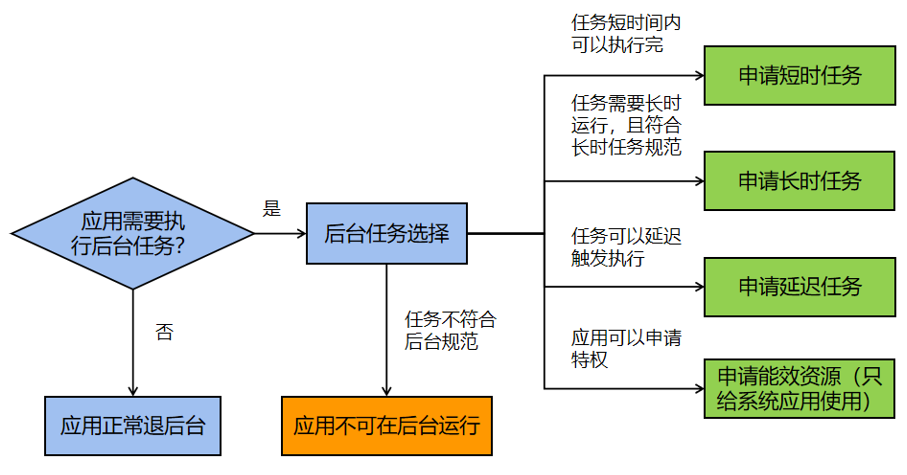

<!--RP1-->
# 后台任务总体概述<!--RP1End-->

## 功能介绍

设备返回主界面、锁屏、应用切换等操作会使应用退至后台。应用退至后台后，如果继续活动，可能会造成设备耗电快、用户界面卡顿等现象。为了降低设备耗电速度、保障用户使用流畅度，系统会对退至后台的应用进行管控，包括进程挂起和进程终止。挂起后，应用进程无法使用软件资源（如公共事件、定时器等）和硬件资源（CPU、网络、GPS、蓝牙等）。<!--RP2--><!--RP2End-->

- 应用退至后台一小段时间（由系统定义），应用进程会被挂起。

- 应用退至后台，在后台被访问一小段时间（由系统定义）后，应用进程会被挂起。

- 资源不足时，系统会终止部分应用进程（即回收该进程的所有资源）。

同时，为了保障后台音乐播放、日历提醒等功能的正常使用，系统提供了规范内受约束的后台任务，扩展应用在后台运行时间。

## 资源使用约束
对于运行的进程，系统会给予一定的资源配额约束，包括进程在连续一段时间内内存的使用、<!--RP3-->CPU使用占比<!--RP3End-->，以及24小时磁盘写的IO量，均有对应的配额上限。超过配额上限时，如果进程处于前台，系统会有对应的warning日志，如果进程处于后台，系统会终止该进程。

## 后台任务类型

标准系统支持规范内受约束的后台任务，包括短时任务、长时任务、延迟任务、代理提醒和能效资源。

开发者可以根据如下的功能介绍，选择合适的后台任务，以满足应用退至后台后继续运行的需求。

- **短时任务**：适用于实时性要求高、耗时不长的任务，例如状态保存。

- **长时任务**：适用于长时间运行在后台、用户可感知的任务，例如后台播放音乐、导航、设备连接等，使用长时任务避免应用进程被挂起。

- **延迟任务**：对于实时性要求不高、可延迟执行的任务，系统提供了延迟任务，即满足条件的应用退至后台后被放入执行队列，系统会根据内存、功耗等统一调度。

- **代理提醒**：代理提醒是指应用退后台或进程终止后，系统会代理应用做相应的提醒。适用于定时提醒类业务，当前支持的提醒类型包括倒计时、日历和闹钟三类。

<!--Del-->
同时，对于提供基础能力的系统应用，系统单独提供[能效资源申请](efficiency-resource-request.md)接口。应用调用能效资源接口后，系统对应用进行一定的管控豁免。<!--DelEnd-->

  **图1** 后台任务类型选择  

> **说明：**
>
> 1. 系统仅支持规范内受约束的后台任务。应用退至后台后，若未使用规范内的后台任务或选择的后台任务类型不正确，对应的应用进程会被挂起或终止。
> 
> 2. 应用申请了规范内的后台任务，仅会提升应用进程被回收的优先级。当系统资源严重不足时，即使应用进程申请了规范内的后台任务，系统仍会终止部分进程，用以保障系统稳定性。