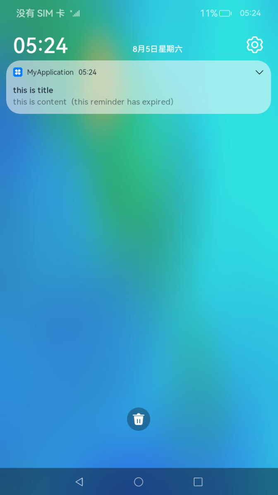

# 后台代理提醒开发指导


## 接口说明

后台代理提醒功能主要提供后台提醒通知发布接口，开发者可调用这些接口创建定时提醒，包括倒计时、日历、闹钟三种提醒类型。[reminderAgentManager](https://gitee.com/openharmony/docs/blob/master/zh-cn/application-dev/reference/apis/js-apis-reminderAgentManager.md)封装了发布、取消提醒通知的方法。

  **表1** reminderAgentManager主要接口

| 接口名                                      | 描述                                       |
| ---------------------------------------- | ---------------------------------------- |
| publishReminder(reminderReq:&nbsp;ReminderRequest,&nbsp;callback:&nbsp;AsyncCallback&lt;number&gt;):&nbsp;void<br/>publishReminder(reminderReq:&nbsp;ReminderRequest):&nbsp;Promise&lt;number&gt; | 发布一个定时提醒类通知。<br/>-&nbsp;单个应用有效的提醒个数最多支持30个（不包括已经超时，即后续不会再提醒的提醒实例）。<br/>-&nbsp;整个系统有效的提醒个数最多支持2000个（不包括已经超时，即后续不会再提醒的提醒实例）。 |
| cancelReminder(reminderId:&nbsp;number,&nbsp;callback:&nbsp;AsyncCallback&lt;void&gt;):&nbsp;void<br/>cancelReminder(reminderId:&nbsp;number):&nbsp;Promise&lt;void&gt; | 取消一个指定的提醒类通知（reminderId从publishReminder的返回值获取）。 |
| getValidReminders(callback:&nbsp;AsyncCallback&lt;Array&lt;ReminderRequest&gt;&gt;):&nbsp;void<br/>getValidReminders():&nbsp;Promise&lt;Array&lt;ReminderRequest&gt;&gt; | 获取当前应用设置的所有有效的提醒。                        |
| cancelAllReminders(callback:&nbsp;AsyncCallback&lt;void&gt;):&nbsp;void<br/>cancelAllReminders():&nbsp;Promise&lt;void&gt; | 取消当前应用设置的所有提醒。                           |
| addNotificationSlot(slot:&nbsp;NotificationSlot,&nbsp;callback:&nbsp;AsyncCallback&lt;void&gt;):&nbsp;void<br/>addNotificationSlot(slot:&nbsp;NotificationSlot):&nbsp;Promise&lt;void&gt; | 注册一个提醒类需要使用的NotificationSlot。            |
| removeNotificationSlot(slotType:&nbsp;notification.SlotType,&nbsp;callback:&nbsp;AsyncCallback&lt;void&gt;):&nbsp;void<br/>removeNotificationSlot(slotType:&nbsp;notification.SlotType):&nbsp;Promise&lt;void&gt; | 删除指定类型的NotificationSlot。                 |


## 开发步骤

1. 申请`ohos.permission.PUBLISH_AGENT_REMINDER`权限，配置方式请参阅[访问控制授权申请指导](https://gitee.com/openharmony/docs/blob/master/zh-cn/application-dev/security/accesstoken-guidelines.md#stage%E6%A8%A1%E5%9E%8B)。

2. [使能通知开关](../notification/notification-enable.md)，获得用户授权后，才能使用代理提醒功能。

3. 导入模块。

   ```js
   import reminderAgentManager from '@ohos.reminderAgentManager';
   import NotificationManager from '@ohos.notificationManager';
   ```

4. 定义目标提醒代理。开发者根据实际需要，选择定义如下类型的提醒。
   - 定义倒计时实例。

      ```js
      let targetReminderAgent: reminderAgentManager.ReminderRequestTimer = {
        reminderType: reminderAgentManager.ReminderType.REMINDER_TYPE_TIMER, // 提醒类型为倒计时类型
        triggerTimeInSeconds: 10,
        actionButton: [ // 设置弹出的提醒通知信息上显示的按钮类型和标题，支持“关闭”和“延迟”两种类型，其中“延迟”按钮类型需要与snoozeTimes和timeInterval参数结合使用
          {
            title: 'close',
            type: reminderAgentManager.ActionButtonType.ACTION_BUTTON_TYPE_CLOSE
          }
        ],
        wantAgent: { // 点击提醒通知后跳转的目标UIAbility信息
          pkgName: 'com.example.myapplication',
          abilityName: 'EntryAbility'
        },
        maxScreenWantAgent: { // 全屏显示提醒到达时自动拉起的目标Ability信息
          pkgName: 'com.example.myapplication',
          abilityName: 'EntryAbility'
        },
        title: 'this is title', // 指明提醒标题
        content: 'this is content', // 指明提醒内容
        expiredContent: 'this reminder has expired', // 指明提醒过期后需要显示的内容
        notificationId: 100, // 指明提醒使用的通知的ID号，相同ID号的提醒会覆盖
        slotType: NotificationManager.SlotType.SOCIAL_COMMUNICATION // 指明提醒的Slot类型
      }
      ```
   - 定义日历实例。

      ```js
      let targetReminderAgent: reminderAgentManager.ReminderRequestCalendar = {
        reminderType: reminderAgentManager.ReminderType.REMINDER_TYPE_CALENDAR, // 提醒类型为日历类型
        dateTime: { // 指明提醒的目标时间
          year: 2023,
          month: 7,
          day: 30,
          hour: 11,
          minute: 14,
          second: 30
        },
        repeatMonths: [1], // 指明重复提醒的月份
        repeatDays: [1], // 指明重复提醒的日期
        actionButton: [ // 设置弹出的提醒通知信息上显示的按钮类型和标题，支持“关闭”和“延迟”两种类型，其中“延迟”按钮类型需要与snoozeTimes和timeInterval参数结合使用
          {
            title: 'close',
            type: reminderAgentManager.ActionButtonType.ACTION_BUTTON_TYPE_CLOSE
          },
          {
            title: 'snooze',
            type: reminderAgentManager.ActionButtonType.ACTION_BUTTON_TYPE_SNOOZE
          },
        ],
        wantAgent: { // 点击提醒通知后跳转的目标UIAbility信息
          pkgName: 'com.example.myapplication',
          abilityName: 'EntryAbility'
        },
        maxScreenWantAgent: { // 点击提醒通知后跳转的目标UIAbility信息
          pkgName: 'com.example.myapplication',
          abilityName: 'EntryAbility'
        },
        ringDuration: 5, // 指明响铃时长（单位：秒）
        snoozeTimes: 2, // 指明延迟提醒次数
        timeInterval: 5, // 执行延迟提醒间隔（单位：秒）
        title: 'this is title', // 指明提醒标题
        content: 'this is content', // 指明提醒内容
        expiredContent: 'this reminder has expired', // 指明提醒过期后需要显示的内容
        snoozeContent: 'remind later', // 指明延迟提醒时需要显示的内容
        notificationId: 100, // 指明提醒使用的通知的ID号，相同ID号的提醒会覆盖
        slotType: NotificationManager.SlotType.SOCIAL_COMMUNICATION // 指明提醒的Slot类型
      }
      ```
   - 定义闹钟实例。

      ```js
      let targetReminderAgent: reminderAgentManager.ReminderRequestAlarm = {
        reminderType: reminderAgentManager.ReminderType.REMINDER_TYPE_ALARM, // 提醒类型为闹钟类型
        hour: 23, // 指明提醒的目标时刻
        minute: 9, // 指明提醒的目标分钟
        daysOfWeek: [2], // 指明每周哪几天需要重复提醒
        actionButton: [ // 设置弹出的提醒通知信息上显示的按钮类型和标题，支持“关闭”和“延迟”两种类型，其中“延迟”按钮类型需要与snoozeTimes和timeInterval参数结合使用
          {
            title: 'close',
            type: reminderAgentManager.ActionButtonType.ACTION_BUTTON_TYPE_CLOSE
          },
          {
            title: 'snooze',
            type: reminderAgentManager.ActionButtonType.ACTION_BUTTON_TYPE_SNOOZE
          },
        ],
        wantAgent: { // 点击提醒通知后跳转的目标UIAbility信息
          pkgName: 'com.example.myapplication',
          abilityName: 'EntryAbility'
        },
        maxScreenWantAgent: { // 点击提醒通知后跳转的目标UIAbility信息
          pkgName: 'com.example.myapplication',
          abilityName: 'EntryAbility'
        },
        ringDuration: 5, // 指明响铃时长（单位：秒）
        snoozeTimes: 2, // 指明延迟提醒次数
        timeInterval: 5, // 执行延迟提醒间隔（单位：秒）
        title: 'this is title', // 指明提醒标题
        content: 'this is content', // 指明提醒内容
        expiredContent: 'this reminder has expired', // 指明提醒过期后需要显示的内容
        snoozeContent: 'remind later', // 指明延迟提醒时需要显示的内容
        notificationId: 99, // 指明提醒使用的通知的ID号，相同ID号的提醒会覆盖
        slotType: NotificationManager.SlotType.SOCIAL_COMMUNICATION // 指明提醒的Slot类型
      }
      ```

5. 发布相应的提醒代理。代理发布后，应用即可使用后台代理提醒功能。

   ```js
   try {
     reminderAgentManager.publishReminder(targetReminderAgent).then(res => {
       console.info('publishReminder promise reminderId: ' + res);
       let reminderId: number = res;
       // ...
     }).catch(err => {
       console.info('publishReminder err code: ' + err.code + ' message:' + err.message);
     })
   } catch (error) {
     console.info('publishReminder code: ' + error.code + ' message:' + error.message);
   }
   ```

   以闹钟为例，运行效果如下图所示。

   

6. 若需要删除提醒任务，可以通过调用[reminderAgentManager.cancelReminder()](https://gitee.com/openharmony/docs/blob/master/zh-cn/application-dev/reference/apis/js-apis-reminderAgentManager.md#reminderagentmanagercancelreminder)方法来实现。

   ```js
   let reminderId = 0; // reminderId的值从发布提醒代理成功之后的回调中获得

   try {
       reminderAgentManager.cancelReminder(reminderId).then(() => {
           console.log("cancelReminder promise");
       }).catch(err => {
           console.log("promise err code: " + err.code + ", message:" + err.message);
       });
   } catch (error) {
       console.log("cancelReminder code: " + error.code + ", message: " + error.message);
   };
   ```
