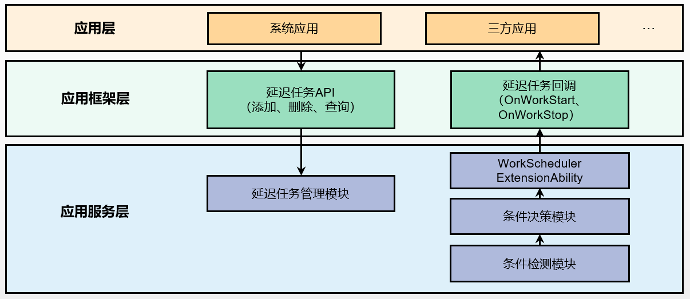

# 延迟任务回调能力开发指导（WorkSchedulerExtensionAbility）

对于实时性要求不高的任务或持久性任务，可以使用延迟任务，该机制会在应用满足应用设定条件（包括网络类型、充电类型、存储状态、电池状态、定时状态）时，根据系统当前状态，由系统统一决策调度时间。

WorkSchedulerExtensionAbility提供了延迟任务回调能力，在延迟任务开始和结束时，系统会调用回调接口来处理任务逻辑，开发者可在回调接口里面编写自己的任务逻辑。

## 运作机制

延迟任务调度运作机制如图1所示。

  **图1** 延迟任务调度运作机制 



应用通过[延迟任务API](../reference/apis/js-apis-resourceschedule-workScheduler.md)注册、删除、查询任务。
应用服务侧进行条件检测和判断，若满足条件，则回调WorkSchedulerExtensionAbility拉起应用，执行onWorkStart、onWorkStop回调接口。

## 接口说明

WorkSchedulerExtensionAbility类拥有如下API接口，具体的API介绍详见[接口文档](../reference/apis/js-apis-WorkSchedulerExtensionAbility.md)。

| 接口名 | 描述 |
| -------- | -------- |
| onWorkStart(work: workScheduler.WorkInfo): void | 延迟任务调度开始回调。 |
| onWorkStop(work: workScheduler.WorkInfo): void | 延迟任务调度结束回调。 |

## 开发步骤

在DevEco Studio工程中新建一个WorkScheduler工程，主要涉及如下关键步骤：

- [实现延迟任务回调拓展能力](#实现延迟任务回调拓展能力)：开发延迟任务生命周期回调接口WorkSchedulerExtensionAbility。

- [实现延迟任务调度能力](#实现延迟任务调度能力)：开发延迟任务API，实现延迟任务注册、停止等功能。

- [配置文件](#配置文件)：配置应用配置文件module.json5。

### 实现延迟任务回调拓展能力

1. 在工程根目录新建Module，模板选择为Ohos Library，命名为library。

2. 在library对应的ets目录(./library/src/main/ets)下，新建ArkTS文件并命名为workAbility.ets，用于实现延迟任务回调接口。

    导入模块。

    ```ts
    import WorkSchedulerExtensionAbility from '@ohos.WorkSchedulerExtensionAbility';
    ```

    实现WorkSchedulerExtension生命周期接口。

    ```ts
    export default class workAbility extends WorkSchedulerExtensionAbility {
      // 延迟任务开始回调
      onWorkStart(workInfo) {
        console.log(`onWorkStart CommonEvent publish start ${JSON.stringify(workInfo)}`);
        // 发送升级通知
        let notificationRequest = notification.getNotificationContentBasic('upgrade', upgradeMessage, '');
        notification.publish(notificationRequest, (err) => {
          if (err) {
            console.log(`onWorkStart notification publish err ${JSON.stringify(err)}`);
          }
          console.log(`onWorkStart notification publish success`);
        });
      }

      // 延迟任务结束回调
      onWorkStop(workInfo) {
        // 发送升级完成通知
        let notificationRequest = notification.getNotificationContentBasic('upgrade', 'upgrade success', '');
        notification.publish(notificationRequest, (err) => {
          if (err) {
            console.log(`onWorkStop notification publish err ${JSON.stringify(err)}`);
          }
          console.log(`onWorkStop notification publish success`);
        });
      }
    }
    ```

3. 在工程entry Module对应的ets目录(./entry/src/main/ets)下，新建一个目录并命名为workAbility。
   在workAbility目录下，新建一个ArkTS文件并命名为WorkTest.ets，实现延迟任务回调接口。

    导入模块。

    ```ts
    import { workAbility } from '@ohos/library'
    ```

    继承workAbility，实现WorkSchedulerExtension生命周期接口。

    ```ts
    export default class WorkTest extends workAbility {
      onWorkStart(workInfo) {
        console.log(`onWorkStartTest start ${JSON.stringify(workInfo)}`);
        super.onWorkStart(workInfo);
      }
   
      onWorkStopTest(workInfo) {
        super.onWorkStop(workInfo);
        console.log(`onWorkStop value`);
      }
    }
    ```

### 实现延迟任务调度能力

1. 在library对应的ets目录(./library/src/main/ets)下，新建TypeScript文件并命名为DelayWork.ts，用于实现延迟任务API。

    导入模块。

    ```ts
    import workScheduler from '@ohos.resourceschedule.workScheduler';
    ```

    封装延迟任务注册、停止接口。

    ```ts
    export default class DelayWork {
      private workInfo = {
        workId: 1,
        networkType: workScheduler.NetworkType.NETWORK_TYPE_WIFI,
        bundleName: '',
        abilityName: ''
      }
      // 注册延迟任务
      startWork(bundleName: string, abilityName: string) {
        this.workInfo.bundleName = bundleName;
        this.workInfo.abilityName = abilityName;
        try {
          workScheduler.startWork(this.workInfo);
          console.log(`startWork success`);
        } catch (error) {
          Logger.error(TAG, `startWork startwork failed. code is ${error.code} message is ${error.message}`);
          prompt.showToast({
            message: `${error.message}`
          });
        }
      }

      // 停止延迟任务
      stopWork(bundleName: string, abilityName: string) {
        this.workInfo.bundleName = bundleName;
        this.workInfo.abilityName = abilityName;
        workScheduler.stopWork(this.workInfo, false);
        console.log(`stopWork`);
      }
    }
    ```

2. 在工程entry Module对应的index页面(./entry/src/main/ets/pages/index.ets)下，增加“升级”按钮，调用library封装的延迟任务注册接口。

    导入模块。

    ```ts
    import { workAbility } from '@ohos/library';
    ```

    增加“升级”按钮，调用library封装的延迟任务注册接口，传入bundleName和abilityName，其中abilityName为WorkTest。

    ```ts
    Button($r('app.string.upgrade'))
      .width('60%')
      .height(40)
      .fontSize(30)
      .onClick(() => {
        this.work.startWork('ohos.samples.workscheduler', 'WorkTest');
      });
    ```

    在组件析构时，调用延迟任务停止接口。

    ```ts
    aboutToDisappear() {
      this.work.stopWork('ohos.samples.workscheduler', 'WorkTest');
    }
    ```

### 配置文件

1. 在工程entry Module对应的[module.json5配置文件](../quick-start/module-configuration-file.md)中注册WorkSchedulerExtensionAbility，type标签需要设置为“workScheduler”，srcEntry标签表示当前ExtensionAbility组件所对应的代码路径。
   
  ```json
  {
    "module": {
        "extensionAbilities": [
          {
            "name": "WorkTest",
            "srcEntry": "./ets/workAbility/WorkTest.ets",
            "label": "$string:WorkSchedulerExtensionAbility_label",
            "description": "$string:WorkSchedulerExtensionAbility_desc",
            "type": "workScheduler"
          }
        ]
    }
  }
  ```

## 限制

为了降低WorkSchedulerExtensionAbility能力被三方应用滥用的风险，在WorkSchedulerExtensionAbility中限制以下接口的调用

- @ohos.backgroundTaskManager.d.ts
- @ohos.resourceschedule.backgroundTaskManager.d.ts
- @ohos.multimedia.camera.d.ts
- @ohos.multimedia.audio.d.ts
- @ohos.multimedia.media.d.ts

## 相关实例

针对WorkSchedulerExtensionAbility开发，有以下相关示例可供参考：

- [WorkScheduler的创建与使用（ArkTS）（API9）](https://gitee.com/openharmony/applications_app_samples/tree/master/code/BasicFeature/TaskManagement/WorkScheduler)

