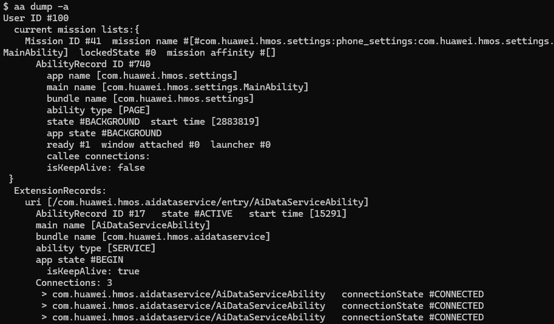
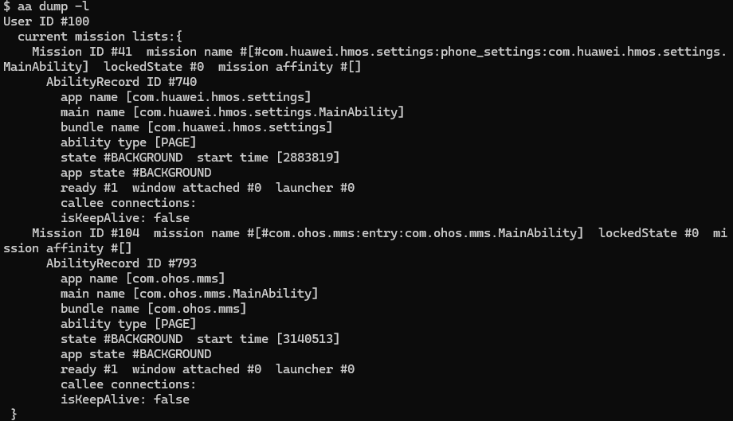
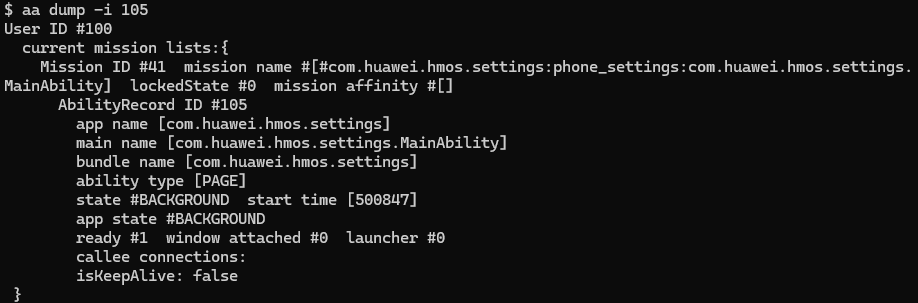

# aa工具


Ability assistant（Ability助手，简称为aa），是用于启动应用和启动测试用例的工具，为开发者提供基本的应用调试和测试能力，例如启动应用组件、强制停止进程、打印应用组件相关信息等。

> **说明：**
>
> 在使用本工具前，开发者需要先获取<!--Del-->[<!--DelEnd-->hdc工具<!--Del-->](../../device-dev/subsystems/subsys-toolchain-hdc-guide.md)<!--DelEnd-->，执行hdc shell。


## help
  用于显示aa相关的帮助信息。

  **返回值**：

  返回对应的帮助信息。

  **使用方法**：

  
  ```bash
  aa help
  ```


## start
  用于启动一个应用组件，目标组件可以是FA模型的PageAbility和ServiceAbility组件，也可以是Stage模型的UIAbility和ServiceExtensionAbility组件，且目标组件相应配置文件中的exported标签不能配置为false。

  | 参数 | 参数说明              |
  | -------- |-------------------|
  | -h/--help | 帮助信息。             |
  | -d | 可选参数，deviceId。    |
  | -a | 可选参数，abilityName。 |
  | -b | 可选参数，bundleName。  |
  | -m | 可选参数，moduleName。  |
  | -U | 可选参数，URI。         |
  | -A | 可选参数，action。      |
  | -e | 可选参数，entity。      |
  | -t | 可选参数，type。        |
  | -S | 可选参数，调试时是否进入应用沙箱。携带该参数代表进入，不携带代表不进入。 |
  | --pi  | 可选参数，整形类型键值对。     |
  | --pb  | 可选参数，布尔类型键值对。     |
  | --ps  | 可选参数，字符串类型键值对。    |
  | --psn | 可选参数，空字符串关键字。     |
  | --wl | 可选参数，windowLeft，窗口左边距，单位px。<br>**约束：**<br>仅当2in1设备处于开发者模式下，且被启动应用采用调试签名时，该字段生效。|
  | --wt | 可选参数，windowTop，窗口上边距，单位px。<br>**约束：**<br>仅当2in1设备处于开发者模式下，且被启动应用采用调试签名时，该字段生效。|
  | --wh | 可选参数，windowHeight，窗口高度，单位px。<br>**约束：**<br>仅当2in1设备处于开发者模式下，且被启动应用采用调试签名时，该字段生效。|
  | --ww | 可选参数，windowWidth，窗口宽度，单位px。<br>**约束：**<br>仅当2in1设备处于开发者模式下，且被启动应用采用调试签名时，该字段生效。|
  | -D | 可选参数，调试模式。        |
  | -p | 可选参数，调优命令。命令由调用方自定义。        |

  **返回值**：

  当启动成功时，返回"start ability successfully."；当启动失败时，返回"error: failed to start ability."，同时会包含相应的失败信息。

  **使用方法**：

  
  ```bash
  # 显示启动Ability
  aa start [-d <deviceId>] [-a <abilityName> -b <bundleName>] [-m <moduleName>] [-D] [-S] [--pi <key> <integer-value>] [--pb <key> <bool-value: true/false/t/f大小写不敏感] [--ps <key> <value>] [--psn <key>] [--wl <windowLeft>] [--wt <windowTop>] [--wh <windowHeight>] [--ww <windowWidth>] [-p <perf-cmd>]
  
  # 隐式启动Ability。如果命令中的参数都不填，会导致启动失败。
  aa start [-d <deviceId>] [-U <URI>] [-t <type>] [-A <action>] [-e <entity>] [-D] [--pi <key> <integer-value>] [--pb <key> <bool-value: true/false/t/f大小写不敏感] [--ps <key> <value>] [--psn <key>] [--wl <windowLeft>] [--wt <windowTop>] [--wh <windowHeight>] [--ww <windowWidth>] [-p <perf-cmd>]
  ```

  **示例**：

以隐式启动Ability为例。
  > **说明：**
  > 
  > 本例中仅介绍了部分字段的使用。关于Ability匹配的详细规则参考[显式Want与隐式Want匹配规则](../application-models/explicit-implicit-want-mappings.md)。


  - **目标应用**：修改module.json5配置，为目标Ability配置uris。

      ```json
      {
        "name": "TargetAbility",
        ......
        "exported": true,
        "skills": [
          {
            "actions":[
              "ohos.want.action.viewData"
            ],
            "uris":[
              {
                "scheme": "myscheme",
                "host": "www.test.com",
                "port": "8080",
                "path": "path",
              }
            ]
          }
        ]
      }
      ```


  - **拉起方应用**: 隐式启动Ability。

    - 如果需要拉起应用的页面，可以使用-U命令，示例如下：

        ```bash
        aa start -U myscheme://www.test.com:8080/path
        ```

    - 在上述基础上，如果需要携带参数，可以使用如下命令：

        ```bash
        aa start -U myscheme://www.test.com:8080/path --pi paramNumber 1 --pb paramBoolean true --ps paramString teststring  --psn paramNullString
        ```

      UIAbility获取传入参数示例如下：
  
        ```ts
        import UIAbility from '@ohos.app.ability.UIAbility';
        import hilog from '@ohos.hilog';
        import Want from '@ohos.app.ability.Want';

        export default class TargetAbility extends UIAbility {
          onCreate(want:Want, launchParam) {
            hilog.info(0x0000, 'testTag', '%{public}s', 'Ability onCreate');
            let paramNumber = want.parameters.paramNumber
            let paramBoolean = want.parameters.paramBoolean
            let paramString = want.parameters.paramString
            let paramNullString = want.parameters.paramNullString
          }
        }
        ```

    - 如果需要拉起浏览器并跳转指定页面，可以使用-A -U命令，示例如下：

      本例中以`https://www.example.com`为例，请根据实际情况替换为真实的网址。

        ```bash
        aa start -A ohos.want.action.viewData -U https://www.example.com
        ```


## stop-service
  用于停止ServiceAbility。

  | 参数 | 参数说明 |
  | -------- | -------- |
  | -h/--help | 帮助信息。 |
  | -d | 可选参数，deviceId。 |
  | -a | 必选参数，abilityName。 |
  | -b | 必选参数，bundleName。 |
  | -m | 可选参数，moduleName。 |

  **返回值**：

  当成功停止ServiceAbility时，返回"stop service ability successfully."；当停止失败时，返回"error: failed to stop service ability."。

  **使用方法**：

  
  ```bash
  aa stop-service [-d <deviceId>] -a <abilityName> -b <bundleName> [-m <moduleName>]
  ```

## dump<sup>(deprecated)</sup>
  > **说明：**
  >
  > aa dump命令从API version 7开始支持，从API version 9废弃，替换命令为[hidumper](../dfx/hidumper.md) -s AbilityManagerService。

  用于打印应用组件的相关信息。
  | 参数 | 二级参数 | 参数说明 |
  | -------- | -------- | -------- |
  | -h/--help | - | 帮助信息。 |
  | -a/--all | - | 打印所有mission内的应用组件信息。 |
  | -l/--mission-list | type（缺省打印全部） | 服务侧为了方便管理任务链，内部维护了4种类型的任务链。<br/>可取值：<br/>-&nbsp;NORMAL：正常启动的任务链(比如A拉起B拉起C, 则对应的任务链是A->B->C)<br/>-&nbsp;DEFAULT_STANDARD：已经被破坏的任务链中的任务, 启动模式为`multiton`的任务被放到该任务链中, 这里面的任务之间没有关联关系<br/>-&nbsp;DEFAULT_SINGLE：已经被破坏的任务链中的任务, 启动模式为`singleton`的任务被放到该任务链中, 这里面的任务之间没有关联关系<br/>-&nbsp;LAUNCHER：launcher的任务链 |
  | -e/--extension | elementName | 打印扩展组件信息。 |
  | -u/--userId | UserId | 打印指定UserId的栈信息，需要和其他参数组合使用，例如aa&nbsp;dump&nbsp;-a&nbsp;-u&nbsp;100、aa&nbsp;dump&nbsp;-d&nbsp;-u&nbsp;100。 |
  | -d/--data | - | 打印DataAbility相关信息。 |
  | -i/--ability | AbilityRecord&nbsp;ID | 打印指定应用组件详细信息。 |
  | -c/--client | - | 打印应用组件详细信息，需要和其他参数组合使用，例如aa&nbsp;dump&nbsp;-a&nbsp;-c、aa&nbsp;dump&nbsp;-i&nbsp;21&nbsp;-c。 |
  | -p/--pending | - | 打印pendingWant信息，需要和其他参数组合使用，例如aa&nbsp;dump&nbsp;-a&nbsp;-p。 |
  | -r/--process | - | 打印应用进程信息，需要和其他参数组合使用，例如aa&nbsp;dump&nbsp;-a&nbsp;-r。 |

  **使用方法**：

  
  ```bash
  aa dump -a
  ```

  

  
  ```bash
  aa dump -l
  ```

  

  
  ```bash
  aa dump -i 12
  ```

  

## force-stop
  通过bundleName强制停止一个进程。

  **返回值**：

  当成功强制停止该进程时，返回"force stop process successfully."；当强制停止失败时，返回"error: failed to force stop process."。

  **使用方法**：

  
  ```bash
  aa force-stop <bundleName>
  ```

## test

  根据所携带的参数启动测试框架。

  > **说明**：
  > 
  > 关于class、level、size、testType等参数的详细说明请参见<!--RP2-->[aa test命令执行配置参数](../application-test/arkxtest-guidelines.md#cmd执行)<!--RP2End-->。

  | 参数 | 参数说明 |
  | -------- | -------- |
  | -h/--help | 帮助信息。 |
  | -b | 必选参数，bundleName。 |
  | -s unittest | 必选参数，testRunner。 |
  | -p | 可选参数，testRunner的packageName。<br>**说明**：该可选参数仅可在FA模型下使用。 |
  | -m | 可选参数，testRunner的moduleName。<br>**说明**：该可选参数仅可在Stage模型下使用。 |
  | -s class | 可选参数，指定要执行的测试套或测试用例。 |
  | -s level | 可选参数，指定要执行用例的用例级别。 |
  | -s size | 可选参数，指定要执行用例的用例规模。 |
  | -s testType | 可选参数，指定要执行用例的用例类型。 |
  | -s timeout | 可选参数，测试用例执行的超时时间（单位ms），默认为5000。 |
  | -s \<any-key> | 可选参数，任意键值对。 |
  | -w | 可选参数，指定测试运行时间（单位ms）。 |
  | -D | 可选参数，调试模式。 |

  **返回值**：

  当成功启动测试框架时，返回"user test started."；当启动失败时，返回"error: failed to start user test."和对应的错误信息。

  **使用方法**：

  ```bash
  aa test -b <bundleName> [-m <module-name>] [-p <package-name>] [-s class <test-class>] [-s level <test-level>] [-s size <test-size>] [-s testType <test-testType>] [-s timeout <test-timeout>] [-s <any-key> <any-value>] [-w <wait-time>] -s unittest <testRunner>
  ```

## attach
  通过bundleName使指定应用进入调试模式。

  | 参数 | 参数说明              |
  | -------- |-------------------|
  | -h/--help | 帮助信息。             |
  | -b | 必选参数，bundleName。  |


  **返回值**：

  当应用成功进入调试模式时，返回"attach app debug successfully."；当给定参数不合法时，返回"fail: unknown option."并打印帮助信息。

  **使用方法**：

  
  ```bash
  aa attach -b <bundleName>
  ```

## detach
  通过bundleName使指定应用退出调试模式。

  | 参数 | 参数说明              |
  | -------- |-------------------|
  | -h/--help | 帮助信息。             |
  | -b | 必选参数，bundleName。  |


  **返回值**：

  当应用成功退出调试模式时，返回"detach app debug successfully."；当给定参数不合法时，返回"fail: unknown option."并打印帮助信息。

  **使用方法**：

  
  ```bash
  aa detach -b <bundleName>
  ```

## appdebug
  用于设置、取消设置应用等待调试状态，以及获取处于等待调试状态的应用包名和持久化信息。等待调试状态只对debug类型应用生效。appdebug的设置命令只对单个应用生效，当重复设置时，应用包名与持久化状态会替换成最新设置内容。

  | 参数 | 二级参数 | 参数说明 |
  | -------- | -------- | -------- |
  | -h/--help | - | 帮助信息。 |
  | -b/--bundlename | bundleName | 为指定应用设置等待调试状态。设置时，不会进行包名合法化的校验。 |
  | -p/--persist | - | 可选参数；持久化标志位，加入该参数，代表持续设置应用为等待调试状态，无论重启设备、重装应用都可以持续生效；不加入该参数，代表等待调试状态仅可以在重启设备前生效一次。需要和-b参数组合使用，例如：aa&nbsp;appdebug&nbsp;-b&nbsp;&lt;bundleName&gt;&nbsp;-p。 |
  | -c/--cancel | - | 取消等待调试状态。 |
  | -g/--get | - | 获取等待调试状态的应用包名和持久化信息。 |

  **返回值**：

  当执行成功时，返回"app debug successfully."；当执行失败时，返回"error: failed to app debug."；当失败原因为非开发者模式时，返回"error: not developer mode."。

  **使用方法**：

  ```bash
  # 显示帮助信息
  aa appdebug -h

  # 为指定应用设置等待调试状态
  aa appdebug -b <bundleName> [-p]

  # 取消等待调试状态
  aa appdebug -c

  # 获取等待调试状态的应用包名和持久化信息
  aa appdebug -g
  # 获取信息例： bundle name : com.example.publishsystem, persist : false
  ```

## process
  对应用进行调试或调优，IDE用该命令集成调试和调优工具。

  | 参数 | 参数说明 |
  | -------- | -------- |
  | -h/--help | 帮助信息。 |
  | -b | 必选参数，bundleName。 |
  | -a | 必选参数，abilityName。 |
  | -m | 可选参数，moduleName。 |
  | -p | 可选参数，调优命令，与-D必须二选一。命令由调用方自定义。 |
  | -D | 可选参数，调试命令，与-p必须二选一。命令由调用方自定义。 |
  | -S | 可选参数，进入应用沙箱。 |

  **返回值**：

  当执行成功时，返回"start native process successfully."；当执行失败时，返回"error: failed to start native process."；当给定参数不合法时，返回"error: option requires a value."并打印帮助信息。

  **使用方法**：

  ```bash
  # 显示帮助信息
  aa process -h

  # 调试应用
  aa process -b <bundleName> -a <abilityName> [-m <moduleName>] [-D <debug-cmd>] [-S]

  # 调优应用
  aa process -b <bundleName> -a <abilityName> [-m <moduleName>] [-p <perf-cmd>] [-S]
  ```
