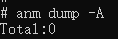

# anm工具

Advanced Notification Manager（通知管理工具，简称anm）是实现通知打印、设置通知参数等功能的工具，为开发者提供基本的通知调试和测试能力，例如打印已发布通知详细信息、设置通知缓存个数、使能通知等。

> **说明：**
>
> 在使用本工具前，开发者需要先获取<!--Del-->[<!--DelEnd-->hdc工具<!--Del-->](../../device-dev/subsystems/subsys-toolchain-hdc-guide.md)<!--DelEnd-->，执行hdc shell。
> 
> 当前工具仅支持在eng版本中使用，在user版本中使用会出现报错error: user version cannot use setting。


## help

* **介绍**

  打印帮助信息。

* **用法**

  ```bash
  anm help
  ```

## dump

* **介绍**

  打印通知相关信息。

* **用法**

  ```bash
  anm dump [<options>]
  ```

  参数如下表所示

  | 参数             | 参数说明                           |
  | ---------------- | ---------------------------------- |
  | -A/--active      | 打印所有活跃的通知信息             |
  | -R/--recent      | 打印最近的通知信息                 |
  | -D/--distributed | 打印来自其他设备的分布式通知信息   |
  | -b/--bundle      | 可选参数，设置指定的Bundle名称打印 |
  | -u/--user-id     | 可选参数，设置指定的用户ID打印     |
  | -h/--help        | 帮助信息                           |

* **示例**：打印活跃的通知信息

  ```bash
  anm dump -A
  ```
  

## Setting

* **介绍**

  设置通知参数。
* **用法**

  ```bash
  anm setting [<options>]
  ```

  参数如下表所示

  | 参数                     | 参数说明                             |
  | ------------------------ | ------------------------------------ |
  | -c/--recent-count        | 设置保存在内存中的最近通知的最大个数 |
  | -e/--enable-notification | 设置通知使能开关                     |
  | -h/--help                | 帮助信息                             |

* **示例**：设置保存在内存中的最近通知的最大数为100个

  ```bash
  anm setting -c 100
  ```
