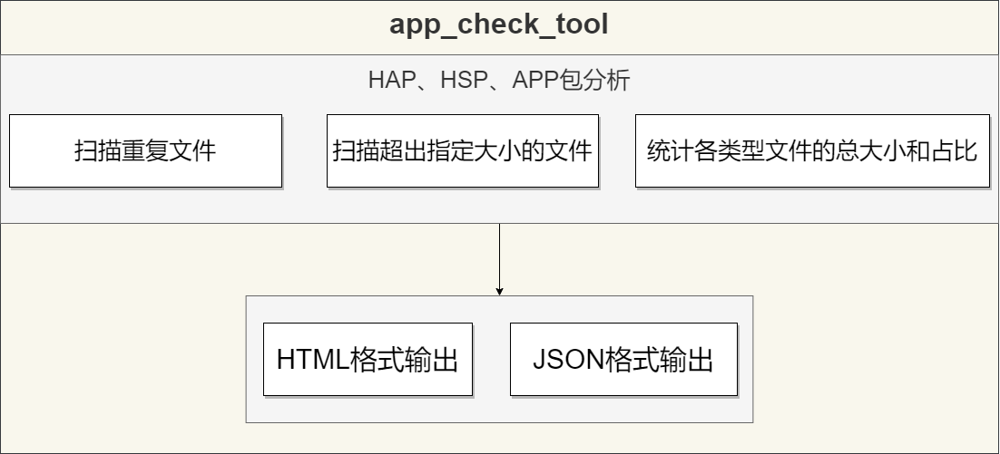

# 扫描工具

## 简介

扫描工具可用于分析检测应用安装包，根据不同的参数设定，扫描指定路径的HAP、HSP、App包内容并输出检测结果报告，为开发者优化包结构或排查问题提供数据支撑。目前扫描工具支持以下几种分析统计：
- 扫描重复文件。
- 扫描超出指定大小的文件。
- 统计分析各类型文件的总大小和占比。<br>

工具扫描结果默认以JSON和HTML两种文件格式输出。<br>
扫描工具app_check_tool.jar需要从SDK路径下的toolchains目录中获取。



## 约束与限制
- 扫描工具需运行在Java8及其以上环境。
- 扫描工具运行所在的目录需要有读写权限。

## 扫描重复文件示例

<b>命令示例：</b>

```
java -jar app_check_tool.jar --input ./test.app --out-path ./test --stat-duplicate true
```

<b>扫描重复文件指令参数说明</b>

| 指令             | 是否必选项 | 描述                                                               |
| ---------------- | ---------- | ------------------------------------------------------------------ |
| --input          | 是         | 指定传入的HAP、HSP、App包文件路径。                                |
| --out-path       | 是         | 指定结果输出文件夹目录。                                           |
| --stat-duplicate | 否         | 是否扫描重复文件。默认为false。<br>true：启用。<br>false：不启用。  |

<b>JSON统计结果：</b>

```
[{
    "taskType":1,
    "taskDesc":"find the duplicated files",
    "param":"--stat-duplicate",
    "startTime":"2023-11-17 14:48:01:265",
    "stopTime":"2023-11-17 14:48:01:434",
	"result":[{
        "md5":"975c41f5727b416b1ffefa5bb0f073b",
        "size":1108880,
        "files":[
            "/application-entry-default.hap/libs/armeabi-v7a/example.so",
            "/entry-default.hap/libs/armeabi-v7a/example.so"
        ]
    }]
}]
```

**扫描重复文件字段信息**

| 字段      | 类型   | 描述                        |
| --------- | ------ | --------------------------- |
| taskType  | int    | 取值为1，表示扫描重复文件。 |
| taskDesc  | String | 任务的详细描述。            |
| param     | String | 扫描程序传入参数。          |
| startTime | String | 任务开始时间。              |
| stopTime  | String | 任务结束时间。              |
| result    | Struct | [参考下表。](#section1)       |

**重复文件统计结果字段信息** <a name="section1"></a>

| 字段  | 类型            | 描述                       |
| ----- | --------------- | -------------------------- |
| md5   | String          | 相同文件的MD5值。          |
| size  | int             | 相同文件的大小。单位为Byte。 |
| files | Vector\<String> | 相同文件名的对应路径。     |

## 扫描超出指定大小的文件示例

<b>命令示例：</b>

```
java -jar app_check_tool.jar --input ./test.app --out-path ./test --stat-file-size 4
```

<b>扫描超出指定大小的文件的指令参数说明</b>

| 指令             | 是否必选项 | 描述                                                        |
| ---------------- | ---------- | ----------------------------------------------------------- |
| --input          | 是         | 指定传入的HAP、HSP、App包文件路径。                         |
| --out-path       | 是         | 指定结果输出文件夹目录。                                    |
| --stat-file-size | 否         | 扫描超过设定大小的文件，单位KB。 <br>范围为 0-4294967295 KB。 |

<b>JSON统计结果：</b>

```
[{
    "taskType":2,
    "taskDesc":"find files whose size exceed the limit size",
    "param":"--stat-file-size 4",
    "startTime":"2023-11-17 14:48:01:458",
    "stopTime":"2023-11-17 14:48:01:491",
    "result":[{
            "file":"/application-entry-default.hap/libs/x86_64/example.so",
            "size":1292840
    }]
}]
```


**扫描超出指定大小的文件字段信息**

| 字段      | 类型   | 描述                                |
| --------- | ------ | ----------------------------------- |
| taskType  | int    | 取值为2，表示扫描超出指定大小文件。 |
| taskDesc  | String | 任务的详细描述。                    |
| param     | String | 扫描程序传入参数。                  |
| startTime | String | 任务开始时间。                      |
| stopTime  | String | 任务结束时间。                      |
| result    | Struct | [参考下表。](#section2)               |

**超出指定大小的文件统计结果字段信息**<a name="section2"></a>

| 字段 | 类型   | 描述                                 |
| ---- | ------ | ------------------------------------ |
| file | String | 扫描的大文件的对应路径。             |
| size | int    | 扫描的大文件的对应大小，单位为Byte。 |

## 统计各类型文件大小占比示例

<b>命令示例：</b>

```
java -jar app_check_tool.jar --input ./test.app --out-path ./test --stat-suffix true
```

<b>统计各类型文件大小占比指令参数说明</b>

| 指令          | 是否必选项 | 描述                                                                      |
| ------------- | ---------- | ------------------------------------------------------------------------- |
| --input       | 是         | 指定传入的HAP、HSP、App包文件路径。                                       |
| --out-path    | 是         | 指定结果输出文件夹目录。                                                  |
| --stat-suffix | 否         | 是否统计各类型文件大小及占比。默认为false。<br>true：启用。<br>false：不启用。|

<b>JSON统计结果：</b>

```
[{
    "taskType":3,
    "taskDesc":"show files group by file type[.suffix]",
    "param":"--stat-suffix",
    "startTime":"2023-11-17 14:48:01:497",
    "stopTime":"2023-11-17 14:48:01:537",
    "pathList":[
        "test.app/application-entry-default.hap",
        "test.app/entry-default.hap"
    ],
    "result":[{
        "suffix":"so",
        "totalSize":1292840,
        "files":[{
            "compress":"false",
            "file":"/application-entry-default.hap/libs/x86_64/example.so",
            "size":1292840
        }]
    },
    {
        "suffix":"abc",
        "totalSize":84852,
        "files":[{
            "file":"/application-entry-default.hap/ets/modules.abc",
            "size":76304
        },
        {
            "file":"/entry-default.hap/ets/modules.abc",
            "size":8548
        }]
    }]
}]
```


**统计各类型文件大小占比字段信息**

| 字段      | 类型            | 描述                                                                                   |
| --------- | --------------- | -------------------------------------------------------------------------------------- |
| taskType  | int             | 取值为3，表示统计各类型文件大小占比。                                                  |
| taskDesc  | String          | 任务的详细描述。                                                                       |
| param     | String          | 扫描程序传入参数。                                                                     |
| startTime | String          | 任务开始时间。                                                                         |
| stopTime  | String          | 任务结束时间。                                                                         |
| pathList  | Vector\<String> | 多个HAP、HSP包的路径。                                                                  |
| result    | Struct          | [参考下表。](#section3)                                                                  |

**各类型文件大小占比统计结果字段信息**<a name="section3"></a>

| 字段      | 类型   | 描述                                       |
| --------- | ------ | ------------------------------------------ |
| suffix    | String | 同类型文件后缀名。                         |
| totalSize | int    | 扫描的同类型文件的总大小，单位为Byte。 |
| files     | Stuct  | [参考下表。](#section4)                      |

**同类型文件的对应路径和大小字段信息**<a name="section4"></a>
| 字段     | 类型   | 描述                                                                |
| -------- | ------ | ------------------------------------------------------------------- |
| file     | String | 文件路径。                                                          |
| size     | int    | 文件的大小，单位为Byte。                                                        |
| compress | bool   | 是否是压缩文件（仅so类型文件展示）。<br>true：是压缩文件。<br>false：不是压缩文件。 |
