# bm工具

Bundle Manager（包管理工具，简称bm）是实现应用安装、卸载、更新、查询等功能的工具，bm为开发者提供基本的应用安装包的调试能力。

## 环境要求

在使用本工具前，开发者需要先获取<!--Del-->[<!--DelEnd-->hdc工具<!--Del-->](../../device-dev/subsystems/subsys-toolchain-hdc-guide.md)<!--DelEnd-->，执行hdc shell。


## bm工具命令列表

| 命令 | 描述 |
| -------- | -------- |
| help | 帮助命令，用于查询bm支持的命令信息。 |
| install | 安装命令，用于安装应用。 |
| uninstall | 卸载命令，用于卸载应用。 |
| dump | 查询命令，用于查询应用的相关信息。 |
| clean | 清理命令，用于清理应用的缓存和数据。此命令在root版本下可用，在user版本下打开开发者模式可用。其它情况不可用。|<!--Del-->
| enable | 使能命令，用于使能应用，使能后应用可以继续使用。此命令在root版本下可用，在user版本下不可用。 |
| disable | 禁用命令，用于禁用应用，禁用后应用无法使用。此命令在root版本下可用，在user版本下不可用。 |<!--DelEnd-->
| get | 获取udid命令，用于获取设备的udid。 |
| quickfix | 快速修复相关命令，用于执行补丁相关操作，如补丁安装、补丁查询。 |
| compile | 应用执行编译AOT命令。 |
| copy-ap | 把应用的ap文件拷贝到/data/local/pgo目录下，供shell用户读取文件。 |
| dump-dependencies | 查询应用依赖的模块信息。 |
| dump-shared | 查询应用间HSP应用信息。 |
| dump-overlay | 打印overlay应用的overlayModuleInfo。 |
| dump-target-overlay | 打印目标应用的所有关联overlay应用的overlayModuleInfo。 |


## 帮助命令
```bash
bm help
```

  **表2** help命令列表

| 命令    | 描述       |
| ------- | ---------- |
| bm help | 显示bm工具的能够支持的命令信息。 |

示例：


```bash
# 显示帮助信息
bm help
```


## 安装命令

```bash
bm install [-h] [-p filePath] [-u userId] [-r] [-w waitingTime] [-s hspDirPath]
```

  **表3** 安装命令列表


| 命令 | 是否必选 | 描述 |
| -------- | -------- | -------- |
| -h | 否，默认输出帮助信息 | 显示install支持的命令信息。|
| -p | 是 | 安装HAP路径，支持指定路径和多个HAP同时安装。|
| -u | 否，默认安装到当前所有用户上 | 给指定用户安装一个HAP。 |
| -r | 否，默认值为覆盖安装 | 覆盖安装一个HAP。 |
| -s | 根据场景判断，安装应用间HSP时必选字段，其他场景为可选字段。 |安装应用间共享库， 每个路径目录下只能存在一个同包名的HSP。|
| -w | 否，默认等待5s | 安装HAP时指定bm工具等待时间，最小的等待时长为5s，最大的等待时长为600s,&nbsp;默认缺省为5s。 |


示例：
```bash
# 安装一个hap
bm install -p /data/app/ohos.app.hap
# 覆盖安装一个hap
bm install -p /data/app/ohos.app.hap -r
# 安装一个应用间共享库
bm install -s xxx.hsp
# 同时安装使用方应用和其依赖的应用间共享库
bm install -p aaa.hap -s xxx.hsp yyy.hsp
# 指定用户安装一个hap,等待时间为10s
bm install -p /data/app/ohos.app.hap -u 100 -w 10
```

## 卸载命令

```bash
bm uninstall [-h] [-n bundleName] [-m moduleName] [-u userId] [-k] [-s] [-v versionCode]
```

  **表4** 卸载命令列表

| 命令 | 是否必选 | 描述 |
| -------- | -------- | -------- |
| -h | 否，默认输出帮助信息 | 显示uninstall支持的命令信息。 |
| -n | 是 | 指定Bundle名称卸载应用。 |
| -m | 否，默认卸载所有模块 | 指定卸载应用的一个模块。 |
| -u | 否，默认卸载当前所有用户下该应用 | 指定用户卸载应用。 |
| -k | 否，默认卸载应用时不保存应用数据 | 卸载应用时保存应用数据。 |
| -s | 根据场景判断，安装应用间HSP时必选字段，其他场景为非必选字段。| 卸载指定的共享库。|
| -v | 否，默认卸载同包名的所有共享包 | 指示共享包的版本号。 |


示例：

```bash
# 卸载一个应用
bm uninstall -n com.ohos.app
# 卸载应用的一个模块
bm uninstall -n com.ohos.app -m com.ohos.app.EntryAbility
# 卸载一个shared bundle
bm uninstall -n com.ohos.example -s
# 卸载一个shared bundle的指定版本
bm uninstall -n com.ohos.example -s -v 100001
# 卸载一个应用，并保留用户数据
bm uninstall -n com.ohos.app -k
# 指定用户卸载应用的一个模块
bm uninstall -n com.ohos.app -m com.ohos.app.EntryAbility -u 100 
```


## 查询应用信息命令

```bash
bm dump [-h] [-a] [-n bundleName] [-s shortcutInfo] [-u userId] [-d deviceId]
```

  **表5** 查询命令列表

| 命令 | 是否必选 | 描述 |
| -------- | -------- | -------- |
| -h | 否，默认输出帮助信息 | 显示dump支持的命令信息。 |
| -a | 否 | 查询系统已经安装的所有应用。 |
| -n | 否 | 查询指定Bundle名称的详细信息。 |
| -s | 否 | 查询指定Bundle名称下的快捷方式信息。 |
| -d | 否，默认查询当前设备 | 查询指定设备中的包信息。 |
| -u | 否，默认查询当前设备上的所有用户 | 查询指定用户下指定Bundle名称的详细信息。 |


示例：

```bash
# 显示所有已安装的Bundle名称
bm dump -a
# 查询该应用的详细信息
bm dump -n com.ohos.app -u 100
# 查询该应用的快捷方式信息
bm dump -s -n com.ohos.app -u 100
# 查询跨设备应用信息
bm dump -n com.ohos.app -d xxxxx
```

## 清理命令

```bash
bm clean [-h] [-c] [-n bundleName] [-d] [-u userId] [-i appIndex]
```

  **表6** 清理命令列表

| 命令 | 是否必选 | 描述 |
| -------- | --------- | -------- |
| -h | 否，默认输出帮助信息 | 显示clean支持的命令信息。 |
| -c&nbsp;-n | -n为必选字段，-c为非必选字段。 |清除指定Bundle名称的缓存数据。 |
| -d&nbsp;-n | -n为必选字段，-d为非必选字段。 |清除指定Bundle名称的数据目录。 |
| -i | 否，默认为0 | 清除分身应用的数据目录。|
| -u | 否，默认为当时活跃用户 | 清除指定用户下Bundle名称的缓存数据。 |


示例：

```bash
# 清理该应用下的缓存数据
bm clean -c -n com.ohos.app -u 100
# 清理该应用下的用户数据
bm clean -d -n com.ohos.app -u 100
// 执行结果
clean bundle data files successfully.
```

<!--Del-->
## 使能命令

```bash
bm enable [-h] [-n bundleName] [-a abilityName] [-u userId]
```


  **表7** 使能命令列表

| 命令 | 是否必选 |描述 |
| -------- | -------- | -------- |
| -h | 否，默认输出帮助信息 |显示enable支持的命令信息。 |
| -n | 是 |使能指定Bundle名称的应用。 |
| -a | 否 |使能指定Bundle名称下的元能力模块。 |
| -u | 否，默认为当前活跃用户 |使能指定用户和Bundle名称的应用。 |


示例：

```bash
# 使能该应用
bm enable -n com.ohos.app -a com.ohos.app.EntryAbility -u 100
// 执行结果
enable bundle successfully.
```


## 禁用命令

```bash
bm disable [-h] [-n bundleName] [-a abilityName] [-u userId]
```


  **表8** 禁用命令列表

| 命令 | 是否必选 |描述 |
| -------- | -------- | -------- |
| -h | 否，默认输出帮助信息 | 显示disable支持的命令信息。|
| -n | 是 |禁用指定Bundle名称的应用。|
| -a | 否 |禁用指定Bundle名称下的元能力模块。|
| -u | 否，默认为当前活跃用户 | 禁用指定用户和Bundle名称下的应用。|


示例：

```bash
# 禁用该应用
bm disable -n com.ohos.app -a com.ohos.app.EntryAbility -u 100
// 执行结果
disable bundle successfully.
```
<!--DelEnd-->

## 获取udid命令

```bash
bm get [-h] [-u]
```

  **表9** 获取udid命令列表

| 命令 | 是否必选 |描述 |
| -------- | -------- | -------- |
| -h | 否，默认输出帮助信息 | 显示get支持的命令信息。|
| -u | 是 | 获取设备的udid。|


示例：

```bash
# 获取设备的udid
bm get -u
// 执行结果
udid of current device is :
23CADE0C
```


## 快速修复命令

```bash
bm quickfix [-h] [-a -f filePath [-t targetPath] [-d]] [-q -b bundleName] [-r -b bundleName] 
```

注：hqf文件制作方式可参考[HQF打包指令](packing-tool.md#hqf打包指令)。

  **表10** 快速修复命令列表
|   命令        | 是否必选     |   描述    |
| -------- | -------- | -------- |
| -h | 否，默认输出帮助信息 | 显示quickfix支持的命令信息 |
| -a&nbsp;-f | -a非必选字段，指定后，-f为必选字段，未指定-a，则-f为非必选字段。| 执行快速修复补丁安装命令，file-path对应hqf文件，支持传递1个或多个hqf文件，或传递hqf文件所在的目录。 |
| -q&nbsp;-b | -q为非必选字段，指定后，-b为必选字段，未指定-q，则-b为非必选字段。 | 根据包名查询补丁信息，bundle-name对应包名。 |
| -r&nbsp;-b | -r为非必选字段，指定后，-b为必选字段，未指定-r，则-b为非必选字段。 | 根据包名卸载未使能的补丁。|
| -t | 否 | 表示应用的目标路径。|
| -d | 否| 应用快速修复调试模式。|


示例：

```bash
# 根据包名查询补丁包信息
bm quickfix -q -b com.ohos.app
// 执行结果
// Information as follows:            
// ApplicationQuickFixInfo:           
//  bundle name: com.ohos.app 
//  bundle version code: xxx     
//  bundle version name: xxx       
//  patch version code: x            
//  patch version name:              
//  cpu abi:                          
//  native library path:             
//  type:                            
# 快速修复补丁安装
bm quickfix -a -f /data/app/
// 执行结果
apply quickfix succeed.
# 快速修复补丁卸载
bm quickfix -r -b com.ohos.app
// 执行结果
delete quick fix successfully
```

## 共享库查询命令

```bash
bm dump-shared [-h] [-a] [-n bundleName] [-m moduleName]
```

  **表11** 共享库查询命令列表

| 命令 | 是否必选 |描述 |
| -------- | -------- | -------- |
| -h | 否，默认输出帮助信息 | 显示dump-shared支持的命令信息。 |
| -a | 否 | 查询系统中已安装所有共享库。|
| -n | 否 | 查询指定共享库包名的详细信息。|
| -m | 否 | 查询指定共享库包名和模块名的详细信息。|


示例：

```bash
# 显示所有已安装共享库包名
bm dump-shared -a
# 显示该共享库的详细信息
bm dump-shared -n com.ohos.lib
# 显示指定应用指定模块依赖的共享库信息
bm dump-dependencies -n com.ohos.app -m entry
```

## 共享库依赖关系查询命令

显示指定应用和指定模块依赖的共享库信息。
```bash
bm dump-dependencies [-h] [-n bundleName] [-m moduleName]
```

  **表12** 共享库依赖关系查询命令列表
| 命令 | 是否必选 |描述 |
| -------- | -------- | -------- |
| -h | 否，默认输出帮助信息 | 显示dump-dependencies支持的命令信息。 |
| -n | 是 | 查询指定共享库包名的详细信息。|
| -m | 否 | 查询指定应用指定模块依赖的共享库信息。|

示例
```Bash
# 显示指定应用指定模块依赖的共享库信息
bm dump-dependencies -n com.ohos.app -m entry
```


## 应用执行编译AOT命令

应用执行编译AOT命令。
```bash
bm compile [-h] [-m mode] [-r bundleName]
```
  **表13** compile命令列表

| 命令 | 是否必选 |描述 |
| -------- | -------- | -------- |
| -h | 否，默认输出帮助信息 | 显示compile支持的命令信息。 |
| -a | 是 | 编译所有应用。|
| -m | 否，可选值为partial或者full。 | 根据包名编译应用。|
| -r | 否 | 移除应用的结果。|

示例：

```bash
# 根据包名编译应用
bm compile -m partial com.example.myapplication
```

## 拷贝ap文件命令

拷贝ap文件到指定应用的/data/local/pgo路径。

```bash
bm copy-ap [-h] [-a] [-n bundleName]
```

**表14** copy-ap命令列表

| 命令 | 是否必选 |描述 |
| -------- | -------- | -------- |
| -h | 否，默认输出帮助信息 | 显示copy-ap支持的命令信息。 |
| -a | 否，默认所有包相关ap文件 | 拷贝所有包相关ap文件。|
| -n | 否，默认当前应用包名 | 根据包名拷贝对应包相关的ap文件。|

示例：

```bash
# 根据包名移动对应包相关的ap文件
bm copy-ap -n com.example.myapplication
```

## 查询overlay应用信息命令

打印overlay应用的overlayModuleInfo。
```bash
bm dump-overlay [-h] [-b bundleName] [-m moduleName] [-u userId] [-t targetModuleName]
```

**表15** dump-overlay命令列表
| 命令 | 是否必选 |描述 |
| -------- | -------- | -------- |
| -h | 否，默认输出帮助信息 | 显示dump-overlay支持的命令信息。 |
| -b | 是 | 获取指定应用的所有OverlayModuleInfo信息。|
| -m | 否，默认当前应用主模块名 | 根据指定的包名和module名查询OverlayModuleInfo信息。|
| -t | 否 | 根据指定的包名和目标module名查询OverlayModuleInfo信息。|
| -u | 否，默认为当前活跃用户。 | 根据指定的包名、目标module名和用户查询OverlayModuleInfo信息。 |

示例：

```bash
# 根据包名来获取overlay应用com.ohos.app中的所有OverlayModuleInfo信息
bm dump-overlay -b com.ohos.app

# 根据包名和module来获取overlay应用com.ohos.app中overlay module为entry的所有OverlayModuleInfo信息
bm dump-overlay -b com.ohos.app -m entry

# 根据包名和module来获取overlay应用com.ohos.app中目标module为feature的所有OverlayModuleInfo信息
bm dump-overlay -b com.ohos.app -m feature
```

## 查询应用的overlay相关信息命令

查询目标应用的所有关联overlay应用的overlayModuleInfo信息。

```bash
bm dump-target-overlay [-h] [-b bundleName] [-m moduleName] [-u userId]
```

**表16** dump-overlay命令列表
| 命令 | 是否必选 |描述 |
| -------- | -------- | -------- |
| -h | 否，默认输出帮助信息 | 显示dump-target-overlay支持的命令信息。 |
| -b | 是 | 获取指定应用的所有OverlayBundleInfo信息。|
| -m | 否，默认当前应用主模块名 | 根据指定的包名和module名查询OverlayBundleInfo信息。|
| -u | 否，默认为当前活跃用户。 | 根据指定的包名、目标module名和用户查询OverlayBundleInfo信息。 |

示例：

```bash
# 根据包名来获取目标应用com.ohos.app中的所有关联的OverlayBundleInfo信息
bm dump-target-overlay-b com.ohos.app

# 根据包名和module来获取目标应用com.ohos.app中目标module为entry的所有关联的OverlayModuleInfo信息
bm dump-target-overlay -b com.ohos.app -m entry
```
示例：

```bash
# 根据包名来获取目标应用com.ohos.app中的所有关联的OverlayBundleInfo信息
bm dump-target-overlay-b com.ohos.app

# 根据包名和module来获取目标应用com.ohos.app中目标module为entry的所有关联的OverlayModuleInfo信息
bm dump-target-overlay -b com.ohos.app -m entry
```

## bm工具错误码

### 9568320 签名文件不存在
**错误信息**

Failed to install bundle, no signature file.
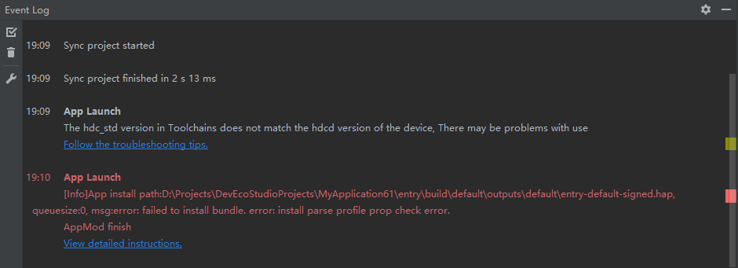

**错误描述**

用户安装未签名的HAP包。

**可能原因**

HAP包未经签名认证。

**处理步骤**

1. 使用[自动签名](https://developer.huawei.com/consumer/cn/doc/harmonyos-guides-V5/ide-signing-V5#section18815157237)。在连接设备后，重新为应用进行签名。
2. 使用手动签名，请参考<!--RP1-->[手动签名](https://developer.huawei.com/consumer/cn/doc/harmonyos-guides-V5/ide-signing-V5#section297715173233)<!--RP1End-->。
<br></br>

### 9568347 解析本地so文件失败
**错误信息**

Error: install parse native so failed.

**错误描述**

在启动调试或运行C++应用/服务时，安装HAP包出现错误，提示“error: install parse native so failed”错误信息。

**可能原因**

设备支持的Abi类型与C++工程中配置的Abi类型不匹配。

**处理步骤**

1. 将设备与DevEco Studio进行连接。
2. 打开命令行工具，并进入SDK安装目录下的toolchains\{版本号}目录下。
    ```
    若不清楚OpenHarmony SDK安装目录，可单击File > Settings > SDK界面查看安装路径。
    ```
3. 执行如下命令，查询设备支持的Abi列表，返回结果为default/armeabi-v7a/armeabi/arm64-v8a/x86/x86_64中的一个或多个Abi类型。
    ```
    hdc shell
    param get const.product.cpu.abilist
    ```
4. 根据查询返回结果，检查[模块级build-profile.json5](https://developer.huawei.com/consumer/cn/doc/harmonyos-guides-V5/ide-hvigor-compilation-options-customizing-sample-V5#section4322212200)文件中的“abiFilters”参数中的配置，规则如下：
    * 若返回结果为default，请执行如下命令，查询是否存在lib64文件夹。
      ```
      cd /system/
      ls
      ```
      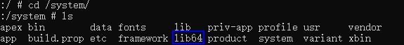
      * 存在lib64文件夹：则“abiFilters”参数中需要包含arm64-v8a类型。
      * 不存在lib64文件夹：则“abiFilters”参数中需要至少包含armeabi/armeabi-v7a中的一个类型。
    * 若返回结果为armeabi-v7a/armeabi/arm64-v8a/x86/x86_64中的一个或多个，需要在“abiFilters”参数中至少包含返回结果中的一个Abi类型。
<br></br>


### 9568344 解析配置文件失败
**错误信息**

Error: install parse profile prop check error.


**错误描述**

在启动调试或运行应用/服务时，安装HAP出现错误，提示“error: install parse profile prop check error”错误信息。

**可能原因**

应用使用了应用特权，但应用的签名文件发生变化后未将新的签名指纹重新配置到设备的特权管控白名单文件install_list_capability.json中。

**处理步骤**

1. 获取新的签名指纹。

    a. 在[项目级build-profile.json5](https://developer.huawei.com/consumer/cn/doc/harmonyos-guides-V5/ide-hvigor-compilation-options-customizing-sample-V5#section1448071082016)文件中，signingConfigs字段内的profile的值即为签名文件的存储路径。

    b. 打开该签名文件（后缀为.p7b），打开后在文件内搜索“development-certificate”，将“-----BEGIN CERTIFICATE-----”和“-----END CERTIFICATE-----”以及中间的信息拷贝到新的文本中，注意换行并去掉换行符，保存为一个新的.cer文件，如命名为xxx.cer。

    新的.cer文件格式如下图（仅作为格式示意，内容以实际为准）：

    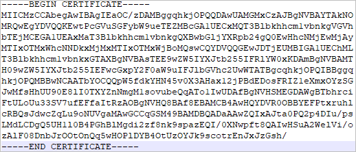


    c. 使用keytool工具（在DevEco Studio安装目录下的jbr/bin文件夹内），执行如下命令通过.cer文件获取证书指纹的SHA256值。
      ```
      keytool -printcert -file xxx.cer
      ```
    d. 将证书指纹中SHA256的内容去掉冒号，即为最终要获得的签名指纹。
    
    如SHA256值为下图（仅作为格式示意，内容以实际为准）：
    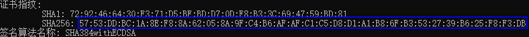

    去掉冒号后的签名指纹为：5753DDBC1A8EF88A62058A9FC4B6AFAFC1C5D8D1A1B86FB3532739B625F8F3DB

2. 获取设备的特权管控白名单文件install_list_capability.json。

    a. 连接设备。

    b. 执行如下命令查看设备的特权管控白名单文件install_list_capability.json。
    ```
    find /system -name install_list_capability.json
    ```
    设备上install_list_capability.json的位置通常为以下目录地址，通过bundleName找到对应的配置文件：
    ```
    /system/etc/app/install_list_capability.json
    ```
    c. 执行如下命令拉取install_list_capability.json。
    ```
    hdc shell mount -o rw,remount /
    hdc file recv /system/etc/app/install_list_capability.json
    ```

3. 将步骤1获取到的签名指纹配置到install_list_capability.json文件的app_signature中，注意要配置到对应的bundleName下。

4. 将修改后的install_list_capability.json文件重新推到设备上，并重启设备。

    ```
    hdc shell mount -o rw,remount / 
    hdc file send install_list_capability.json /system/etc/app/install_list_capability.json 
    hdc shell chmod 644 /system/etc/app/install_list_capability.json 
    hdc shell reboot
    ```
5. 设备重启后，重新安装新的应用即可。


### 9568305 依赖的模块不存在
**错误信息**

Error: dependent module does not exist.


**错误描述**

在启动调试或运行应用/服务时，安装HAP出现错误，提示“error: dependent module does not exist”错误信息。

**可能原因**

运行/调试的应用依赖的动态共享包（SharedLibrary）模块未安装导致安装报错。

**处理步骤**

1. 先安装依赖的动态共享包（SharedLibrary）模块，再在应用运行配置页勾选Keep Application Data，点击OK保存配置，再运行/调试。

2. 在运行配置页，选择Deploy Multi Hap标签页，勾选Deploy Multi Hap Packages，选择依赖的模块，点击OK保存配置，再进行运行/调试。
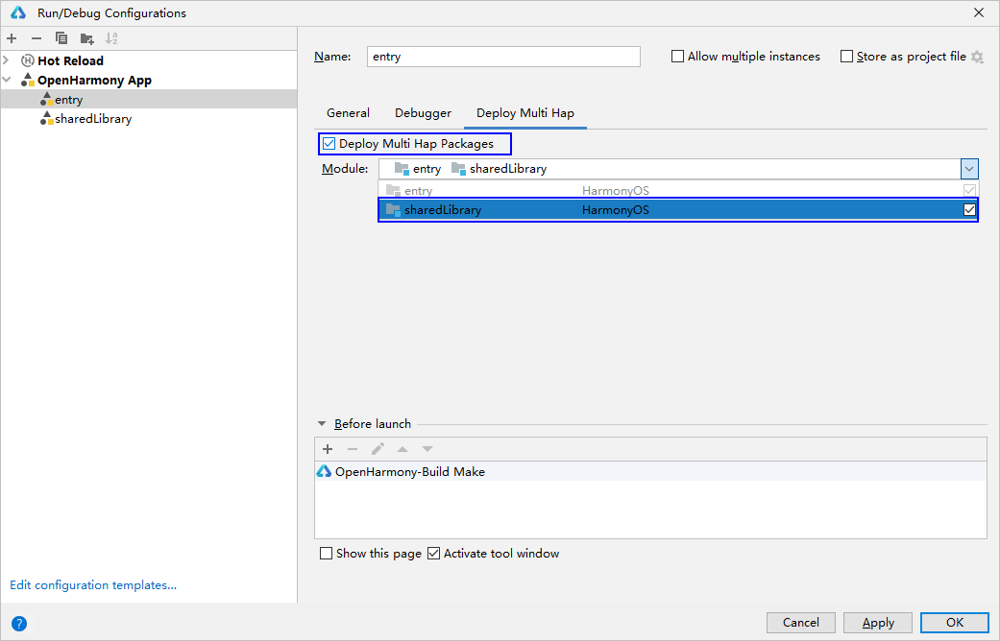


### 9568259 安装解析配置文件缺少字段
**错误信息**

Error: install parse profile missing prop.<br>
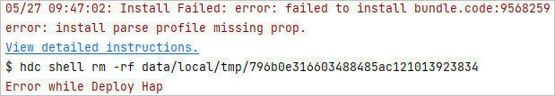

**错误描述**

在启动调试或运行应用/服务时，安装HAP出现错误，提示“error: install parse profile missing prop”错误信息。

**可能原因**

配置文件app.json5和module.json5中必填字段缺失。

**处理步骤**

* 方法1：请参考[app.json5配置文件](../quick-start/app-configuration-file.md)和[module.json5配置文件](../quick-start/module-configuration-file.md)查看并补充必填字段。
* 方法2：通过hilog日志判断缺失字段。

    开启落盘命令：
    ```
    hilog -w start
    ```

    落盘位置：/data/log/hilog

    打开日志查看“profile prop %{public}s is mission”。如“profile prop icon is mission”表示“icon”字段缺失。


### 9568258 安装应用的releaseType与已安装应用的releaseType不相同
**错误信息**

Error: install releaseType target not same.<br>


**错误描述**

在启动调试或运行应用/服务时，安装HAP出现错误，提示“error: install releaseType target not same”错误信息。

**可能原因**

设备上已安装的旧HAP和现在要安装的新HAP所使用的SDK中的releaseType值不一样。

**处理步骤**

1. 请先卸载设备上已安装的HAP，再安装新的HAP。


### 9568322 由于应用来源不可信，签名验证失败
**错误信息**

Error: signature verification failed due to not trusted app source.


**错误描述**

在启动调试或运行应用/服务时，安装HAP出现错误，提示“error: signature verification failed due to not trusted app source”错误信息。

**可能原因**

* 场景一：签名中未包含该调试设备的UDID。

* 场景二：签名时使用了[发布证书和发布profile文件](https://developer.huawei.com/consumer/cn/doc/app/agc-help-releaseharmony-0000001933963166)。发布证书签名的应用不能启动调试或运行。

**处理步骤**

* 场景一：
	1. 使用[自动签名](https://developer.huawei.com/consumer/cn/doc/harmonyos-guides-V5/ide-signing-V5#section18815157237)。在连接设备后，重新为应用进行签名。
	2. 如果使用的是手动签名，对于OpenHarmony应用，请参考<!--RP2-->[OpenHarmony应用手动签名](https://gitee.com/openharmony/docs/blob/master/zh-cn/application-dev/security/hapsigntool-guidelines.md)<!--RP2End-->，在UnsgnedDebugProfileTemplate.json文件中添加该调试设备的**UDID**。
		```
		//UDID获取命令
		hdc shell bm get -u
		```

* 场景二：使用[调试证书和调试profile文件](https://developer.huawei.com/consumer/cn/doc/app/agc-help-debug-app-0000001914423098)重新签名应用。


### 9568289 权限请求失败导致安装失败
**错误信息**

Error: install failed due to grant request permissions failed.


**错误描述**

在启动调试或运行应用/服务时，安装HAP出现错误，提示“error: install failed due to grant request permissions failed”错误信息。

**可能原因**

默认应用等级为normal，只能使用normal等级的权限，如果使用了system_basic或system_core等级的权限，将导致报错。

**处理步骤**

1. 在UnsgnedDebugProfileTemplate.json文件中修改apl等级，调整成system_basic或system_core等级，重新签名打包即可。


### 9568297 由于设备sdk版本较低导致安装失败
**错误信息**

Error: install failed due to older sdk version in the device.


**错误描述**

在启动调试或运行应用/服务时，安装HAP出现错误，提示“error: install failed due to older sdk version in the device”错误信息。

**可能原因**

该问题是由于编译打包所使用的SDK版本与设备镜像版本不匹配。

**处理步骤**

* 场景一：设备上的镜像版本低于编译打包的SDK版本，请更新设备镜像版本。查询设备镜像版本命令：
  ```
  hdc shell param get const.ohos.apiversion
  ```
  如果镜像提供的api版本为10，且应用编译所使用的SDK版本也为10，仍出现该报错，可能是由于镜像版本较低，未兼容新版本SDK校验规则，请将镜像版本更新为最新版本。

* 场景二：对于需要运行在OpenHarmony设备上的应用，请确认runtimeOS已改为OpenHarmony。


### 9568332 签名不一致导致安装失败
**错误信息**

Error: install sign info inconsistent.
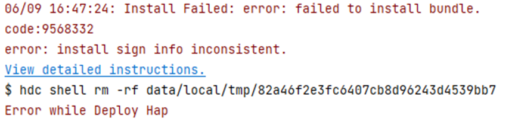

**错误描述**

在启动调试或运行应用/服务时，安装HAP出现错误，提示“error: install sign info inconsistent”错误信息。

**可能原因**

设备上已安装的应用与新安装的应用中签名不一致。如果在Edit Configurations中勾选了“Keep Application Data”（不卸载应用，覆盖安装），并且重新进行了签名，将导致该报错。

**处理步骤**

1. 请卸载设备上已安装的应用，或取消勾选“Keep Application Data”后，重新安装新的应用。


### 9568329 签名信息验证失败
**错误信息**

Error: verify signature failed.


**错误描述**

签名信息中的包名与应用的包名（bundleName）不一致。

**可能原因**

* 场景一：用户导入了三方提供的HSP模块，且该HSP既非[集成态HSP](../quick-start/integrated-hsp.md)，又非同包名的HSP，造成包名不一致。

* 场景二：用户使用了错误的签名文件（后缀为.p7b）进行签名，造成包名不一致。


**处理步骤**

* 场景一：HSP只能给同包名的应用使用，只有集成态HSP可以给不同包名的应用使用。需要用户与三方开发者确认，三方开发者应提供集成态HSP、或同包名的HSP给用户使用。

* 场景二：检查签名流程和签名证书，参考[应用/服务签名](https://developer.huawei.com/consumer/cn/doc/harmonyos-guides-V5/ide-signing-V5)。


### 9568266 安装权限拒绝
**错误信息**

Error: install permission denied.
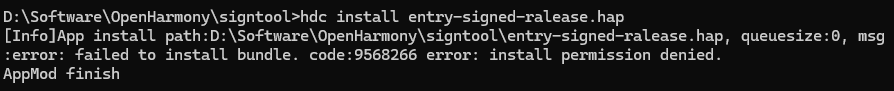

**错误描述**

使用hdc install安装HAP时出现错误，提示“code:9568266 error: install permission denied”错误信息。

**可能原因**

hdc install不能安装release签名的企业应用。

**处理步骤**

1. 请使用hdc install指令安装调试debug签名的企业应用。


### 9568337 安装解析失败
**错误信息**

Error: install parse unexpected.

**错误描述**

应用推送到设备安装时，报错包管理打开hap文件失败。

**可能原因**

* 场景一：设备system分区存储空间已满，导致hdc file send文件后，因存储空间不足导致设备中文件损坏。

* 场景二：推送hap包到设备过程hap包损坏。

**处理步骤**

* 场景一：查看设备system分区存储空间，若已满，清理存储满足安装所需空间。
  ```bash
  hdc shell df -h /system
  ```

* 场景二：查看本地hap与推送到设备上hap的md5值，若不一致则表示推送过程hap损毁，请尝试重传。


### 9568316 数据代理中APL权限字段描述权限低
**错误信息**

Error: apl of required permission in proxy data is too low.

**错误描述**

proxyData标签requiredReadPermission和requiredWritePermission属性验证失败。

**可能原因**

用户工程module.json中，proxyData标签requiredReadPermission和requiredWritePermission属性验证失败，这两个属性要求system_basic或system_core权限等级。

**处理步骤**

1. 检查应用定义的proxyData内容是否符合要求，参考[proxyData标签](../quick-start/module-configuration-file.md#proxydata标签)。


### 9568315 数据代理URI错误
**错误信息**

Error: uri in proxy data is wrong.

**错误描述**

proxyData标签uri属性验证失败。

**可能原因**

用户工程module.json中，proxyData标签uri属性验证失败，不满足uri格式要求。

**处理步骤**

1. 检查应用定义的proxyData内容是否符合要求，参考[proxyData标签](../quick-start/module-configuration-file.md#proxydata标签)。


### 9568336 应用调试类型与已安装应用不一致
**错误信息**

Error: install debug type not same.

**错误描述**

应用调试类型（app.json的debug字段）与已安装应用不一致。

**可能原因**

开发者使用IDE的debug按钮安装了应用，后面打包之后又通过hdc install方式安装。

**处理步骤**

1. 卸载已安装的应用，重新安装新应用。
   

### 9568296 包类型错误
**错误信息**

Error: install failed due to error bundle type.

**错误描述**    

bundleType错误导致应用安装失败。

**可能原因**

新安装应用的bundleType与已安装的有相同bundleName应用不一致。
       
**处理步骤**

* 方法一：卸载已安装的应用，重新安装新应用。

* 方法二：修改应用的bundleType，与已安装应用保持一致。


### 9568292 UserID为0的用户只能安装singleton应用
**错误信息**

Error: install failed due to zero user can only install singleton app.

**错误描述**

UserID 0用户只允许安装singleton权限应用，singleton权限应用只允许被UserID 0用户安装。

**可能原因**

singleton权限应用安装未指定UserID 0。

**处理步骤**

1. 应用是singleton权限，安装时指定UserID 0。
	```
	//指定userId安装命令
	hdc install -p hap名.hap -u 0
	```


### 9568263 无法降级安装
**错误信息**

Error: install version downgrade.

**错误描述**

正在安装应用的VersionCode小于系统中已安装应用的VersionCode，安装失败。

**可能原因**

正在安装应用的VersionCode小于系统中已安装应用的VersionCode。

**处理步骤**

1. 卸载已安装的应用，重新安装新应用。


### 9568304 应用不支持当前设备类型
**错误信息**

Error: device type is not supported.

**错误描述**

正在安装的应用不支持当前设备类型，安装失败。

**可能原因**

正在安装的应用不支持当前设备类型。

**处理步骤**

1. 如需要适配当前设备，请在应用设备类型配置中增加当前设备类型。应用deviceTypes配置包含phone（手机）、tablet（平板）、2in1（2合1设备）、tv（智慧屏）、wearable（智能手表）和car（车机）。


### 9568317 应用的多进程配置与系统配置不匹配
**错误信息**

Error: isolationMode does not match the system.

**错误描述**

安装应用时，设置的isolationMode与系统配置项允许的系统配置不匹配。

**可能原因**

* 场景一：设备支持隔离模式，即persist.bms.supportIsolationMode为true时，HAP配置的isolationMode为nonisolationOnly。

* 场景二：设备不支持隔离模式，即persist.bms.supportIsolationMode为false时，HAP配置的isolationMode为isolationOnly。

**处理步骤**

1. 按照设备的隔离模式配置HAP配置文件isolationMode属性。  
	```
	//查询设备persist.bms.supportIsolationMode值，若返回errNum is:106说明没配置
	hdc shell
	param get persist.bms.supportIsolationMode
	//配置设备persist.bms.supportIsolationMode值
	hdc shell
	param set persist.bms.supportIsolationMode [true|false]
	```


### 9568315 数据代理的uri属性错误
**错误信息**

Error: uri in proxy data is wrong.

**错误描述**

应用module.json文件中proxyData标签的uri属性验证失败。

**可能原因**

uri不满足格式规范。

**处理步骤**

1. 确认uri满足格式规范。
	```
	//uri格式规范
	不同数据代理的uri不可重复，且需要满足datashareproxy://当前应用包名/xxx的格式
	```


### 9568310 兼容策略不同      
**错误信息**

Error: compatible policy not same.

**错误描述**

新包与已安装包兼容策略不同。

**可能原因**

设备中已安装相同包名的hap包。

**处理步骤**

1. 卸载已安装相同包名hap包，再安装新包。


### 9568391 包管理服务已停止      
**错误信息**

Error: bundle manager service is died.

**错误描述**

包管理服务已停止。

**可能原因**

使用bm install -p ***.hap方式安装预置应用会杀掉正在运行的应用，导致异常（例如foundation进程重启）。

**处理步骤**

1. 预置应用请参考OTA升级。


### 9568393 验证代码签名失败      
**错误信息**

Error: verify code signature failed.

**错误描述**

验证代码签名失败。

**可能原因**

* 场景一：包没有代码签名信息。

* 场景二：签名证书问题。


**处理步骤**

* 场景一：使用SDK签名工具验证包是否签名。
	```
	//验证签名指令
	java -jar SDK安装路径（DevEco工具安装目录中sdk）\toolchains\lib\hap-sign-tool.jar verify-app -outCertChain out.cer -outProfile out.p7b -inFile 包路径\**.hap
	// 执行结果1：can not find codesign block。说明包没有签名
	// 执行结果2：verify codesign success。说明包已签名
	```

* 场景二：检查签名流程和签名证书，参考[应用/服务签名](https://developer.huawei.com/consumer/cn/doc/harmonyos-guides-V5/ide-signing-0000001587684945-V5)。


### 9568257 验证pkcs7文件失败      
**错误信息**

Error: fail to verify pkcs7 file.

**错误描述**

验证pkcs7文件失败。

**可能原因**

应用当前使用的签名不符合HarmonyOS应用签名要求，通常是由于当前使用的是OpenHarmony应用的签名，应该替换为HarmonyOS应用的签名。

**处理步骤**

1.在为应用/服务签名时勾选“Support HarmonyOS”,完成HarmonyOS应用签名后再次启动调试或运行应用。


### 9568401 调试包仅支持运行在开发者模式设备      
**错误信息**

Error: debug bundle can only be installed in developer mode.

**错误描述**

调试包仅支持运行在开发者模式设备。

**可能原因**

终端设备未开启“开发者模式”。

**处理步骤**

1. 终端系统查看“设置 > 系统”中是否有“开发者选项”，如果不存在，可在“设置 > 关于本机”连续七次单击“版本号”，直到提示“开启开发者模式”，点击“确认开启”后输入PIN码（如果已设置），设备将自动重启。
2. USB数据线连接终端和PC，在“设置 > 系统 > 开发者选项”中，打开“USB调试”开关，弹出的“允许USB调试”的弹框，点击“允许”。
3. 启动调试或运行应用。

### 9568386 卸载找不到资源      
**错误信息**

Error: uninstall missing installed bundle.

**错误描述**

卸载找不到资源。

**可能原因**

之前卸载不干净，有资源残留。

**处理步骤**

1. 手动清理el1/el2下所有未卸载的资源。
2. 重新安装。


### 9568284 安装版本不匹配      
**错误信息**

Error: install version not compatible.

**错误描述**

安装版本不匹配。

**可能原因**

当前安装HSP的版本信息与已安装HAP的版本信息不匹配。
安装HSP时会做如下校验：
1. bundleName和HAP的一致。
2. version和HAP的一致。
3. 签名和HAP的一致。

**处理步骤**

1. 卸载版本信息不匹配的HAP，再安装HSP。
2. 修改HSP版本信息与HAP一致，再安装HSP。

### 9568287 安装包entry模块数量不合规      
**错误信息**

Error: install invalid number of entry hap.

**错误描述**

安装包entry模块数量不合规。

**可能原因**

安装包中entry模块有多个。一个应用只能有一个entry模块，可以有多个feature模块。

**处理步骤**

1. 保留一个entry模块，其余entry模块修改为feature（修改module.json5中type字段）。


### 9568281 安装包vendor不一致      
**错误信息**

Error: install vendor not same.

**错误描述**

安装包vendor不一致。

**可能原因**

app.json5文件中app的vendor字段配置不一致。

**处理步骤**

1. 若只有一个HAP，要求与已安装应用vendor字段一致，卸载重装即可。
2. 若包含集成态HSP，要求集成态HSP与使用方HAP的vendor字段保持一致。


### 9568279 安装版本名不一致      
**错误信息**

Error: install version name not same.

**错误描述**

安装版本名不一致。

**可能原因**

* 场景一：只有一个hap，可能是保存数据的应用版本和新安装版本不一致导致。

* 场景二：HSP和HAP一起安装时，HSP和HAP的包名、版本号、sdk版本号、releaseType有不一致。

**处理步骤**

* 场景一：DevEco entry配置界面中取消勾选“Keep Application Data”。
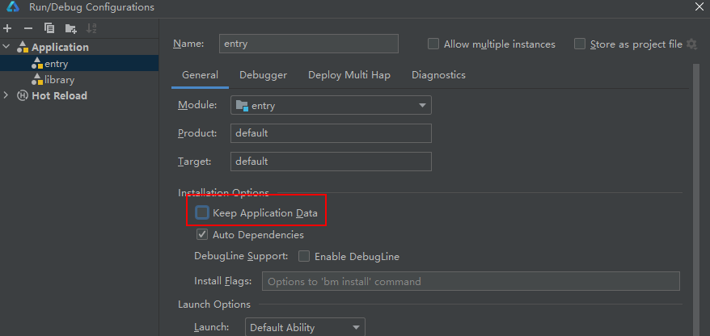

* 场景二：对其HSP和HAP的包名、版本号、sdk版本号、releaseType使其一致。


### 9568274 安装服务错误      
**错误信息**

Error: install installd service error.

**错误描述**

安装服务错误。

**可能原因**

安装服务异常。

**处理步骤**

1. 清除缓存，重启设备。


### 9568314 安装应用间共享库失败      
**错误信息**

Error: Failed to install the HSP because installing a shared bundle specified by hapFilePaths is not allowed.

**错误描述**

安装应用间共享库失败。

**可能原因**

安装应用间共享HSP时使用“hdc app install ***”指令。

**处理步骤**

1. 安装应用间HSP时使用“hdc install -s ***”指令。


### 9568359 安装设置selinux失败      
**错误信息**

Error: installd set selinux label failed.

**错误描述**

安装设置selinux失败。

**可能原因**

签名配置文件中APL字段错误。APL有“normal”、“system_basic”和“system_core”三种等级。

**处理步骤**

1.确认签名文件p7b中apl字段是否有误。
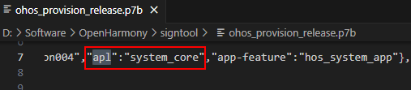
2.若apl字段有误，修改UnsgnedReleasedProfileTemplate.json文件中apl字段，并重新签名。
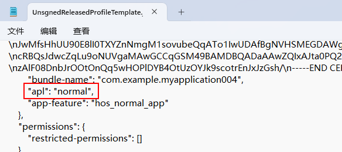


### 9568403 安装加密校验失败      
**错误信息**

Error: check encryption failed.

**错误描述**

安装加密校验失败。

**可能原因**

可能是镜像版本较老；或者HAP包lib目录内非so文件导致。

**处理步骤**

1. 安装新版本镜像。
2. 删除HAP工程中lib目录内非so文件，重新签名打包。