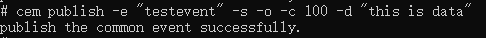

# cem工具

Common Event Manager（公共事件管理工具， 简称cem）是实现公共事件信息打印、发布公共事件等功能的工具，为开发者提供基本的公共事件调试和测试能力。通过该工具，开发者可以在hdc shell中，发送命令执行各种系统操作，例如打印所有公共事件订阅者、已发送公共事件和接受者、模拟发布公共事件等。

## cem调试助手

### help

* 介绍

  打印帮助信息。

* 用法

  ```
  cem help
  ```

### publish

* 介绍

  发布公共事件。

* 用法

  ```
  cem publish [<options>]
  ```

  参数如下表所示

  | 参数         | 参数说明                                   |
  | ------------ | ------------------------------------------ |
  | -e/--event   | 必选参数，发布事件名称                     |
  | -s/--sticky  | 可选参数，发布粘性事件，默认发布非粘性事件 |
  | -o/--ordered | 可选参数，发布有序事件，默认发布无序事件   |
  | -c/--code    | 可选参数，公共事件结果码                   |
  | -d/--data    | 可选参数，公共事件携带数据                 |
  | -h/--help    | 帮助信息                                   |

* 示例：

  ```bash
  # 发布名称为testevent的公共事件
  cem publish --event "testevent"
  ```
  
  
  
  ```bash
  # 发布名称为testevent的粘性有序公共事件，该事件的结果码为100，携带数据内容为“this is data”
  cem publish -e "testevent" -s -o -c 100 -d "this is data"
  ```
  
  

### dump

* 介绍

  打印公共事件相关信息。

* 用法

  ```
  cem dump [<options>]
  ```

  参数如下表所示

  | 参数       | 参数说明                                     |
  | ---------- | -------------------------------------------- |
  | -a/--all   | 打印开机以来所有已发送的公共事件及其具体信息 |
  | -e/--event | 查询特定名称事件的具体信息                   |
  | -h/--help  | 帮助信息                                     |

* 示例

  ```bash
  # 打印公共事件名称为testevent的具体信息
  cem dump -e "testevent"
  ```

  
