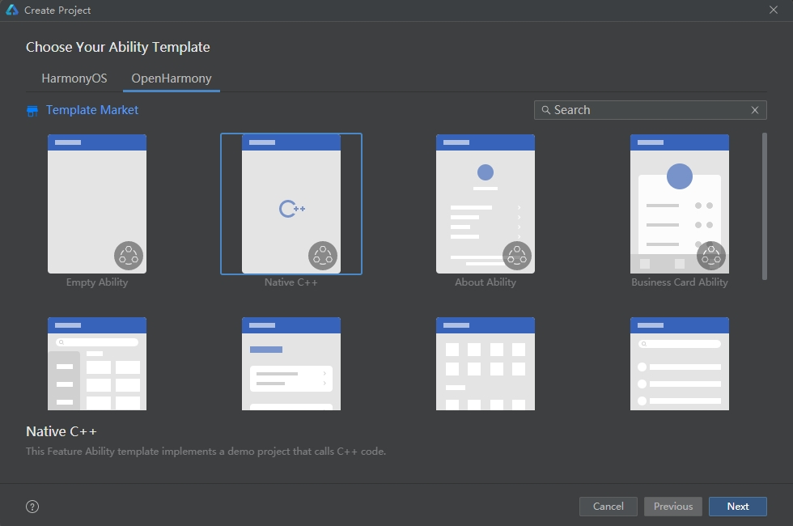

# lldb使用命令行远程调试hap应用的过程
## 使用DevEco Studio创建Native C++应用
> **说明：**
> 
> 请使用**DevEco Studio V3.0.0.900 Beta3**及更高版本。
> 
> 为确保运行效果，本文以使用**DevEco Studio V3.1.0.200**版本为例，点击[此处](https://developer.harmonyos.com/cn/develop/deveco-studio)获取下载链接。

### 创建OpenHarmony下的Native C++应用
> **说明：**
>
> 在使用本工具前，开发者需要先获取[hdc工具](../../device-dev/subsystems/subsys-toolchain-hdc-guide.md)，执行hdc shell。
1. 若首次打开DevEco Studio，请点击Create Project创建工程。如果已经打开了一个工程，请在菜单栏选择File > New > Create Project来创建一个新工程。选择OpenHarmony模板库，选择模板“Empty Ability”，点击Next进行下一步配置。

2.这里是列表文本
- 1.首先推送lldb-server到远程设备
- 2.启动本地lldb，并选择远程平台remote-ohos，建立连接
- 3.设置hap运行所需库路径
-   `settings append target.exec-search-paths "MyApp2/entry/build/default/intermediates/cmake/default/obj/armeabi-v7a"`
- 4. dc install 安装hap包，然后启动hap应用
-    `hdc shell aa start -a EntryAbility -b com.example.myapplication`
- 5. 获取hap应用进程pid
- 6.对C++代码打断点
    `breakpoint set --file hello.cpp --line 154`
- 7.attach 应用的进程
    `attach -p pid`
- 8.执行continue命令
   ` continue`
- 9.进行后续调试流程
