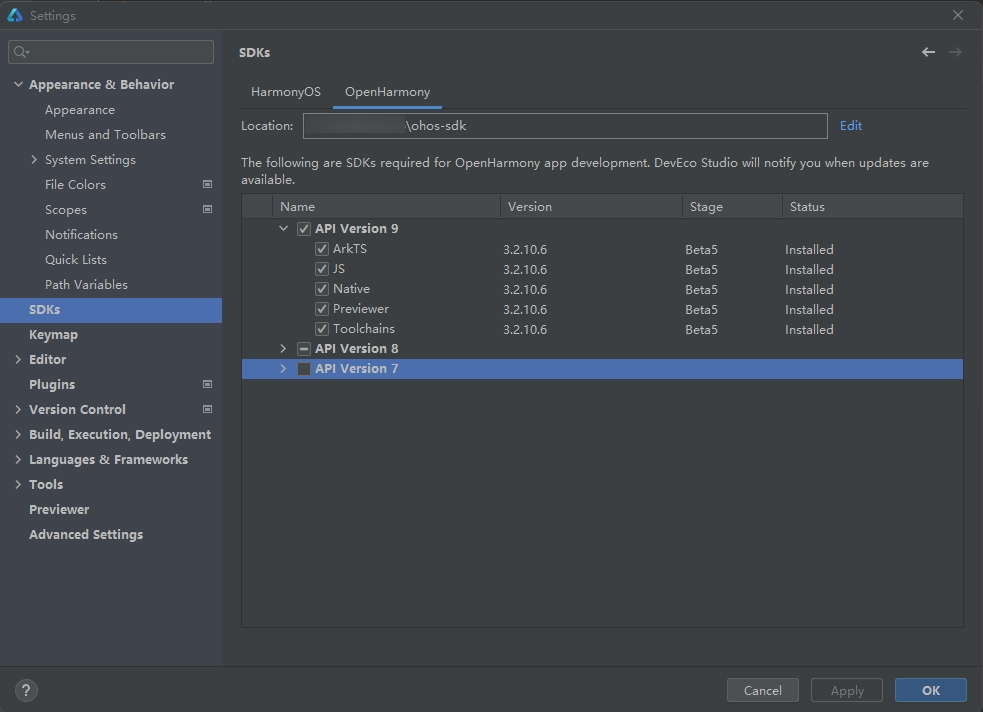
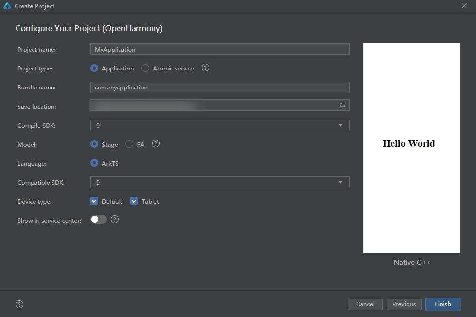

# lldb使用命令行远程调试hap应用的过程
## 使用DevEco Studio创建Native C++应用

### 下载最新发布的OHOS-SDK、HDC工具和DevEco Studio
> **说明：**
> 请使用**DevEco Studio V3.0.0.900 Beta3**及更高版本。
> 
> 为确保运行效果，本文以使用**DevEco Studio V3.1.0.200**版本为例，点击[此处](https://developer.harmonyos.com/cn/develop/deveco-studio)获取下载链接。
> 
> 在使用本工具前，开发者需要先获取[hdc工具](../../device-dev/subsystems/subsys-toolchain-hdc-guide.md)，执行hdc shell。
> 
> 从每日构建中获取最新的[OHOS-SDK](http://ci.openharmony.cn/dailys/dailybuilds)
1. 配置SDK:把每日构建中下载的SDK放到指定目录

2. 若首次打开DevEco Studio，请点击Create Project创建工程。如果已经打开了一个工程，请在菜单栏选择File > New > Create Project来创建一个新工程。选择OpenHarmony模板库，选择模板“Empty Ability”，点击Next进行下一步配置。

3. 进入配置工程界面参数保持默认设置即可。

4. 点击Finish，工具会自动生成示例代码和相关资源，等待工程创建完成。
5. 将以下demo代码替换到hello.cpp文件
```
#include "napi/native_api.h"
#include <iostream>
#include <map>
#include <set>
#include <list>
#include <deque>
#include <queue>
#include <initializer_list>
#include <forward_list>
#include <optional>
#include <bitset>
#include <variant>
#include <atomic>
#include <stack>
#include <unordered_map>
#include <unordered_set>

using namespace std;

void VarTest() {
    string str = "qweqwe";
    std::vector<int> v = {1, 2, 3};
    std::map<int, int> intMap = {{1, 11}, {2, 22}};
    std::set<int> se = {3, 4, 5};
    std::multiset<int> mSet = {4, 4, 5};
    std::list<int> li = {7, 8, 9};
    std::stack<int> s;
    s.push(11);
    s.push(12);
    std::queue<int> q;
    q.push(11);
    q.push(12);
    std::deque<int> dq = {7, 8, 9};
    dq.push_back(13);
    dq.push_back(14);

    std::vector<int> vecArray[2] = {{1, 2, 3}, {4, 5, 6}};
    std::map<int, int> mapArray[2];
    mapArray[0].insert({1, 11});
    mapArray[0].insert({2, 22});
    mapArray[1].insert({3, 33});
    mapArray[1].insert({4, 44});
    std::forward_list<int> forwardList = {11, 22, 33};
    std::bitset<8> b(12);
    std::atomic<int> atomicInt(7);

    std::unordered_set<int> unSet = {3, 4, 5};
    std::unordered_map<int, int> unMap = {{1, 100}, {2, 200}};
    cout << str << endl;
}
class Student
{
public:
    Student(char *name, int age, float score);
    void show();
private:
    char *m_name;
    int m_age;
    float m_score;
};

Student::Student(char *name, int age, float score){
    m_name = name;
    m_age = age;
    m_score = score;
}

void Student::show(){
    cout << m_name << "age" << m_age << ",grade" << m_score << endl;
}
int test_class()
{
    Student stu((char*)"ming", 15, 92.5);
    stu.show();

    Student *pstu = new Student((char*)"lihua", 16, 96);
    pstu->show();

    return 0;
}

double mix(double x, double y) {
    return x * y;
}

void nullPtr()
{
    char* a[3] = {NULL};
    char tmp = 'c';
    char* b[2] = {&tmp, &tmp};
    int int_a = 2;
    int *aptr[2] = {};
    char* a_nullptr[3] = {nullptr};
    char* p = nullptr;
    char* p_null = NULL;
    int int_n[2] = {};
    int int_x[] = {1, 2};
    int int_y[2] = {1};

    cout << int_a << endl;

    if (p == nullptr){
        cout << "p is nullptr" << endl;
    }

    for (int i = 0; i < 2; i++)
    {
        cout << int_y[i] << endl;
    }

    for (int j = 0; j < sizeof(int_y) / sizeof(int); j++)
    {
        cout << int_x[j] << endl;
    }

    return;
}

void stringFunc()
{
    string str("test string");
    int length = str.length();

    cout << "str is " << str.c_str() << endl;
    cout << "length = " << length << endl;

    map<int, string> mapTemp;
    mapTemp.insert({5, "wang"});
    mapTemp.insert({4, "li"});
    mapTemp.insert({3, "zhang"});

    map<int, string>::iterator it;
    for (it = mapTemp.begin(); it != mapTemp.end(); it++)
    {
        cout << "number" << (*it).first << " name" << (*it).second.c_str() << endl;
    }

    return;
}

void double_test()
{
    double double_var = 16.0;
    double double_max = 32.0;

    double mul = mix(double_var, double_max);
    cout << mul << endl;

    return;
}

static napi_value Add(napi_env env, napi_callback_info info)
{
    VarTest();
    stringFunc();
    double_test();
    nullPtr();
    size_t requireArgc = 2;
    size_t argc = 2;
    napi_value args[2] = {nullptr};

    napi_get_cb_info(env, info, &argc, args, nullptr, nullptr);

    napi_valuetype valuetype0;
    napi_typeof(env, args[0], &valuetype0);

    napi_valuetype valuetype1;
    napi_typeof(env, args[1], &valuetype1);

    double value0;
    napi_get_value_double(env, args[0], &value0);

    double value1;
    napi_get_value_double(env, args[1], &value1);

    napi_value sum;
    napi_create_double(env, value0 + value1, &sum);

    return sum;
}

EXTERN_C_START
static napi_value Init(napi_env env, napi_value exports)
{
    napi_property_descriptor desc[] = {
        { "add", nullptr, Add, nullptr, nullptr, nullptr, napi_default, nullptr }
    };
    napi_define_properties(env, exports, sizeof(desc) / sizeof(desc[0]), desc);
    return exports;
}
EXTERN_C_END

static napi_module demoModule = {
    .nm_version = 1,
    .nm_flags = 0,
    .nm_filename = nullptr,
    .nm_register_func = Init,
    .nm_modname = "entry",
    .nm_priv = ((void*)0),
    .reserved = { 0 },
};

extern "C" __attribute__((constructor)) void RegisterEntryModule(void)
{
    napi_module_register(&demoModule);
}

```

- 首先推送lldb-server到远程设备

```
hdc.exe file send E:\ohos-sdk\windows\native\llvm\lib\clang\12.0.1\bin\arm-linux-ohos\lldb-server /data/local/tmp
```
- 命令行窗口一使用hdc shell方式进入设备，执行命令启动server

```
./data/local/tmp/lldb-server p --server --listen "*:8080"
```

- 命令行窗口二启动本地lldb，并选择远程平台remote-ohos，建立连接：
在windows平台运行lldb.exe，进行连接

```
E:\ohos-sdk\windows\native\llvm\bin>lldb.exe
(lldb) platform select remote-ohos
  Platform: remote-ohos
 Connected: no
 Container: no
(lldb) platform connect connect://localhost:8080
  Platform: remote-ohos
    Triple: aarch64-unknown-linux-unknown
  Hostname: localhost
 Connected: yes
 Container: no
WorkingDir: /data/local/tmp
    Kernel: #1 SMP Thu Apr 13 16:10:02 CST 2023
(lldb)
```
- 在lldb中设置hap运行所需库路径

```
  (lldb) settings append target.exec-search-paths "MyApp/entry/build/default/intermediates/cmake/default/obj/armeabi-v7a"
```
- 安装hap包，在windows命令行窗口中执行一下命令(需要在hap文件的路径下执行或者安装命令带上hap文件的路径）：
```
  hdc install -r entry-default-signed.hap
```
- 启动hap应用，在windows命令行窗口中执行如下命令
```
  hdc shell aa start -a EntryAbility -b com.example.myapplication
```
- 获取hap应用进程pid，在windows命令行窗口中执行如下命令
```
  hdc shell ps -elf | grep com.example.myapplication
```
- 对C++代码打断点
```
    (lldb) breakpoint set --file hello.cpp --line 154
```
- attach应用的进程pid
```
    (lldb) attach -p pid`
```
- 执行continue命令，调试停在断点hello.cpp154行
```
   (lldb) continue
```
- 进行后续调试流程,可参考上述文档中调试功能部分
