# OpenHarmony SDK 升级助手
## 简介
OpenHarmony SDK 升级助手，用于帮助开发者快速解决OpenHarmony应用SDK升级导致的API不兼容问题。</br>
由于OpenHarmony SDK Beta版本不承诺API稳定性，在SDK升级后，可能存在API不兼容的问题，应用开发者对现在工程切换API版本后，需要适配API接口及其底层行为的变更，存在一定的升级成本；因此OpenHarmony提供了SDK升级助手，可以帮助开发者快速了解升级适配全貌，并通过工具提示快速适配升级，显著提高SDK升级效率。

## 约束与限制
1. 应用在升级SDK之前，需要将旧版本的SDK文件进行备份，以免被新版本SDK给覆盖掉。
2. 目前suap工具仅支持OpenHarmony应用升级SDK时使用。

## 使用教程

### 工具安装
1.在DevEco Studio主菜单栏中点击 "File" > "Settings..."。

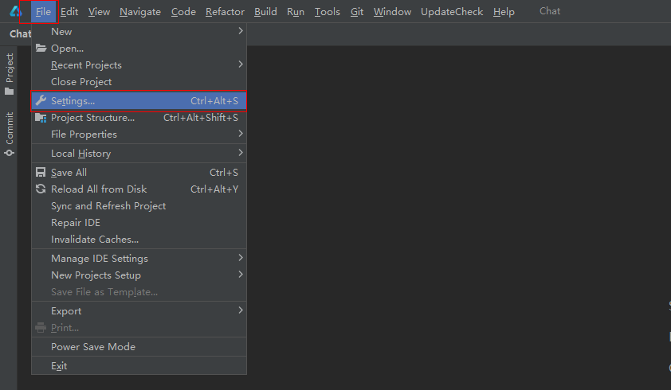

2.在Settings弹出框界面，选中"Plugins"进入IDE插件模块。

3.点击"Marketplace"选项，在下方搜索框中输入"OpenHarmony SDK Upgrade Assistant"。

4.点击搜索到的插件右方"Install"按钮进行下载安装，安装完成之后点击"Apply"按钮，重启IDE即安装成功（注意：插件安装完成后需要重启IDE）。

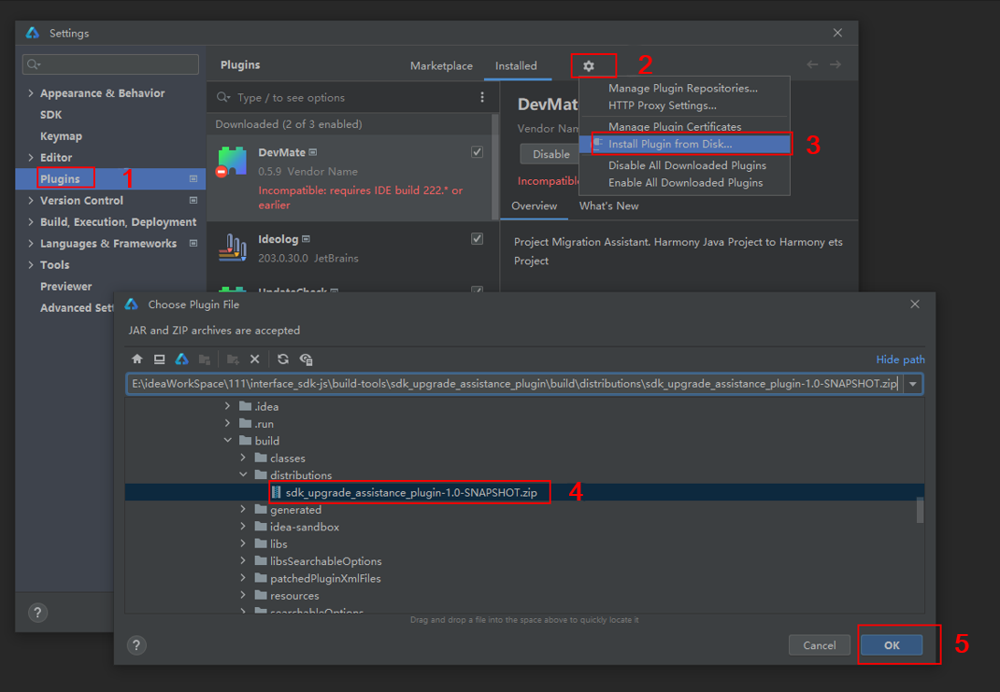

### 使用工具

辅助升级插件安装好后，打开需要升级的OpenHarmony工程。

工程加载完毕后，点击窗口上方主菜单栏的"UpdateCheck" > "Start"。

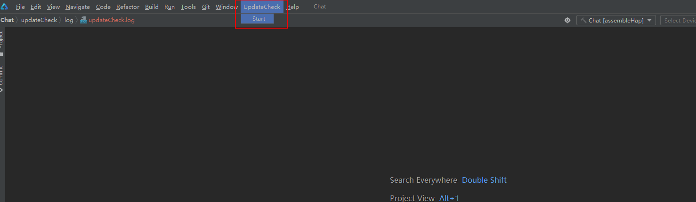

手动选择旧版本SDK路径，需要选择到“ets”文件夹。新版本SDK路径将通过IDE配置文件及当前应用配置的SDK版本自动获取。路径选择完成后，点击“OK”按钮，开始生成辅助升级报告。

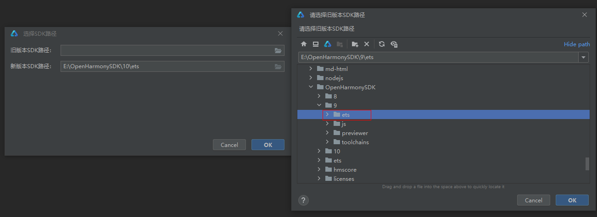

报告生成成功后，将弹窗提示，点击“OK”按钮，关闭当前弹窗。

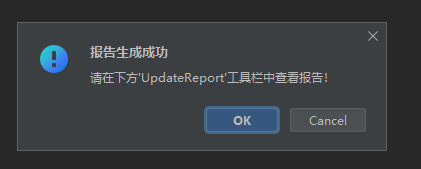

根据弹窗提示，打开下方工具栏内UpdateReport按钮，查看升级报告。

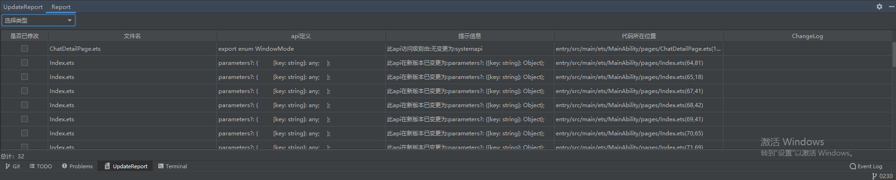

### 报告功能点介绍

1. 报告下方总数为因升级SDK导致当前应用出现的问题总数，帮助快速评估修改工作量。
2. 报告的每个标题头都可以单击进行排序。
3. 报告中选择类型下拉框可以选择升级类型原因，下方总计会根据选择的类型更改数量。
4. 是否已修改功能可以帮助开发者记录哪些问题已修改，避免出现重复工作量。
5. 双击代码所在位置列，可以快速定位到当前代码在应用中位置。
6. 提示信息列会提供修改建议，供开发者参考修改。
7. changelog列如果多个版本，单击之后会出现弹出框，将版本号和链接罗列，点击进行跳转。单个版本变更，单击之后，直接跳转到对应的ChangeLog文档中。

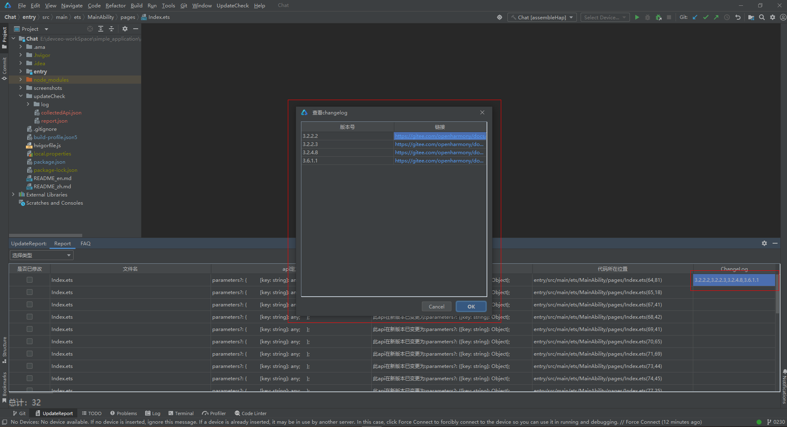

## 打包构建

1.[interface仓](https://gitcode.com/openharmony/interface_sdk-js/tree/master/build-tools)中 clone [api_diff](https://gitcode.com/openharmony/interface_sdk-js/tree/master/build-tools/api_diff)工具(对比两个版本SDK里的API差异)和[collect_application_api](https://gitcode.com/openharmony/interface_sdk-js/tree/master/build-tools/collect_application_api)工具(用于解析并汇总应用中使用到的API)到本地。

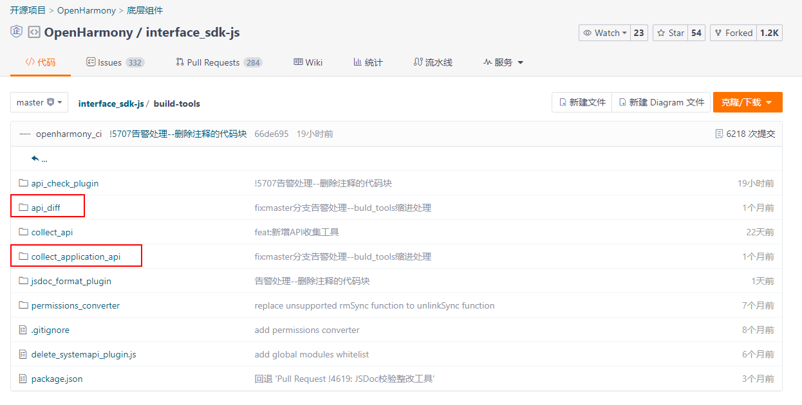

2.在本地api_diff工具和collect_application_api工具目录下进入终端，进行安装和编译。

> **说明：**
>
> 需保证node.js版本为14.
>

输入命令：npm install，之后进行构建：npm run build。构建成功之后，会在对应的工具文件夹下生成dist=>build=>api-diff.js和dist=>build=>api-collector.js。

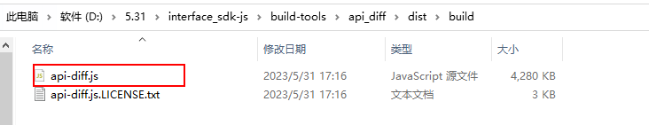
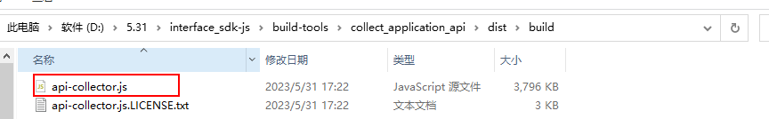

3.在本地磁盘的最后一个盘符，创建名为'updateCheck'文件夹，内部分别创建'api-diff'和'collect_application_api'文件夹。</br>将步骤3中的api-diff.js文件放置'api-diff'文件夹下，collect_application_api文件夹下libs文件夹以及api-collector.js放置在'collect_application_api'文件夹下。

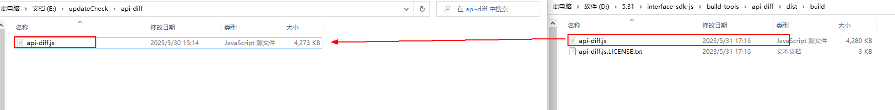
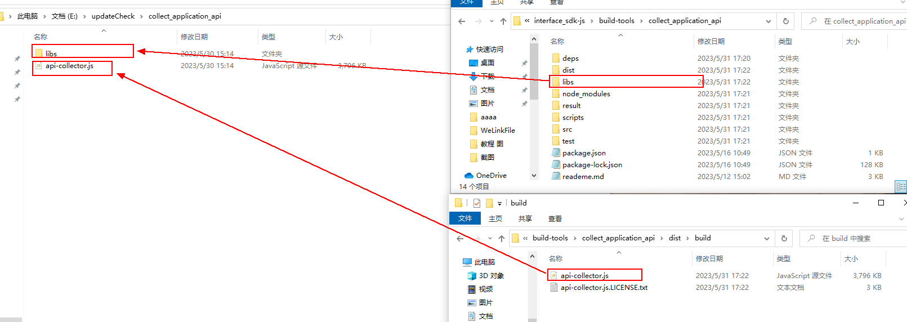

4.升级辅助工具源码clone下来之后，在idea上打开，需要配置gradle环境，并且在src同级目录下新建'build.gradle.kts'文件，将下面内容粘贴至文件中，刷新gradle，在idea右侧gradle工具栏即可运行项目和打包成插件。
```lombok.config
plugins {
    id("java")
    id("org.jetbrains.intellij") version "1.5.2"
}

group = "com.example"
version = "1.0-SNAPSHOT"

repositories {
    maven {
        setUrl("https://mirrors.huaweicloud.com/repository/maven")
    }
}

dependencies{
    implementation("org.springframework:spring-web:5.2.12.RELEASE")
    implementation("org.apache.commons:commons-compress:1.21")
    implementation("com.alibaba:fastjson:1.2.28")
    implementation("org.apache.logging.log4j:log4j-core:2.19.0")
    implementation("commons-httpclient:commons-httpclient:3.1")
}

intellij {
    version.set("2021.2")
    type.set("IC") // Target IDE Platform

    plugins.set(listOf(/* Plugin Dependencies */))
}

tasks {
    // Set the JVM compatibility versions
    withType<JavaCompile> {
        sourceCompatibility = "11"
        targetCompatibility = "11"
    }

    patchPluginXml {
        sinceBuild.set("212")
        untilBuild.set("522.*")
    }

    signPlugin {
        certificateChain.set(System.getenv("CERTIFICATE_CHAIN"))
        privateKey.set(System.getenv("PRIVATE_KEY"))
        password.set(System.getenv("PRIVATE_KEY_PASSWORD"))
    }

    publishPlugin {
        token.set(System.getenv("PUBLISH_TOKEN"))
    }
}


```