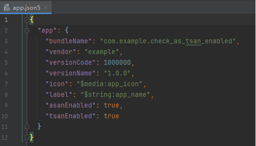
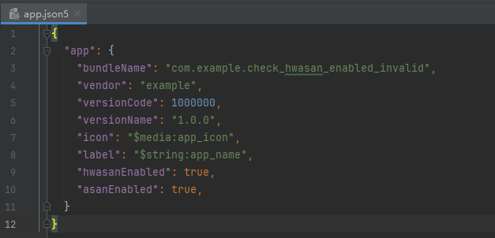
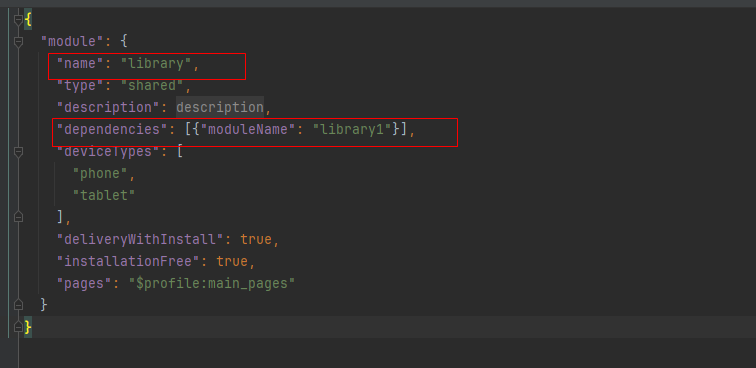
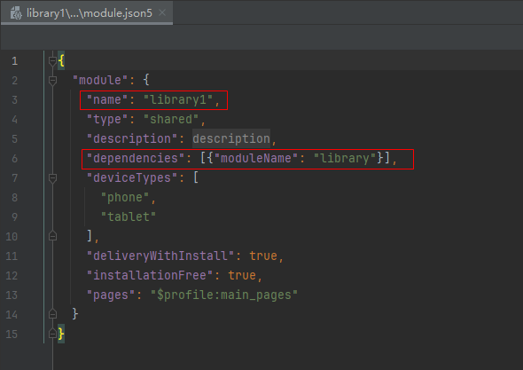

# 打包工具

打包工具用于在程序编译完成后，对编译出的文件等进行打包，以供安装发布。开发者可以使用DevEco Studio进行打包，也可使用打包工具的JAR包进行打包，JAR包通常存放在SDK路径下的toolchains目录中。

打包工具支持生成：Ability类型的模块包（HAP）、动态共享包（HSP）、应用程序包（App）、快速修复模块包（HQF）、快速修复包（APPQF）。


## 约束与限制

打包工具需要运行在Java8及其以上环境。


## HAP打包指令

开发者可以使用打包工具的JAR包对模块进行打包，通过传入打包选项、文件路径，生成所需的HAP包。

- Stage模型示例：


    ```
    java -jar app_packing_tool.jar --mode hap --json-path <path> [--resources-path <path>] [--ets-path <path>] [--index-path <path>] [--pack-info-path <path>] [--lib-path <path>] --out-path <path> [--force true] [--compress-level 5] [--pkg-context-path <path>] [--hnp-path <path>]
    ```

- FA模型示例：


    ```
    java -jar app_packing_tool.jar --mode hap --json-path <path> [--maple-so-path <path>] [--profile-path <path>] [--maple-so-dir <path>] [--dex-path <path>] [--lib-path <path>] [--resources-path <path>] [--index-path <path>] --out-path <path> [--force true] [--compress-level 5]
    ```

**表1** HAP打包指令参数说明

| 指令             | 是否必选项 | 选项          | 描述                                                         | 备注            |
| ---------------- | ---------- | ------------- | ------------------------------------------------------------ | --------------- |
| --mode           | 是         | hap           | 打包类型。                                                   | NA              |
| --json-path      | 是         | NA            | .json文件路径.FA模型文件名必须为config.json；Stage模型文件名必须为module.json。 | NA              |
| --profile-path   | 否         | NA            | CAPABILITY.profile文件路径。                                 | NA              |
| --maple-so-path  | 否         | NA            | maple so文件输入路径，so文件路径，文件名必须以.so为后缀。如果是多个so需要用“，”分隔。 | NA              |
| --maple-so-dir   | 否         | NA            | maple so目录输入路径。                                       | NA              |
| --dex-path       | 否         | NA            | dex文件路径，文件名必须以.dex为后缀。如果是多个dex需要用“，”分隔。 <br/>dex文件路径也可以为目录。 | NA              |
| --lib-path       | 否         | NA            | lib库文件路径。                                              | NA              |
| --resources-path | 否         | NA            | resources资源包路径。                                        | NA              |
| --index-path     | 否         | NA            | .index文件路径，文件名必须为resources.index。                | NA              |
| --pack-info-path | 否         | NA            | pack.info文件路径，文件名必须为pack.info。                   | NA              |
| --rpcid-path     | 否         | NA            | rpcid.sc文件路径，文件名必须为rpcid.sc。                     | NA              |
| --js-path        | 否         | NA            | 存放js文件目录路径。                                         | 仅stage模型生效 |
| --ets-path       | 否         | NA            | 存放ets文件目录路径。                                        | 仅stage模型生效 |
| --out-path       | 是         | NA            | 目标文件路径，文件名必须以.hap为后缀。                       | NA              |
| --force          | 否         | true或者false | 默认值为false，如果为true，表示当目标文件存在时，强制删除。  | NA              |
| --an-path        | 否         | NA            | 存放an文件的路径。                                           | 仅stage模型生效 |
| --ap-path        | 否         | NA            | 存放ap文件的路径。                                           | 仅stage模型生效 |
| --dir-list       | 否         | NA            | 可指定目标文件夹列表，将其打入HAP包内。                      | NA              |
| --compress-level | 否         | number        | 压缩等级，默认值1，可选等级1-9。在应用配置compressNativeLibs参数为true的情况下生效，数值越大压缩率越高、压缩速度越慢。 | NA  |
| --pkg-context-path      | 否         | NA            | 可指定语境信息表文件路径，文件名必须为pkgContextInfo.json。 | 仅stage模型生效              |
| --hnp-path | 否 | NA | 指定native软件包文件路径，将native软件包打入HAP包内。 | NA |

## HSP打包指令

HSP包实现了多个HAP对文件的共享，开发者可以使用打包工具的jar包对应用进行打包，通过传入打包选项、文件路径，生成所需的HSP包。

示例：
```
java -jar app_packing_tool.jar --mode hsp --json-path <path> [--resources-path <path>] [--ets-path <path>] [--index-path <path>] [--pack-info-path <path>] [--lib-path <path>] --out-path <path> [--force true] [--compress-level 5] [--pkg-context-path <path>]
```

**表2** HSP打包指令参数说明

| 指令             | 是否必选项 | 选项          | 描述                                                         |
| ---------------- | ---------- | ------------- | ------------------------------------------------------------ |
| --mode           | 是         | hsp           | 打包类型。                                                   |
| --json-path      | 是         | NA            | .json文件路径，文件名必须为module.json。                     |
| --profile-path   | 否         | NA            | CAPABILITY.profile文件路径。                                 |
| --dex-path       | 否         | NA            | 1.dex文件路径，文件名必须以.dex为后缀。如果是多个dex需要用“，”分隔。<br/>2.dex文件路径也可以为目录。 |
| --lib-path       | 否         | NA            | lib库文件路径。                                              |
| --resources-path | 否         | NA            | resources资源包路径。                                        |
| --index-path     | 否         | NA            | .index文件路径，文件名必须为resources.index。                |
| --pack-info-path | 否         | NA            | pack.info文件路径，文件名必须为pack.info。                   |
| --js-path        | 否         | NA            | 存放js文件目录路径。                                         |
| --ets-path       | 否         | NA            | 存放ets文件目录路径。                                        |
| --out-path       | 是         | NA            | 目标文件路径，文件名必须以.hsp为后缀。                       |
| --force          | 否         | true或者false | 默认值为false，如果为true，表示当目标文件存在时，强制删除。  |
| --compress-level | 否         | number        | 压缩等级，默认值1，可选等级1-9。在应用配置compressNativeLibs参数为true的情况下生效，数值越大压缩率越高、压缩速度越慢。 |
| --pkg-context-path      | 否         | NA            | 可指定语境信息表文件路径，文件名必须为pkgContextInfo.json。 |

## App打包指令

开发者可以使用打包工具的jar包对应用进行打包，通过传入打包选项、文件路径，生成所需的App包。App包用于上架应用市场。

**App打包时HAP合法性校验：** 在对工程内的HAP包打包生成App包时，需要保证被打包的每个HAP在json文件中配置的bundleName、versionCode、minCompatibleVersionCode、debug、minAPIVersion、targetAPIVersion相同，moduleName唯一。对于FA模型，还需要保证json文件中配置的package唯一。HAP模块之间需要保证apiReleaseType相同，HSP模块不校验apiReleaseType。

**打包App时的压缩规则：** 打包App时，对release模式的HAP、HSP包会进行压缩，对debug模式的HAP、HSP包不会压缩。

>**说明：**
>
>从API version 12开始，App打包不再对versionName校验。

示例：

```
java -jar app_packing_tool.jar --mode app [--hap-path <path>] [--hsp-path <path>] --out-path <path> [--signature-path <path>] [--certificate-path <path>] --pack-info-path <path> [--force true] [--encrypt-path <path>]
```

**表3** App打包指令参数说明

| 指令                 | 是否必选项 | 选项          | 描述                                                           |
|--------------------|-------|-------------|--------------------------------------------------------------|
| --mode             | 是     | app         | 多个HAP需满足HAP的合法性校验。                                           |
| --hap-path         | 否     | NA          | HAP包文件路径，文件名必须以.hap为后缀。如果是多个HAP包需要用“，”分隔。<br/>HAP包文件路径也可以是目录。 |
| --hsp-path         | 否     | NA          | HSP包文件路径，文件名必须以.hsp为后缀。如果是多个HSP包需要用“，”分隔。<br/>HSP包文件路径也可以是目录。 |
| --pack-info-path   | 是     | NA          | 文件名必须为pack.info。                                             |
| --out-path         | 是     | NA          | 目标文件路径，文件名必须以.app为后缀。                                        |
| --signature-path   | 否     | NA          | 签名路径。                                                        |
| --certificate-path | 否     | NA          | 证书路径。                                                        |
| --pack-res-path    | 否     | NA          | pack.res快照文件路径。                                 |
| --force            | 否     | true或者false | 默认值为false，如果为true，表示当目标文件存在时，强制删除。                           |
| --encrypt-path     | 否     | NA          | 文件名必须为encrypt.json 。                           |


## 多工程打包指令

多工程打包适用于多个团队开发同一个应用，但不方便共享代码的情况。开发者通过传入已经打好的HAP、HSP和App包，将多个包打成一个最终的App包，并上架应用市场。

**多工程打包HAP合法性校验：** 需要保证被打包的每个HAP在json文件中配置的bundleName、versionCode、minCompatibleVersionCode、debug属性相同，minAPIVersion、targetAPIVersion、compileSdkVersion、compileSdkType相同，moduleName唯一，同一设备entry唯一。对于FA模型，还需要保证json文件中配置的package唯一。HAP模块之间需要保证apiReleaseType相同，HSP模块不校验apiReleaseType。

>**说明：**
>
>从API version 12开始，多工程打包不再对versionName校验。

示例：

```
java -jar app_packing_tool.jar --mode multiApp [--hap-list <path>] [--hsp-list <path>] [--app-list <path>] --out-path <option> [--force true] [--encrypt-path <path>]
```

**表4** 多工程打包指令参数说明

| 指令         | 是否必选项 | 选项        | 描述                                                                                                  |
|------------|-------|-----------|-----------------------------------------------------------------------------------------------------|
| --mode     | 是     | multiApp  | 打包类型，在将多个HAP打入同一个App时，需保证每个HAP满足合法性校验规则。                                                            |
| --hap-list | 否     | HAP的路径    | HAP包文件路径，文件名必须以.hap为后缀。如果是多个HAP包需要”，“分隔。<br/>HAP文件路径也可以是目录。                                          |
| --hsp-list | 否     | HSP的路径    | HSP包文件路径，文件名必须以.hsp为后缀。如果是多个HSP包需要”，“分隔。<br/>HSP文件路径也可以是目录。                                          |
| --app-list | 否     | App的路径    | App文件路径，文件名必须以.app为后缀。如果是多个App包需要用”，“分隔。<br/>App文件路径也可以是目录。<br/>--hap-list，--hsp-list，--app-list不可以都不传。 |
| --out-path | 是     | NA | 目标文件路径，文件名必须以.app为后缀。 |
| --force    | 否     | true或者false | 默认值为false，如果为true，表示当目标文件存在时，强制删除。                                                                  |
| --encrypt-path | 否     | encrypt.json的路径 | 文件名必须为encrypt.json。                                                                  |


## HQF打包指令

HQF包适用于应用存在一些问题，需要紧急修复的场景。开发者可以使用打包工具的jar包对应用进行打包，通过传入打包选项、文件路径，生成所需的HQF包。

示例:

```
java -jar app_packing_tool.jar --mode hqf --json-path <path> [--lib-path <path>] [--ets-path <path>] [--resources-path <path>] --out-path <path> [--force true]
```

**表5** HQF打包指令参数说明

| 指令          | 是否必选项 | 选项          | 描述                                 |
|-------------|-------|-------------|------------------------------------|
| --mode      | 是     | hqf         | 打包类型。                              |
| --json-path | 是     | NA          | .json文件路径，文件名必须为patch.json。        |
| --lib-path  | 否     | NA          | lib库文件的路径。                         |
| --ets-path  | 否     | NA          | 存放ets文件目录路径。                       |
| --resources-path  | 否     | NA          | resources资源包路径。                       |
| --out-path  | 是     | NA          | 目标文件路径，文件名必须以.hqf为后缀。              |
| --force     | 否     | true或者false | 默认值为false，如果为true，表示当目标文件存在时，强制删除。 |

## APPQF打包指令

APPQF包由一个或多个HQF文件组成。这些HQF包在应用市场会从APPQF包中拆分出来，再被分发到具体的设备上。开发者可以使用打包工具的jar包对应用进行打包，通过传入打包选项、文件路径，生成所需的APPQF包。

示例:

```
java -jar app_packing_tool.jar --mode appqf --hqf-list <path> --out-path <path> [--force true]
```

**表6** APPQF打包指令参数说明

| 指令         | 是否必选项 | 选项          | 描述                                 |
|------------|-------|-------------|------------------------------------|
| --mode     | 是     | appqf       | 打包类型。                              |
| --hqf-list | 是     | NA          | HQF文件路径，多个HQF以英文逗号隔开。              |
| --out-path | 是     | NA          | 目标文件路径，文件名必须以.appqf为后缀。            |
| --force    | 否     | true或者false | 默认值为false，如果为true，表示当目标文件存在时，强制删除。 |

## 版本归一指令（versionNormalize）

同一个App中，所有HAP、HSP包的versionName和versionCode需要保持一致。当只有一个HAP或HSP需要修改升级时，可以调用此命令，将多个HAP、HSP的版本统一。本命令会修改所传入的HAP、HSP的版本号和版本名称，并在指定目录生成修改后的同名HAP、HSP，以及一个version_record.json文件，用于记录所有HAP、HSP原有的版本号、版本名称。

示例：
```
java -jar path\app_packing_tool.jar --mode versionNormalize --input-list 1.hap,2.hsp --version-code 1000001 --version-name 1.0.1 --out-path path\out\
```

**表7** versionNormalize指令参数说明

| 指令             | 是否必选项 | 选项               | 描述                                                                |
|----------------|-------|------------------|-------------------------------------------------------------------|
| --mode         | 是     | versionNormalize | 命令类型。                                                             |
| --input-list   | 是     | HAP或HSP的路径       | 1.HAP或HSP包文件路径，文件名必须以.HAP或.HSP为后缀。如果是多个HAP或HSP包需要“,”分隔。<br/>2.传入目录时，会读取目录下所有的HAP和HSP文件。 |
| --version-code | 是     | 版本号              | 指定的版本号，HAP、HSP的版本号会被修改为该版本。需要为整数，且不小于所有传入的HAP、HSP的版本号。            |
| --version-name | 是     | 版本名称             | 指定的版本名称，HAP、HSP的版本名称会被修改为该版本名称。                                    |
| --out-path     | 是     | NA               | 目标文件路径，需要为一个目录。                                                   |

## 包名归一指令（packageNormalize）

此命令可以修改传入的HSP的包名和版本号，并在指定目录生成修改后的同名HSP。

示例：
```
java -jar path\app_packing_tool.jar --mode packageNormalize --hsp-list path\1.hsp,path\2.hsp --bundle-name com.example.myapplication --version-code 1000001 --out-path path\out\
```

**表8**  参数含义及规范

| 指令             | 是否必选项 | 选项            | 描述                                                  |
|----------------|-------|---------------|-----------------------------------------------------|
| --mode         | 是     | packageNormalize | 命令类型。                                               |
| --hsp-list     | 是     | HSP的路径      | 1.HSP包文件路径，文件名必须以.hsp为后缀。如果是多个HSP包需要“,”分隔。<br/>2.HSP包目录。 |
| --bundle-name  | 是     | 包名            | 指定的包名，HSP的包名会被修改为指定的包名。                             |
| --version-code | 是     | 版本号           | 指定的版本号，HSP的版本号会被修改为该版本号。需要为整数，且大于0。                 |
| --out-path     | 是     | NA            | 目标文件路径，需要为一个目录。                                     |

## res模式打包指令

此命令用于打包元服务快照资源。

示例：

```
java -jar app_packing_tool.jar --mode res --entrycard-path <path> --pack-info-path <path> --out-path <path> [--force true]
```

**表9** 参数含义及规范

| 指令               | 是否必选项 | 选项            | 描述                                 |
|------------------|-------|---------------|------------------------------------|
| --mode           | 是     | res           | 命令类型。                              |
| --entrycard-path | 是     | NA            | 快照目录的路径。                           |
| --pack-info-path | 是     | NA            | pack.info文件路径。              |
| --out-path       | 是     | NA            | 目标文件路径，文件名必须以.res为后缀。              |
| --force          | 否     | true或者false   | 默认值为false，如果为true，表示当目标文件存在时，强制删除。 |

## fastApp模式打包指令

开发者可以使用打包工具的jar包对应用进行打包，通过传入打包选项、HAP、HSP包文件目录路径，生成所需的App包。App包用于上架应用市场。

**App打包时HAP合法性校验：** 在对工程内的HAP包打包生成App包时，需要保证被打包的每个HAP在json文件中配置的bundleName、versionCode、minCompatibleVersionCode、debug、minAPIVersion、targetAPIVersion相同，moduleName唯一。HAP模块之间需要保证apiReleaseType相同，HSP模块不校验apiReleaseType。

**打包App时的压缩规则：** 打包App时，对release模式的HAP、HSP包会进行压缩，对debug模式的HAP、HSP包不会压缩。

示例：

```
java -jar app_packing_tool.jar --mode fastApp [--hap-path <path>] [--hsp-path <path>] --out-path <path> [--signature-path <path>] [--certificate-path <path>] --pack-info-path <path> [--pack-res-path <path>] [--force true] [--encrypt-path <path>]
```

**表10** 参数含义及规范

| 指令                 | 是否必选项 | 选项         | 描述                                                                                                    |
|--------------------|-------|------------|-------------------------------------------------------------------------------------------------------|
| --mode             | 是     | fastApp    | 多个HAP需满足HAP的合法性校验。                                                                                    |
| --hap-path         | 否     | NA         | HAP包文件目录路径，目录内要包含一个完整的HAP包的所有文件。允许传入多个路径，多个路径需要用英文“,”分隔。                                              |
| --hsp-path         | 否     | NA         | 1.HSP包文件路径，文件名必须以.hsp为后缀。如果是多个HSP包需要用英文“,”分隔。2.HSP包文件目录路径，目录内要包含一个完整的HSP包的所有文件。允许传入多个路径，多个路径需要用英文“,”分隔。 |
| --pack-info-path   | 是     | NA         | 文件名必须为pack.info。                                                                                      |
| --out-path         | 是     | NA         | 目标文件路径，文件名必须以.app为后缀。                                                                                 |
| --signature-path   | 否     | NA         | 签名路径。                                                                                                 |
| --certificate-path | 否     | NA         | 证书路径。                                                                                                 |
| --pack-res-path    | 否     | NA         | pack.res快照文件路径。                                                                          |
| --force            | 否     | true或者false | 默认值为false，如果为true，表示当目标文件存在时，强制删除。                                                                    |
| --encrypt-path     | 否     | NA         | 文件名必须为encrypt.json。                                                                    |

## 打包工具工具错误码

### 10010001 执行打包工具失败
**错误信息**

Execute packing tool failed.

**错误描述**

执行构建打包操作时，例如构建HAP包或App包，打包失败。

**可能原因**

1. 解析打包参数命令失败。
2. 打包过程中校验打包文件合法性不通过。

**处理步骤**

1. 检查打包指令参数是否正确，例如传入参数为文件路径时，确保该路径下存在该文件。详细可参考[打包指令](https://developer.huawei.com/consumer/cn/doc/harmonyos-guides-V13/packing-tool-V13#hap打包指令)。
2. 根据相关报错信息检查 HAP 包的合法性。打包生成 App 包时，需要确保：
   - 每个HAP在JSON文件中配置的`bundleName`、`versionCode`、`minCompatibleVersionCode`、`debug`、`minAPIVersion`、`targetAPIVersion`相同。
   - `moduleName`唯一。
   - FA 模型需确保`package`唯一。
   - HAP 模块之间`apiReleaseType`需相同（HSP模块不校验`apiReleaseType`）。

### 10012001 执行打包操作失败
**错误信息**

Execute compress process failed.

**错误描述**

执行打包操作时，例如构建HAP包或App包，打包失败。

**可能原因**

1. 打包文件校验不通过。
2. 需要打包的文件正在被其他程序使用。

**处理步骤**

1. 根据相关日志检查打包文件内容是否正确。
2. 关闭使用打包文件的相关程序或进程。

### 10012002 压缩HAP失败
**错误信息**

Compress Stage Hap failed.

**错误描述**

打包HAP时，压缩Stage类型HAP包失败。

**可能原因**

校验HAP包内容失败。

**处理步骤**

根据错误信息提示进行修改。

### 10012003 校验HAP信息失败
**错误信息**

Verify stage hap info failed.

**错误描述**

打包HAP时，校验Stage类型HAP包配置信息失败。

**可能原因**

1. `asanEnabled`配置错误。
2. `hwasanEnabled`配置错误。
3. `atomicService`配置错误。
4. `continueBundleName`配置错误。

**处理步骤**

1. 参考[asanEnabled配置错误](packing-tool.md#10012004-检查参数- asanEnabled-失败)。
2. 参考[hwasanEnabled配置出错](packing-tool.md#10012005-检查参数hwasanenabled失败)。
3. 参考[atomicService配置出错](packing-tool.md#10012006-检查-atomicservice-失败)。
4. 参考[continueBundleName配置出错](packing-tool.md#10012007-检查-continuebundlename-无效)。

### 10012004 检查参数asanEnabled失败
**错误信息**

Check asanEnabled failed.

**错误描述**

构建HAP/HSP时,app.json5中`asanEnabled`设置错误。

**可能原因**

`asanEnabled`和`tsanEnabled`被同时设置为true。如下图所示：
   

**处理步骤**

修改`asanEnabled`和`tsanEnabled`，确保二者不会同时为`true`。

### 10012005 检查参数hwasanEnabled失败
**错误信息**

Check hwasanEnabled failed.

**错误描述**

构建HAP/HSP时，参数`hwasanEnabled`设置错误。

**可能原因**

1. `hwasanEnabled`和`asanEnabled`被同时设置为true。
   
2. `hwasanEnabled`和`tsanEnabled`被同时设置为true。
3. `hwasanEnabled`和`GWPAsanEnabled`被同时设置为true。

**处理步骤**

修改app.json5，确保`hwasanEnabled`、`asanEnabled`、`tsanEnabled`和`GWPAsanEnabled`不会同时为true。

### 10012006 检查atomicService失败
**错误信息**

Check atomicService failed.

**错误描述**

检查元服务失败。

**可能原因**

1. entry模块中不含ability。
2. 当bundleType配置为元服务时，模块中的installationFree为false。

**处理步骤**

1. 确保entry模块中包含ability。
2. 修改bundleType或installationFree。

### 10012007 检查continueBundleName无效
**错误信息**

Check continueBundleName invalid.

**错误描述**
检查模块中配置的continueBundleName是无效的。

**可能原因**

continueBundleName与当前包名称相同。

**处理步骤**

检查continueBundleName中是否存在自身包名。

### 10012008 检查overlay失败
**错误信息**

Check whether is an overlay hsp failed.

**错误描述**

配置动态共享包（HSP）时，配置targetModuleName标识指定的目标module存在错误。

**可能原因**

1. 模块中同时配置了targetModuleName与requestPermissions。
2. targetModuleName设置为自己的moduleName。
3. 模块中未配置targetModuleName或targetBundleName，但配置了targetPriority。
4. 应用配置targetBundleName, 但是模块中未配置targetModuleName。
5. targetBundleName与自身bundleName相同。

**处理步骤**

1. 检查配置文件，确保targetModuleName和requestPermissions不会同时出现。
2. 根据需要修改targetModuleName。
3. 根据需要修改相关配置，确保配置targetPriority前配置了targetModuleName或targetBundleName。
4. 根据需要增加targetModuleName。
5. 根据需要修改targetBundleName。

### 10012009 执行压缩操作时异常
**错误信息**

Process compress exception.

**错误描述**

压缩HAP/HSP/App时存在异常。

**可能原因**

校验HAP/HSP/App内容错误。

**处理步骤**

通常会有其他错误码及错误信息给出，根据相关报错信息进行修改。

### 10012015 构建App包失败
**错误信息**

Compress app file failed.

**错误描述**

构建App类型的包时失败。

**可能原因**

校验App打包文件失败。

**处理步骤**

通常会有其他错误码及错误信息给出，根据相关报错信息进行修改。

### 10012017 检查SharedAPP无效
**错误信息**

Check shared App mode invalid.

**错误描述**

构建Shared类型的App包时，检查打包文件不通过。

**可能原因**

1. 存在两个以上的hsp模块。
2. hsp包依赖了其他包。

**处理步骤**

1. 检查打包文件类型确保hsp模块不超过一个。
2. 删除hsp模块配置的dependencies。

### 10012022 校验Stage HSP失败
**错误信息**

Verify stage hsp info failed.

**错误描述**

打包HAP时，校验Stage类型HSP包失败。

**可能原因**

1. `asanEnabled`配置出错。
2. `hwasanEnabled`配置出错。
3. `atomicService`配置出错。
4. `continueBundleName`配置出错。
5. overlay配置出错。

**处理步骤**

1. 参考[asanEnabled配置错误](packing-tool.md#10012004-检查参数-asanEnabled-失败)。
2. 参考[hwasanEnabled配置出错](packing-tool.md#10012005-检查参数hwasanenabled失败)。
3. 参考[atomicService配置出错](packing-tool.md#10012006-检查-atomicservice-失败)。
4. 参考[continueBundleName配置出错](packing-tool.md#10012007-检查-continuebundlename-无效)。
5. 参考[overlay配置出错](packing-tool.md#10012008-检查-overlay-失败)。

### 10013006 检查entry模块中的ability失败
**错误信息**

check entry module at least one ability failed.

**错误描述**

检测到entry模块中没有ability。

**可能原因**

Entry类型的模块中不存在ability。

**处理步骤**

确认Entry类型的模块至少配置了一个ability。

### 10013007 检查installationFree错误
**错误信息**

Check module atomicService installationFree invalid.

**错误描述**

检查元服务和installationFree配置出错。

**可能原因**

1. bundleType配置了无效值。
2. 当bundleType为shared时，installationFree不为false。
3. 当installationFree为true时，bundleType为atomicService以外的配置。

**处理步骤**

1. 检查bundleType是否为以下值app, atomicService, shared, appService。
2. 根据需要修改bundleType或installationFree。
3. 根据需要修改bundleType或installationFree。

### 10014001 未找到可用文件
**错误信息**

File available not found exception.

**错误描述**

使用打包工具打包时，需要打包的文件不可使用。

**可能原因**

1. 传入文件地址不正确。
2. 文件正在被使用。
3. 文件权限不允许。

**处理步骤**

1. 检查传入参数的文件地址是否存在该文件。
2. 关闭使用文件的相关程序或进程。
3. 检查文件的使用权限。

### 10016003 检查分发策略交集错误
**错误信息**

Check two distroFilter policy disjoint invalid.

**错误描述**

当一个工程中存在多个Entry，且多个Entry配置的deviceTypes存在交集时，检查Entry对应配置的分发策略时出错。

**可能原因**

1. 分发策略`policy`和`value`标签为空或无效值。

**处理步骤**

1. 检查分发策略相关配置，确保`policy`的值均为`include`或`exclude`, 可参考[distributionFilter标签](https://developer.huawei.com/consumer/cn/doc/harmonyos-guides-V5/module-configuration-file-V5#distributionfilter标签)。

### 10016006 检查HAP包无效
**错误信息**

Verify hap info is invalid.

**错误描述**

构建App包时，检查用于打包的HAP包无效。

**可能原因**

1. 传入的HAP文件路径有错。
2. 不同HAP包App配置不同。
3. FA模型packageName重复。
4. 模块依赖项无效。
5. 元服务应用预加载失败。
6. 目标模块未找到。
7. 不同HAP编译sdk版本不一致。

**处理步骤**

1. 检查打包参数传入HAP的路径是否正确包含HAP包。
2. 检查不同HAP中App的配置是否相同。
3. 检查config.json中是否存在重复的packageName。
4. 检查打包模块中是否存在循坏依赖或无效的依赖项。
5. 检查元服务预加载模块是否存在且非自身。
6. 检查目标模块是否存在。
7. 检查不同模块使用的编译sdk版本是否一致。

### 10016007 检查entry模块无效
**错误信息**

Check entry module invalid.

**错误描述**

当一个工程中存在多个Entry，检查多个Entry配置时出错。

**可能原因**

多个Entry模块的配置的deviceType或distroFilter存在交集，未满足HAP唯一性校验逻辑。

**处理步骤**

根据[HAP唯一性校验](https://developer.huawei.com/consumer/cn/doc/harmonyos-guides-V5/ide-hvigor-verification-rule-V5)修改工程中的entry模块。

### 10016009 检查依赖错误
**错误信息**

Check dependency list is invalid.

**错误描述**

检查模块之间的依赖无效。

**可能原因**

1. 存在循环依赖
    例如：模块library依赖了library1, library1依赖了library, 则这两个模块之间构成循环依赖。
   
   
2. 依赖的模块类型为entry或feature。

**处理步骤**

1. 修改module.josn5中`dependencies`的配置， 删除循环依赖，确保App中不存在循环依赖。
2. 修改module.josn5中`dependencies`的配置，删除在entry或feature类型上配置的依赖。

### 10016010 检查元服务无效
**错误信息**

Check atomicservice is invalid.

**错误描述**

检查元服务应用无效。

**可能原因**

元服务预加载模块无效。

**处理步骤**

检查元服务预加载模块是否有效，不能配置自身modulename，且必须有对应的模块，取值为长度不超过31字节的字符串。

### 10016011 检查元服务预加载无效
**错误信息**

Atomicservice preloads is invalid.

**错误描述**

检查元服务预加载模块无效。

**可能原因**

1. 元服务预加载配置了重复模块。
2. 元服务预加载配置了不存在的模块。
3. 元服务预加载了配置了自身。

**处理步骤**

检查元服务预加载模块是否有效，不能配置自身moduleName，且必须有对应的模块存在。

### 10016012 目标模块不存在
**错误信息**

TargetModuleName is not exist.

**错误描述**

构建App时, 模块中配置了目标模块，检查目标模块不在打包工程中。

**可能原因**

工程中缺少匹配的目标模块。

**处理步骤**

检查目标模块是否存在工程中，创建目标模块。

### 10016014 代理数据不唯一
**错误信息**

Proxy data uri is not unique.

**错误描述**

模块中配置的代理数据uri不唯一。

**可能原因**

数据代理配置的uri存在重复。

**处理步骤**

去除代理数据中配置的重复的uri, 可参考[proxyData](https://developer.huawei.com/consumer/cn/doc/harmonyos-guides-V13/module-configuration-file-V13#proxydata标签)标签。

### 10016015 ContinueType配置无效
**错误信息**

Check continueType is invalid.

**错误描述**

构建App时，检查到ContinueType配置出错。

**可能原因**

1. 同一个module中不同的Ability存在重复的continueType。
2. 不同的module中同时存在重复的device类型和continueType。

**处理步骤**

去除重复的continueTypep或device配置。

### 10016016 文件大小检查错误
**错误信息**

Check file size failed.

**错误描述**

检查元服务单个包文件大小超过2MB。

**可能原因**

元服务单个包文件大小超过2MB。

**处理步骤**

减少对应单个文件包的大小。

### 10016018 元服务模块大小检查错误
**错误信息**

AtomicService module size check failed.

**错误描述**

检查元服务单个包和其依赖的共享库大小超过2MB。

**可能原因**

元服务单个包和其依赖的共享库大小超过2MB。

**处理步骤**

减少相应模块的大小。

### 10016019 检查分发策略无效
**错误信息**

Check feature module distributionFilter is invalid.

**错误描述**

检查Feature模块分发信息无效。

**可能原因**

工程中Entry模块分发策略配置存在错误，无法对Feature模块的分发信息进行匹配。

**处理步骤**
检查工程中Entry模块分发策略是否正确配置，例如配置 `policy` 为 `exclude` 或 `include`, 参考[distributionFilter标签](https://developer.huawei.com/consumer/cn/doc/harmonyos-guides-V13/module-configuration-file-V13#distributionfilter标签)。
