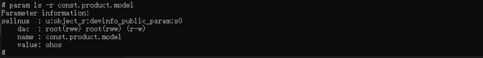
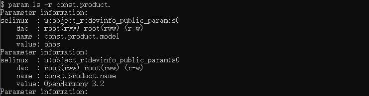
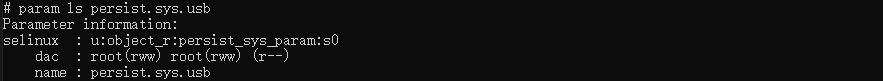

# param工具

param是为开发人员提供用于操作系统参数的工具，该工具只支持标准系统。

## 环境要求

* 获取<!--Del-->[<!--DelEnd-->hdc工具<!--Del-->](../../device-dev/subsystems/subsys-toolchain-hdc-guide.md)<!--DelEnd-->，执行hdc shell。
* 正常连接设备。

## param工具命令列表

  | 选项 | 说明 |
  | ----------------- | ------------------------------------------ |
  | -h | 获取param支持的命令。 |
  | ls [-r] [name] | 显示匹配name的系统参数信息。带"-r"则根据参数权限获取信息，不带"-r"则直接获取参数信息。 |
  | get [name] | 获取指定name系统参数的值；若不指定任何name，则返回所有系统参数。 |
  | set name value | 设置指定name系统参数的值为value。 |
  | wait name [value] [timeout] | 同步等待指定name系统参数与指定值value匹配。value支持模糊匹配，如"\*"表示任何值，"val\*"表示只匹配前三个val字符。timeout为等待时间（单位：s），不设置则默认为30s。 |
  | save | 保存persist参数到工作空间。 |

## 获取param支持的命令

* 获取param支持的命令，命令格式如下：

  ```bash
  param -h
  ```

## 获取系统参数信息

* 显示匹配name的系统参数信息，命令格式如下：

  ```bash
  param ls [-r] [name]
  ```
  **示例**<br>
  
  
  

## 获取系统参数的值

* 获取指定name系统参数的值，命令格式如下：

  ```bash
  param get [name]
  ```
  **示例**<br>
  

## 设置系统参数的值

* 设置指定name系统参数的值为value，命令格式如下：

  ```bash
  param set name value
  ```
  **示例**<br>
  

## 等待系统参数值匹配

* 同步等待指定name系统参数与指定值value匹配，命令格式如下：

  ```bash
  param wait name [value] [timeout]
  ```
  **示例**<br>
  

## 保存persist(可持久化)参数

* 保存persist(可持久化)参数到工作空间，命令格式如下：

  ```bash
  param save
  ```
  **示例**<br>
  
