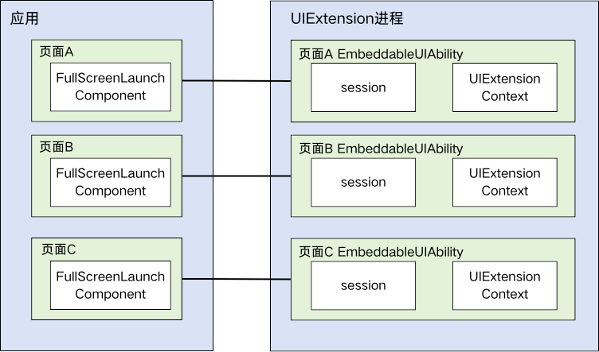
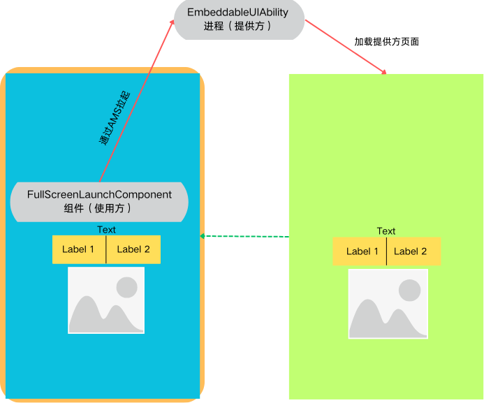

# 全屏启动原子化服务组件（FullScreenLaunchComponent）

FullScreenLaunchComponent允许开发者以全屏方式拉起原子化服务，使得应用能够提供更友好的用户体验。

## 基本概念

- [FullScreenLaunchComponent](../reference/apis-arkui/arkui-ts/ohos-arkui-advanced-FullScreenLaunchComponent.md)组件

  FullScreenLaunchComponent是由ArkUI提供的组件，允许在使用方应用中通过ArkTS的声明式范式进行定义和使用。<!--Del-->该组件基于[UIExtension](./arkts-ui-extension-components.md)封装，但不同于系统接口 [UIExtensionComponent](../reference/apis-arkui/arkui-ts/ts-container-ui-extension-component-sys.md)，<!--DelEnd-->FullScreenLaunchComponent向第三方应用开放使用权限，当被拉起方授权使用方应用嵌入式运行原子化服务时，使用方应用可全屏嵌入式运行该服务。若未授权，则使用方应用将以跳出式方式拉起原子化服务。

- [EmbeddableUIAbility](../reference/apis-ability-kit/js-apis-app-ability-embeddableUIAbility.md)组件

  提供方应用中定义使用，用于运行提供方应用在一个独立进程中，同时具备跳转启动和嵌入式启动两种启动方式。

## 实现原理

FullScreenLaunchComponent提供的一种全屏启动原子化服务的能力。需要拉起原子化服务时，拉起方向AMS查询拉起方是否授权使用方可以嵌入式运行原子化服务。已授权时，使用方全屏嵌入式运行原子化服务；未授权时，使用方跳出式拉起原子化服务。

<!--Del-->全屏嵌入式运行原子化服务是指，通过[UIExtension](./arkts-ui-extension-components.md)封装的组件方式嵌入到使用方的组件树中，拉起EmbeddableUIAbility，展示提供方的应用内容，以实现组件式的交互体验。<!--DelEnd-->

跳出式运行原子化服务是指，非组件化的方式拉起EmbeddableUIAbility，交互体验接近独立窗口。

## 能力范围

### 组件基本能力

- 当被拉起方授权使用方可以嵌入式运行原子化服务时，使用方全屏嵌入式运行原子化服务
- 当被拉起方未授权使用方可以嵌入式运行原子化服务时，使用方跳出式拉起原子化服务
- 提供图标占位自定义组件功能，控件展示图标占位，点击图标后拉起原子化服务

### EmbeddableUIAbility进程应用可用能力范围

FullScreenLaunchComponent为了实现跨应用的能力共享，存在较开放的灵活性，通过跨进程的方式拉起提供方应用提供的能力供当前使用方（宿主方）使用。在运行机制上，是两个进程之间的业务交互行为，和一般组件和宿主方存在根本上的差异。

以下给出针对FullScreenLaunchComponent，在EmbeddableUIAbility内提供方应用能够使用的属性、事件、组件、Node-API接口等方面的范围，便于使用方应用与提供方应用在使用FullScreenLaunchComponent组件时进行参照。

以下为当前组件不支持及部分支持的能力。

**通用属性**

不支持通用属性。

**组件**

应用提供方使用组件时，需要和使用方（宿主方）的组件、应用进程上下文交互的场景，默认不支持。主要包括如下场景：

- 组件展示效果范围超过组件本身的范围、控制影响到使用方应用侧的场景，如Navigation展示到安全区的场景；
- 组件能力依赖其他组件或者支持跨组件、跨应用控制与访问的场景，如PluginComponent提供访问其他组件，FormComponent卡片提供跨进程载体展示其他应用页面的能力；
- 组件能力依赖宿主方窗口信息、进程实例UIContext上下文实现能力、交互、动效等场景，如FolderStack组件；

详情如下：

| 组件                                                         | 能力规格 | 功能说明                                                     | 规格补充说明                                                 |
| ------------------------------------------------------------ | -------- | ------------------------------------------------------------ | ------------------------------------------------------------ |
| [FullScreenLaunchComponent (全屏启动原子化服务组件)](../reference/apis-arkui/arkui-ts/ohos-arkui-advanced-FullScreenLaunchComponent.md) | 不支持   | 全屏启动原子化服务组件，当被拉起方授权使用方可以嵌入式运行原子化服务时，使用方全屏嵌入式运行原子化服务；未授权时，使用方跳出式拉起原子化服务。 | 由于是一种跨应用调度的能力，FullScreenLaunchComponent中暂不支持嵌套拉起。  |
| <!--DelRow-->[PluginComponent (系统接口)](../reference/apis-arkui/arkui-ts/ts-basic-components-plugincomponent-sys.md) | 不支持   | 用于给插件组件的使用者请求组件和数据，使用者发送组件模板和数据。支撑SystemUI实现插件化方式集成其他业务提供的UI。 | 1、和FullScreenLaunchComponent能力类似，容易出现嵌套，增加复杂度。 2、由于FullScreenLaunchComponent组件的提供方已经在另一个进程中，默认能力下，无法提供访问宿主组件访问的能力。 |
| <!--DelRow-->[FormComponent（系统接口）](../reference/apis-arkui/arkui-ts/ts-basic-components-formcomponent-sys.md) | 不支持   | 提供卡片组件，实现卡片的显示功能。                           | 卡片组件提供的是跨进程的组件调用能力，FullScreenLaunchComponent中嵌套使用会导致进程关系复杂，导致功能性能方面的问题。 |
| <!--DelRow-->[IsolatedComponent (系统接口)](../reference/apis-arkui/arkui-ts/ts-container-isolated-component-sys.md) | 不支持   | IsolatedComponent用于支持在本页面内嵌入显示独立Abc（.abc文件）提供的UI，展示的内容在受限worker线程中运行。 | 由于云卡能力也是一种跨应用调度的能力，FullScreenLaunchComponent中暂不支持拉起云卡。 |
| [EmbeddedComponent](../reference/apis-arkui/arkui-ts/ts-container-embedded-component.md) | 不支持   | EmbeddedComponent用于支持在当前页面嵌入本应用内其他[EmbeddedUIExtensionAbility](../reference/apis-ability-kit/js-apis-app-ability-embeddedUIExtensionAbility.md)提供的UI。EmbeddedUIExtensionAbility在独立进程中运行，完成页面布局和渲染。 | 由于是一种跨应用调度的能力，FullScreenLaunchComponent中暂不支持嵌套拉起。  |
| <!--DelRow-->[RemoteWindow](../reference/apis-arkui/arkui-ts/ts-basic-components-remotewindow-sys.md) | 不支持   | 远程控制窗口组件，可以通过此组件控制应用窗口，提供启动退出过程中控件动画和应用窗口联动动画能力。 | FullScreenLaunchComponent中的组件已经在另一个进程中，无法影响控制宿主应用的窗口。 |
| [RichText](../reference/apis-arkui/arkui-ts/ts-basic-components-richtext.md) | 不支持   | 富文本组件，解析并显示HTML格式文本。                         | —                                                            |
| [FolderStack](../reference/apis-arkui/arkui-ts/ts-container-folderstack.md) | 不支持   | 通常用于有Abc热更新诉求的模块化开发场景。FolderStack继承于Stack(层叠布局)控件，新增了折叠屏悬停能力，通过识别upperItems自动避让折叠屏折痕区后移到上半屏。 | 折叠屏划分组件能力，需要和宿主方窗口形成联动，从而需要在提供方内获取宿主主窗的信息，目前无法支持。 |
| [XComponent](../reference/apis-arkui/arkui-ts/ts-basic-components-xcomponent.md) | 不支持   | 可用于EGL/OpenGLES和媒体数据写入，并显示在XComponent组件。   | —                                                            |
| [FormLink](../reference/apis-arkui/arkui-ts/ts-container-formlink.md) | 不支持   | 提供静态卡片交互组件，用于静态卡片内部和提供方应用间的交互，当前支持router、message和call三种类型的事件。 | 卡片提供的是跨进程的组件调用能力，FullScreenLaunchComponent中嵌套使用会导致进程关系复杂，导致功能性能方面的问题。 |
| [HyperLink](../reference/apis-arkui/arkui-ts/ts-container-hyperlink.md) | 不支持   | 超链接组件，组件宽高范围内点击实现跳转。                     | —                                                            |
| [ContextMenu](../reference/apis-arkui/arkui-ts/ts-methods-menu.md) | 不支持   | 在页面范围内关闭通过[bindContextMenu](../reference/apis-arkui/arkui-ts/ts-universal-attributes-menu.md#bindcontextmenu12)属性绑定的菜单。 | —                                                            |
| [警告弹窗](../reference/apis-arkui/arkui-ts/ts-methods-alert-dialog-box.md) | 部分支持 | 显示警告弹窗组件，可设置文本内容与响应回调。若在FullScreenLaunchComponent中设置showInSubWindow为true, 弹窗将基于FullScreenLaunchComponent的宿主窗口对齐。 | 需要依赖主窗的信息实现弹窗对齐，弹窗组件基于FullScreenLaunchComponent提供的信息获取宿主应用的窗口信息实现了对齐应用窗口的能力。仅限于窗口对齐。 |
| [列表选择弹窗](../reference/apis-arkui/arkui-ts/ts-methods-action-sheet.md) | 部分支持 | 列表弹窗。若在FullScreenLaunchComponent中设置showInSubWindow为true, 弹窗将基于FullScreenLaunchComponent的宿主窗口对齐。 | 需要依赖主窗的信息实现弹窗对齐，弹窗组件基于FullScreenLaunchComponent提供的信息获取宿主应用的窗口信息实现了对齐应用窗口的能力。仅限于窗口对齐。 |
| [自定义弹窗](../reference/apis-arkui/arkui-ts/ts-methods-custom-dialog-box.md) | 部分支持 | 通过CustomDialogController类显示自定义弹窗。使用弹窗组件时，可优先考虑自定义弹窗，便于自定义弹窗的样式与内容。若在FullScreenLaunchComponent中设置showInSubWindow为true, 弹窗将基于FullScreenLaunchComponent的宿主窗口对齐。 | 需要依赖主窗的信息实现弹窗对齐，弹窗组件基于FullScreenLaunchComponent提供的信息获取宿主应用的窗口信息实现了对齐应用窗口的能力。仅限于窗口对齐。 |
| [Navigation](../reference/apis-arkui/arkui-ts/ts-basic-components-navigation.md) | 部分支持 | 该组件从API Version 11开始默认支持安全区避让特性(默认值为：expandSafeArea([SafeAreaType.SYSTEM], [SafeAreaEdge.TOP, SafeAreaEdge.BOTTOM]))，开发者可以重写该属性覆盖默认行为。 | 1、如果FullScreenLaunchComponent未设置模态或沉浸式，Navigation无法扩展到安全区。 2、无法路由到宿主方的页面中。 |

**Node-API接口**

Native API接口提供能力，在FullScreenLaunchComponent场景下也需要考虑是否是跨出当前组件的能力，以及和使用方（宿主方）组件、应用进程上下文交互的场景。主要包括如下场景：

- 接口功能所需的信息依赖使用方的上下文、窗口等信息，如UIContext。
- 接口功能控制非组件本身，需要控制影响其他组件或者使用方应用侧的场景，如用户界面外观。

详情如下：

| 模块                                                         | 能力规格 | 功能说明                                                     | 规格补充说明                                                 |
| ------------------------------------------------------------ | -------- | ------------------------------------------------------------ | ------------------------------------------------------------ |
| [页面间转场](../reference/apis-arkui/arkui-ts/ts-page-transition-animation.md) | 不支持   | 当路由进行切换时，可以通过在pageTransition函数中自定义页面入场和页面退场的转场动效。 | —                                                            |
| [组件内隐式共享元素转场](../reference/apis-arkui/arkui-ts/ts-transition-animation-geometrytransition.md) | 不支持   | 在视图切换过程中提供丝滑的上下文传承过渡。通用transition机制提供了opacity、scale等转场效果，geometryTransition通过安排绑定的in/out组件(in指新视图、out指旧视图)的frame、position使得原本独立的transition动画在空间位置上发生联系，将视觉焦点由旧视图位置引导到新视图位置。 | —                                                            |
| [componentUtils](../reference/apis-arkui/js-apis-arkui-componentUtils.md) | 不支持   | 提供获取组件绘制区域坐标和大小的能力。                       | 获取信息来自于窗口，默认情况下直接获取到的位置信息是EmbeddableUIAbility的WindowProxy的信息，非宿主应用的主窗口信息。 |
| [UIContext](../reference/apis-arkui/arkts-apis-uicontext-uicontext.md) | 不支持   | @ohos.window在API version 10 新增[getUIContext](../reference/apis-arkui/arkts-apis-window-Window.md#getuicontext10)接口，获取UI上下文实例UIContext对象，使用UIContext对象提供的替代方法，可以直接作用在对应的UI实例上。 | 基于window获取，但FullScreenLaunchComponent内部默认方式下，提供方无真正的窗口承载，无法使用该接口获取到正确的UIContext。 |
| [DragController](../reference/apis-arkui/js-apis-arkui-dragController.md) | 不支持   | 本模块提供发起主动拖拽的能力，当应用接收到触摸或长按等事件时可以主动发起拖拽的动作，并在其中携带拖拽信息。 本模块功能依赖UI的执行上下文，不可在[UI上下文不明确](./arkts-global-interface.md)的地方使用，参见UIContext说明。 | 拖拽时通过UIContext上下文传递组件间的事件传递，使用方应用和提供方应用不共享UIContext内容，默认能力下无法支持拖拽事件的传递。 |
| [布局回调](../reference/apis-arkui/js-apis-arkui-inspector.md) | 部分支持 | 提供注册组件布局和绘制完成回调通知的能力。                   | 如果指定FullScreenLaunchComponent组件，预期是获得所有FullScreenLaunchComponent中的组件信息，尚未支持该能力；提供方内部可以正常使用。 |
| <!--DelRow-->[性能监测](../reference/apis-arkui/js-apis-arkui-performancemonitor-sys.md) | 不支持   | 用户操作场景提供性能相关指标监测能力，目前仅包含响应时延、完成时延、丢帧。| —                                                            |
| [注册自定义字体](../reference/apis-arkui/js-apis-font.md)    | 不支持   | 本模块提供注册自定义字体。                                   | 注册字体存在影响范围的问题，提供方侧无法影响使用方应用的字体。 |
| [PluginComponentManager](../reference/apis-arkui/js-apis-plugincomponent.md) | 不支持   | 用于给插件组件的使用者请求组件与数据，使用者发送组件模板和数据。 | 依赖获取其他组件的数据，提供方组件在另一个进程中，无法提供访问宿主组件的能力。 |
| <!--DelRow-->[用户界面外观(系统接口)](../reference/apis-arkui/js-apis-uiappearance-sys.md) | 不支持   | 用户界面外观提供管理系统外观的一些基础能力，目前仅包括深浅色模式配置。 | 提供方不能通过该能力影响使用方。                             |

## 约束与限制

### 安全能力约束

FullScreenLaunchComponent组件（使用方）可以访问调用集成了EmbeddableUIAbility的应用（提供方），提供了一种通用应用共享能力。FullScreenLaunchComponent能力无法独立提供安全保障机制，作为提供服务的应用（提供方）需要结合使用其他ArkUI的能力进行安全保护，以保护自己不被使用方应用攻击。

由于FullScreenLaunchComponent能力（包含基于FullScreenLaunchComponent衍生的相关能力）机制的灵活性，如果提供方应用存在安全方面的诉求，无法在现有FullScreenLaunchComponent的场景下解决的，建议优先使用其他方案。如选择继续采用FullScreenLaunchComponent能力，提供方应用以及使用方应用都需要承担一定的安全风险。

使用模式

- 当被拉起方授权使用方可以嵌入式运行原子化服务时，使用方全屏嵌入式运行原子化服务。
- 未授权时，使用方跳出式拉起原子化服务。

嵌入式模式下为了避免被使用方的子窗遮挡，使用方的交互行为将受限，使用方无法再创建任何子窗覆盖到提供方的窗口上。

### 嵌套约束

FullScreenLaunchComponent暂不支持嵌套，比如A应用(UIAbility)->B应用(EmbeddableUIAbility)->C应用(EmbeddableUIAbility)这种嵌套能力依赖。

### 事件处理机制约束

FullScreenLaunchComponent不支持通用事件，会将事件经过坐标转换后传递给提供方EmbeddableUIAbility处理。

对事件传递处理方式进行区分，针对不同事件使用场景确定同步或异步方式：

- 宿主进程与提供方进程的交互默认均是异步处理：优先考虑从默认机制上避免性能（影响整体交互体验）和死锁问题。
- 同步事件处理原则：能够支持同步的事件，触发频率较低，性能影响较小；尽量满足应用实际场景。

应用开发者使用FullScreenLaunchComponent能力时，需要遵守如下设计场景约束：

异步处理的事件场景：FullScreenLaunchComponent组件以及宿主应用侧组件可以同时收到事件。需要应用开发者结合应用场景进行处理，如宿主应用侧组件不做事件处理。如果无法避免，建议替换FullScreenLaunchComponent组件来保障交互体验。

| 场景     | 分类                       | 是否支持 | 同步/异步（宿主与提供方） | 备注                                                         |
| -------- | -------------------------- | -------- | ------------------------- | ------------------------------------------------------------ |
| 通用事件 | 点击事件（Click）          | 支持     | 异步                      | —                                                            |
| 通用事件 | 触摸事件（Touch）          | 支持     | 异步                      | —                                                            |
| 通用事件 | 拖拽事件（onDragXXX）      | 支持     | 异步                      | —                                                            |
| 通用事件 | 按键事件（KeyEvent）       | 支持     | 同步                      | 支持超时等待机制，超时后会结束等待，对上层来说相当于事件未处理。 |
| 通用事件 | 焦点事件（onFocus/onBlur） | 支持     | 同步                      | 支持超时等待机制，超时后会结束等待，对上层来说相当于事件未处理。 |
| 通用事件 | 鼠标事件（onHover/onMouse） | 支持     | 异步                      | —                                                            |
| 手势处理 | —                          | 支持     | 异步                      | —                                                            |
| 无障碍   | —                          | 支持     | 同步                      | 支持超时等待机制，超时后会结束等待，对上层来说相当于事件未处理。 |

### 页面渲染效果体验约束

由于FullScreenLaunchComponent是一种跨进程的应用调用，使用方应用进程和提供方应用进程的处理不能实现同步，会导致在交互体验上存在和一般组件不同的体验问题。应用开发者应知悉本组件存在跨多个进程渲染页面的性能约束，从而进行针对性的处理。

- **闪白现象**：FullScreenLaunchComponent创建并拉起另一个进程为应用提供能力，创建、拉起进程并完成页面渲染是一个耗时的过程，使用方在等待的过程中会感知到FullScreenLaunchComponent的背景色（默认是白色），所以会有闪白的现象。
- **渲染显示不同步现象**：当使用方应用页面快速变化时（如横竖屏切换、拖拽窗口大小），会出现使用方页面渲染过程和FullScreenLaunchComponent组件中展示的内容不同步的情况。这种现象是跨进程交互带来的，提供方进程任务是使用方触发，而对于布局等任务均是在各自进程的JS线程中，无法保障使用方和提供方的渲染任务同步，最终导致了不同步的效果。

应用开发者（提供方）需要考虑如下设计约束：

- 尽量使用布局变化少的场景。
- 当由布局变化时，提供方js线程尽量少的执行任务，确保js线程能够及时响应布局变化的任务。

应用开发者（使用方）可以通过如下方式消减闪白问题：

- 根据使用方应用的页面以及提供方页面的背景色，更改FullScreenLaunchComponent的背景色（[背景设置](../reference/apis-arkui/arkui-ts/ts-universal-attributes-background.md)），做到在加载过程中配合场景过渡显示，从而实现无跳变感知。

如果消减后效果不能完全满足应用交互诉求，由于跨进程的能力约束，建议应用优先考虑其他方案。

### 其他约束

- 不支持在运行过程中修改切换后端拉起的原子化服务EmbeddableUIAbility。

- 不支持预览，不在开发DevEco Studio中提供预览能力。
