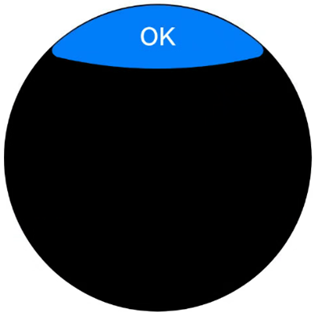
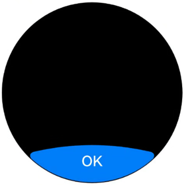
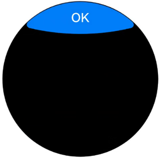
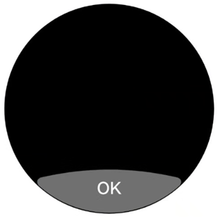
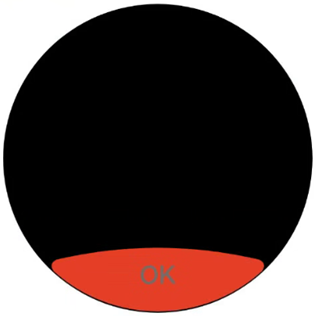
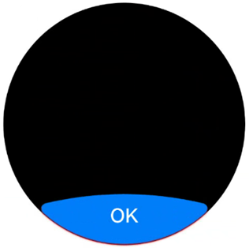
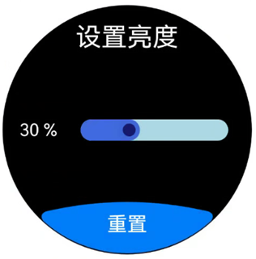

# 弧形按钮 (ArcButton)


ArcButton是弧形按钮组件，用于圆形屏幕使用。为手表用户提供强调、普通、警告等样式按钮。具体用法请参考[ArcButton](../reference/apis-arkui/arkui-ts/ohos-arkui-advanced-ArcButton.md)。


## 创建按钮

ArcButton通过调用以下接口来创建。

  ```ts
ArcButton({
    options: new ArcButtonOptions({
      label: 'OK',
      position: ArcButtonPosition.TOP_EDGE,
      styleMode: ArcButtonStyleMode.EMPHASIZED_LIGHT
    })
})
  ```

  其中，[label](../reference/apis-arkui/arkui-ts/ohos-arkui-advanced-ArcButton.md#arcbuttonoptions)设置按钮文字，[position](../reference/apis-arkui/arkui-ts/ohos-arkui-advanced-ArcButton.md#arcbuttonoptions)设置按钮类型，[styleMode](../reference/apis-arkui/arkui-ts/ohos-arkui-advanced-ArcButton.md#arcbuttonoptions)设置按钮样式。

  

## 设置按钮类型

ArcButton有上弧形按钮和下弧形按钮两种类型。使用[position](../reference/apis-arkui/arkui-ts/ohos-arkui-advanced-ArcButton.md#arcbuttonoptions)设置按钮类型。

- 下弧形按钮（默认类型）。

  通过将[position](../reference/apis-arkui/arkui-ts/ohos-arkui-advanced-ArcButton.md#arcbuttonoptions)属性设置为ArcButtonPosition.BOTTOM_EDGE，可以将按钮设置为下弧形按钮。

  ```ts
  ArcButton({
    options: new ArcButtonOptions({
      label: 'OK',
      position: ArcButtonPosition.BOTTOM_EDGE,
      styleMode: ArcButtonStyleMode.EMPHASIZED_LIGHT
    })
  })
  ```

  

- 上弧形按钮。

  通过将[position](../reference/apis-arkui/arkui-ts/ohos-arkui-advanced-ArcButton.md#arcbuttonoptions)属性设置为ArcButtonPosition.TOP_EDGE，可以将按钮设置为上弧形按钮。

  ```ts
  ArcButton({
    options: new ArcButtonOptions({
      label: 'OK',
      position: ArcButtonPosition.TOP_EDGE,
      styleMode: ArcButtonStyleMode.EMPHASIZED_LIGHT
    })
  })
  ```

  

## 自定义样式

- 设置背景色。

  使用[backgroundColor](../reference/apis-arkui/arkui-ts/ohos-arkui-advanced-ArcButton.md#arcbuttonoptions)属性设置按钮的背景色。

  ```ts
  ArcButton({
    options: new ArcButtonOptions({
      label: 'OK',
      styleMode: ArcButtonStyleMode.CUSTOM,
      backgroundColor: ColorMetrics.resourceColor('#707070')
    })
  })
  ```

  

- 设置文本颜色。

  使用[fontColor](../reference/apis-arkui/arkui-ts/ohos-arkui-advanced-ArcButton.md#arcbuttonoptions)属性设置按钮的文本颜色。

  ```ts
  ArcButton({
    options: new ArcButtonOptions({
      label: 'OK',
      styleMode: ArcButtonStyleMode.CUSTOM,
      backgroundColor: ColorMetrics.resourceColor('#E84026'),
      fontColor: ColorMetrics.resourceColor('#707070')
    })
  })
  ```

  

- 设置阴影颜色。

  使用[shadowEnabled](../reference/apis-arkui/arkui-ts/ohos-arkui-advanced-ArcButton.md#arcbuttonoptions)属性启用按钮阴影，并通过[shadowColor](../reference/apis-arkui/arkui-ts/ohos-arkui-advanced-ArcButton.md#arcbuttonoptions)属性设置按钮的阴影颜色。

  ```ts
  ArcButton({
    options: new ArcButtonOptions({
      label: 'OK',
      shadowEnabled: true,
      shadowColor: ColorMetrics.resourceColor('#ffec1022')
    })
  })
  ```

  

## 添加事件

- 绑定onClick事件来响应点击操作后的自定义行为。

  ```ts
  ArcButton({
    options: new ArcButtonOptions({
      label: 'OK',
      onClick: () => {
        console.info('ArcButton onClick')
      }
    })
  })
  ```

- 绑定onTouch事件来响应触摸操作后的自定义行为。

  ```ts
  ArcButton({
    options: new ArcButtonOptions({
      label: 'OK',
      onTouch: (event: TouchEvent) => {
        console.info('ArcButton onTouch')
      }
    })
  })
  ```

## 场景示例

  在亮度设置界面，进度条显示当前亮度为30%。点击重置后，亮度值将被重置为默认的50%。

  ```ts
import { LengthMetrics, LengthUnit, ArcButton, ArcButtonOptions, ArcButtonStyleMode, } from '@kit.ArkUI';

@Entry
@ComponentV2
struct BrightnessPage {
  @Local brightnessValue: number = 30
  private defaultBrightnessValue: number = 50

  build() {
    RelativeContainer() {
      Text('设置亮度')
        .fontColor(Color.White)
        .id('id_brightness_set_text')
        .fontSize(24)
        .margin({ top: 16 })
        .alignRules({
          middle: { anchor: '__container__', align: HorizontalAlign.Center }
        })

      Text(`${this.brightnessValue} %`)
        .fontColor(Color.White)
        .id('id_brightness_min_text')
        .margin({ left: 16 })
        .alignRules({
          start: { anchor: '__container__', align: HorizontalAlign.Start },
          center: { anchor: '__container__', align: VerticalAlign.Center }
        })

      Slider({
        value: this.brightnessValue,
        min: 0,
        max: 100,
        style: SliderStyle.InSet
      })
        .blockColor('#191970')
        .trackColor('#ADD8E6')
        .selectedColor('#4169E1')
        .width(150)
        .id('id_brightness_slider')
        .margin({ left: 16, right: 16 })
        .onChange((value: number, mode: SliderChangeMode) => {
          this.brightnessValue = value
        })
        .alignRules({
          center: { anchor: 'id_brightness_min_text', align: VerticalAlign.Center },
          start: { anchor: 'id_brightness_min_text', align: HorizontalAlign.End },
          end: { anchor: 'id_brightness_max_text', align: HorizontalAlign.Start }
        })

      ArcButton({
        options: new ArcButtonOptions({
          label: '重置',
          styleMode: ArcButtonStyleMode.EMPHASIZED_LIGHT,
          fontSize: new LengthMetrics(19, LengthUnit.FP),
          onClick: () => {
            this.brightnessValue = this.defaultBrightnessValue
          }
        })
      })
        .alignRules({
          middle: { anchor: '__container__', align: HorizontalAlign.Center },
          bottom: { anchor: '__container__', align: VerticalAlign.Bottom }
        })
    }
    .height('100%')
    .width('100%')
    .backgroundColor(Color.Black)
  }
}
  ```

  