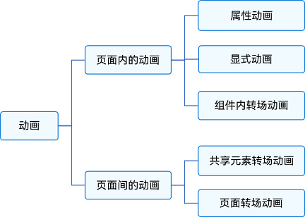
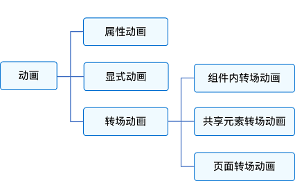

# 动画概述

动画的原理是在一个时间段内，多次改变UI外观，由于人眼会产生视觉暂留，所以最终看到的就是一个“连续”的动画。UI的一次改变称为一个动画帧，对应一次屏幕刷新，而决定动画流畅度的一个重要指标就是帧率FPS（Frame Per Second），即每秒的动画帧数，帧率越高则动画就会越流畅。

ArkUI中，产生动画的方式是改变属性值且指定动画参数。动画参数包含了如动画时长、变化规律（即曲线）等参数。当属性值发生变化后，按照动画参数，从原来的状态过渡到新的状态，即形成一个动画。

ArkUI提供的动画能力按照页面的分类方式，可分为页面内的动画和页面间的动画。如下图所示，页面内的动画指在一个页面内即可发生的动画，页面间的动画指两个页面跳转时才会发生的动画。

  **图1** 按照页面分类的动画  

如果按照基础能力分，可分为属性动画、显式动画、转场动画三部分。如下图所示。

  **图2** 按照基础能力分类的动画  

本文按照页面的分类方式，从使用场景出发，提供各种动画的使用方法和注意事项，使开发者快速学习动画。
