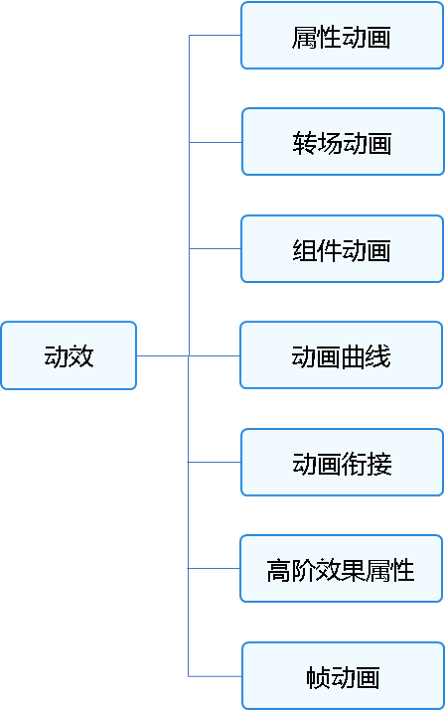

# 动画概述
<!--Kit: ArkUI-->
<!--Subsystem: ArkUI-->
<!--Owner: @CCFFWW-->
<!--SE: @yangfan229-->
<!--TSE: @lxl007-->

UI（用户界面）中包含开发者与设备进行交互时所看到的各种组件（如时间、壁纸等）。属性作为接口，用于控制组件的行为。例如，开发者可通过位置属性调整组件在屏幕上的位置。

属性值的变化，通常会引起UI的变化。动画可在UI发生改变时，添加流畅的过渡效果。如果不加入动画，属性将在一瞬间完成变化。造成突兀感的同时，容易导致用户失去视觉焦点。

动画的目的包括：

- 使界面的过渡自然流畅。
- 增强用户从界面获得的反馈感和互动感。
- 在内容加载等场景中，增加用户的耐心，缓解等待带来的不适感。
- 引导用户了解和操作设备。

在需要为UI变化添加过渡的场景，都可以使用动画，如开机、应用启动退出、下拉进入控制中心等。这些动画可向用户提供关于其操作的反馈，并有助于让用户始终关注界面。

ArkUI中提供多种动画接口（属性动画、转场动画等），用于驱动属性值按照设定的动画参数，从起始值逐渐变化到终点值。尽管变化过程中参数值并非绝对的连续，而是具有一定的离散性。但由于人眼会产生视觉暂留，所以最终看到的就是一个“连续“的动画。UI的一次改变称为一个动画帧，对应一次屏幕刷新。决定动画流畅度的一个重要指标就是帧率FPS（Frame Per Second），即每秒的动画帧数，帧率越高则动画就会越流畅。ArkUI中，动画参数包含了如动画时长、动画曲线等参数。动画曲线作为主要因素，决定了属性值变化的规律。以线性动画曲线为例，在动画时长内，属性值将从起点值匀速变化到终点值。属性过快或过慢的变化，都可能带来不好的视觉感受，影响用户体验。因此动画参数特别是动画曲线，需要结合场景和曲线特点进行设计和调整。

动画接口驱动属性值按照动画参数决定的规律，从原来的状态连续过渡到新的状态，进而在UI上产生的连续视觉效果。本文将按照如下结构，提供各种动画的使用方法和注意事项，使开发者快速学习动画。

- 属性动画：最基础的动画类型，按照动画参数逐帧驱动属性的变化，产生一帧帧的动画效果。除其中的自定义属性动画外，动画过程的驱动由系统完成，应用侧不感知动画过程。

- 转场动画：为组件在出现和消失时添加过渡动画。为了保证动画一致性，部分接口动画曲线已内置，不支持开发者自定义。
  - 不推荐在应用内使用UIAbility组合所有的界面：UIAbility是一个任务，会在多任务界面独立显示一个卡片，UIAbility之间的跳转是任务之间的跳转。以应用内查看大图的典型场景为例，不建议应用内调用图库的UIAbility去打开图片查看大图，会导致任务的跳转，图库的UIAbility也会加入多任务界面中。正确的方式是应用内构建大图组件，通过模态转场去调起大图组件，一个任务内的所有的界面都在一个UIAbility内闭环。
  - 导航转场中，应使用Navigation组件实现转场动画。过去的page+router方式在实现导航转场过程中，因为page和page之间相互独立，其联动动画效果受限。不仅容易导致页面之间的割裂，并且不支持一次开发多端部署。

- 组件动画：组件提供默认动效（如List的滑动动效）便于开发者使用，同时部分组件还支持定制化动效。

- 动画曲线：介绍传统曲线和弹簧曲线的特点和使用方式。动画曲线影响属性值的运动规律，进而决定界面的动画效果。

- 动画衔接：介绍如何实现动画与动画之间、手势与动画之间的自然过渡。

- 高阶动画效果：介绍模糊、大阴影和颜色渐变等高阶效果接口的使用方法。

- 帧动画：系统侧提供在动画过程中的插值结果，由开发者每帧修改属性值产生动画，相比于属性动画，有可实现暂停的优点，但性能不如属性动画。

## 相关实例

针对动画开发，有以下相关实例可供参考：

- [动效示例（ArkTS）（API9）](https://gitee.com/openharmony/codelabs/tree/master/ETSUI/Animation)