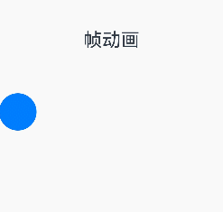
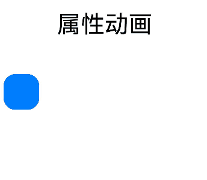
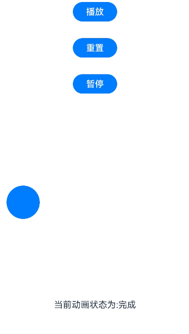

# 帧动画（ohos.animator）

帧动画具备逐帧回调的特性，便于开发者在每一帧中处理需调整的属性。通过向应用提供onFrame逐帧回调，帧动画使开发者能够在应用的每一帧设置属性值，从而实现组件属性值变化的自然过渡，营造出动画效果。帧动画接口详情可参考[@ohos.animator (动画)](../reference/apis-arkui/js-apis-animator.md)。

与属性动画相比，帧动画能让开发者实时感知动画进程，即时调整UI值，具备事件即时响应和可暂停的优势，但在性能上略逊于属性动画。当属性动画能满足需求时，建议优先采用属性动画接口实现。属性动画接口可参考[实现属性动画](./arkts-attribute-animation-apis.md)。

| 名称 | 实现方式 | 事件响应方式 | 可暂停 | 性能 |
| -------- | -------- | -------- | -------- |-------- |
| 帧动画（ohos.animator） | 开发者可每帧修改UI侧属性值，UI侧属性实时更新 | 实时响应 | 是 | 较差 |
| 属性动画 | UI侧只计算动画最终状态，动画过程为渲染值在改变，UI侧一直为动画最终状态，不感知实时渲染值 | 按最终状态响应 | 否 | 较好 |

如图所示，帧动画在动画过程中即可实时响应，而属性动画按最终状态响应。





## 使用帧动画实现动画效果

使用如下步骤可以创建一个简单的animator，并且在每个帧回调中打印当前插值。

1. 引入相关依赖。

   ```ts
   import { AnimatorOptions, AnimatorResult } from '@kit.ArkUI';
   ```

2. 创建执行动画的对象。

   ```ts
   // 创建动画的初始参数
   let options: AnimatorOptions = {
     duration: 1500,
     easing: "friction",
     delay: 0,
     fill: "forwards",
     direction: "normal",
     iterations: 2,
     // 动画onFrame 插值首帧值                                    
     begin: 200.0,
     // 动画onFrame 插值尾帧值                                    
     end: 400.0
   };
   let result: AnimatorResult = this.getUIContext().createAnimator(options);
   // 设置接收到帧时回调，动画播放过程中每帧会调用onFrame回调
   result.onFrame = (value: number) => {
     console.log("current value is :" + value);
   }
   ```

3. 播放动画。

   ```ts
   // 播放动画
   result.play();
   ```

4. 动画执行完成后手动释放AnimatorResult对象。

   ```ts
   // 释放动画对象
   result = undefined;
   ```

## 使用帧动画实现小球抛物运动

1. 引入相关依赖。

   ```ts
   import { AnimatorOptions, AnimatorResult } from '@kit.ArkUI';
   ```

2. 定义要做动画的组件。

   ```ts
   Button()
     .width(60)
     .height(60)
     .translate({ x: this.translateX, y: this.translateY })
   ```

3. 在onPageShow中创建AnimatorResult对象。

   ```ts
   onPageShow(): void {
     //创建animatorResult对象
     this.animatorOptions = this.getUIContext().createAnimator(options);
     this.animatorOptions.onFrame = (progress: number) => {
       this.translateX = progress;
       if (progress > this.topWidth && this.translateY < this.bottomHeight) {
         this.translateY = Math.pow(progress - this.topWidth, 2) * this.g;
       }
     }
     //动画取消时执行方法
     this.animatorOptions.onCancel = () => {
       this.animatorStatus = '取消';
     }
     //动画完成时执行方法
     this.animatorOptions.onFinish = () => {
       this.animatorStatus = '完成';
     }
     //动画重复播放时执行方法
     this.animatorOptions.onRepeat = () => {
       console.log("动画重复播放");
     }
   }
   ```

4. 定义动画播放，重置，暂停的按钮。

   ```ts
   Button('播放').onClick(() => {
     this.animatorOptions?.play();
     this.animatorStatus = '播放中'
   }).width(80).height(35)
   Button("重置").onClick(() => {
     this.translateX = 0;
     this.translateY = 0;
   }).width(80).height(35)
   Button("暂停").onClick(() => {
     this.animatorOptions?.pause();
     this.animatorStatus = '暂停'
   }).width(80).height(35)
   ```
5. 在页面隐藏或销毁的生命周期中释放动画对象，避免内存泄漏。
   ```ts
   onPageHide(): void {
     this.animatorOptions = undefined;
   }
   ```

完整示例如下。

```ts
import { AnimatorOptions, AnimatorResult } from '@kit.ArkUI';

@Entry
@Component
struct Index {
  @State animatorOptions: AnimatorResult | undefined = undefined;
  @State animatorStatus: string = '创建';
  begin: number = 0;
  end: number = 300;
  topWidth: number = 150;
  bottomHeight: number = 100;
  g: number = 0.18;
  animatorOption: AnimatorOptions = {
    duration: 4000,
    delay: 0,
    easing: 'linear',
    iterations: 1,
    fill: "forwards",
    direction: 'normal',
    begin: this.begin,
    end: this.end
  };
  @State translateX: number = 0;
  @State translateY: number = 0;

  onPageShow(): void {
    this.animatorOptions = this.getUIContext().createAnimator(this.animatorOption)
    this.animatorOptions.onFrame = (progress: number) => {
      this.translateX = progress;
      if (progress > this.topWidth && this.translateY < this.bottomHeight) {
        this.translateY = Math.pow(progress - this.topWidth, 2) * this.g;
      }
    }
    this.animatorOptions.onCancel = () => {
      this.animatorStatus = '取消';
    }
    this.animatorOptions.onFinish = () => {
      this.animatorStatus = '完成';
    }
    this.animatorOptions.onRepeat = () => {
      console.log("动画重复播放");
    }
  }

  onPageHide(): void {
    this.animatorOptions = undefined;
  }

  build() {
    Column() {
      Column({ space: 30 }) {
        Button('播放').onClick(() => {
          this.animatorOptions?.play();
          this.animatorStatus = '播放中';
        }).width(80).height(35)
        Button("重置").onClick(() => {
          this.translateX = 0;
          this.translateY = 0;
        }).width(80).height(35)
        Button("暂停").onClick(() => {
          this.animatorOptions?.pause();
          this.animatorStatus = '暂停';
        }).width(80).height(35)
      }.width("100%").height('25%')

      Stack() {
        Button()
          .width(60)
          .height(60)
          .translate({ x: this.translateX, y: this.translateY })
      }
      .width("100%")
      .height('45%')
      .align(Alignment.Start)

      Text("当前动画状态为:" + this.animatorStatus)
    }.width("100%").height('100%')
  }
}
```

