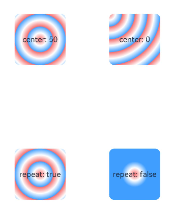

# 色彩


## 色彩

通过颜色渐变接口，可以设置组件的背景颜色渐变效果，实现在两个或多个指定的颜色之间进行平稳的过渡。

| 接口 | 说明 |
| -------- | -------- |
| [linearGradient](../reference/apis-arkui/arkui-ts/ts-universal-attributes-gradient-color.md#lineargradient) | 为当前组件添加线性渐变的颜色渐变效果。 |
| [sweepGradient](../reference/apis-arkui/arkui-ts/ts-universal-attributes-gradient-color.md#sweepgradient) | 为当前组件添加角度渐变的颜色渐变效果。 |
| [radialGradient](../reference/apis-arkui/arkui-ts/ts-universal-attributes-gradient-color.md#radialgradient) | 为当前组件添加径向渐变的颜色渐变效果。 |


## 为组件添加线性渐变效果


```ts
@Entry
@Component
struct LinearGradientDemo {
  build() {
    Grid() {
      GridItem() {
        Column() {
          Text('angle: 180')
            .fontSize(15)
        }
        .width(100)
        .height(100)
        .justifyContent(FlexAlign.Center)
        .borderRadius(10)
        .linearGradient({
          // 0点方向顺时针旋转为正向角度，线性渐变起始角度的默认值为180°
          colors: [
            [0xf56c6c, 0.0], // 颜色断点1的颜色和比重，对应组件在180°方向上的起始位置
            [0xffffff, 1.0],// 颜色断点2的颜色和比重，对应组件在180°方向上的终点位置
          ]
        })
      }

      GridItem() {
        Column() {
          Text('angle: 45')
            .fontSize(15)
        }
        .width(100)
        .height(100)
        .justifyContent(FlexAlign.Center)
        .borderRadius(10)
        .linearGradient({
          angle: 45, // 设置颜色渐变起始角度为顺时针方向45°
          colors: [
            [0xf56c6c, 0.0],
            [0xffffff, 1.0],
          ]
        })
      }

      GridItem() {
        Column() {
          Text('repeat: true')
            .fontSize(15)
        }
        .width(100)
        .height(100)
        .justifyContent(FlexAlign.Center)
        .borderRadius(10)
        .linearGradient({
          repeating: true, // 在当前组件内0.3到1.0区域内重复0到0.3区域的颜色渐变效果
          colors: [
            [0xf56c6c, 0.0],
            [0xE6A23C, .3],
          ]
        })
      }

      GridItem() {
        Column() {
          Text('repeat: false')
            .fontSize(15)
        }
        .width(100)
        .height(100)
        .justifyContent(FlexAlign.Center)
        .borderRadius(10)
        .linearGradient({
          colors: [
            [0xf56c6c, 0.0], // repeating默认为false，此时组件内只有0到0.3区域内存在颜色渐变效果
            [0xE6A23C, .3],
          ]
        })
      }
    }
    .columnsGap(10)
    .rowsGap(10)
    .columnsTemplate('1fr 1fr')
    .rowsTemplate('1fr 1fr 1fr')
    .width('100%')
    .height('100%')
  }
}
```


## 为组件添加角度渐变效果


```ts
@Entry
@Component
struct SweepGradientDemo {
  build() {
    Grid() {
      GridItem() {
        Column() {
          Text('center: 50')
            .fontSize(15)
        }
        .width(100)
        .height(100)
        .justifyContent(FlexAlign.Center)
        .borderRadius(10)
        .sweepGradient({
          center: [50, 50], // 角度渐变中心点
          start: 0, // 角度渐变的起点
          end: 360, // 角度渐变的终点。
          repeating: true, // 渐变效果在重复
          colors: [
          // 当前组件中，按照中心点和渐变的起点和终点值,
          // 角度区域为0-0.125的范围，从颜色断点1的颜色渐变到颜色断点2的颜色,
          // 角度区域0.125到0.25的范围，从颜色断点2的颜色渐变到颜色断点3的颜色,
          // 因为repeating设置为true，角度区域0.25到1的范围，重复区域0到0.25的颜色渐变效果
            [0xf56c6c, 0], // 颜色断点1的颜色和比重，对应角度为0*360°=0°，角点为中心点
            [0xffffff, 0.125], // 颜色断点2的颜色和比重
            [0x409EFF, 0.25]// 颜色断点3的颜色和比重
          ]
        })
      }

      GridItem() {
        Column() {
          Text('center: 0')
            .fontSize(15)
        }
        .width(100)
        .height(100)
        .justifyContent(FlexAlign.Center)
        .borderRadius(10)
        .sweepGradient({
          center: [0, 0], // 角度渐变中心点，当前为组件的左上角坐标
          start: 0,
          end: 360,
          repeating: true,
          colors: [
          // 当前组件中，因为角度渐变中心是组件的左上角，所以从颜色断点1到颜色断点3的角度范围，恰好可以覆盖整个组件
            [0xf56c6c, 0], // 颜色断点1的颜色和比重，对应角度为0*360°=0°
            [0xffffff, 0.125], // 色断点2的颜色和比重，对应角度为0.125*360°=45°
            [0x409EFF, 0.25]// 色断点3的颜色和比重，对应角度为0.25*360°=90°
          ]
        })
      }

      GridItem() {
        Column() {
          Text('repeat: true')
            .fontSize(15)
        }
        .width(100)
        .height(100)
        .justifyContent(FlexAlign.Center)
        .borderRadius(10)
        .sweepGradient({
          center: [50, 50],
          start: 0,
          end: 360,
          repeating: true,
          colors: [
            [0xf56c6c, 0],
            [0xffffff, 0.125],
            [0x409EFF, 0.25]
          ]
        })
      }

      GridItem() {
        Column() {
          Text('repeat: false')
            .fontSize(15)
        }
        .width(100)
        .height(100)
        .justifyContent(FlexAlign.Center)
        .borderRadius(10)
        .sweepGradient({
          center: [50, 50],
          start: 0,
          end: 360,
          repeating: false, //只在颜色断点角度覆盖范围内产生颜色渐变效果，其余范围内不重复
          colors: [
            [0xf56c6c, 0],
            [0xffffff, 0.125],
            [0x409EFF, 0.25]
          ]
        })
      }
    }
    .columnsGap(10)
    .rowsGap(10)
    .columnsTemplate('1fr 1fr')
    .rowsTemplate('1fr 1fr 1fr')
    .width('100%')
    .height(437)
  }
}
```


## 为组件添加径向渐变效果


```ts
@Entry
@Component
struct radialGradientDemo {
  build() {
    Grid() {
      GridItem() {
        Column() {
          Text('center: 50')
            .fontSize(15)
        }
        .width(100)
        .height(100)
        .justifyContent(FlexAlign.Center)
        .borderRadius(10)
        .radialGradient({
          center: [50, 50], // 径向渐变中心点
          radius: 100, // 径向渐变半径
          repeating: true, // 允许在组件内渐变范围外重复按照渐变范围内效果着色
          colors: [
          // 组件内以[50，50]为中心点，在半径为0到12.5的范围内从颜色断点1的颜色渐变到颜色断点2的颜色,
          // 在半径为12.5到25的范围内从颜色断点2的颜色渐变到颜色断点3的颜色,
          // 组件外其他半径范围内按照半径为0到25的渐变效果重复着色
            [0xf56c6c, 0], // 颜色断点1的颜色和比重，对应半径为0*100=0
            [0xffffff, 0.125], // 颜色断点2的颜色和比重，对应半径为0.125*100=12.5
            [0x409EFF, 0.25]// 颜色断点3的颜色和比重，对应半径为0.25*100=25
          ]
        })
      }

      GridItem() {
        Column() {
          Text('center: 0')
            .fontSize(15)
        }
        .width(100)
        .height(100)
        .justifyContent(FlexAlign.Center)
        .borderRadius(10)
        .radialGradient({
          center: [0, 0], // 径向渐变中心点，当前为组件左上角坐标
          radius: 100,
          repeating: true,
          colors: [
            [0xf56c6c, 0],
            [0xffffff, 0.125],
            [0x409EFF, 0.25]
          ]
        })
      }

      GridItem() {
        Column() {
          Text('repeat: true')
            .fontSize(15)
        }
        .width(100)
        .height(100)
        .justifyContent(FlexAlign.Center)
        .borderRadius(10)
        .radialGradient({
          center: [50, 50],
          radius: 100,
          repeating: true,
          colors: [
            [0xf56c6c, 0],
            [0xffffff, 0.125],
            [0x409EFF, 0.25]
          ]
        })
      }

      GridItem() {
        Column() {
          Text('repeat: false')
            .fontSize(15)
        }
        .width(100)
        .height(100)
        .justifyContent(FlexAlign.Center)
        .borderRadius(10)
        .radialGradient({
          center: [50, 50],
          radius: 100,
          repeating: false, // 在组件内渐变范围外不重复按照渐变范围内效果着色
          colors: [
            [0xf56c6c, 0],
            [0xffffff, 0.125],
            [0x409EFF, 0.25]
          ]
        })
      }
    }
    .columnsGap(10)
    .rowsGap(10)
    .columnsTemplate('1fr 1fr')
    .rowsTemplate('1fr 1fr 1fr')
    .width('100%')
    .height('100%')
  }
}
```


