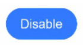
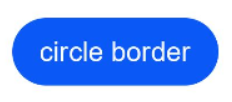
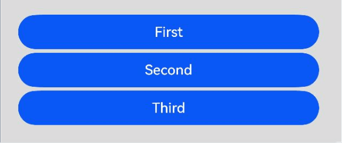

# 按钮 (Button)


Button是按钮组件，通常用于响应用户的点击操作，其类型包括胶囊按钮、圆形按钮、普通按钮、圆角矩形按钮。Button做为容器使用时可以通过添加子组件实现包含文字、图片等元素的按钮。具体用法请参考[Button](../reference/apis-arkui/arkui-ts/ts-basic-components-button.md)。


## 创建按钮

Button通过调用接口来创建，接口调用有以下两种形式：


- 通过label和[ButtonOptions](../reference/apis-arkui/arkui-ts/ts-basic-components-button.md#buttonoptions对象说明)创建不包含子组件的按钮。以ButtonOptions中的type和stateEffect为例。

  ```ts
  Button(label?: ResourceStr, options?: { type?: ButtonType, stateEffect?: boolean })
  ```

  其中，label用来设置按钮文字，type用于设置Button类型，stateEffect属性设置Button是否开启点击效果。

  ```ts
  Button('Ok', { type: ButtonType.Normal, stateEffect: true }) 
    .borderRadius(8) 
    .backgroundColor(0x317aff) 
    .width(90)
    .height(40)
  ```

  


- 通过[ButtonOptions](../reference/apis-arkui/arkui-ts/ts-basic-components-button.md#buttonoptions对象说明)创建包含子组件的按钮。以ButtonOptions中的type和stateEffect为例。

  ```ts
  Button(options?: {type?: ButtonType, stateEffect?: boolean})
  ```

  只支持包含一个子组件，子组件可以是基础组件或者容器组件。

  ```ts
  Button({ type: ButtonType.Normal, stateEffect: true }) {
    Row() {
      Image($r('app.media.loading')).width(20).height(40).margin({ left: 12 })
      Text('loading').fontSize(12).fontColor(0xffffff).margin({ left: 5, right: 12 })
    }.alignItems(VerticalAlign.Center)
  }.borderRadius(8).backgroundColor(0x317aff).width(90).height(40)
  ```

  


## 设置按钮类型

Button有四种可选类型，分别为胶囊类型（Capsule）、圆形按钮（Circle）、普通按钮（Normal）和圆角矩形按钮（ROUNDED_RECTANGLE），通过type进行设置。


- 胶囊按钮（默认类型）。

  此类型按钮的圆角自动设置为高度的一半，不支持通过borderRadius属性重新设置圆角。

  ```ts
  Button('Disable', { type: ButtonType.Capsule, stateEffect: false }) 
    .backgroundColor(0x317aff) 
    .width(90)
    .height(40)
  ```

  


- 圆形按钮。

  此类型按钮为圆形，不支持通过borderRadius属性重新设置圆角。

  ```ts
  Button('Circle', { type: ButtonType.Circle, stateEffect: false }) 
    .backgroundColor(0x317aff) 
    .width(90) 
    .height(90)
  ```

  

- 普通按钮。

  此类型的按钮默认圆角为0，支持通过borderRadius属性重新设置圆角。

  ```ts
  Button('Ok', { type: ButtonType.Normal, stateEffect: true }) 
    .borderRadius(8) 
    .backgroundColor(0x317aff) 
    .width(90)
    .height(40)
  ```

  

- 圆角矩形按钮。
  当[controlSize](../reference/apis-arkui/arkui-ts/ts-basic-components-button.md#controlsize11)为NORMAL时，默认圆角大小为20vp，[controlSize](../reference/apis-arkui/arkui-ts/ts-basic-components-button.md#controlsize11)为SMALL时，圆角大小为14vp，支持通过borderRadius属性重新设置圆角。

  ```ts
  Button('Disable', { type: ButtonType.ROUNDED_RECTANGLE, stateEffect: true }) 
    .backgroundColor(0x317aff) 
    .width(90)
    .height(40)
  ```

  

## 自定义样式

- 设置边框弧度。

  使用通用属性来自定义按钮样式。例如通过borderRadius属性设置按钮的边框弧度。

  ```ts
  Button('circle border', { type: ButtonType.Normal }) 
    .borderRadius(20)
    .height(40)
  ```

  


- 设置文本样式。

  通过添加文本样式设置按钮文本的展示样式。

  ```ts
  Button('font style', { type: ButtonType.Normal }) 
    .fontSize(20) 
    .fontColor(Color.Pink) 
    .fontWeight(800)
  ```

  


- 设置背景颜色。

  添加backgroundColor属性设置按钮的背景颜色。

  ```ts
  Button('background color').backgroundColor(0xF55A42)
  ```

  


- 创建功能型按钮。

 创建删除操作的按钮。

  ```ts
  let MarLeft: Record<string, number> = { 'left': 20 }
  Button({ type: ButtonType.Circle, stateEffect: true }) {
    Image($r('app.media.ic_public_delete_filled')).width(30).height(30)
  }.width(55).height(55).margin(MarLeft).backgroundColor(0xF55A42)
  ```

  


## 添加事件

Button组件通常用于触发某些操作，可以绑定onClick事件来响应点击操作后的自定义行为。

```ts
Button('Ok', { type: ButtonType.Normal, stateEffect: true }) 
  .onClick(()=>{ 
    console.info('Button onClick') 
  })
```


## 场景示例

- 用于启动操作。

  可以用按钮启动任何用户界面元素，按钮会根据用户的操作触发相应的事件。例如，在List容器里通过点击按钮进行页面跳转。

  ```ts
  // xxx.ets
  @Entry
  @Component
  struct ButtonCase1 {
    pathStack: NavPathStack = new NavPathStack();

    @Builder
    PageMap(name: string) {
      if (name === "first_page") {
        pageOneTmp()
      } else if (name === "second_page") {
        pageTwoTmp()
      } else if (name === "third_page") {
        pageThreeTmp()
      }
    }

    build() {
      Navigation(this.pathStack) {
        List({ space: 4 }) {
          ListItem() {
            Button("First").onClick(() => {
              this.pathStack.pushPath({ name: "first_page"});
            })
              .width('100%')
          }

          ListItem() {
            Button("Second").onClick(() => {
              this.pathStack.pushPath({ name: "second_page"});
            })
              .width('100%')
          }

          ListItem() {
            Button("Third").onClick(() => {
              this.pathStack.pushPath({ name: "third_page"});
            })
              .width('100%')
          }
        }
        .listDirection(Axis.Vertical)
        .backgroundColor(0xDCDCDC).padding(20)
      }
      .mode(NavigationMode.Stack)
      .navDestination(this.PageMap)
    }
  }

  // pageOne
  @Component
  export struct pageOneTmp {
    pathStack: NavPathStack = new NavPathStack();
  
    build() {
      NavDestination() {
        Column() {
          Text("first_page")
        }.width('100%').height('100%')
      }.title("pageOne")
      .onBackPressed(() => {
        const popDestinationInfo = this.pathStack.pop(); // 弹出路由栈栈顶元素
        console.info('pop' + '返回值' + JSON.stringify(popDestinationInfo));
        return true
      })
      .onReady((context: NavDestinationContext) => {
        this.pathStack = context.pathStack;
      })
    }
  }

  // pageTwo
  @Component
  export struct pageTwoTmp {
    pathStack: NavPathStack = new NavPathStack();

    build() {
      NavDestination() {
        Column() {
          Text("second_page")
        }.width('100%').height('100%')
      }.title("pageTwo")
      .onBackPressed(() => {
        const popDestinationInfo = this.pathStack.pop(); // 弹出路由栈栈顶元素
        console.info('pop' + '返回值' + JSON.stringify(popDestinationInfo));
        return true
      })
      .onReady((context: NavDestinationContext) => {
        this.pathStack = context.pathStack;
      })
    }
  }

  // pageThree
  @Component
  export struct pageThreeTmp {
    pathStack: NavPathStack = new NavPathStack();

    build() {
      NavDestination() {
        Column() {
          Text("third_page")
        }.width('100%').height('100%')
      }.title("pageThree")
      .onBackPressed(() => {
        const popDestinationInfo = this.pathStack.pop(); // 弹出路由栈栈顶元素
        console.info('pop' + '返回值' + JSON.stringify(popDestinationInfo));
        return true
      })
      .onReady((context: NavDestinationContext) => {
        this.pathStack = context.pathStack;
      })
    }
  }
  ```

  


- 用于提交表单。

  在用户登录/注册页面，使用按钮进行登录或注册操作。

  ```ts
  // xxx.ets
  @Entry
  @Component
  struct ButtonCase2 {
    build() {
      Column() {
        TextInput({ placeholder: 'input your username' }).margin({ top: 20 })
        TextInput({ placeholder: 'input your password' }).type(InputType.Password).margin({ top: 20 })
        Button('Register').width(300).margin({ top: 20 })
          .onClick(() => {
            // 需要执行的操作
          })
      }.padding(20)
    }
  }
  ```

  

- 悬浮按钮。

  在可以滑动的界面，滑动时按钮始终保持悬浮状态。

  ```ts
  // xxx.ets
  @Entry
  @Component
  struct HoverButtonExample {
    private arr: number[] = [0, 1, 2, 3, 4, 5, 6, 7, 8, 9]
    build() {
      Stack() {
        List({ space: 20, initialIndex: 0 }) {
          ForEach(this.arr, (item:number) => {
            ListItem() {
              Text('' + item)
                .width('100%').height(100).fontSize(16)
                .textAlign(TextAlign.Center).borderRadius(10).backgroundColor(0xFFFFFF)
            }
          }, (item:number) => item.toString())
        }.width('90%')
        Button() {
          Image($r('app.media.ic_public_add'))
            .width(50)
            .height(50)
        }
        .width(60)
        .height(60)
        .position({x: '80%', y: 600})
        .shadow({radius: 10})
        .onClick(() => {
          // 需要执行的操作
        })
      }
      .width('100%')
      .height('100%')
      .backgroundColor(0xDCDCDC)
      .padding({ top: 5 })
    }
  }
  ```

  
