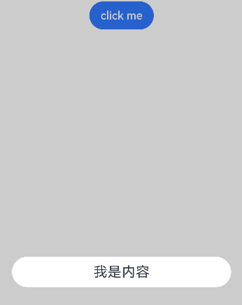
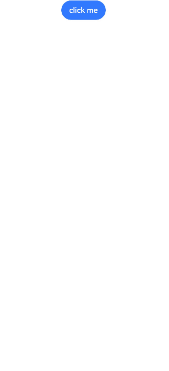
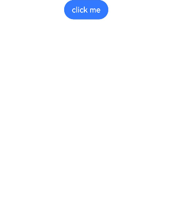

# 自定义弹窗 (CustomDialog)


CustomDialog是自定义弹窗，可用于广告、中奖、警告、软件更新等与用户交互响应操作。开发者可以通过CustomDialogController类显示自定义弹窗。具体用法请参考[自定义弹窗](../reference/apis-arkui/arkui-ts/ts-methods-custom-dialog-box.md)。

> **说明：** 
>
> 当前，ArkUI弹窗均为非页面级弹窗，在页面路由跳转时，如果开发者未调用close方法将其关闭，弹窗将不会自动关闭。若需实现在跳转页面时弹窗同步关闭的场景，建议使用Navigation。具体使用方法，请参考[组件导航子页面显示类型的弹窗类型](arkts-navigation-navigation.md#页面显示类型)。

## 创建自定义弹窗

1. 使用\@CustomDialog装饰器装饰自定义弹窗，可在此装饰器内自定义弹窗内容。

   ```ts
   @CustomDialog
   struct CustomDialogExample {
     controller: CustomDialogController = new CustomDialogController({
       builder: CustomDialogExample({}),
     })
   
     build() {
       Column() {
         Text('我是内容')
           .fontSize(20)
           .margin({ top: 10, bottom: 10 })
       }
     }
   }
   ```

3. 创建构造器，与装饰器呼应相连。

   ```ts
    @Entry
    @Component
    struct CustomDialogUser {
      dialogController: CustomDialogController = new CustomDialogController({
        builder: CustomDialogExample(),
      })
    }
   ```

4. 点击与onClick事件绑定的组件使弹窗弹出。

   ```ts
   @Entry
   @Component
   struct CustomDialogUser {
     dialogController: CustomDialogController = new CustomDialogController({
       builder: CustomDialogExample(),
     })

     build() {
       Column() {
         Button('click me')
           .onClick(() => {
             this.dialogController.open()
           })
       }.width('100%').margin({ top: 5 })
     }
   }
   ```

   


## 弹窗的交互

弹窗可用于数据交互，完成用户一系列响应操作。


1. 在\@CustomDialog装饰器内添加按钮，同时添加数据函数。

   ```ts
   @CustomDialog
   struct CustomDialogExample {
     cancel?: () => void
     confirm?: () => void
     controller: CustomDialogController

     build() {
       Column() {
         Text('我是内容').fontSize(20).margin({ top: 10, bottom: 10 })
         Flex({ justifyContent: FlexAlign.SpaceAround }) {
           Button('cancel')
             .onClick(() => {
               this.controller.close()
               if (this.cancel) {
                 this.cancel()
               }
             }).backgroundColor(0xffffff).fontColor(Color.Black)
           Button('confirm')
             .onClick(() => {
               this.controller.close()
               if (this.confirm) {
                 this.confirm()
               }
             }).backgroundColor(0xffffff).fontColor(Color.Red)
         }.margin({ bottom: 10 })
       }
     }
   }
   ```

2. 页面内需要在构造器内进行接收，同时创建相应的函数操作。

     ```ts
   @Entry
   @Component
   struct CustomDialogUser {
       dialogController: CustomDialogController = new CustomDialogController({
         builder: CustomDialogExample({
           cancel: ()=> { this.onCancel() },
           confirm: ()=> { this.onAccept() },
         }),
       })

       onCancel() {
         console.info('Callback when the first button is clicked')
       }

       onAccept() {
         console.info('Callback when the second button is clicked')
       }

       build() {
         Column() {
           Button('click me')
             .onClick(() => {
               this.dialogController.open()
             })
         }.width('100%').margin({ top: 5 })
       }
     }
   ```

      

   3.可通过弹窗中的按钮实现路由跳转，同时获取跳转页面向当前页传入的参数。

   ```ts
   // Index.ets
   @CustomDialog
   struct CustomDialogExample {
     @Link textValue: string
     controller?: CustomDialogController
     cancel: () => void = () => {
     }
     confirm: () => void = () => {
     }

     build() {
       Column({ space: 20 }) {
         if (this.textValue != '') {
           Text(`第二个页面的内容为：${this.textValue}`)
             .fontSize(20)
         } else {
           Text('是否获取第二个页面的内容')
             .fontSize(20)
         }
         Flex({ justifyContent: FlexAlign.SpaceAround }) {
           Button('cancel')
             .onClick(() => {
               if (this.controller != undefined) {
                 this.controller.close()
                 this.cancel()
               }
             }).backgroundColor(0xffffff).fontColor(Color.Black)
           Button('confirm')
             .onClick(() => {
               if (this.controller != undefined && this.textValue != '') {
                 this.controller.close()
               } else if (this.controller != undefined) {
                 this.getUIContext().getRouter().pushUrl({
                   url: 'pages/Index2'
                 })
                 this.controller.close()
               }
             }).backgroundColor(0xffffff).fontColor(Color.Red)
         }.margin({ bottom: 10 })
       }.borderRadius(10).padding({ top: 20 })
     }
   }

   @Entry
   @Component
   struct CustomDialogUser {
     @State textValue: string = ''
     dialogController: CustomDialogController | null = new CustomDialogController({
       builder: CustomDialogExample({
         cancel: () => {
           this.onCancel()
         },
         confirm: () => {
           this.onAccept()
         },
         textValue: $textValue
       })
     })

     // 在自定义组件即将析构销毁时将dialogController置空
     aboutToDisappear() {
       this.dialogController = null // 将dialogController置空
     }

     onPageShow() {
       const params = this.getUIContext().getRouter().getParams() as Record<string, string>; // 获取传递过来的参数对象
       if (params) {
         this.dialogController?.open()
         this.textValue = params.info as string; // 获取info属性的值
       }
     }

     onCancel() {
       console.info('Callback when the first button is clicked')
     }

     onAccept() {
       console.info('Callback when the second button is clicked')
     }

     exitApp() {
       console.info('Click the callback in the blank area')
     }

     build() {
       Column() {
         Button('click me')
           .onClick(() => {
             if (this.dialogController != null) {
               this.dialogController.open()
             }
           }).backgroundColor(0x317aff)
       }.width('100%').margin({ top: 5 })
     }
   }
   ```

   ```ts
   // Index2.ets
   @Entry
   @Component
   struct Index2 {
     @State message: string = '点击返回';
     build() {
       Column() {
         Button(this.message)
           .fontSize(50)
           .fontWeight(FontWeight.Bold).onClick(() => {
           this.getUIContext().getRouter().back({
             url: 'pages/Index',
             params: {
               info: 'Hello World'
             }
           });
         })
       }.width('100%').height('100%').margin({ top: 20 })
     }
   }
   ```

   

## 弹窗的动画

弹窗通过定义openAnimation控制弹窗出现动画的持续时间，速度等参数。

```ts
@CustomDialog
struct CustomDialogExample {
  controller?: CustomDialogController

  build() {
    Column() {
      Text('Whether to change a text?').fontSize(16).margin({ bottom: 10 })
    }
  }
}

@Entry
@Component
struct CustomDialogUser {
  @State textValue: string = ''
  @State inputValue: string = 'click me'
  dialogController: CustomDialogController | null = new CustomDialogController({
    builder: CustomDialogExample(),
    openAnimation: {
      duration: 1200,
      curve: Curve.Friction,
      delay: 500,
      playMode: PlayMode.Alternate,
      onFinish: () => {
        console.info('play end')
      }
    },
    autoCancel: true,
    alignment: DialogAlignment.Bottom,
    offset: { dx: 0, dy: -20 },
    gridCount: 4,
    customStyle: false,
    backgroundColor: 0xd9ffffff,
    cornerRadius: 10,
  })

  // 在自定义组件即将析构销毁时将dialogController置空
  aboutToDisappear() {
    this.dialogController = null // 将dialogController置空
  }

  build() {
    Column() {
      Button(this.inputValue)
        .onClick(() => {
          if (this.dialogController != null) {
            this.dialogController.open()
          }
        }).backgroundColor(0x317aff)
    }.width('100%').margin({ top: 5 })
  }
}
```


## 弹窗的样式
弹窗通过定义宽度、高度、背景色、阴影等参数来控制样式。

```ts
@CustomDialog
struct CustomDialogExample {
  controller?: CustomDialogController

  build() {
    Column() {
      Text('我是内容').fontSize(16).margin({ bottom: 10 })
    }
  }
}

@Entry
@Component
struct CustomDialogUser {
  @State textValue: string = ''
  @State inputValue: string = 'click me'
  dialogController: CustomDialogController | null = new CustomDialogController({
    builder: CustomDialogExample(),
    autoCancel: true,
    alignment: DialogAlignment.Center,
    offset: { dx: 0, dy: -20 },
    gridCount: 4,
    customStyle: false,
    backgroundColor: 0xd9ffffff,
    cornerRadius: 20,
    width: '80%',
    height: '100px',
    borderWidth: 1,
    borderStyle: BorderStyle.Dashed,//使用borderStyle属性，需要和borderWidth属性一起使用
    borderColor: Color.Blue,//使用borderColor属性，需要和borderWidth属性一起使用
    shadow: ({ radius: 20, color: Color.Grey, offsetX: 50, offsetY: 0}),
  })

  // 在自定义组件即将析构销毁时将dialogController置空
  aboutToDisappear() {
    this.dialogController = null // 将dialogController置空
  }

  build() {
    Column() {
      Button(this.inputValue)
        .onClick(() => {
          if (this.dialogController != null) {
            this.dialogController.open()
          }
        }).backgroundColor(0x317aff)
    }.width('100%').margin({ top: 5 })
  }
}
```


## 嵌套自定义弹窗

通过第一个弹窗打开第二个弹窗时，最好将第二个弹窗定义在第一个弹窗的父组件处，通过父组件传给第一个弹窗的回调来打开第二个弹窗。

```ts
@CustomDialog
struct CustomDialogExampleTwo {
  controllerTwo?: CustomDialogController
  @State message: string = "I'm the second dialog box."
  @State showIf: boolean = false;
  build() {
    Column() {
      if (this.showIf) {
        Text("Text")
          .fontSize(30)
          .height(100)
      }
      Text(this.message)
        .fontSize(30)
        .height(100)
      Button("Create Text")
        .onClick(()=>{
          this.showIf = true;
        })
      Button ('Close Second Dialog Box')
        .onClick(() => {
          if (this.controllerTwo != undefined) {
            this.controllerTwo.close()
          }
        })
        .margin(20)
    }
  }
}
@CustomDialog
struct CustomDialogExample {
  openSecondBox?: ()=>void
  controller?: CustomDialogController

  build() {
    Column() {
      Button ('Open Second Dialog Box and close this box')
        .onClick(() => {
          this.controller!.close();
          this.openSecondBox!();
        })
        .margin(20)
    }.borderRadius(10)
  }
}
@Entry
@Component
struct CustomDialogUser {
  @State inputValue: string = 'Click Me'
  dialogController: CustomDialogController | null = new CustomDialogController({
    builder: CustomDialogExample({
      openSecondBox: ()=>{
        if (this.dialogControllerTwo != null) {
          this.dialogControllerTwo.open()
        }
      }
    }),
    cancel: this.exitApp,
    autoCancel: true,
    alignment: DialogAlignment.Bottom,
    offset: { dx: 0, dy: -20 },
    gridCount: 4,
    customStyle: false
  })
  dialogControllerTwo: CustomDialogController | null = new CustomDialogController({
    builder: CustomDialogExampleTwo(),
    alignment: DialogAlignment.Bottom,
    offset: { dx: 0, dy: -25 } })

  aboutToDisappear() {
    this.dialogController = null
    this.dialogControllerTwo = null
  }

  onCancel() {
    console.info('Callback when the first button is clicked')
  }

  onAccept() {
    console.info('Callback when the second button is clicked')
  }

  exitApp() {
    console.info('Click the callback in the blank area')
  }
  build() {
    Column() {
      Button(this.inputValue)
        .onClick(() => {
          if (this.dialogController != null) {
            this.dialogController.open()
          }
        }).backgroundColor(0x317aff)
    }.width('100%').margin({ top: 5 })
  }
}
```


由于自定义弹窗在状态管理侧有父子关系，如果将第二个弹窗定义在第一个弹窗内，那么当父组件（第一个弹窗）被销毁（关闭）时，子组件（第二个弹窗）内无法再继续创建新的组件。

## 相关实例

针对自定义弹窗开发，有以下相关实例可供参考：

- [自定义弹窗（ArkTS）（API9）](https://gitee.com/openharmony/codelabs/tree/master/ETSUI/CustomDialog)

- [构建多种样式弹窗（ArkTS）（API9）](https://gitee.com/openharmony/codelabs/tree/master/ETSUI/MultipleDialog)

- [目标管理（ArkTS）（API9）](https://gitee.com/openharmony/codelabs/tree/master/ETSUI/TargetManagement)