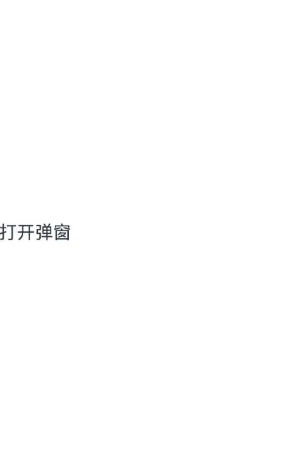

# 基础自定义弹出框 (CustomDialog)(不推荐)
CustomDialog是自定义弹出框，可用于广告、中奖、警告、软件更新等与用户交互响应操作。开发者可以通过CustomDialogController类显示自定义弹出框。具体用法请参考[自定义弹出框](../reference/apis-arkui/arkui-ts/ts-methods-custom-dialog-box.md)。

> **说明：**
> 
> 当前，ArkUI弹出框默认为非页面级弹出框，在页面路由跳转时，如果开发者未调用close方法将其关闭，弹出框将不会自动关闭。若需实现在跳转页面时覆盖弹出框的场景，可以使用[组件导航子页面显示类型的弹窗类型](arkts-navigation-navigation.md#页面显示类型)或者[页面级弹出框](arkts-embedded-dialog.md)。

默认为模态弹窗且有蒙层，不可与蒙层下方控件进行交互（不支持点击和手势等向下透传）。可以通过配置[isModal](../reference/apis-arkui/arkui-ts/ts-methods-custom-dialog-box.md#customdialogcontrolleroptions对象说明)来实现模态和非模态弹窗，详细说明可参考[弹窗的种类](arkts-dialog-overview.md#弹窗的种类)。

当isModal为true时，弹出框为模态弹窗，且弹窗周围的蒙层区不支持透传。isModal为false时，弹出框为非模态弹窗，且弹窗周围的蒙层区可以透传。因此如果需要同时允许弹出框的交互和弹出框外页面的交互行为，需要将弹出框设置为非模态。

## 生命周期

从API version 19开始，自定义弹出框提供了生命周期函数用于通知用户该弹出框的生命周期。生命周期的触发时序依次为：onWillAppear -> onDidAppear -> onWillDisappear -> onDidDisappear。

| 名称            |类型| 说明                       |
| ----------------- | ------ | ---------------------------- |
| onWillAppear    | Callback&lt;void&gt; | 弹出框显示动效前的事件回调。 |
| onDidAppear    | Callback&lt;void&gt;  | 弹出框弹出后的事件回调。    |
| onWillDisappear | Callback&lt;void&gt; | 弹出框退出动效前的事件回调。 |
| onDidDisappear | Callback&lt;void&gt;  | 弹出框消失后的事件回调。    |

## 创建自定义弹出框

1. 使用\@CustomDialog装饰器装饰自定义弹出框，可在此装饰器内自定义弹出框内容。CustomDialogController需在@Component内定义。
   
   ```ts
   @CustomDialog
   struct CustomDialogExample {
     controller: CustomDialogController
   
     build() {
       Column() {
         Text('我是内容')
           .fontSize(20)
       }.height(60).justifyContent(FlexAlign.Center)
     }
   }
   ```
2. 创建构造器，与装饰器呼应相连。
   
   ```ts
    @Entry
    @Component
    struct CustomDialogUser {
      dialogController: CustomDialogController = new CustomDialogController({
        builder: CustomDialogExample(),
      })
    }
   ```
3. 点击与onClick事件绑定的组件使弹出框弹出。
   
   ```ts
   @Entry
   @Component
   struct CustomDialogUser {
     dialogController: CustomDialogController = new CustomDialogController({
       builder: CustomDialogExample(),
     })
   
     build() {
       Column() {
         Button('click me')
           .onClick(() => {
             this.dialogController.open();
           })
       }.width('100%').margin({ top: 5 })
     }
   }
   ```
   
   

## 弹出框的交互

弹出框可用于数据交互，完成用户一系列响应操作。

1. 在\@CustomDialog装饰器内添加按钮和数据函数。
   
   ```ts
   @CustomDialog
   struct CustomDialogExample {
     cancel: () => void = () => {
     }
     confirm: () => void = () => {
     }
     controller: CustomDialogController;
   
     build() {
       Column() {
         Text('我是内容').fontSize(20).margin({ top: 10, bottom: 10 })
         Flex({ justifyContent: FlexAlign.SpaceAround }) {
           Button('cancel')
             .onClick(() => {
               this.controller.close();
               if (this.cancel) {
                 this.cancel();
               }
             }).backgroundColor(0xffffff).fontColor(Color.Black)
           Button('confirm')
             .onClick(() => {
               this.controller.close();
               if (this.confirm) {
                 this.confirm();
               }
             }).backgroundColor(0xffffff).fontColor(Color.Red)
         }.margin({ bottom: 10 })
       }
     }
   }
   ```
2. 页面内需要在构造器内进行接收，同时创建相应的函数操作。
   
   ```ts
   @Entry
   @Component
   struct CustomDialogUser {
     dialogController: CustomDialogController = new CustomDialogController({
       builder: CustomDialogExample({
         cancel: ()=> { this.onCancel() },
         confirm: ()=> { this.onAccept() },
       }),
     });
   
     onCancel() {
       console.info('Callback when the first button is clicked');
     }
   
     onAccept() {
       console.info('Callback when the second button is clicked');
     }
   
     build() {
       Column() {
         Button('click me')
           .onClick(() => {
             this.dialogController.open();
           })
       }.width('100%').margin({ top: 5 })
     }
   }
   ```
   
   
   
   3.可通过弹出框中的按钮实现路由跳转，同时获取跳转页面向当前页传入的参数。
   
   ```ts
   // Index.ets
   @CustomDialog
   struct CustomDialogExample {
     @Link textValue: string;
     controller?: CustomDialogController;
     cancel: () => void = () => {
     }
     confirm: () => void = () => {
     }
   
     build() {
       Column({ space: 20 }) {
         if (this.textValue != '') {
           Text(`第二个页面的内容为：${this.textValue}`)
             .fontSize(20)
         } else {
           Text('是否获取第二个页面的内容')
             .fontSize(20)
         }
         Flex({ justifyContent: FlexAlign.SpaceAround }) {
           Button('cancel')
             .onClick(() => {
               if (this.controller != undefined) {
                 this.controller.close();
                 this.cancel();
               }
             }).backgroundColor(0xffffff).fontColor(Color.Black)
           Button('confirm')
             .onClick(() => {
               if (this.controller != undefined && this.textValue != '') {
                 this.controller.close();
               } else if (this.controller != undefined) {
                 this.getUIContext().getRouter().pushUrl({
                   url: 'pages/Index2'
                 });
                 this.controller.close();
               }
             }).backgroundColor(0xffffff).fontColor(Color.Red)
         }.margin({ bottom: 10 })
       }.borderRadius(10).padding({ top: 20 })
     }
   }
   
   @Entry
   @Component
   struct CustomDialogUser {
     @State textValue: string = '';
     dialogController: CustomDialogController | null = new CustomDialogController({
       builder: CustomDialogExample({
         cancel: () => {
           this.onCancel()
         },
         confirm: () => {
           this.onAccept()
         },
         textValue: this.textValue
       })
     });
   
     // 在自定义组件即将析构销毁时将dialogController置空
     aboutToDisappear() {
       this.dialogController = null; // 将dialogController置空
     }
   
     onPageShow() {
       const params = this.getUIContext().getRouter().getParams() as Record<string, string>; // 获取传递过来的参数对象
       if (params) {
         this.dialogController?.open();
         this.textValue = params.info as string; // 获取info属性的值
       }
     }
   
     onCancel() {
       console.info('Callback when the first button is clicked');
     }
   
     onAccept() {
       console.info('Callback when the second button is clicked');
     }
   
     exitApp() {
       console.info('Click the callback in the blank area');
     }
   
     build() {
       Column() {
         Button('click me')
           .onClick(() => {
             if (this.dialogController != null) {
               this.dialogController.open();
             }
           }).backgroundColor(0x317aff)
       }.width('100%').margin({ top: 5 })
     }
   }
   ```
   
   ```ts
   // Index2.ets
   @Entry
   @Component
   struct Index2 {
     @State message: string = '点击返回';

     build() {
       Column() {
         Button(this.message)
           .type(ButtonType.Capsule)
           .onClick(() => {
              this.getUIContext().getRouter().back({
                url: 'pages/Index',
                params: {
                info: 'Hello World'
              }
           });
         })
       }.width('100%').height('100%').margin({ top: 20 })
     }
   }
   ```
   
   

## 弹出框的动画

弹出框通过定义openAnimation控制弹出框出现动画的持续时间，速度等参数。

```ts
@CustomDialog
struct CustomDialogExample {
  controller?: CustomDialogController;

  build() {
    Column() {
      Text('Whether to change a text?').fontSize(16).margin({ bottom: 10 })
    }
  }
}

@Entry
@Component
struct CustomDialogUser {
  @State textValue: string = '';
  @State inputValue: string = 'click me';
  dialogController: CustomDialogController | null = new CustomDialogController({
    builder: CustomDialogExample(),
    openAnimation: {
      duration: 1200,
      curve: Curve.Friction,
      delay: 500,
      playMode: PlayMode.Alternate,
      onFinish: () => {
        console.info('play end')
      }
    },
    autoCancel: true,
    alignment: DialogAlignment.Bottom,
    offset: { dx: 0, dy: -20 },
    gridCount: 4,
    customStyle: false,
    backgroundColor: 0xd9ffffff,
    cornerRadius: 10,
  });

  // 在自定义组件即将析构销毁时将dialogController置空
  aboutToDisappear() {
    this.dialogController = null; // 将dialogController置空
  }

  build() {
    Column() {
      Button(this.inputValue)
        .onClick(() => {
          if (this.dialogController != null) {
            this.dialogController.open();
          }
        }).backgroundColor(0x317aff)
    }.width('100%').margin({ top: 5 })
  }
}
```


## 弹出框的样式

通过定义弹出框的宽度、高度、背景色、阴影等参数，控制其样式。

```ts
@CustomDialog
struct CustomDialogExample {
  controller?: CustomDialogController;

  build() {
    Column() {
      Text('我是内容').fontSize(16).margin({ bottom: 10 })
    }
  }
}

@Entry
@Component
struct CustomDialogUser {
  @State textValue: string = '';
  @State inputValue: string = 'click me';
  dialogController: CustomDialogController | null = new CustomDialogController({
    builder: CustomDialogExample(),
    autoCancel: true,
    alignment: DialogAlignment.Center,
    offset: { dx: 0, dy: -20 },
    gridCount: 4,
    customStyle: false,
    backgroundColor: 0xd9ffffff,
    cornerRadius: 20,
    width: '80%',
    height: '100px',
    borderWidth: 1,
    borderStyle: BorderStyle.Dashed,//使用borderStyle属性，需要和borderWidth属性一起使用
    borderColor: Color.Blue,//使用borderColor属性，需要和borderWidth属性一起使用
    shadow: ({ radius: 20, color: Color.Grey, offsetX: 50, offsetY: 0}),
  });

  // 在自定义组件即将析构销毁时将dialogController置空
  aboutToDisappear() {
    this.dialogController = null; // 将dialogController置空
  }

  build() {
    Column() {
      Button(this.inputValue)
        .onClick(() => {
          if (this.dialogController != null) {
            this.dialogController.open();
          }
        }).backgroundColor(0x317aff)
    }.width('100%').margin({ top: 5 })
  }
}
```


## 嵌套自定义弹出框

通过第一个弹出框打开第二个弹出框时，最好将第二个弹出框定义在第一个弹出框的父组件处，通过父组件传给第一个弹出框的回调来打开第二个弹出框。

```ts
@CustomDialog
struct CustomDialogExampleTwo {
  controllerTwo?: CustomDialogController;
  @State message: string = "I'm the second dialog box.";
  @State showIf: boolean = false;

  build() {
    Column() {
      if (this.showIf) {
        Text("Text")
          .fontSize(30)
          .height(100)
      }
      Text(this.message)
        .fontSize(30)
        .height(100)
      Button("Create Text")
        .onClick(() => {
          this.showIf = true;
        })
      Button('Close Second Dialog Box')
        .onClick(() => {
          if (this.controllerTwo != undefined) {
            this.controllerTwo.close();
          }
        })
        .margin(20)
    }
  }
}

@CustomDialog
struct CustomDialogExample {
  openSecondBox?: () => void
  controller?: CustomDialogController

  build() {
    Column() {
      Button('Open Second Dialog Box and close this box')
        .onClick(() => {
          this.controller!.close();
          this.openSecondBox!();
        })
        .margin(20)
    }.borderRadius(10)
  }
}

@Entry
@Component
struct CustomDialogUser {
  @State inputValue: string = 'Click Me';
  dialogController: CustomDialogController | null = new CustomDialogController({
    builder: CustomDialogExample({
      openSecondBox: () => {
        if (this.dialogControllerTwo != null) {
          this.dialogControllerTwo.open()
        }
      }
    }),
    cancel: this.exitApp,
    autoCancel: true,
    alignment: DialogAlignment.Bottom,
    offset: { dx: 0, dy: -20 },
    gridCount: 4,
    customStyle: false
  });
  dialogControllerTwo: CustomDialogController | null = new CustomDialogController({
    builder: CustomDialogExampleTwo(),
    alignment: DialogAlignment.Bottom,
    offset: { dx: 0, dy: -25 }
  });

  aboutToDisappear() {
    this.dialogController = null;
    this.dialogControllerTwo = null;
  }

  onCancel() {
    console.info('Callback when the first button is clicked');
  }

  onAccept() {
    console.info('Callback when the second button is clicked');
  }

  exitApp() {
    console.info('Click the callback in the blank area');
  }

  build() {
    Column() {
      Button(this.inputValue)
        .onClick(() => {
          if (this.dialogController != null) {
            this.dialogController.open();
          }
        }).backgroundColor(0x317aff)
    }.width('100%').margin({ top: 5 })
  }
}
```


由于自定义弹出框在状态管理侧有父子关系，如果将第二个弹出框定义在第一个弹出框内，那么当父组件（第一个弹出框）被销毁（关闭）时，子组件（第二个弹出框）内无法再继续创建新的组件。

## 实现弹出框的物理返回拦截

执行点击遮障层关闭、侧滑（左滑或右滑）、三键Back、键盘ESC关闭等交互操作时，如果注册了[onWillDismiss](../reference/apis-arkui/arkui-ts/ts-methods-custom-dialog-box.md#customdialogcontrolleroptions对象说明)回调函数，弹出框不会立即关闭。在回调函数中，通过[reason](../reference/apis-arkui/arkui-ts/ts-methods-custom-dialog-box.md#dismissdialogaction12)获取阻拦关闭弹出框的操作类型，根据原因决定是否关闭弹出框。

```ts
@CustomDialog
struct CustomDialogExample {
  cancel: () => void = () => {
  }
  confirm: () => void = () => {
  }
  controller?: CustomDialogController;

  build() {
    Column() {
      Text('Are you sure?')
        .fontSize(20)
        .margin({
          top: 10,
          bottom: 10
        })
      Row() {
        Button('cancel')
          .onClick(() => {
            if (this.controller != undefined) {
              this.controller.close();
            }
          })
          .backgroundColor(0xffffff)
          .fontColor(Color.Black)
        Button('confirm')
          .onClick(() => {
            if (this.controller != undefined) {
              this.controller.close();
            }
          })
          .backgroundColor(0xffffff)
          .fontColor(Color.Red)
      }
      .width('100%')
      .justifyContent(FlexAlign.SpaceAround)
      .margin({ bottom: 10 })
    }
  }
}

@Entry
@Component
struct InterceptCustomDialog {
  dialogController: CustomDialogController = new CustomDialogController({
    builder: CustomDialogExample({
      cancel: () => {
        this.onCancel();
      },
      confirm: () => {
        this.onAccept();
      }
    }),
    onWillDismiss: (dismissDialogAction: DismissDialogAction) => {
      console.info('dialog onWillDismiss reason: ' + dismissDialogAction.reason);
      // 1、PRESS_BACK    点击三键back、侧滑（左滑/右滑）、键盘ESC。
      // 2、TOUCH_OUTSIDE    点击遮障层时
      // 3、CLOSE_BUTTON    点击关闭按钮
      if (dismissDialogAction.reason === DismissReason.PRESS_BACK) {
        // 处理业务逻辑后通过dismiss主动关闭对话框
        // dismissDialogAction.dismiss();
      }
      if (dismissDialogAction.reason === DismissReason.TOUCH_OUTSIDE) {
        // dismissDialogAction.dismiss();
      }
    },
    alignment: DialogAlignment.Bottom,
    offset: { dx: 0, dy: -20 }
  })

  onCancel() {
    console.info('Callback when the first button is clicked');
  }

  onAccept() {
    console.info('Callback when the second button is clicked');
  }

  build() {
    Column() {
      Button('click me')
        .onClick(() => {
          this.dialogController.open();
        })
    }
    .width('100%')
  }
}
```


## 设置弹出框避让软键盘的距离

为显示弹出框的独立性，弹出框弹出时会与周边进行避让，包括状态栏、导航条以及键盘等留有间距。故当软键盘弹出时，默认情况下，弹出框会自动避开软键盘，并与之保持16vp的距离。开发者可以利用[CustomDialogControllerOptions](../reference/apis-arkui/arkui-ts/ts-methods-custom-dialog-box.md#customdialogcontrolleroptions对象说明)中的keyboardAvoidMode和keyboardAvoidDistance这两个配置项，来设置弹出框在软键盘弹出时的行为，包括是否需要避开软键盘以及与软键盘之间的距离。
设置软键盘间距时，需要将keyboardAvoidMode值设为KeyboardAvoidMode.DEFAULT。

```ts
// xxx.ets
import { LengthMetrics } from '@kit.ArkUI'

@CustomDialog
struct CustomDialogExample {
  controller?: CustomDialogController;
  build() {
    Column() {
      Column() {
        Text('keyboardAvoidDistance: 0vp')
          .fontSize(20)
          .margin({ bottom: 36 })
        TextInput({ placeholder: '' })
      }.backgroundColor('#FFF0F0F0')
    }
  }
}

@Entry
@Component
struct Index {
  dialogController: CustomDialogController | null = new CustomDialogController({
    builder: CustomDialogExample({
    }),
    autoCancel: true,
    gridCount: 4,
    showInSubWindow: true,
    isModal: true,
    customStyle: false,
    cornerRadius: 30,
    alignment:DialogAlignment.Bottom,
    keyboardAvoidMode: KeyboardAvoidMode.DEFAULT, // 软键盘弹出时，弹出框自动避让
    keyboardAvoidDistance: LengthMetrics.vp(0) // 软键盘弹出时与弹出框的距离为0vp
  })

  build() {
    Row() {
      Row({ space: 20 }) {
        Text('打开弹窗')
          .fontSize(30)
          .onClick(() => {
            if (this.dialogController != null) {
              this.dialogController.open();
            }
          })
      }
      .width('100%')
    }
    .height('100%')
  }
}
```

 

## 获取弹出框的状态

在业务模块中，页面上可能会同时出现多个弹出框。为避免重复打开相同的弹出框，建议在显示弹出框前，先通过控制器检查其当前状态。如果弹出框已处于显示状态，则不应再次打开。
从API version 20开始，新增了getState接口，用于获取弹出框的当前状态。具体的弹出框状态信息，请参见[CommonState](../reference/apis-arkui/js-apis-promptAction.md#commonstate20枚举说明)枚举的详细说明。

以下示例通过getDialogController和CustomDialogController两种方法，实现了获取弹出框当前状态的功能。

```ts
// xxx.ets
@CustomDialog
struct CustomDialogExample {
  controller?: CustomDialogController

  build() {
    Column() {
      Button('点我查询弹窗状态:通过自定义组件自带controller')
        .onClick(() => {
          if (this.getDialogController() != undefined) {
            console.info('state:' + this.getDialogController().getState())
          } else {
            console.info('state: no exist')
          }
        }).margin(20)
      Button('点我查询弹窗状态:通过CustomDialogController ')
        .onClick(() => {
          console.info('state:' + this.controller?.getState())
        }).margin(20)
      Button('点我关闭弹窗')
        .onClick(() => {
          if (this.getDialogController() != undefined) {
            this.getDialogController().close()
          }
        }).margin(20)
      
    }
  }
}

@Entry
@Component
struct CustomDialogUser {
  dialogController: CustomDialogController | null = new CustomDialogController({
    builder: CustomDialogExample({
    }),
    autoCancel: false
  })

  build() {
    Column() {
      Button('click me')
        .onClick(() => {
          if (this.dialogController != null) {
            this.dialogController.open()
          }
        })
    }.width('100%').margin({ top: 5 })
  }
}
```

## 相关实例

针对自定义弹出框开发，有以下相关实例可供参考：

- [自定义弹出框（ArkTS）（API9）](https://gitee.com/openharmony/codelabs/tree/master/ETSUI/CustomDialog)
- [构建多种样式弹出框（ArkTS）（API9）](https://gitee.com/openharmony/codelabs/tree/master/ETSUI/MultipleDialog)
- [目标管理（ArkTS）（API9）](https://gitee.com/openharmony/codelabs/tree/master/ETSUI/TargetManagement)


