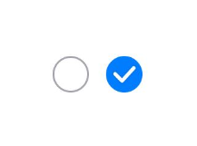
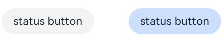
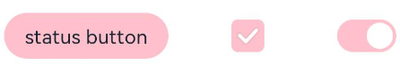
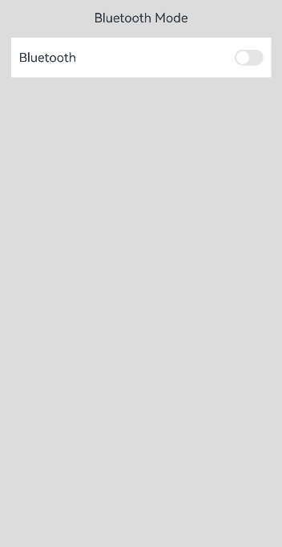

# 切换按钮 (Toggle)


Toggle组件提供状态按钮样式、勾选框样式和开关样式，一般用于两种状态之间的切换。具体用法请参考[Toggle](../reference/apis-arkui/arkui-ts/ts-basic-components-toggle.md)。


## 创建切换按钮

Toggle通过调用[ToggleOptions](../reference/apis-arkui/arkui-ts/ts-basic-components-toggle.md#toggleoptions18对象说明)来创建，具体调用形式如下：

```ts
Toggle(options: { type: ToggleType, isOn?: boolean })
```

其中，ToggleType为开关类型，包括Button、Checkbox和Switch，isOn为切换按钮的状态。

API version 11开始，Checkbox默认样式由圆角方形变为圆形。

接口调用有以下两种形式：


- 创建不包含子组件的Toggle。
  当ToggleType为Checkbox或者Switch时，用于创建不包含子组件的Toggle：
  
  
    ```ts
  Toggle({ type: ToggleType.Checkbox, isOn: false })
  Toggle({ type: ToggleType.Checkbox, isOn: true })
    ```

  
  
  ```ts
  Toggle({ type: ToggleType.Switch, isOn: false })
  Toggle({ type: ToggleType.Switch, isOn: true })
  ```
  
    
  
- 创建包含子组件的Toggle。
  当ToggleType为Button时，只能包含一个子组件，如果子组件有文本设置，则相应的文本内容会显示在按钮上。

  ```ts
  Toggle({ type: ToggleType.Button, isOn: false }) {
    Text('status button')
      .fontColor('#182431')
      .fontSize(12)
  }.width(100)
  Toggle({ type: ToggleType.Button, isOn: true }) {
    Text('status button')
      .fontColor('#182431')
      .fontSize(12)
  }.width(100)
  ```

    


## 自定义样式

- 通过selectedColor属性设置Toggle打开选中后的背景颜色。

  ```ts
  Toggle({ type: ToggleType.Button, isOn: true }) {
    Text('status button')
    .fontColor('#182431')
    .fontSize(12)
  }.width(100).selectedColor(Color.Pink)
  Toggle({ type: ToggleType.Checkbox, isOn: true })
    .selectedColor(Color.Pink)
  Toggle({ type: ToggleType.Switch, isOn: true })
    .selectedColor(Color.Pink)
  ```

  

- 通过switchPointColor属性设置Switch类型的圆形滑块颜色，仅对type为ToggleType.Switch生效。

  ```ts
  Toggle({ type: ToggleType.Switch, isOn: false })
    .switchPointColor(Color.Pink)
  Toggle({ type: ToggleType.Switch, isOn: true })
    .switchPointColor(Color.Pink)
  ```

  


## 添加事件

除支持[通用事件](../reference/apis-arkui/arkui-ts/ts-component-general-events.md)外，Toggle还用于选中和取消选中后触发某些操作，可以绑定onChange事件来响应操作后的自定义行为。


```ts
Toggle({ type: ToggleType.Switch, isOn: false })
  .onChange((isOn: boolean) => {
      if(isOn) {
        // 需要执行的操作
      }
  })
```


## 场景示例

Toggle用于切换蓝牙开关状态。

```ts
// xxx.ets
import { promptAction } from '@kit.ArkUI';

@Entry
@Component
struct ToggleExample {
  @State BOnSt: promptAction.ShowToastOptions = { 'message': 'Bluetooth is on.' };
  @State BOffSt: promptAction.ShowToastOptions = { 'message': 'Bluetooth is off.' };

  build() {
    Column() {
      Row() {
        Text("Bluetooth Mode")
          .height(50)
          .fontSize(16)
      }

      Row() {
        Text("Bluetooth")
          .height(50)
          .padding({ left: 10 })
          .fontSize(16)
          .textAlign(TextAlign.Start)
          .backgroundColor(0xFFFFFF)
        Toggle({ type: ToggleType.Switch })
          .margin({ left: 200, right: 10 })
          .onChange((isOn: boolean) => {
            if (isOn) {
              this.getUIContext().getPromptAction().showToast(this.BOnSt);
            } else {
              this.getUIContext().getPromptAction().showToast(this.BOffSt);
            }
          })
      }
      .backgroundColor(0xFFFFFF)
    }
    .padding(10)
    .backgroundColor(0xDCDCDC)
    .width('100%')
    .height('100%')
  }
}
```



